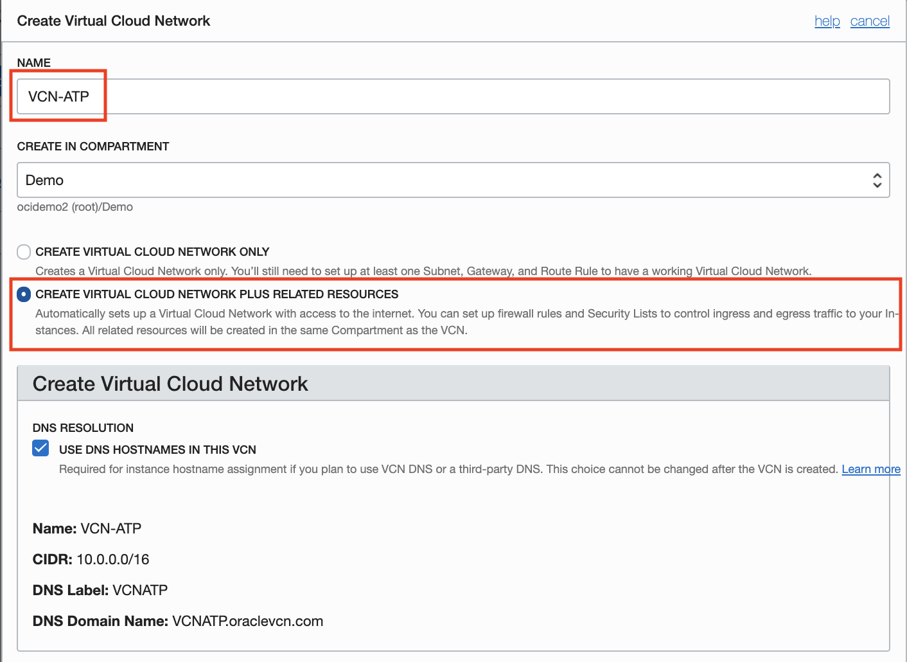
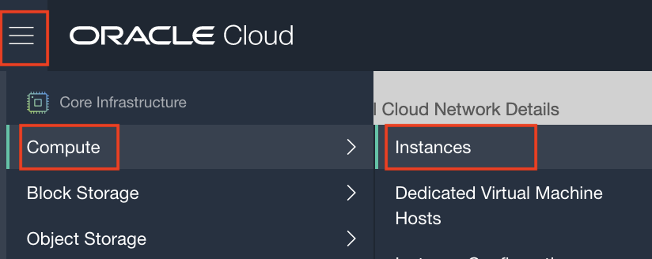
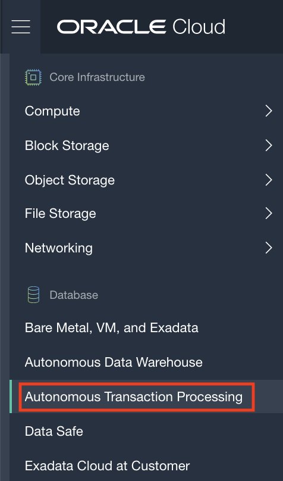
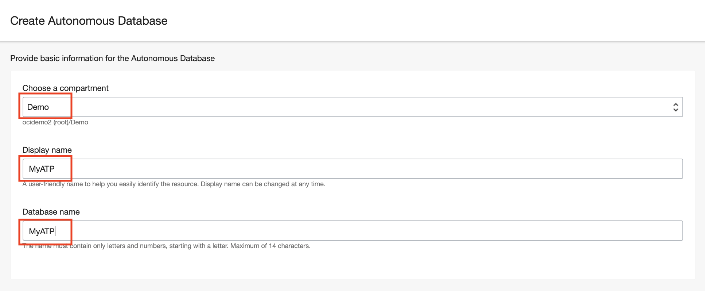
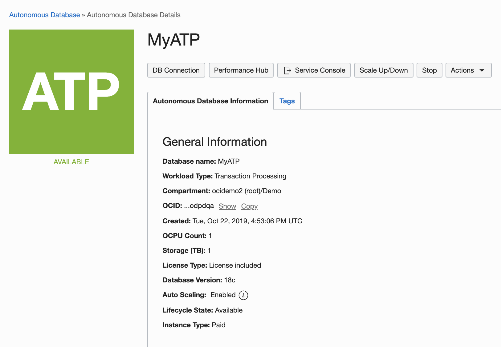
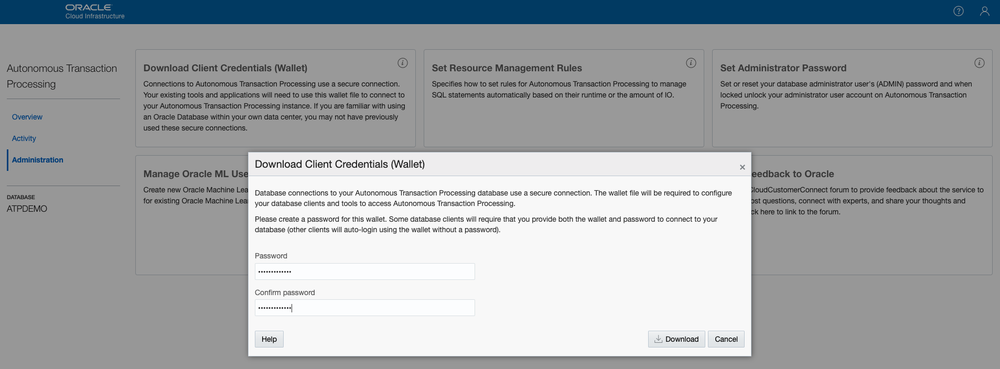
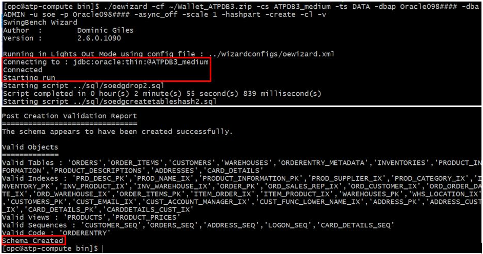
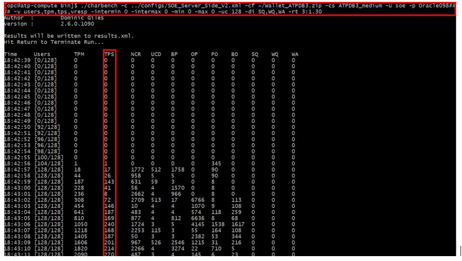
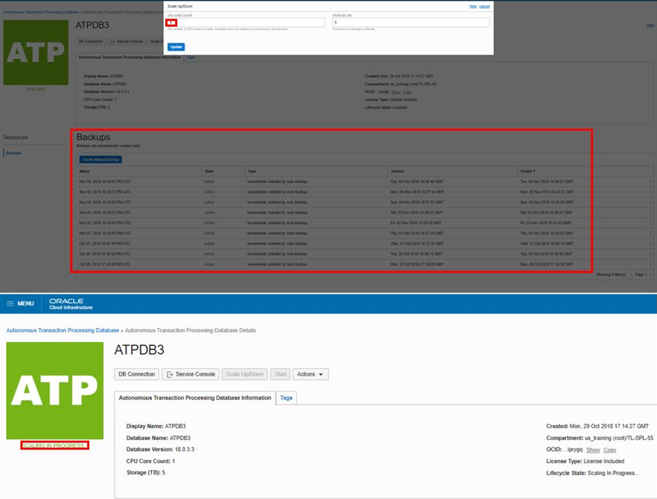
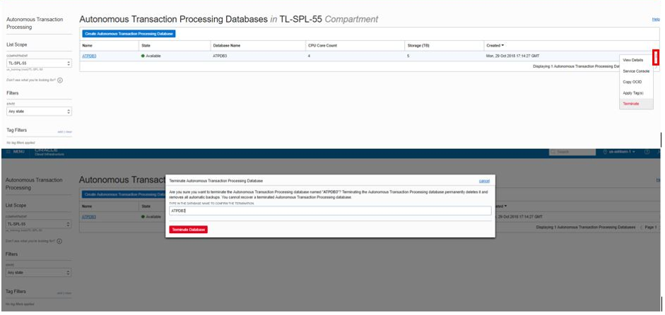

#  Autonomous Transaction Processing
  
## Table of Contents

[Overview](#overview)

[Pre-Requisites](#pre-requisites)

[Practice 1: Sign in to OCI Console and create VCN](#practice-1-sign-in-to-oci-console-and-create-vcn)

[Practice 2: Create Compute instance and install Swing Bench](#practice-2-create-compute-instance-and-install-swing-bench)

[Practice 3: Create ATP instance in OCI and Configure Swing Bench on Compute instance to generate load traffic](#practice-3-create-atp-instance-in-oci-and-configure-swing-bench-on-compute-instance-to-generate-load-traffic)

[Practice 4: Dynamically Scale CPU on ATP instance and verify results](#practice-4-dynamically-scale-cpu-on-atp-instance-and-verify-results)

[Practice 5: Delete the resources](#practice-5-delete-the-resources)

## Overview

Oracle Cloud Infrastructure's Autonomous Transaction Processing Cloud Service is a fully managed, preconfigured database environment. You do not need to configure or manage any hardware, or install any software. After provisioning, you can scale the number of CPU cores or the storage capacity of the database at any time without impacting availability or performance. Autonomous Transaction Processing handles creating the database, as well as the following maintenance tasks:

- Backing up the database
- Patching the database
- Upgrading the database

## Pre-Requisites

- Oracle Cloud Infrastructure account credentials (User, Password, Tenant, and Compartment)  

## Recommended Learning Assets

- [OCI Training](https://cloud.oracle.com/en_US/iaas/training)
- [Familiarity with OCI console](https://docs.us-phoenix-1.oraclecloud.com/Content/GSG/Concepts/console.htm)
- [Overview of Networking](https://docs.us-phoenix-1.oraclecloud.com/Content/Network/Concepts/overview.htm)
- [Familiarity with Compartment](https://docs.us-phoenix-1.oraclecloud.com/Content/GSG/Concepts/concepts.htm)
- [Connecting to a compute instance](https://docs.us-phoenix-1.oraclecloud.com/Content/Compute/Tasks/accessinginstance.htm)

## Practice-1: Sign in to OCI Console and create VCN

**Note:** OCI UI is being updated thus some screenshots in the instructions might be different than actual UI

1. Sign in using your tenant name, user name and password.
2. Once signed select the compartment you have permissions on the left part of the screen
3. From the OCI Services menu, click **Networking** and select **Virtual Cloud Network**. Click **Create Virtual Cloud Network**
4. Fill out the dialog box:

   - **Name:** *VCN-ATP*
   - **Create Virtual Cloud Network Plus Related Resources:** Select this option
  
   - Scroll down and click the **Create Virtual Cloud Network** button.
   - Click **Close**
  
  **NOTE:** This will create a complete VCN with 3 subnets and the required security lists to allow access to your instance using ssh.

## Practice 2: Create Compute instance and install Swing Bench

1. Switch to the OCI console. From OCI servies menu, Click **Compute** and **Instances** 

2. Click Create Instance. Fill out the dialog box:
   - **Name:** *ATP1*
   - **Image Operating System:** For the image, we recommend using the Latest Oracle Linux available.
   - Click on the *Show Shape, Network, Storage Options* link to expose those options.
   - **Availability Domain:** Select any availability domain
   - **Choose Instance Type:** Select Virtual Machine
   - **Choose Instance Shape:** Select *VM.Standard.E2.1.Micro (Virtual Machine)* for the shape.
   - **Virtual Cloud Network Compartment:** Choose your compartment
   - **Virtual Cloud Network:** Select the *VCN-ATP* virtual cloiud netwrk that you created earlier.
    - **Subnet Compartment:** Choose your compartment. 
   - **Subnet:** Choose the first Subnet
   - Click the *Assign a public IP address* option!
   - **Configure Boot Volume:** Leave the default
   - **Add SSH Keys:** Browse or enter the content of your public SSH. Feel free to reuse one (*id_rsa.pu*)that you have created earlier in this set of labs.
   - Click **Create**

**NOTE:** If 'Service limit' error is displayed choose a different shape such as VM.Standard.E2.2 OR VM.Standard2.2

3. Wait for Instance to be in **Running** state. Then access your instance using ssh:

    `ssh –i <private_ssh_key> opc@<Public_IP_Address>`

    **NOTE:** User name is opc

    **HINT:** If ‘Permission denied error’ is seen, ensure you are using ‘-i’ in the ssh command

    For example:
    `ssh -i ~/.ssh/id_rsa  opc@192.168.0.0`

4.  On the compute instance enter the following commands: 

    `sudo yum makecache fast`

16. Install Java and its dependencies, Enter Command, 

    `sudo yum install java-1.8.0-openjdk-headless.x86_64`

17. Verify Java Installation and version, Enter Command,

    `java -version`

18. Next we will install Swing bench, Enter command:(No Spaces)

    `curl http://www.dominicgiles.com/swingbench/swingbenchlatest.zip -o swingbench.zip`

19. Unzip the file:

    `unzip swingbench.zip`

## Practice 3: Create ATP instance in OCI and Configure Swing Bench on Compute instance to generate load traffic
In this section we will create a ATP instance in OCI. We will initially create this 
instance with only 1 OCPU and scale it after generating load test from the compute 
instance created earlier.

1. Switch to OCI console, from services menu under **Database** click **Autonomous Transaction Processing**.

2. Click **Create Autonmous Database**. Fill out the dialog box:
   - **Choose a compartment:** Select your main working compartment.
   - **Display Name:** *MyATP*
   - **Database Name:** *MyATP*
   
   - **Workload Type:** *Autonomous Transaction Processing*
   - **Choose a deployment type:** *Serverless* 
   
   - **OCPU Core Count:** 1
   - **Storage(TB):** 1
   - **Password:** Provide a password (e.g Oracle098Ax12w) 

   **NOTE:** *Be sure to write this down smewhere! Better yet, for the puroses of this lab simply ue te provided password of Oracle098Ax12w so you can copy and paste most commands directly.*
   - **Confirm Password:** Provide the same password
   - **License Type:** Choose **License Included**

    

   -  Click Create **Autonomous Database**

**Note:** : It may take several minutes to provision your instance. This would be a good time for a quick break if you are so inclined.

3. Once Database is in running state, click its Name. In Database details window click **Service Console** 

    **NOTE:** If pop up blocker appears then click 'Allow' **

    

4. If prompted for password, enter the same password used to create the ATP instance

5. Click the **DB Connection** button and then **Download Client Credentials (Wallet)**. In pop up window provide a password. This can be the same password as one used to create the ATP instance and click **Download**. This will download the credentials file that will be used to connect to this Database instance from the compute instance created eaelier. Save the zip file.

    **NOTE:** The file is generally downloaded in Downloads directory

    
ß
6. Save the file in and note down the directory name where the file was saved. We will need to upload this zip file on to public Compute instance.
   
7. Open a terminal window change to directory where zip file was saved.

8. Upload the zip file to compute instance, Enter command,

    `sftp  -i <private_ssh_key> opc@<Public_IP_Address>`

    For example:

    `sftp  -i ~/.ssh/id_rsa opc@129.146.17.195`

9. At sftp prompt Enter command,

    `put Wallet_MyATP.zip`

    **NOTE:** Usually the file name starts with 'Wallet'. Verify the file transfer completed

10. Step 9. Switch to ssh session to the public compute instance. Enter command,
 
    `cd ~/swingbench/bin`

11. Enter command:

    `which java`

12. verify java path is displayed, if no java path is displayed then install java. Enter command:

    `sudo yum install java`
    
    Answer `Y` when prompted

13. Enter below commands, replacing the value in < >. (This will install a schema to run our transactions against)

    `./oewizard -cf ~/<CREDENTIAL_ZIP_FILE> -cs <DB_NAME>_medium  -ts DATA -dbap <DB_PASSWORD> -dba ADMIN -u soe -p <DB_PASSWORD> -async_off -scale 0.1 -hashpart -create -cl -v`

    **NOTE:** In below example,<CREDENTIAL_ZIP_FILE> is 'Wallet_MyATP.zip', <DB_NAME> is MyATP, <DB_PASSWORD> is *Oracle098Ax12w*

    For example, if you have followed this lab closely, your command would be:

    `./oewizard -cf ~/Wallet_MyATP.zip -cs MyATP_medium  -ts DATA -dbap Oracle098Ax12w -dba ADMIN -u soe -p Oracle098Ax12w -async_off -scale 0.1 -hashpart -create -cl -v`

14. The script will take around 10-15 minutes to populate the Database. Tghis is another good time to take a quick break. Verify the script completes successfully 

    

15. Validate the schema, Enter command:

    `./sbutil -soe -cf ~/Wallet_MyATP.zip -cs MyATP_medium -u soe -p Oracle098Ax12w -tables`

    

15. Next we will configure the load generator file. Enter command:

    `cd ~/swingbench/configs`

16. Enter command:

    `vi SOE_Server_Side_V2.xml`

     

17. Search for string **LogonGroupCount** and change the existing number to **4**. You will find it in the <Load> section near the top of the file. On the next line with string **LogonDelay** change the number to **300**. Finally on line with string **WaitTillAllLogon** change the flag to **false** (case sensitive). Save and quit out of the editor. See below example

    

18. Now we will generate some load. Enter the following commands:
    ```
    # cd ~/swingbench/bin
    # ./charbench -c ../configs/SOE_Server_Side_V2.xml -cf ~/Wallet_MyATP.zip  -cs MyATP_medium -u soe -p Oracle098Ax12w -v users,tpm,tps,vresp -intermin 0 -intermax 0 -min 0 -max 0 -uc 128 -di SQ,WQ,WA -rt 0:30.30
    ```
19. After a few seconds the number in 4th column (TPS)indicating Transactions Per Seconds will stabalize in 16xx range (Your exact numbers may be different by an order of magnitude). Remember the current ATP DB instance has only 1 OCPU. 

    

## Practice 4: Dynamically Scale CPU on ATP instance and verify results
We have Autonomous Transaction Processing DB instance configured and are testing Transaction per second data using a compute instance. Next we will dynamically scale the OCPU count via OCI console and observe the Transaction Per Second number. We will also see that Dynamic CPU scaling has no impact on the operation of Autonomous Transaction Processing Instance.
In this section we will utilize the dynamic CPU scaling featue of ATP instance and verify Transaction Per second number.

1. Switch to OCI Console and from OCI Services Menu under Database click **Autonomous Transaction Processing** 

2. Click the name of Autonomous Transaction Processing instance created earlier

3. Click **Scale Up/Down**, in the pop up windowchange CPU CORE COUNT to **4** and click **Update**. Also observe the Automatic backup that are being performed. Instance will be in 'Scaling in Progress' state for some time

    

4. Switch to ssh session to the compute instance. Ensure the script is still running and Transaction per second data is being diaplyed. As the instance becomes Available the Transactions Per Second number will be higher.

    

5. You can Scale the number of CPU UP or Down dynamically and obser TPS number change accordingly.

6. Switch to OCI screen and from your ATP instance details page click **Service Console**. From Service Console you can observe Performance data under **Overview** and **Activity** tabs


## Practice 5: Delete the resources
We have now demonstrated the Dynamic Scaling of CPU for an ATP instance. We also successfully generated load traffic and observed CPU usage and other indicators for the ATP instance. Next we will delete the resources that we created

1. Stop your script in the ssh terminal using CTRL+C. Close your ssh connection completely.

2. Switch to  OCI console window

3. From your ATP details page, Hover over the action icon  and Click **Terminate**. In the confimration window provide the ATP instance name and click **Terminate Database**

    

4. From OCI services menu Click *Instances* under *Compute*

5. Locate first compute instance, Click Action icon and then **Terminate** 

6. Make sure Permanently delete the attached Boot Volume is checked, Click *Terminate Instance*. Wait for instance to fully Terminate

7. From OCI services menu under Networking, click **Virtual Cloud Networks**, list of all VCNs will appear.

8. Click on the name of your vcn (most likely *VCN-ATP*) to see the detals page for that vcn.

9. Before you can terminate this vcn, you must first terinate each of the three subnets in the vcn using the vertical ellipse button to the right of each subnet. Terminate all three.

8. Now for the vcn click the action icon and then **Terminate**. Click **Delete All** in the Confirmation window. Click **Close** once VCN is deleted

**Congratulations! You have successfully completed the lab.**
