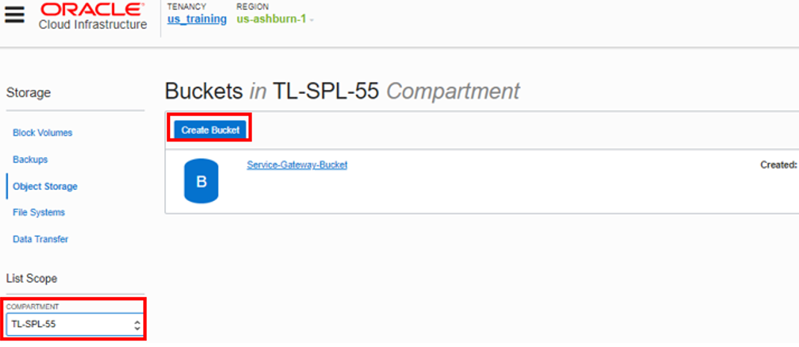
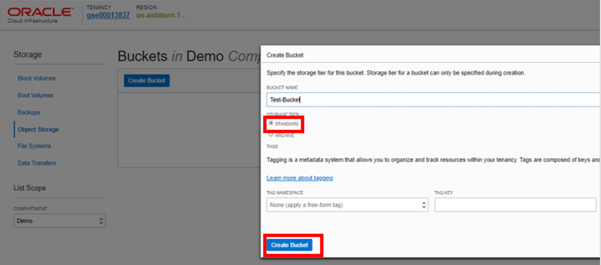
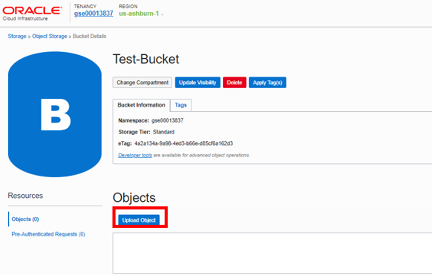

# OCI Audit Service
  
- [OCI Audit Service](#oci-audit-service)
  - [Overview](#overview)
  - [Pre-Requisites](#pre-requisites)
  - [Practice-1: Sign in to OCI Console and Create Object Storage Bucket](#practice-1-sign-in-to-oci-console-and-create-object-storage-bucket)
  - [Practice-2: Upload Object and Check Audit logs](#practice-2-upload-object-and-check-audit-logs)
  - [Conclusion](#conclusion)
  - [Learn More](#learn-more)

## Overview

The Oracle Cloud Infrastructure Audit service automatically records calls to all supported Oracle Cloud Infrastructure public application programming interface (API) endpoints as log events. Currently, all services support logging by Audit. Object Storage service supports logging for bucket-related events, but not for object-related events. Log events recorded by the Audit service include API calls made by the Oracle Cloud Infrastructure Console, Command Line Interface (CLI), Software Development Kits (SDK), your own custom clients, or other Oracle Cloud Infrastructure services

Each log event includes a header ID, target resource(s), time stamp of the recorded event, request parameters, and response parameters. You can view events logged by the Auditservice by using the Console,API, or the Java SDK. You can view events, copy the details of individual events, as well as analyze events or store them separately. Data from events can be used to perform diagnostics, track resource usage, monitor compliance, and collect security-related events.

The purpose of this lab is to give you an overview of the Audit Service and an example scenario to help you understand how the service works.

## Pre-Requisites

- Oracle Cloud Infrastructure account credentials (User, Password, Tenant, and Compartment)  

   **Before You Begin**

- We recommend using Chrome or Edge as the broswer. **Also set your browser zoom to 80%**

**Note:** The OCI UI is frequently updated thus some screenshots in the instructions might be different than actual UI

Ensure you have below information available:

- Tenant, User name, Password, and compartment name

## Practice-1: Sign in to OCI Console and Create Object Storage Bucket

1. Sign in using your tenant name, user name and password.

2. Once signed in select the compartment assigned to you from drop down menu on left part of the screen

3. From the OCI Services menu,click **Object Storage** then **Create Bucket**

   **NOTE:** Ensure the correct Compartment is selected under COMPARTMENT list
   
   

4. Fill out the dialog box:

   - **Bucket Name:** Provide a name (Test-Bucket in this lab)
   - **Storage Tier:**  STANDARD

5. Click **Create Bucket**
   

## Practice-2: Upload Object and Check Audit logs

1. Open a terminal window.

2. Change directory to your Downloads folder Enter command:
**Mac or Lunix**
   ```cd ~/Downloads```
**Windows**
   ```cd /c/Users/PhotonUser/Downloads/**```

3. Create a sample file, Enter command:
    ```touch samplefile```

    This should create a file by the name "samplefile" in the Downloads folder

4. Switch to OCI window and click the Bucket Name.

5. Bucket detail window should be visible. Click **Upload Object**

    

6. Click on the **select files** link. Navigate to the **samplefile** that you created a moment ago.

7. Select the file, then click **Upload Object** in the Dialog box.

8. Using the main OCI menu, select **Governance -> Audit**. Scroll down or type the bucket name in
Keyword section. You can choose other options such as dates and Request Action Type. For this lab
we will leave them as default. Audit logs for the Storage bucket should be visible.


## Conclusion

You have utilized OCI’s Audit service to extract events specific to Storage bucket created. Audit service can be used to monitor operations performed on OCI resources and can assist in trouble shooting your OCI environment.

## Learn More

You can learn more about the Audit Service [here](https://docs.cloud.oracle.com/en-us/iaas/Content/Audit/Concepts/auditoverview.htm)
To see more about the log events in the Audit Service, [click this link](https://docs.cloud.oracle.com/en-us/iaas/Content/Audit/Tasks/viewinglogevents.htm)
