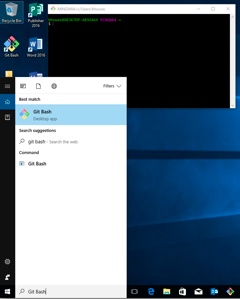
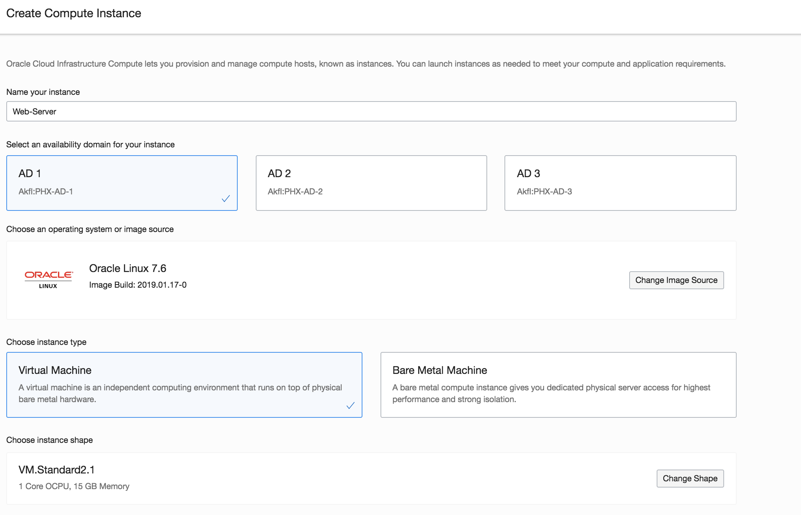
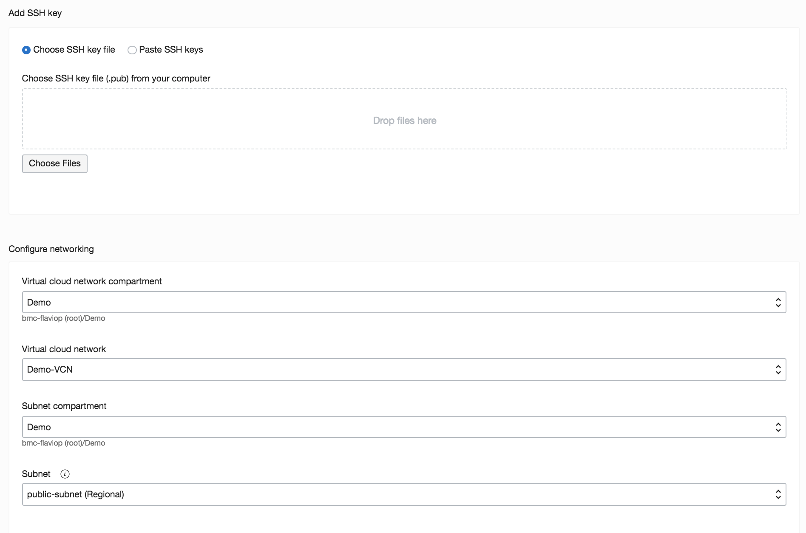
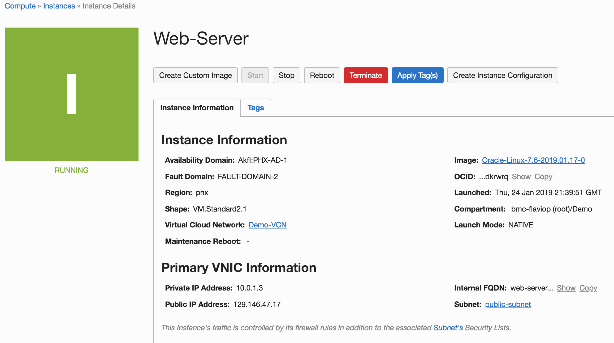
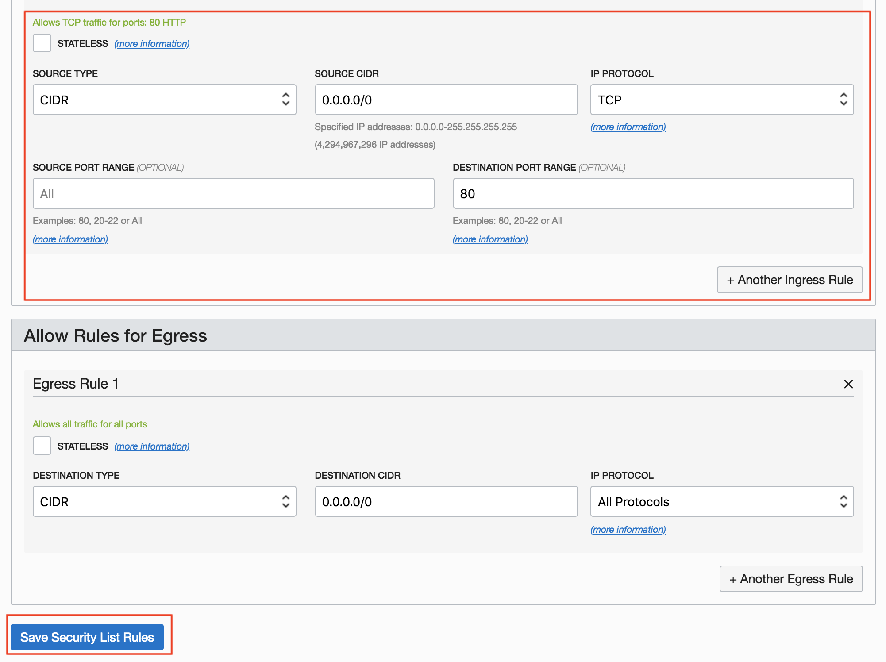
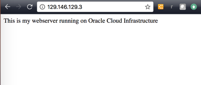

# Compute Service

## Table of Contents

[Overview](#overview)

[Pre-Requisites](#pre-requisites)

[Practice 1: Generate SSH Keys](#practice-1-generate-ssh-keys)

[Practice 2: Creating a Web Server on a Compute Instance](#practice-2-creating-a-web-server-on-a-compute-instance)

**Note:** *Some of the UIs might look a little different than the screen shots included in the instructions, but you can still use the instructions to complete the hands-on labs.*

## Overview

Oracle Cloud Infrastructure Compute lets you provision and manage compute hosts, known as instances. You can launch instances as needed to meet your compute and application requirements. After you launch an instance, you can access it securely from your computer, restart it, attach and detach volumes, and terminate it when you're done with it. Any changes made to the instance's local drives are lost when you terminate it. Any saved changes to volumes attached to the instance are retained.

Be sure to review [Best Practices for Your Compute Instance](https://docs.cloud.oracle.com/iaas/Content/Compute/References/bestpracticescompute.htm) for important information about working with your Oracle Cloud Infrastructure Compute instance.

## Pre-Requisites 

- Oracle Cloud Infrastructure account credentials (User, Password, and Tenant) 
- To sign in to the Console, you need the following:
  -  Tenant, User name and Password
  -  URL for the Console: [https://console.us-ashburn-1.oraclecloud.com/](https://console.us-ashburn-1.oraclecloud.com/)
  -  Oracle Cloud Infrastructure supports the latest versions of Google Chrome, Firefox and Internet Explorer 11 

## Practice 1: Generate SSH Keys

Generate SSH keys to be used later while launching an instance.

#### MAC/LINUX 

1. Generate ssh-keys for your machine if you don’t have one. As long as an id_rsa and id_rsa.pub key pair is present they can be reused. By default these are stored in ~/.ssh folder. Enter the following command if you are using MAC or Linux Desktop:
   
```   
   # ssh-keygen
```

2. Make sure permissions are restricted, sometimes ssh will fail if private keys have permissive permissions.
   
``` 
    # chmod 0700 ~/.ssh  
    # chmod 0600 ~/.ssh/id_rsa  
    # chmod 0644 ~/.ssh/id_rsa.pub
```
#### FOR WINDOWS

1. Install git for windows. Download [Gitbash](https://github.com/git-for-windows/git/releases/download/v2.13.0.windows.1/Git-2.13.0-64-bit.exe) and install.

2. Open Git-bash:
    


3. Generate ssh-keys by running this command in Gitbash and hit enter for all steps:
   
```
# ssh-keygen  
Generating public/private rsa key pair.  
Enter file in which to save the key
(/c/Users/username/.ssh/id\_rsa):  
Created directory '/c/Users/username/.ssh'.  
Enter passphrase (empty for no passphrase): 
Enter same passphrase again:  
Your identification has been saved in /c/Users/username/.ssh/id\_rsa.  
Your public key has been saved in /c/Users/username/.ssh/id\_rsa.pub.  
```
**Note**: In Gitbash, C:\\Users\\username\\ is shown as /c/Users/username/


## Practice 2: Creating a Web Server on a Compute Instance 

Oracle Cloud Infrastructure  offers both Bare Metal and Virtual Machine instances:

- **Bare Metal**  - A bare metal compute instance gives you dedicated physical server access for highest performance and strong isolation.
- **Virtual Machine**  - A Virtual Machine (VM) is an independent computing environment that runs on top of physical bare metal hardware. The virtualization makes it possible to run multiple VMs that are isolated from each other. VMs are ideal for running applications that do not require the performance and resources (CPU, memory, network bandwidth, storage) of an entire physical machine.

An Oracle Cloud Infrastructure VM compute instance runs on the same hardware as a Bare Metal instance, leveraging the same cloud-optimized hardware, firmware, software stack, and networking infrastructure.

1. Navigate to the **Compute** tab and click **Create Instance**. We will launch a VM instance for this lab.

2. The launch browser will automatically fill in the details for launching a single Oracle Linux. Please check each field for better understanding. 

 - **Name:** Name your instance
 - **Availability Domain:** Choose AD1, AD2 or AD3
 - **Image Operating System:** Oracle Linux 7.6
 - **Shape type** : Virtual Machine
 - **Shape:** Virtual Machine - VM.Standard2.1
 - **Boot Volume size:** Leave the default
 - **SSH keys:** Attach the SSH .pub key created on Practice-1
 - **Networking:** 
   - **VCN Name:** VCN you created on VCN HOL
   - **Subnet:** Any subnet among the three ADs





Launching an instance is simple and intuitive with few options to select. Provisioning of the compute instance will complete in less than a minute and the instance state will change from provisioning to running.

3. Once the instance state changes to Running, you can SSH to the Public IP address of the instance.
    


4. To connect to the instance, you can use `Terminal` if you are using MAC or `Gitbash` if you are using Windows. On your terminal or gitbash enter the following command:

**Note:** For Oracle Linux VMs, the default username is **opc**
```
# ssh opc@<public_ip_address>
```

If you have a different path for your SSH key enter the following:

```
# ssh -i <path_to_private_ssh_key> opc@<public_ip_address>
```

5. For this lab, we are going to install an Apache HTTP Webserver and try to connect to it over the public Internet. SSH into the Linux instance and run following commands:

**Note** *Apache HTTP Server is an open-source web server developed by the Apache Software Foundation. The Apache server hosts web content, and responds to requests for this content from web browsers such as Chrome or Firefox.*
 
- Install Apache http
  ```
   # sudo yum install httpd -y
  ```
- Start the apache server and configure it to start after system reboots
  ```
  # sudo apachectl start
  # sudo systemctl enable httpd
  ```
- Run a quick check on apache configurations
  ```
  # sudo apachectl configtest
  ```

- Create firewall rules to allow access to the ports on which the HTTP server listens.
  ```
  # sudo firewall-cmd --permanent --zone=public --add-service=http 
  # sudo firewall-cmd --reload
  ```
- Create an index file for your webserver
  ```
  # sudo bash -c 'echo This is my Web-Server running on Oracle Cloud Infrastructure >> /var/www/html/index.html'
  ```
6. Open your browser and navigate to `http://Public-IPAddress` (the IP address of the Linux VM)

**NOTE:** Your browser will not return anything because port 80 was not opened into the Security Lists

7. Click on **Virtual Cloud Network** and then the VCN you created for this practice. Now click on **Security Lists** on the left navigation bar for the VCN. 

8. Click on the **Default Security List**. Here you need to open port 80. Click on **Edit All Rules**.

9. Click on **+ Another Ingress Rule** and add the following values as shown below:

- **Source Type:** CIDR
- **Source CIDR**: 0.0.0.0/0
- **IP Protocol:** TCP
- **Source Port Range:** All
- **Destination Port Range:** 80
- Click on **Save Security List Rules** at the bottom.



10. Navigate to `http://publicI-PAddress` (the IP address of the Linux VM) in your browser. And now you should see the index page of the webserver we created above.



#### Troubleshooting: 

If you are unable to see the webserver on your browser, possible scenarios include:

  - VCN Security Lists is blocking traffic, Check VCN Security List for
    ingress rule for port 80
  - Firewall on the linux instance is blocking traffic
  
      - `# sudo firewall-cmd --zone=public --list-services` (this should show http service as part of the public zone)
      - `# sudo netstat -tulnp | grep httpd` (an httpd service should be listening on the port 80, if it’s a different port, open up that port on your VCN SL)
      
  - Your company VPN is blocking traffic


