# Edge Services on Oracle Cloud Infrastructure

## Table of Contents

[Overview](#overview)

[Pre-Requisites](#pre-requisites)

[Practice 1: Setup Windows 10 VM](#practice-1-setup-windows-10-vm)

[Practice 2: Log in OCI Web Console](#practice-2-log-in-oci-web-console)

[Practice 3: Create a Traffic Management Policy](#practice-3-create-a-traffic-management-policy)

[Practice 4: Failover Test for Traffic Management Policy](#practice-4-failover-test-for-traffic-management-policy)

[Practice 5: Health Check Policy](#practice-5-health-check-policy)

[Practice 6: Internet Intelligence Tool](#practice-6-internet-intelligence-tool)

[Practice 7: Cleanup](#practice-7-cleanup)

[Practice: Try Oracle Cloud Infrastructure for FREE](#practice-try-oracle-cloud-infrastructure-for-free)


## Overview

OCI DNS has advanced traffic management capabilities to steer DNS traffic across multiple public OCI instances and other private and 3rd party assets/endpoints. Traffic management supports comprehensive policies to provide intelligent responses to ensure high performance, scalability, and availability. 

In this lab, we will learn how to use OCI DNS Traffic Management service to ensure high availability of your web applications through detection of endpoint health and diverting your traffic accordingly. 

## Pre-Requisites 

Each attendee would be provided with a set of credentials for Oracle Cloud Infrastructure. The credentials will include 

- Tenancy Information
- Username
- Password

## Practice 1: Setup Windows 10 VM 

1) Each attendee is provided with a laptop with a Virtual Box. In the Virtual Box, Please start the Windows 10 VM (name of the VM is same as the ID of this Hands on Lab - HOL6379) 

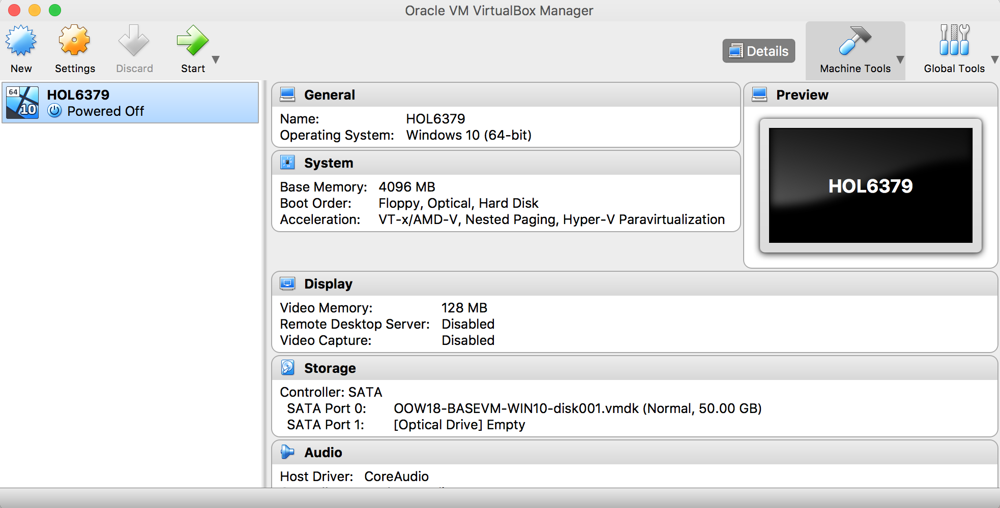


## Practice 2: Log in OCI Web Console 

1) Open Chrome Browser and Log into Oracle Cloud Infrastructure (OCI) Console. 
https://console.us-phoenix-1.oraclecloud.com/
Add the Cloud Tenant name provided to you. 


2) Sign in by providing your username and password. 


After log in, you are at the home page of OCI web console. 


4) Navigate to the different regions from the top right corner. 

```
For this lab, lets navigate to OCI Frankfurt Region. 
eu-frankfurt-1 
```


## Practice 3: Create a Traffic Management Policy

In this exercise we have a web application that has web servers running in OCI in two different regions - Ashburn, US and in Frankfurt, EU. We are going to create a global **Failover** traffic management policy for this web application, where we will use Frankfurt web server as primary and Ashburn web server as secondary. 

The webservers are already built in OCI Ashburn and Frankfurt regions, and are hosting a basic apache webserver. The public IPs associated with these webservers are provided below. 

- Webserver Frankfurt: 130.61.107.80
- Webserver Ashburn: 129.213.80.47

Following is a high level architecture diagram. 


1) Open the Menu and navigate to the Edge Services --> DNS Traffic Management. 


2) Make sure to select the Edgelab-O compartment. 

```
Attendees will share the compartment and the domain name resources. 
```


3) Click on **Create Traffic Management Policy**


4) Create a **Failover** traffic management policy 

```
- Policy Type: Failover
- Policy Name: Policy-UserX (replace x with your userID) 
- Policy TTL: 30 seconds
- Create two Answer Pools and add each webserver in its own 
```

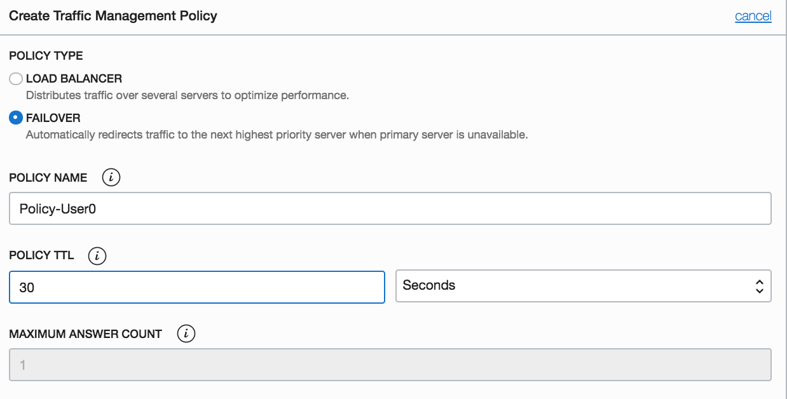

Create answer pools that will contain the records and will be provided as answers for DNS queries. They are an effective way to group similar or related answers together to make managing them easier. 

**NOTE** Use the IP addresses for Web Servers provided to you here, don't use the ones in the snapshot below. 

```
Answer pool
	- Answer Pool Name: Frankfurt-Pool
		- Answer Name: Webserver-Frankfurt
		- Type: A 
		- RData: 130.61.107.80 (Public IP of Webserver in Frankfurt) 
	- Answer Pool Name: Ashburn-Pool
		- Answer Name: Webserver-Ashburn
		- Type: A 
		- RData: 129.213.80.47 (Public IP of Webserver in Ashburn) 
```

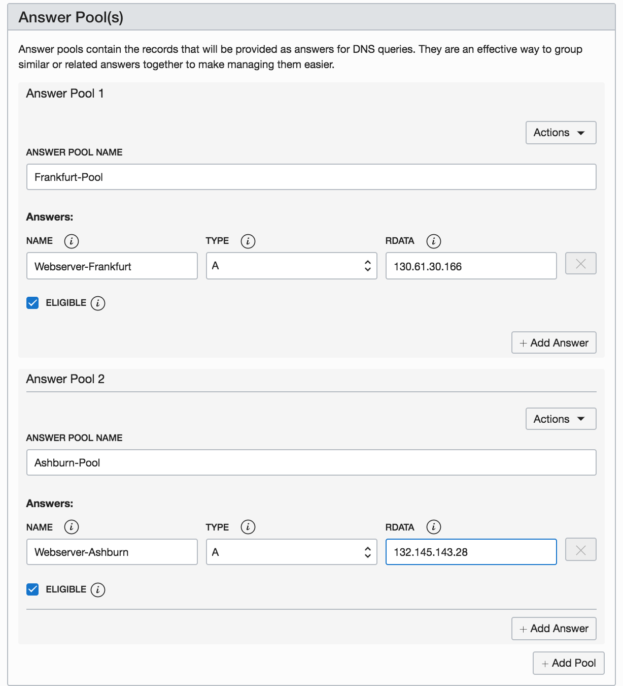

Next we will set priority of a pool in the policy failover chain, listed from highest priority (topmost) to lowest priority (bottommost) in the ruleset.

```
- Rulset
	- Priority 1: Frankfurt-Pool
	- Priority 2: Ashburn-Pool
```
Next we will create a Health Check for our application. (More on it in next exercise)
```
- Attach Health Check: 
	- Health Check Name: HealthCheck-userX (replace x with your userID) 
	- Interval: 30 seconds
	- Protocol: HTTP
```
For the domains, we already have created a zone for you **oowedgeserviceslab.com**. Each user will add its own domain for this zone. 
```
If your user is in tenancy 'jamalarif' use the below available domain,
- Attached Domains 
	- Domain: edgelabuser-X (replace X with your userID)
	- Zone: oowedgeserviceslab.com 
	
OR if you are in Tenancy : bmc-flaviop
- Attached Domains 
	- Domain: edgelabuser-X (replace X with your userID)
	- Zone: flaviosantino.com 
	
```

Click on **Create Policy**.

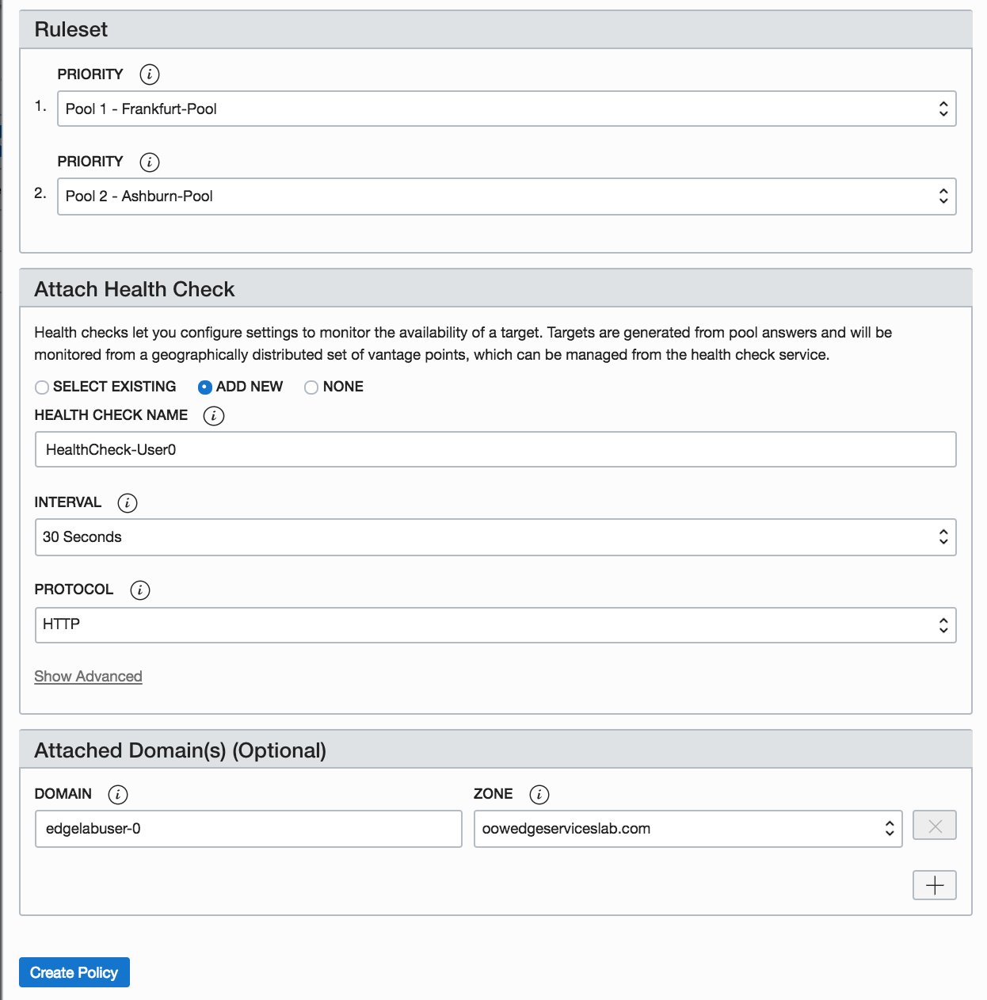

5) Once the **Failover** traffic policy is created, you are navigated to the details page of the policy. 

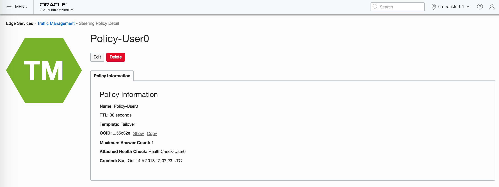

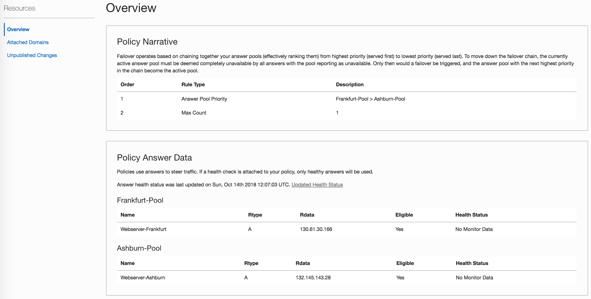

Once the health check runs after the interval specified in health check (30 seconds), the health status will update to show status of your webservers. 

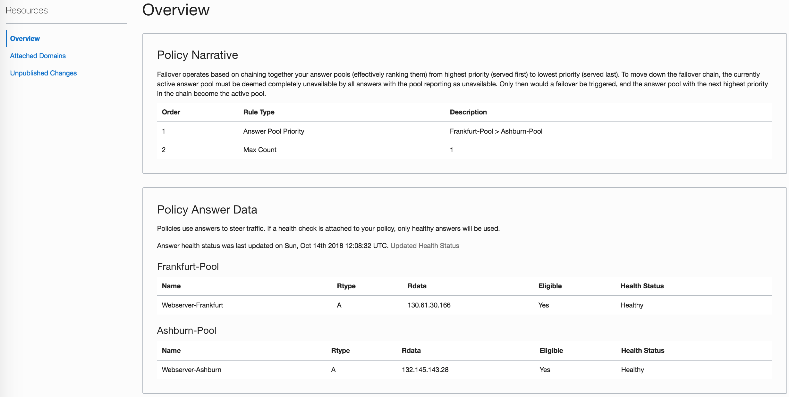

6) In your browser, open up the domain specified in your traffic policy and you will be directed to a webserver in Ashburn region

	http://edgelabuser-X.oowedgeserviceslab.com
	
	(replace X with your userID)
	
	OR 
	
	http://edgelabuser-X.flaviosantino.com
	
	(replace X with your userID)

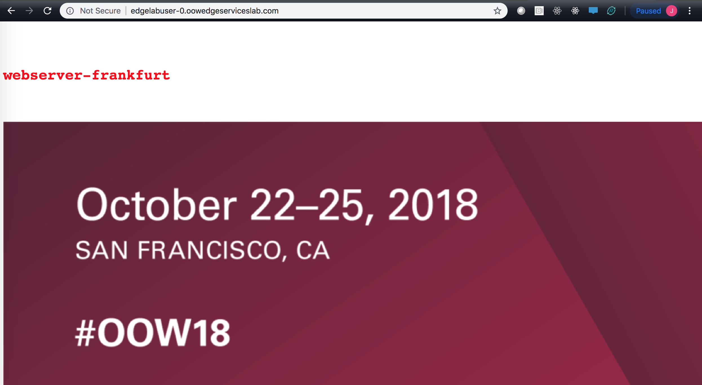


## Practice 4: Failover Test for Traffic Management Policy

In this exercise, we will do a failover test of the policy just created. We will **STOP** the Webserver in Frankfurt region and test if the healt check is updated, and the traffic is diverted to the Ashburn webserver. 

1) Your lab administrator will **STOP** the webserver in Frankfurt region. 

	Once confirmed by the lab administrator , please move ahead to the next step. 

2) In the overview section of the details page of your traffic policy, click on **Update Health Status**. It shows that webserver in frankfurt is currently unhealthy. And as per the policy priority pools, the traffic will be directed to the webserver in Ashburn region. 

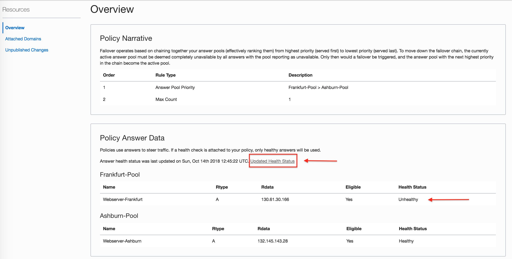

3) In your browser, open up the domain specified in your traffic policy and you will be directed to a webserver in Ashburn region

	http://edgelabuser-X.oowedgeserviceslab.com
	
	(replace X with your userID)

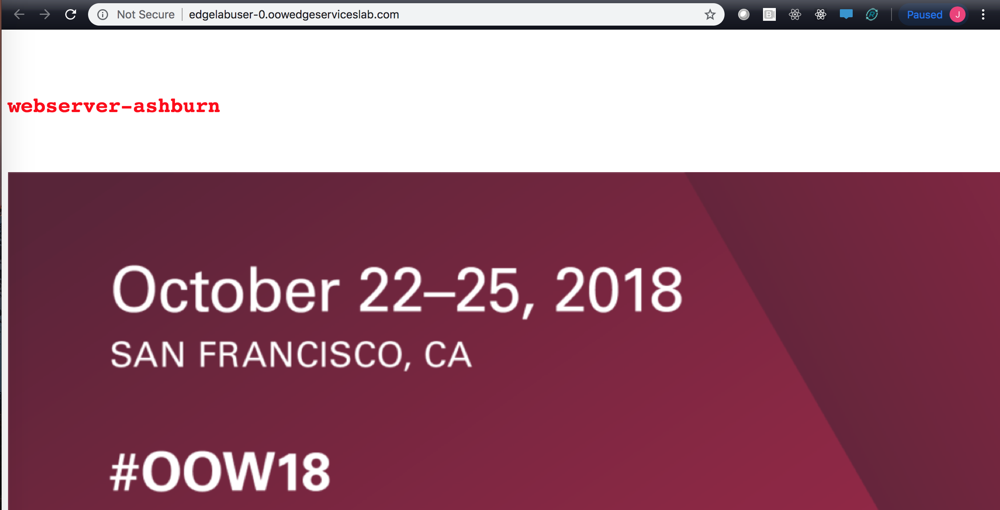

## Practice 5: Health Check Policy

In this exercise we will take a look at different options on the health check policy. 

1) Navigate to the Health Checks tab. 


2) Click on the health check you created **HealthCheck-UserX** (replace X with your userID)


3)In the details panel, you can notice some key details. 
 ```
 - Targets: define the end points
 - Vantage Points: Current vantage points for health check. They are automatically chosen here and can be modified based on your customers geogrpahical area
 - History of Health Check results updated every 30 seconds interval 
```

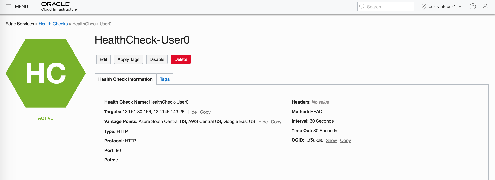

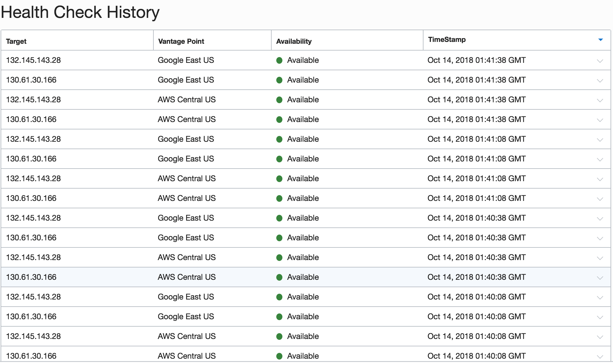

4) Click on **Edit** to edit the vantage points of Health Check. 

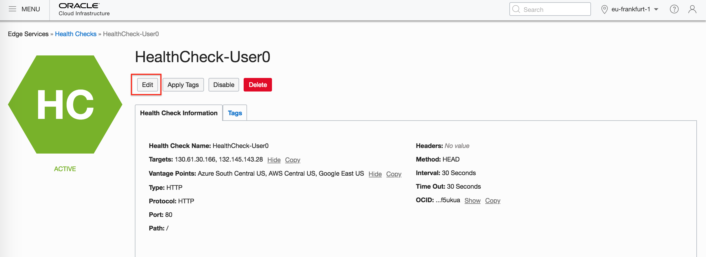

Change the vantage points from the drop down menu to any of the provided options. 

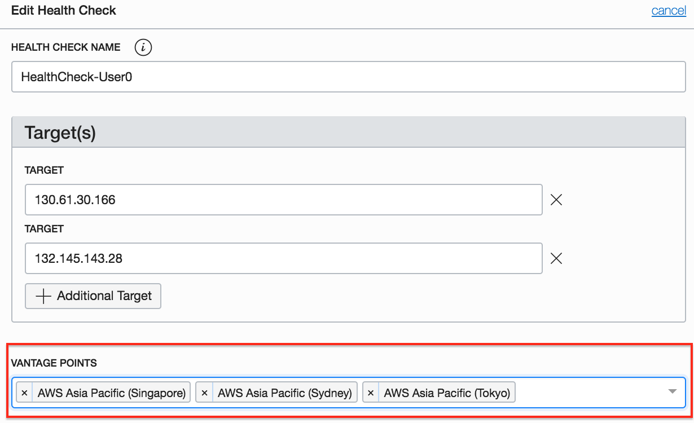

Once changed, you will notice the change on the details page. 

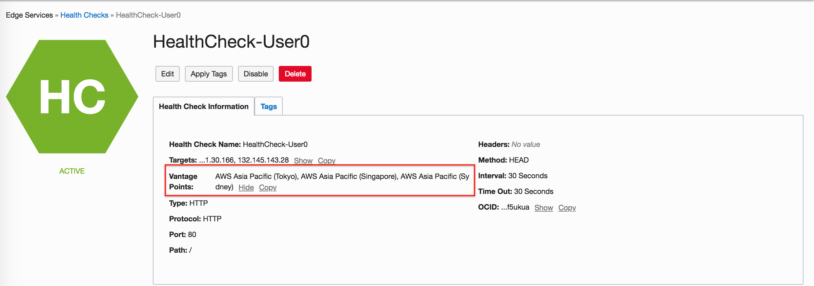

5) Refresh the browser to see the health check history which now reflects Health Checks from selected Vantage Points. 

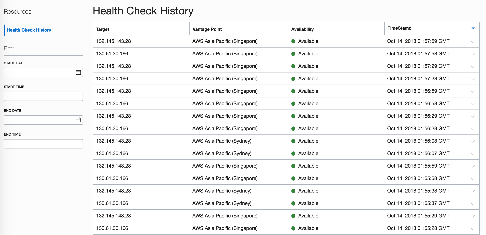

## Practice 6: Internet Intelligence Tool 

In this lab we will test Internet  Intelligence which provides internet analytics capabilities with OCI Market Performance and IP Troubleshooting tools. These features give you insight into the performance of cloud region vantage points to markets and providers around the globe, for both long-term strategy and operational troubleshooting. 

1) Navigate to the **Internet Intelligence** 


### OCI Market Performance

OCI Market Performance provides interactive visualization tools showing performance metrics to key global market cities and providers from each cloud region vantage point. The OCI Market Performance page includes aggregated data views for the previous day, seven days, one month, and three months. This data is based on latency measurements and performance across the public internet. The data does not contain any information specific to a customer.

### IP Troubleshooting

IP Troubleshooting provides network reachability tools that utilize external global vantage points to help users quickly assess the availability and performance of any externally facing endpoints. IP Troubleshooting enables operations and support teams the ability to diagnose performance and availability issues for any endpoint IP address on the internet.

2) In IP troubleshooting, add in the Public IP address of your FrankFurt Webserver and Click on **Run Test**

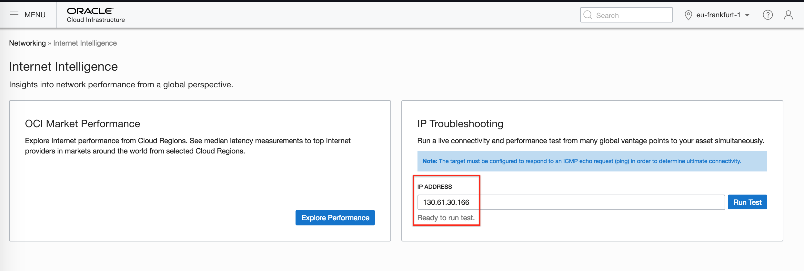 

3) Once the test is run, you can see the results from different vantage points across the globe. 

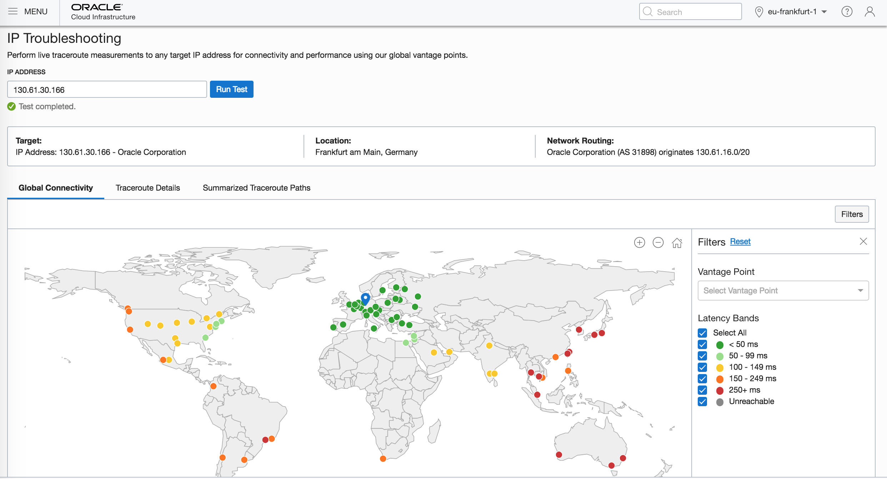 

You can select individual vantage points and get *traceroute* results. 

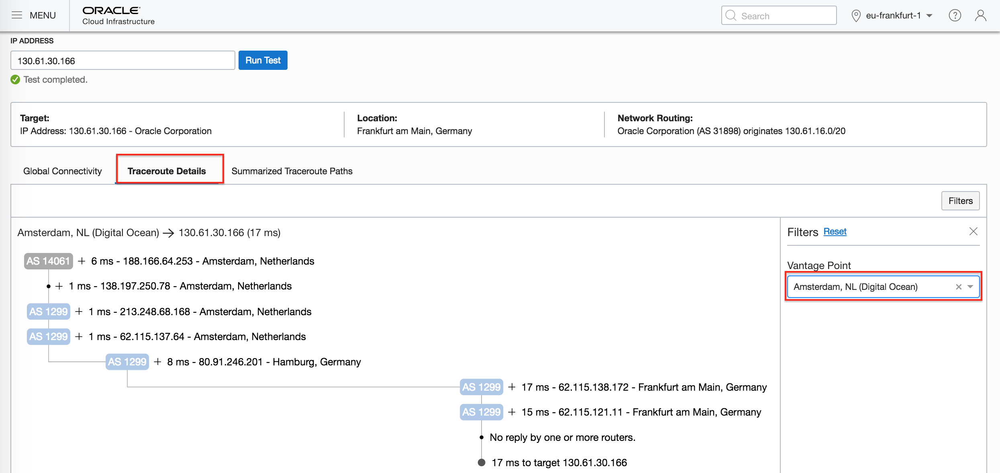 

Navigate to the summarized *traceroute* path to see the summary view of *traceroute* paths to the target IP address, identifying the key providers and shared infrastructure in reaching this IP address.

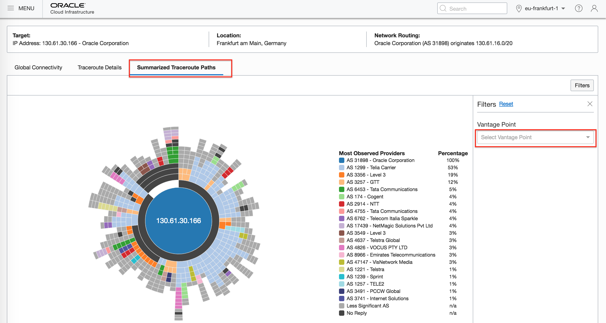 

## Practice 7: Cleanup 

1) Navigate to the **DNS Traffic Management** and delete the policy created. 

 

**Please help us to improve this LAB by clicking here:** [https://www.surveymonkey.com/r/EDGE-LAB](https://www.surveymonkey.com/r/EDGE-LAB)


## Practice: Try Oracle Cloud Infrastructure for FREE 

Sign up for the free Oracle Cloud Infrastructure trial account. 
https://cloud.oracle.com/tryit

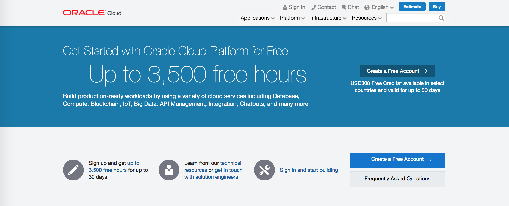 
