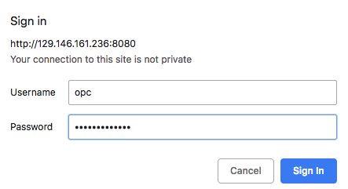
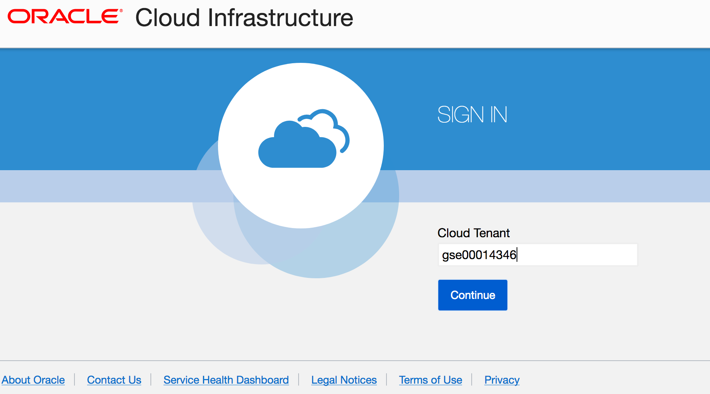
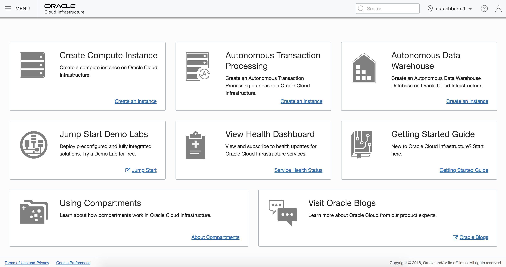

# Computational Fluid Dynamics Simulation on Oracle Cloud Infrastructure
  
## Table of Contents

[Overview](#overview)

[Pre-Requisites](#pre-requisites)

[Practice 1: Setup Windows 10 VM](#practice-1-setup-windows-10-vm)

[Practice 2: Open Gitbash on your Desktop ](#practice-2-open-gitbash-on-your-desktop)

[Practice 3: Access the control node](#practice-3-access-the-control-node)

[Practice 4: Deploy your HPC Cluster](#practice-4-deploy-your-hpc-cluster)

[Practice 5: Run OpenFOAM to generate your simulation](#practice-5-run-openfoam-to-generate-your-simulation)

[Practice 6: Sign in to OCI Console](#practice-6-sign-in-to-oci-console)

[Practice 7: Try Oracle Cloud Infrastructure for FREE](#practice-7-try-oracle-cloud-infrastructure-for-free)

## Overview

High Performance Computing and storage in the cloud can be very confusing and it can be difficult to determine where to start. This Hands on LAB is designed to be a first step in expoloring a cloud based HPC storage and compute architecture. There are many different configuration that could be used, but this lab focuses on a bare metal compute system and a Lustre file system that is attached. After deployment fully independant and functioning IaaS HPC compute and storage cluster has been deployed based on the architecture below.

## Pre-Requisites

- Oracle Cloud Infrastructure account credentials (User, Password, and Tenant) with available service limit for Bare Metal Shapes.

## Practice 1: Setup Windows 10 VM 

1) Each attendee is provided with a laptop with a Virtual Box. In the Virtual Box, Please start the Windows 10 VM (name of the VM is same as the ID of this Hands on Lab - HOL6379)


## Practice 2: Open Gitbash on your Desktop

1) Open Gitbash on your desktop. It is already installed for you. 


## Practice 3: Access the control node

1) On Gitbash terminal use SSH command to connect to the control node with this information:

- **username**: *Instructor will provide username for each participant*
- **password**: *Instructor will provide password for each participant*
- **IP address**: *129.146.103.162
*

```
# ssh username@IPAddress
```

## Practice 4: Deploy your HPC Cluster

1) After login, change into home directory by typing:

```
# cd oci-hpc-ref-arch
```
2) Deploy your Cluster by typing:

```
# ./cli_deploy.sh $C
```
> **Note:**  $C is a variable with your designated compartment. It will be automatically loaded for you after login. 


3) Wait for the HPC cluster to deploy. It will take about 20 minutes


4) Open a web browser and type in the **GOTTY** IP address that was shown at the bottom of the deployment terminal window like this http://IPaddress:8080 and use the following information to authenticate:

- **user**: opc
- **password**: *xxxxxxx*




## Practice 5: Run OpenFOAM to generate your simulation

1) After login into the GOTTY, execute the following command:

```
# cd /mnt/blk/share/data/OpenFOAM/oci-hpc-foam-motorbike; source Allrun 2 52
```

2) While OpenFOAM is running, open another tab in your web browser and navigate to the other output that was written to the terminal after deployment:

- Ganglia: http://IPaddress/gangllia
- Grafana: http://IPaadress:3000

## Practice 6: Sign in to OCI Console

1) Open a supported browser and go to the Console URL. For example, [https://console.us-ashburn-1.oraclecloud.com](https://console.us-ashburn-1.oraclecloud.com).

2) Enter your tenant name: <Tenant> and click **Continue**

 

3) Oracle Cloud Infrastructure is integrated with Identity Cloud Services, you will see a screen validating your Identity Provider. You can just click **Continue**.

 

4) Enter your user name and password

 - **Username:** _instructor will provide username_
 - **Password:** _instructor will provide password_

 

When you sign in to the Console, the home page is displayed.

 

The home page gives you quick links to the documentation and to Oracle Support.

## Practice 7: Try Oracle Cloud Infrastructure for FREE 

Sign up for the free Oracle Cloud Infrastructure trial account. 
https://cloud.oracle.com/tryit


