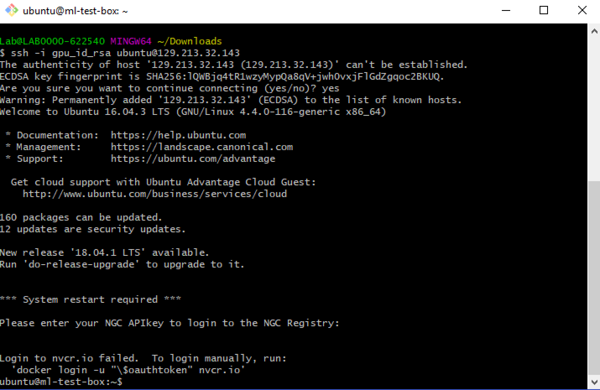

## Machine Learning on Oracle Cloud Infrastructure

## Table of Contents

[Overview](#overview)

[Pre-Requisites](#pre-requisites)

[Practice 1: Setup Windows 10 VM](#practice-1-setup-windows-10-vm)

[Practice 2: Open Gitbash on your Desktop](#practice-1-open-gitbash-on-your-desktop)

[Practice 3: Access the GPU instance](#practice-2-access-the-gpu-instance)

[Practice 4: Use TensorFlow to recognize the visual contents of images](#practice-3-use-tensorflow-to-recognize-the-visual-contents-of-images)

[Practice 5: Try Oracle Cloud Infrastructure for FREE](#practice-5-try-oracle-cloud-infrastructure-for-free)

## Overview
This is a demo for showcasing how TensorFlow Machining Learning (ML) workload running inside Nvidia-Docker can leverage OCI GPU instances.

The topics touched upon by this demo are:

-   Use of TensorFlow to recognize the visual contents of images (not metadata).
-   To show how quickly the GPU can process ML image recognition workloads.
-   To showcase Nvidia-Docker as a means of containerising ML workloads to leverage GPU (because normal docker cannot  _see_  the GPU).

## Pre-Requisites 

- Oracle Cloud Infrastructure account credentials (User, Password, and Tenant)
- Access to a GPU instance in your tenant
- SSH Client
- Download the SSH key into your desktop from this link: https://bit.ly/2Ef9GE4


## Practice 1: Setup Windows 10 VM 

1) Each attendee is provided with a laptop with a Virtual Box. In the Virtual Box, Please start the Windows 10 VM (name of the VM is same as the ID of this Hands on Lab - HOL6379)


## Practice 1: Open Gitbash on your Desktop

1) Open Gitbash on your desktop. It is already installed for you. 


## Practice 2: Access the GPU instance

1) On Gitbash terminal use SSH command to connect to the GPU instance:

- **username**: *ubuntu*
- **IP address**: *129.213.32.143*

```
# ssh -i gpu_id_rsa ubuntu@129.213.32.143 
```
**Note**: When you get the SSH prompt you can hit enter and skip this (you do not need to connect to NGC Registry to run this).

`Please enter your NGC APIkey to login to the NGC Registry`

_`<<Hit enter to skip>>`_



2) Run the following command to pull and run the docker image:

``# nvidia-docker run -dti -p 80:80 --restart always ramnathn/oci-nvidia-docker-gpu-tensorflow-demo node callpy.js``

**Note**: This will pull the docker image ``oci-nvidia-docker-gpu-tensorflow-demo`` from this repo ``ramnathn`` and it will have port 80 open.  This will take around 5 minutes to complete.


3) Now you should be able to access the URL application by typing: ``http://129.213.32.143`` and the following page will show:


4) On your ssh session run the following command:

```
# watch -n 1 nvidia-smi
```
This will show that the GPU is actually getting used by the process.  Keep that screen open. 

## Practice 3: Use TensorFlow to recognize the visual contents of images

1) Go back to your broswer where you opened the application by typing: `http://129.213.32.143` and click on **Browser** at the uper left corner of your screen:


2) Upload the jpeg image download from the **Pre-requisites** step. Once you click upload, the app will run the TensorFlow inference program in the GPU and display the inferences and the time taken to process in the GPU(s).


## Practice 5: Try Oracle Cloud Infrastructure for FREE 

Sign up for the free Oracle Cloud Infrastructure trial account. 
https://cloud.oracle.com/tryit

