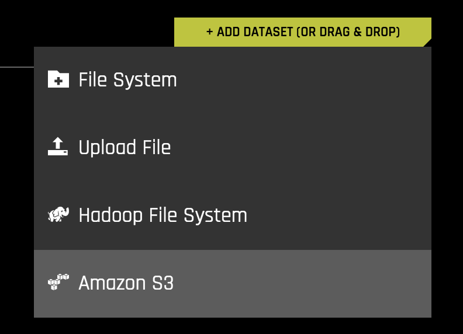
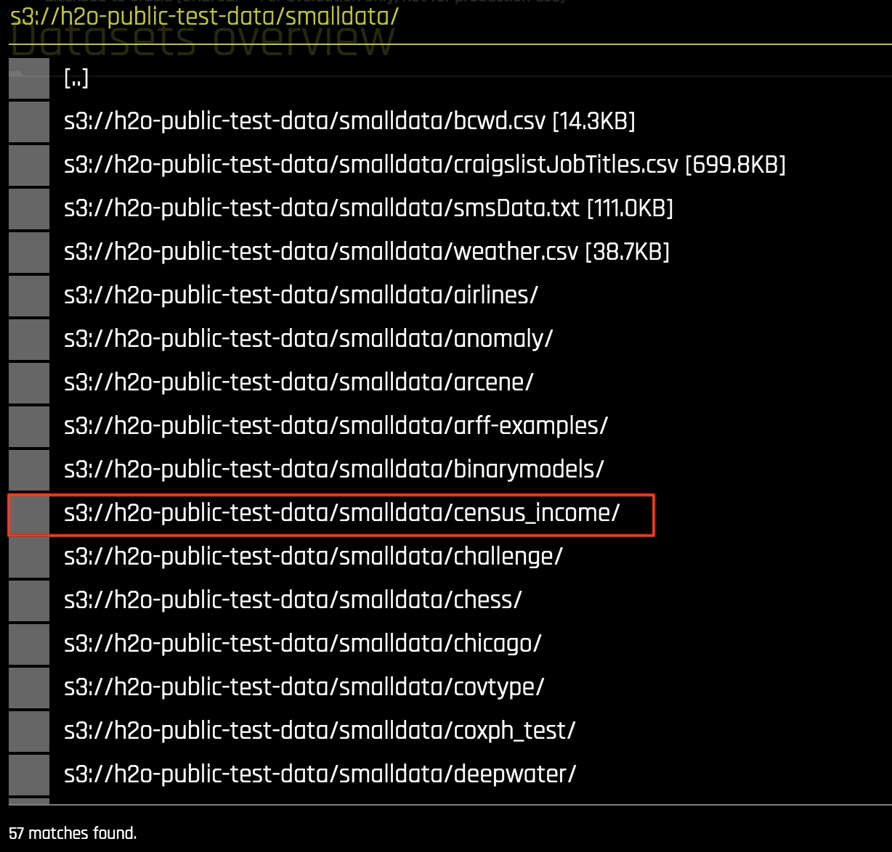
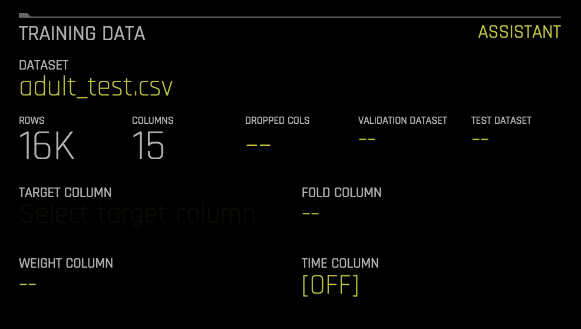
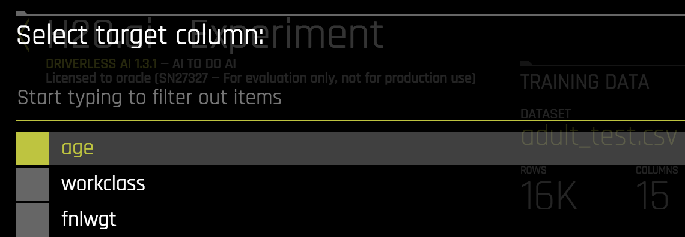
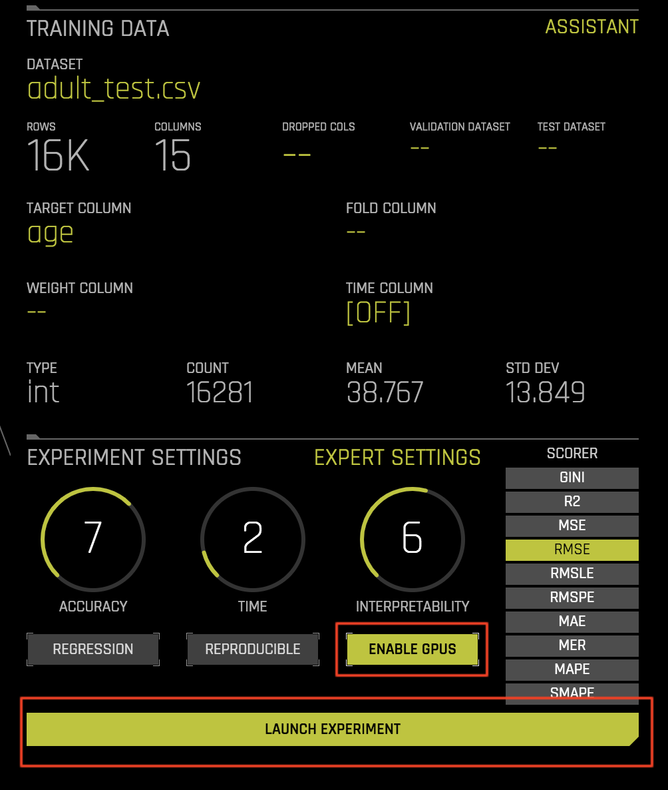
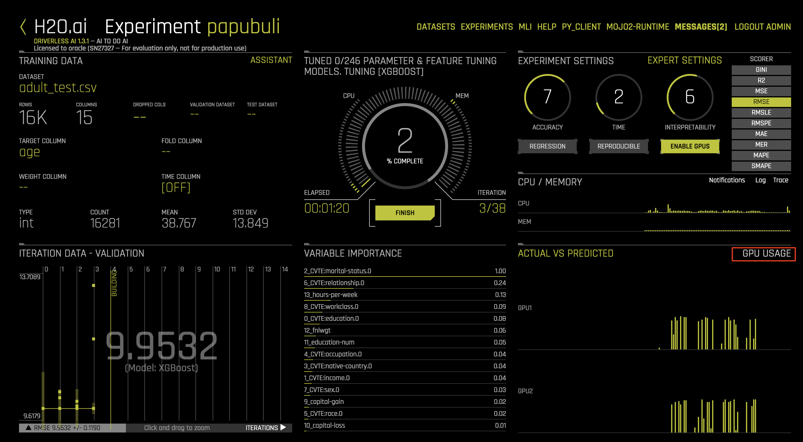
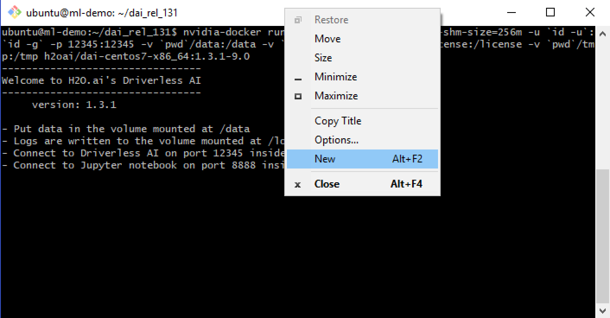
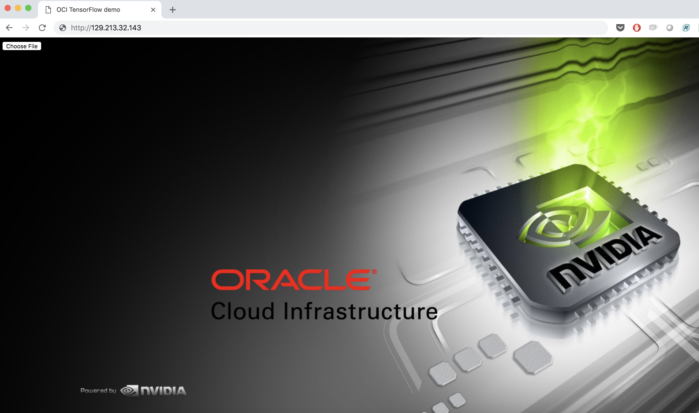
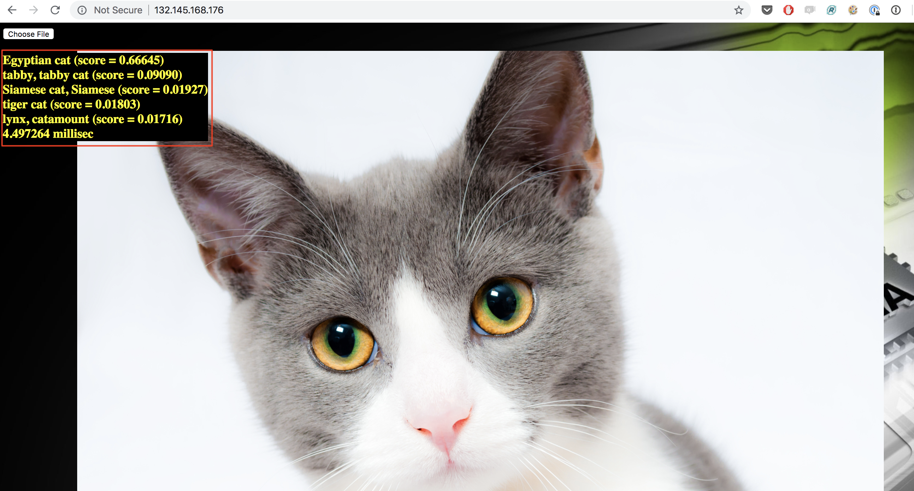

## Machine Learning on Oracle Cloud Infrastructure

## Table of Contents

[Overview](#overview)

[Pre-Requisites](#pre-requisites)
### H20ai Lab 
[Practice 1: Setup Windows 10 VM](#practice-1-setup-windows-10-vm)

[Practice 2: Open Gitbash on your Desktop](#practice-2-open-gitbash-on-your-desktop)

[Practice 3: Access the GPU instance](#practice-3-access-the-gpu-instance)

[Practice 4: Install H2Oai in the GPU Instance](#practice-4-install-h2oai-in-the-gpu-instance)

[Practice 5: Access H2Oai application](#practice-5-access-h2oai-application)

[Practice 6: Loading an adult census dataset](#practice-6-loading-an-adult-census-dataset)
### TensorFlow Lab
[Practice 1: Open a second Gitbash window](#practice-1-open-a-second-gitbash-window)

[Practice 2: Pull the TensorFlow docker image](#practice-2-pull-the-tensorflow-docker-image)

[Practice 3: Use TensorFlow to recognize the visual contents of images](#practice-3-use-tensorflow-to-recognize-the-visual-contents-of-images)

[Practice 4: Try Oracle Cloud Infrastructure for FREE](#practice-4-try-oracle-cloud-infrastructure-for-free)

## Overview
For this Machine Learning session you will complete two Hands-on-Labs

- **H20ai Lab:** In this lab you will experience the first part of a typical Machine Learning process which is training the model, then you will execute the second part of the process which is known as inferencing. We are going to use a partner tool, H2O.ai on top of one of our **Pascal GPU Bare Metal machines** to run this lab.

- **TensorFlow Lab:** This is a demo to show TensorFlow Image Recognition using the power of our **Pascal GPU Bare Metal machine** in order to recognize the visual contents of images.

The key topics touched upon by both labs are:

- To showcase Nvidia-Docker as a means of containerising ML workloads to leverage GPU (because normal docker cannot  _see_  the GPU).
- To show how quickly the GPU can process ML image recognition workloads.

## Pre-Requisites 

- Access to a GPU instance in Oracle Cloud Infrastructure
- SSH Client
- Download the SSH key into your desktop from this link: https://bit.ly/2Ef9GE4


## H20.ai Lab

## Practice 1: Setup Windows 10 VM 

1) Each attendee is provided with a laptop with a Virtual Box. In the Virtual Box, Please start the Windows 10 VM (name of the VM is same as the ID of this Hands on Lab)


## Practice 2: Open Gitbash on your Desktop

1. Open Gitbash program on your desktop. It is already installed on your Windows 10 VM. 


 
2. Download the SSH Key from this link [https://bit.ly/2Ef9GE4](https://bit.ly/2Ef9GE4) and save it your Downloads folder

## Practice 3: Access the GPU instance

1. On Gitbash terminal use SSH command to connect to the GPU instance:

- **username**: *ubuntu*
- **IP address**: *Use the IP address provided by your instructor*

```
# ssh -i ~/Downloads/gpu_id_rsa ubuntu@IPAddress 
```


`Please enter your NGC APIkey to login to the NGC Registry`

_`<<Hit enter to skip>>`_

**_Hit Enter to skip_**


## Practice 4: Install H2Oai in the GPU Instance

1. Execute the following commands to pull H2O docker image:

``# sudo nvidia-smi -pm 1``

``# mkdir dai_rel_131``

``# cd dai_rel_131``

``# wget https://s3.amazonaws.com/artifacts.h2o.ai/releases/ai/h2o/dai/rel-1.3.1-12/x86_64-centos7/dai-docker-centos7-x86_64-1.3.1-9.0.tar.gz``

``# docker load < dai-docker-centos7-x86_64-1.3.1-9.0.tar.gz``

This will take a few minutes to complete

2. Create the folder structure to support H2O.ai

``# mkdir data log license tmp``

3. Start the Driverless AI image using NVIDIA docker:

``# nvidia-docker run --pid=host --init --rm --shm-size=256m -u `id -u`:`id -g` -p 12345:12345 -v `pwd`/data:/data -v `pwd`/log:/log -v `pwd`/license:/license -v `pwd`/tmp:/tmp h2oai/dai-centos7-x86_64:1.3.1-9.0``


This will keep H20.ai application running. Leave this gitbash open. 

## Practice 5: Access H2Oai application

1. Open a browser and access:

``http://IPaddress:12345``

Scroll at the bottom of the page and Agree with the terms:


2. Enter the following credentials and click Sign In:

**Username:** admin
**Password:** admin


3. Click on Enter License and copy/paste the following trial license:

```
JmJF70WfrncHJI7vOK7Fdd3MfaoSu9KqxDT5SAqutbio68C1iev6uaECe_YSf-StuCs2JLD5QzahsZ-IXKLPORyTmXgpk7ESzd31tipG4jn8J8GZnr7ccX_CI1vXYPZhntEM2yCj3gA_Lup2_KX-7c-To7qSIc4nvjyUGLLJmN8bf4zH6HosL8q80jTPyqOLf28IVDrim1dvDg3rL4WQMPcBIDmlDCP32S2mYfvo__Al1QjNN0vGPHL6AHVt-hNJBC4y9NxwBFZxFy4C8Kcmd9C43WxlZFc18QVyANXbThSBolWOC9UU0gwKzV0Zeq5cyfJxY4w1td4ksDJoqnkI5WxpY2Vuc2VfdmVyc2lvbjoxCnNlcmlhbF9udW1iZXI6MjczMjcKbGljZW5zZWVfb3JnYW5pemF0aW9uOm9yYWNsZQpsaWNlbnNlZV9lbWFpbDpuZXdpbGx0QGdtYWlsLmNvbQpsaWNlbnNlZV91c2VyX2lkOjI3MzI3CmlzX2gyb19pbnRlcm5hbF91c2U6ZmFsc2UKY3JlYXRlZF9ieV9lbWFpbDprYXlAaDJvLmFpCmNyZWF0aW9uX2RhdGU6MjAxOC8xMC8xMQpwcm9kdWN0OkRyaXZlcmxlc3NBSQpsaWNlbnNlX3R5cGU6dHJpYWwKZXhwaXJhdGlvbl9kYXRlOjIwMTgvMTEvMDEK
```


4. Click Save and it will redirect you to the home screen:


## Practice 6: Loading an adult census dataset

1. Click on Add Dataset and select Amazon S3



2. Select census_income



3. Select adult_test.csv and click to import selection


4. After the data is imported, click on **Click for Actions** and select **Visualize**. 


5. Select a few of the plots to see how the data interacts. For example **Correlation Graph**


6. 	Now lets launch an experiment. Click on **datasets** at the top of the page, then **click for actions** but this time select **Predict**


7. If a message appears asking if you want to do a tour of H2O, just click **No**.

8. Click **Select target column** and select **Age**




9. Make sure **Enable GPU** is highlighted in yellow and then click **Launch Experiment**




10. Click on **GPU Usage** on the right side of the screen to see GPUs working. This simulation will take about 15 minutes to complete. 





**NOTE**: Let this simulation running while you complete the TensorFlow lab. 


11. When the model is complete, click **Interpret this Model** 


12. On the left side of the page click on **Dashboard**


## TensorFlow Lab

## Practice 1: Open a second Gitbash window

1. Rgith click on your current gitbash window and select **New**



2. On terminal use SSH command to connect to the GPU instance:

- **username**: *ubuntu*
- **IP address**: *Use the IP address provided by your instructor*

```
# ssh -i ~/Downloads/gpu_id_rsa ubuntu@IPAddress 
```


`Please enter your NGC APIkey to login to the NGC Registry`

_`<<Hit enter to skip>>`_

**_Hit Enter to skip_**

## Practice 2: Pull the TensorFlow docker image

1. Run the following command to pull and run the docker image:

``# nvidia-docker run -dti -p 80:80 --restart always ramnathn/oci-nvidia-docker-gpu-tensorflow-demo node callpy.js``

**Note**: This will pull the docker image ``oci-nvidia-docker-gpu-tensorflow-demo`` from this repo ``ramnathn`` and it will have port 80 open. This will take around 5 minutes to complete.


2. Open a browser and access the TensorFlow application by typing: ``http://IPAddress`` 



3. Back to gitbash and type the following command:

```
# watch -n 1 nvidia-smi
```

This will show that the GPU is actually getting used by the image recognision process. Keep that terminal open and running.

## Practice 3: Use TensorFlow to recognize the visual contents of images

We will try to solve a problem which is as simple and small as possible while still being difficult enough to teach us valuable lessons. All we want the GPU instance to do is the following: when presented with an image, our system should analyze it and score the images. Our goal is for our model to pick the correct category as often as possible. This task is called image classification. 

For that we will use two images. Please download those images and save to your Desktop:

- [cat image](https://raw.githubusercontent.com/flavio-santino/learning-library/master/oci-library/OOW-2018/ML-GPU/img/cat.jpg)

- [navy image](https://raw.githubusercontent.com/flavio-santino/learning-library/master/oci-library/OOW-2018/ML-GPU/img/navy.jpg)

1. Go back to your broswer where TensorFlow is running and click on **Choose File** at  uper-left corner of your screen:


2. Upload the cat image image first. Once you click upload, the app will run the TensorFlow inference classification process and display score the image. As you can see it was classified as cat. 



3. Now, lets upload our second image (navy.jpg). This image has more elements to show. You can notice that now, it recognize the military uniform, the suits and even the type of the tie!!


## Practice 4: Try Oracle Cloud Infrastructure for FREE 

Sign up for the free Oracle Cloud Infrastructure trial account. 
https://cloud.oracle.com/tryit


