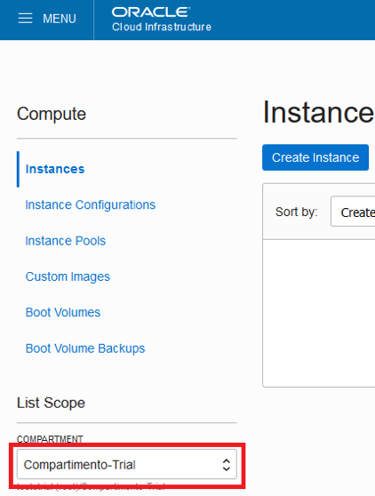
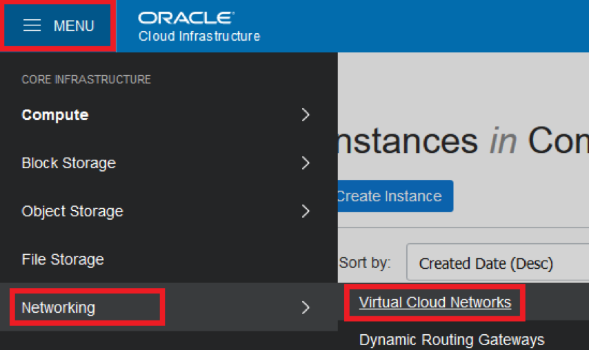
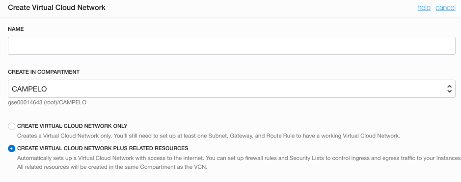
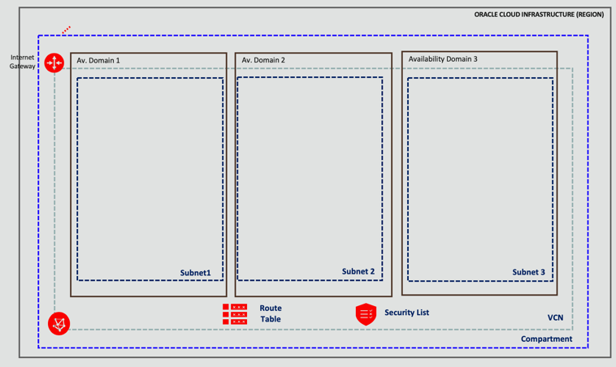

## Lab 2. Networking
The Virtual Cloud Network and It’s Resources

**Objectives**
- Create Oracle Virtual Cloud Network (VCN)
- Configure 3 subnets in 3 ADs
- Provision an Internet Gateway, which will allow your VCN access to public internet
- Configure Route Table

## Create Oracle Cloud Network (VCN)
To create a network, remember to choose your compartment, then hit:  Networking>>Virtual Cloud Networks, from the main menu.

**Don't forget to choose your compartment**

**Create your VCN**

**Create in Compartment**: Compartimento-Trial
**Name**: VCN-Trial
- CREATE VIRTUAL CLOUD NETWORK PLUS RELATED REOURCES

The OCI Console provides the option optimize the networking infrastructure creation process. By choosing the option “Create Virtual Cloud Network Plus Related Resources”, OCI will create the entire network layer for you. OCI will create a 10.0.0/16 CIDR Block, the necessary subnets (AD Local), along with Route Tables, the Internet Gateway, and some Firewall rules.

**Important:** Remember to choose the option "CREATE VIRTUAL CLOUD NETWORK PLUS RELATED REOURCES"

Right below, you will have a description of the options that will be used in the VCN creation process:

The networking creation process is very quick, and when finished, will be shown as below:

##Subnets inside a VCN
A VCN is a software-defined network that you set up in the Oracle Cloud Infrastructure data centers in a particular region. A subnet is a subdivision of a VCN in an Availability Domain. For an overview of VCNs, allowed size, default VCN components, and scenarios for using a VCN, see Overview of Networking.

Each subnet in a VCN consists of a contiguous range of IP addresses that do not overlap with other subnets in the VCN. For example: 172.16.1.0/24. The first two IP addresses and the last in the subnet's CIDR are reserved by the Networking service. You can't change the size of the subnet after creation, so it's important to think about the size of subnets you need before creating them. 

VCN is a cross-AD object. Inside it, we can create objects that will be positioned in any AD, inside the same region.

##Internet Gateway 
You can think of an Internet Gateway as a virtual router connecting the edge of the cloud network with the internet. Traffic that originates in your VCN and is destined for a public IP address outside the VCN goes through the Internet Gateway. 

Route Configuration for the Internet Gateway
Every VCN needs a Route Table that will direct Public IP’s traffic. 

After all the resources are created, your OCI tenant will have a structure that will look like this:

