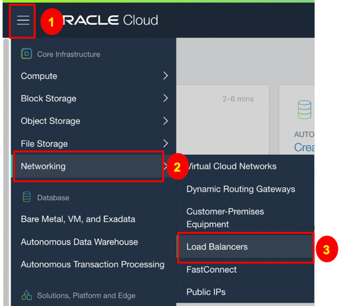
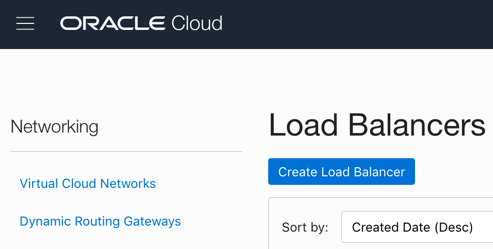
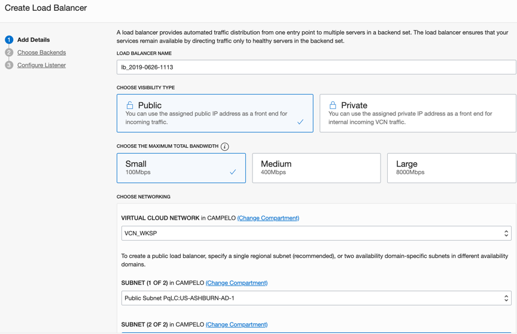
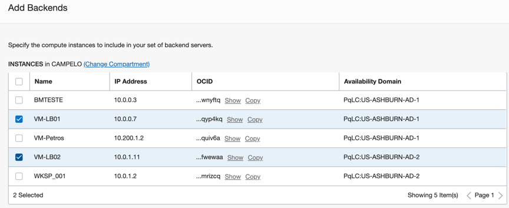
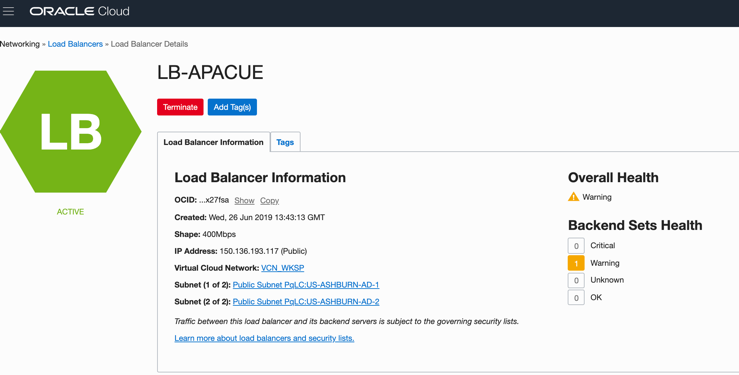

## Lab 6. Load Balancer

The Oracle Cloud Infrastructure Load Balancing service provides automated traffic distribution from one entry point to multiple servers reachable from your Virtual Cloud Network (VCN). The service offers a load balancer with your choice of a public or private IP address, and provisioned bandwidth.

The Load Balancing service enables you to create a public or private load balancer within your VCN. A public load balancer has a public IP address that is accessible from the internet. A private load balancer has an IP address from the hosting subnet, which is visible only within your VCN. You can configure multiple for an IP address to load balance transport Layer 4 and Layer 7 (TCP and HTTP) traffic. Both public and private load balancers can route data traffic to any backend server that is reachable from the VCN.

Your load balancer has a backend set to route incoming traffic to your Compute instances. The backend set is a logical entity that includes:
- A list of backend servers.
- A load balancing policy.
- A health check policy.
- Optional SSL handling.
- Optional session persistence configuration.

## Load Balancing Concepts

**backend server**
An application server responsible for generating content in reply to the incoming TCP or HTTP traffic. You typically identify application servers with a unique combination of overlay (private) IPv4 address and port, for example, 10.10.10.1:8080 and 10.10.10.2:8080.

**backend set**
A logical entity defined by a list of backend servers, a load balancing policy, and a health check policy. SSL configuration is optional. The backend set determines how the load balancer directs traffic to the collection of backend servers.

**certificate**
If you use HTTPS or SSL for your listener, you must associate an SSL server certificate (X.509) with your load balancer. A certificate enables the load balancer to terminate the connection and decrypt incoming requests before passing them to the backend servers.

**health check**
A test to confirm the availability of backend servers. A health check can be a request or a connection attempt. Based on a time interval you specify, the load balancer applies the health check policy to continuously monitor backend servers. If a server fails the health check, the load balancer takes the server temporarily out of rotation. If the server subsequently passes the health check, the load balancer returns it to the rotation.

## Objective
Create a Public Load Balancer Service, with 2 backend servers.
Before we start creating our LB service, please note that there are some important tasks to do. In order to have some “service” to be tested by the Load Balancer, we need to install an application server on the Linux server.

To be successful, we need to execute the tasks in the following way:

**1 –** Create a new Linux Server. Be sure to create the second server in an Availability Domain that is different from the first one.

**2 –** Install Apache Application Server on each server:
Following, you’ll find the necessary commands to start a Apache Web Server :

1.	sudo yum install httpd -y
2.	sudo apachectl start
3.	sudo systemctl enable httpd
4.	sudo apachectl configtest

5.	sudo firewall-cmd --permanent --zone=public --add-service=http
6.	sudo firewall-cmd --reload
7.	sudo su -
8.	echo 'This is Oracle webserver <Put a name Here> running on OCI Workshop' > /var/www/html/index.html

**3 -** Test Apache’s behavior, all you need to do, is use the Compute Instance’s public IP on the browser to check if Apache’s main page will come up.

REMINDER: Before test Apache on your browser, be sure that you have already created an Ingress Rule on the VCN’s Security List, so port 80 is cleared for traffic.

Be sure to start Load Balancer creation only after both calls on Apache are working. This is important, because if you create the load balancer without an available service, it will be created in “Error” state. The Load Balancer usually takes 5 minutes to “calibrate” its status. 
Our Goal is to create Load Balancer service only after both Apache servers are running, so LB service will have a “ready” state, and will be ready to be tested.

## Load Balancer Creation Process

To access Load Balancer interface, again, we’re going to start from the “Action Menu” 

Then hit the Create Load Balancer button:

## Creating Load Balancer
The Load Balancer creation screen is a wizard based model, where you’ll be guided through the process by the interface. In the main screen, you’ll provide the information below :
•	Name
•	Visibility: Public or Private
•	Supported Bandwidth (Small - 100 Mbps, Medium - 400 Mbps, or Large - 8 Gbps)
•	VCN and subnets (choose the 2 subnets where your compute instances were created)

## Set the Load Balancer Policy

Enter the Backend Set servers:

As a last step, define the type of traffic that will be handled 

Once the creation process is finished, you’ll have the following information:

## Load Balancer Testing

In order to simulate an application environment, we need to start a web service on both Compute instances. 

To get different outputs on load balancer calls, add different contents to Index.html file on each compute.
