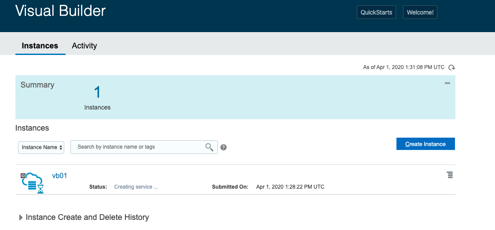

  

# Getting Started

## Lab Purpose and Rules

These labs are designed to provide you with an introduction to Visual Builder and Digital Assistant to prepare you to showcase these services.

Here are some general guidelines that will help you get the most from
these lab exercises.

  - Read through an entire exercise before executing any of the steps.
    Becoming familiar with the expected flow will enhance your learning
    experience.

  - Ask before you do. If you have any questions, please ask the
    instructor before you march down a path that may lead to wasting
    your time.

  - Follow the steps as shown in the Lab Guide. This is a live
    environment. If you want to do something that is not in the labs,
    ask the lab instructor first. In particular, do not create, delete,
    or alter any cloud objects without asking first.

  - There is no prize for finishing first; there is no penalty for
    finishing last. The goal is to gain a firm understanding of Oracle
    Visual Builder.

  - Ask questions freely. The only dumb questions are those that are not
    asked.

# Create VBCS Instance

As part of the lab, we expect learns to create the VBCS instance before the session delivery.
If you are creating a new instance either for the lab purposes or a customer demonstration, please follow the next steps; the process is simple but require several minutes to complete.

In this lab you will make sure you can access the VBCS instance for your
classroom and supporting lab files.

## Video

*Note: By clicking the video, this will redirects you to OTube. Remember to get back to this page to continue with the Lab*

## Guide

First, go to cloud.oracle.com, click on **View Accounts** and select **Sign in to cloud**

Enter your tenant account

On the login screen select SSO and provide your credentials *(Contact your tenant admin if you are using a different login mechanism)*

Once in the main dashboard, open the **General Menu** located at the top left hand side of the screen, select **Platform Services**, and click on **Visual Builder**

* Log into your tenancy using cloud.oracle.com; be sure it has been provisioned to allow Visual Builder Cloud Service and the database and object storage instances also required.  (check with your tenancy admin if unsure)

* From the “Visual Builder” service box there are two ways to open a service console.

* One method is to click on the box’s “Visual Builder” text to display an overview page.

* From the overview page, click the “Open Service Console” button to continue.

* Another method is to click the **General Menu** icon

 in the lower-right corner of the  “Visual Builder” service box to display a menu.

* Select “Open Service Console” from the menu.

* If you have not created any services the Service Console prompts you to begin the process.

**DO NOT** CLICK “CREATE INSTANCE” at this time, we will be using **Quick Starts** (see step 5).

* Visual Builder provides a “Quick Starts” capability to build an instance complete with supporting database and object storage. Click the “Quick Starts” button to get started it is located in the upper-right portion of the Service Console display inside the big blue bar.

* Click on **Custom**
 

* Provide an instance name, description, and region. Once complete, click next and confirm. The instance creation can take up to 10 min.

That’s it, you’ve created an instance that can support many VBCS applications and user.

NOTE:

If others will be sharing your VBCS instance you will need to use Oracle Identity Cloud Service (IDCS)
to make sure they have `ServiceDeveloper` (Visual Builder Administrator) role for your instance if they are developers or 'ServiceAdministrator' (Visual Builder Administrator) role if they need to administer other's applications. 
See Oracle Documentation for more information.

[Return to Main Page](https://oracle.github.io/learning-library/ospa-library/appdev/application-development-lab/index.html?page=README.md)
