# Oracle Digital Assistant Lab

**Before you begin**
This 60-minute hands-on lab is an entry-level exercise for building a skill in Oracle Digital Assistant.

**Background**
Oracle Digital Assistant is an environment for building _digital assistants_, which are user interfaces driven by artificial intelligence (AI) that help users accomplish a variety of tasks in natural language conversations. Digital assistants consist of one or more _skills_, which are individual chatbots that are focused on specific types of tasks.


**Lab Objectives**

In this lab, you will create a skill that can be used for interactions with a pizzeria, including ordering pizzas and canceling orders. As part of this process, you will:
* Define intents, utterances, entities.
* Design a conversation flow.
* Validate, debug and test your skill.

**Intended Audience**

- Beginner/Intermediate technical learners
- New to cloud
- New to Oracle Cloud Infrastructure

**Changelog**
- April 6, 2020 - version 1

**What Do You Need?**
* Access to Oracle Digital Assistant.


[**Return to Main Page**](../index.html)

****************

## Welcome to Oracle Digital Assistant

## Create a Skill
In this lab, we’re starting from scratch. So the first thing you’ll do is create a new skill.
1. Access the cloud tenant using your Oracle SSO account.
1. Click on the  to open the side menu.
2. Select  `Digital Assitant`

	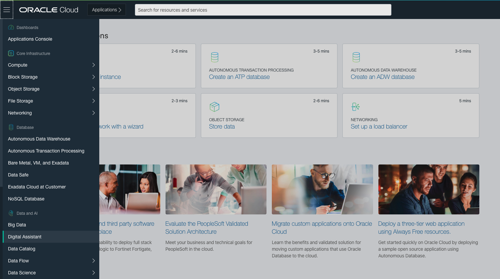

1. On the Digital Assitance console, click the click  next to the instance name and select `Digital Assitant Designer UI`

	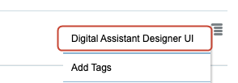

1. With the Oracle Digital Assistant UI open in your browser, click  to open the side menu.

1. Click **Development** and select **Skills**.

	

1. Click  again to collapse the side menu.

1. Click the **New Skill** tile

    

1. The Create Skill dialog appears.

    

1. For **Display Name** enter `Pizza King`. If you are working in an environment where others may also be creating the same tutorial, prefix `Pizza King` with your unique initials.

1.  For **Version**, enter `1.0`

1.  Optionally, fill in a one-sentence description, e.g. `Skill` for ordering from Pizza King

1.  Click **Create**.The designer will then open on the **Intents** page. Here’s where we’ll begin to express the use case (that is, the PizzaKing-customer activity flow) in terms of the concepts that support Natural Language Processing (NLP): intents and entities.


## Create Intents

Oracle Digital Assistant’s underlying natural language processing (NLP) engine doesn’t inherently know about the business or task that a skill is supposed to assist with. For the skill to understand what it should react to, you need to define intents and examples (utterances) for how a user would request a specific intent. 

For the PizzaKing example, you will create intents for ordering pizza, cancelling an order, and filing a complaint.


## Create the Order Pizza Intent

1. In the left navigation for the designer, make sure that  is selected.
2. Click the **+ Intent** button.
3. In the **Conversation Name** field, type `Order Pizza`.
4. In the **Name** field, type `OrderPizza`.
5. Copy the example sentences below, paste them into the **Enter your example utterances here** field, and press the Enter key. (Yes, you can paste all of them at once.)
	
	```
	Would you happen to have thin crust options on your Pizzas?
	Let’s order a cheese pizza
	Would love a large Pepperoni please!
	I feel like eating some pizza
	I would like to order a pizza
	Can I order a Pizza?
	What’s on the menu today?
	I want pizza
	Do you server gluten-free pizza?
	I want to order pizza for lunch
	Do you have deep dish pizzas available?
	Order Pizza!
	```


6. You’ll notice that it's fine for utterances to have inconsistent punctuation and capitalization.

	


## Create the Cancel Pizza Intent

1. Click the **+ Intent** button.
    
2. In the **Conversation Name** field, type `Cancel Pizza`.

3. In the **Name** field, type `CancelPizza`.

4. Copy the example sentences below, paste them into the **Enter your example utterances here** field, and press the Enter key.

	```
	Can I cancel my order?
	Cancel my order
    Cancel my Pizza please
    How do I cancel my order?
    I don’t want my Pizza anymore
    I really don’t want the Pizza anymore
    I’d like to cancel my order please
    Its been more than 20 mts. Please cancel my order and issue a refund to my card.
    Need to cancel my order
    Please cancel my pizza order
    Please don’t deliver my Pizza
	```
    
## Create the File Complaint Intent

1. Click the **+ Intent** button.

2. In the **Name** field, type `FileComplaint`.

3. Copy the example sentences below, paste them into the **Enter your example utterances here** field, and press the Enter key.
	
	```
    I am upset
    You charged me wrong
    I want to file a complaint
    I am not happy with my recent order
    I have some grief to share
    I want to speak with a manager
    Can I raise a complaint
	```

    Your screen should look similar to what is shown in the image below:

    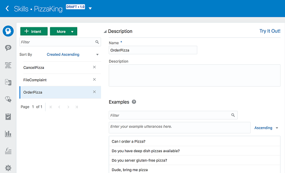

**Note:** If you are stuck, you can import the intents and utterances using  [PizzaKing-Intents.csv](https://docs.oracle.com/en/cloud/paas/digital-assistant/tutorial-skill/files/PizzaKing-Intents.csv).


## Train Your Intents

You’ve now provided the basic ingredients that allow the skill to recognise user input for ordering a pizza, but right now, the skill has no cognition. It can’t understand any user input. To enable it to understand the intents, you need to train it.

1. Locate the **Train button** () on the right side of the page.

    

2. Select `Trainer Ht` a Linguist based model.

    

3. Click , click **Submit**, and then wait a few seconds for the training to complete.

<br>

## Test your Model 

It is not realistic to get the training of your intent model right the first time you do it. Good intent models are created in an iterative cycle of training, testing, retraining, and retesting.

A good intent model is one that has a low ambiguity between the different intents. So let’s see how well we’re doing so far.

1. Click 
2. Click the **Try it Out!** label . The Try Out Intents/Q&A dialog appears.
3. In the **Message** field of the dialog, type `I want to order pizza` and click the **Send** button.As you might expect, the result is as shown in the image below.

	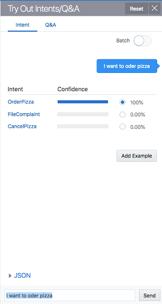

4. Next try `I feel like eating some pizza`. This should also resolve to the OrderPizza intent.

5. Now try `Cancel my order`.  This should resolve to the CancelPizza intent.

6. And now try `Dude, bring me pizza` and see what that resolves to.

	

7. As you can see, the intent engine is (correctly) most confident that the user wants to create an order, but not by a particularly high margin.
The sentence "Dude, bring me pizza" deserves a higher confidence score, so we should add it to the list of utterances.

8. Click **Add Example** to add it.
9. Click  to retrain the model.
10. Again enter Dude, bring me pizza in the **Message** field and click **Send**. The confidence score should be much higher for OrderPizza (possibly even 100%).

    **Note:** Conversational AI does not compare input by exact matches of the words. Though "Dude, bring me pizza" is available as an utterance, when entering the sentence as a message, it is the intent model’s algorithm that determines the matching intent.

11. Type `You are expensive and you still don’t deliver on time` in the **Message** field and click **Send**.

	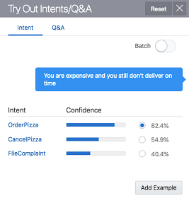

12. In all likelihood, the FileComplaint intent did not receive the highest score. In the above screenshot, OrderPizza "won", though it’s also possible that CancelPizza could get the highest score.

13. To help remedy this, in the FileComplaint intent row of the dialog, select the radio button and then click the **Add Example** button to add the utterance to the FileComplaint intent.

	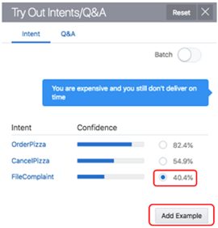

    **Note:** In these examples, you might get slightly different confidence scores than what are shown here. And in some cases, the matching intents themselves could vary, should the differing confidence scores push those intents above or below the given confidence thresholds. The cause of this variance is the non-deterministic nature of the AI behind the natural language processing and the fact that these skills have a limited number of training utterances (in order to make the lab simpler).

14. Retrain the skill. **Note:** For us humans it is easy to see that "You are expensive and you still don’t deliver on time" is not an order but a complaint. However, a skill first needs to be trained before it is able to gain the same understanding. The NLP model in this lab is not trained with a lot of data, so it’s more likely to make mistakes.

15. Think of two or three more phrases that the system might have problems matching to an intent with high confidence and try them in the Intent tester. If you find one that doesn’t match well, select the intent that it should be resolved to and click **Add Example**.

16. Train the model again and then re-test.

### Notes on What You Just Did
In this part of the tutorial, you have tested the quality of your intent training with the goal being to ensure a high level of confidence when resolving intents.

In a real skill project, you would always need to go back to the intent testing with user-provided entries you find in the conversation logs. If, using that test input, your intents are not matched the way they should be, you need to add them as example utterances to proper intents and then retrain the model.

**Note:** Oracle Digital Assistant also has a batch mode that allows you to test based on a log of a previous set of tests. This is useful for re-running a set of tests iteratively as you fine-tune your intents.


## Create Entities

Now it’s time to add entities, which detect information in the user input that can help the intent fulfill a user request. For the Pizza King business, such information could be the size of pizza, the toppings of pizza, and delivery time. For example, the user input "I’d like to order a _small meaty_ pizza at _9:00 pm_" contains all three of these information types.

We’ll create custom entities for size and topping and later use a built-in entity for time. While we’re at it, we’ll add some synonyms (including some common misspellings) that optimize the entity’s ability to tag words from sloppy user input.

### Create Entities for Pizza Size and Pizza Topping
1. In the left navigation for the designer, select .
2. Click  to create a new entity.
3. In the **Name** field, change the value to `PizzaSize`
.
4. In the Configuration section, in the **Type** dropdown, select **Value list**.
5. Click .
6. For **Value**, type `Small`
.
7. For **Synonyms**, type `Personal`
, press Tab, and type `smallest`
.
8. Click **Create**.
9. Following the pattern in the previous four steps, add the value `Medium`
 and the synonym `middle`.
10. Following the same pattern, add the value `Large`.
 and the synonyms `Big`, `grande`, and `biggest`.
11. Click  to create a new entity.
12. In the **Name** field, change the value to `PizzaTopping`.
13. In the Configuration section, in the **Type** dropdown, select **Value list**.
14. Add values for `Meaty` , `Veggie`, `Hot and Spicy`, and `American Hot` .Your list of entities should look like what is shown in this figure:

	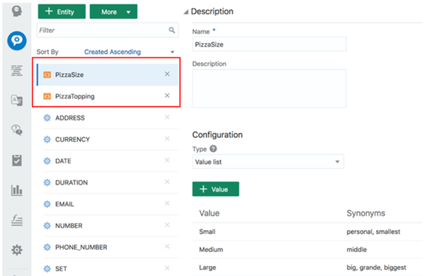


### Associate the Entity with Its Intent
For an entity to be recognised when parsing the user input message, it needs to be associated with an intent. So let’s associate our entities with the appropriate intents:
1. In the left navigation for the designer, select .
2. Select the OrderPizza intent.
3. Click  (in the upper right side of the page).
4. Select the PizzaSize entity.
5. Repeat the previous two steps for the PizzaTopping and TIME entities.(TIME is a built-in entity that we’ll use to help the skill process input for pizza delivery time.)

6. Retrain the model by clicking .The entity list associated with the OrderPizza intent should look like what is shown in the image below (though the order may be different):

	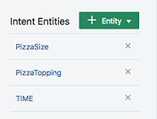


### Test the Entities

The Try It Out feature enables you to test whether the skill identifies entity values in user input.
1. In the left navigation for the designer, select .
2. Click .
3. In the **Message** field of the dialog, type `I want to order a small hot and spicy pizza at 7:30 pm` and click **Send**.You should see a table showing entities and the values extracted from the input.

	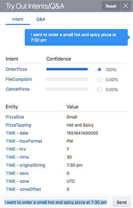

    **Note:** You may need to scroll up in the dialog to see the entities.
Since the entities are recognised in the user input, the skill doesn’t have to ask the user for that information later in the flow.
Now let’s try another one.

5. In the **Message** field, now type `I want to order the biggest meaty pizza at noon` and click **Send**.The result should look like what is shown below and thus prove that the PizzaSize entity shows the right value for the biggest synonym. Also "noon" is properly interpreted as 12:00 p.m.

	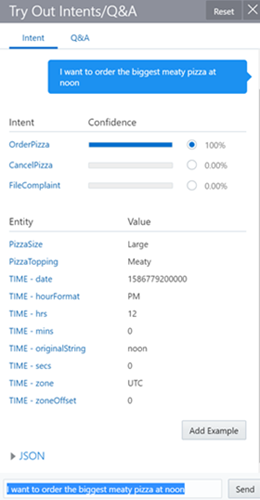


### Notes on What You Just Did
	
In this part of the tutorial, you have created custom entities for the PizzaKing OrderPizza intent, associated the entities with the intent, and tested the entity recognition in the embedded skill tester.
	
Similar to the PizzaOrder intent, you would typically need to create and associate entities for the other intents as well. In the interest of time, this tutorial only focuses on the PizzaOrder intent.


## Design the Dialog Flow

With the NLP model created, you are ready to build the dialog flow for the skill. The dialog flow is a conversation blueprint that defines interactions users may have with the skill. Each interaction is defined as a _state_. Each state references a component, which renders a skill response, receives user input, sets and resets variables, resolves user intents, or authenticates users.

### Set Up the Flow’s Basic Outline
Our first step is to create the basic flow outline, including context variables and states to handle the user’s initial input.
Context variables are the skill’s temporary memory. They can be referenced throughout the dialog flow. We’ll add context variables to hold values returned by the intent engine, entity values, and the value for the pizza order message.
1. In the left navigation for the designer, click  to open the dialog flow editor.
2. Delete all content between the `variables` and the `states` elements.
3. Delete all content below the `states`element. That should leave you the following remaining code:

	

4.  Under `variables:` add these five context variables: 

	```
	iResult: "nlpresult"
	pizzaSize: "PizzaSize"
	pizzaTopping: "PizzaTopping"
	deliveryTime: "TIME"
	pizzaOrderMsg: "string"
	```


    **Important:** Make sure that they are indented two spaces more than the `variables:` (four spaces total). If the indentation isn’t exact, metadata validation will fail. This is what the flow should now look like: 

    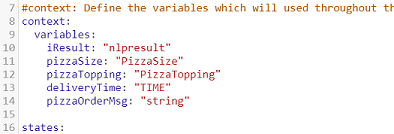

    Now we’re ready to add some states.

### Add a State to Determine User Intent
First we’ll add the `System.Intent`
 component. This component evaluates user input to determine the user intent, extracts all of the entities, and then triggers a subsequent state.

1. Click  to open the gallery of component templates.

2. Select Language as the component type.

	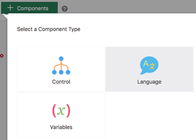

3. In the dialog, select **Intent** and then switch on **Remove Comments**.

    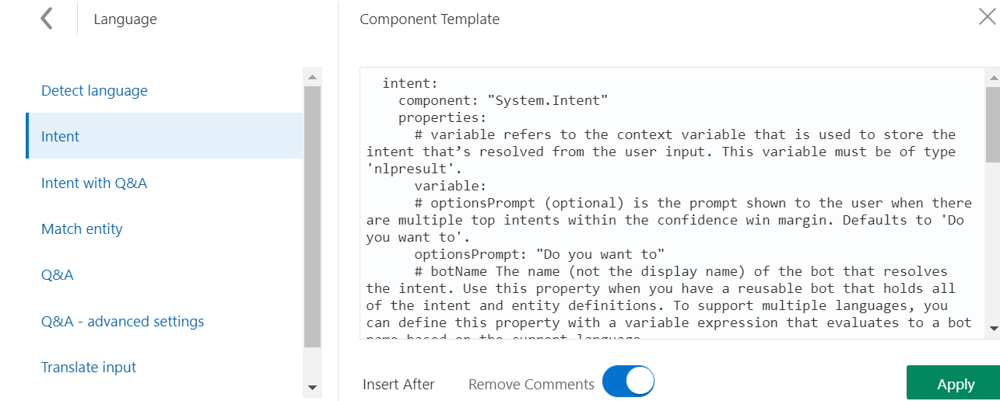

4. Click **Apply**.

5. In the newly added state, set the value of the `Variable`

     property to`"iResult"` (including the quotation marks).This means that `iResult` will be the variable to which the NLP engine saves the intent resolution and entity extraction results to.

6. Delete the following properties:
    
	* botName
	* botVersion
	* sourceVariable
	* autoNumberPostbackActions
	* footerText
	
7. Update transition actions so that it looks like the following:

	`
	transitions:
 	  actions:
		OrderPizza: "startOrderPizza"
		CancelPizza: "cancelPizza"
		FileComplaint: "fileComplaint"
 		unresolvedIntent: "startUnresolved"
	`

### Add Initial States for Each Intent

Next, you need to create the dialog flow states that each possible outcome navigates to. To save you some time, the states are provided in a text document for you to copy and paste.

1. Open [states.txt](files/states.txt).
2. Copy the file’s contents and paste them at the bottom of the dialog flow.Make sure that the indentation is preserved in the pasted content.
3. Verify the correctness of your edits by clicking the **Validate** button on the top of the page.


## Troubleshooting Errors in the Dialog Flow

If you don’t see a success message, then most likely you misspelled a property name or did not follow the required two-space indenting increments. In this case, scroll through the dialog flow until you see an 
 icon in the left margin. 

Mouse over the icon to display the tooltip with a description of the problem. In addition, you can click the debug icon  which appears to the left of the dialog flow editor. It often provides additional information about the reason. You close the debug window by clicking the debug icon again.

If you have gotten into a jam and can’t get anything to work, open the  [your-first-dialog-flow.txt](files/your-first-dialog-flow.txt)  and replace the content in your dialog flow with the content from the file.


## Tune Intent Resolution

Before moving further, let’s take a look at some settings that are useful for fine-tuning intent resolution.
* **Confidence Threshold:** The skill uses this property to steer the conversation by the confidence level of the resolved intent. Set the minimum confidence level required to match an intent. When the level falls below this minimum value, the component triggers its unresolvedIntent action.
* **Confidence Win Margin:** When a skill can’t determine a specific intent, it displays a list of possible intents and prompts the user to choose one. This property helps the skill determine what intents should be in the list. Set the maximum level to use for the delta between the respective confidence levels for the top intents. The list includes the intents that are greater than or equal to this delta and exceed the value set for the Confidence Threshold.
Let’s update these settings:
1. In the left navigation for the skill, click  and select the **Configuration** tab.

2. Set the **Confidence Threshold** property to `0.6`(meaning 60%).

3. Set the **Confidence Win Margin** property to `0.1`(meaning 10%).

    

## Test the Basic Flow

Before doing any further development, let’s test the basic flow to make sure it responds correctly to initial user input.

1. Open the skill tester by clicking () in the bottom of the skill’s left navigation bar.

2. In the **Message** field, type `I want to order a pizza` and then press Enter.

3. Click the **Intent/Q&A** tab to view intent resolution.You should see an order process message as shown in the image below:

    

4. Click **Reset**.
5. In the **Message** field, type `I want to cancel my order` and then press Enter.The skill should respond with a message regarding pizza cancelation. And, in the Intent Matches panel, you should see that the CancelPizza intent is matched.

6. Click **Reset**.
7. In the **Message** field, type `Your delivery is too late, either cancel the order or file a complaint right now` and then press Enter.

    

    As you can see, both CancelPizza and FileComplaint exceeded the confidence threshold of 60%. CancelPizza has a higher score than FileComplaint. However, since CancelPizza’s score exceeds that of FileComplaint by less than the confidence win margin that we set earlier (10%), the skill presents a dialog so that the user can select what she really wants.

8. Finally, try a last random utterance: _Can you get me a radio taxi now?_

    

    As you can see, the confidence threshold level falls below this minimum value of 60% in this case, so the component triggers its unresolvedIntent action.

## Build the Pizza Order Conversation Flow

Now that we have verified that the basic intent model is working, the next step is to implement conversation flows for each intent. In the interest of time, we’ll do this just for the PizzaOrder intent.

We’ll complete the pizza order process by fetching the pizza size, topping, and delivery time, and then printing an order summary.

1. In the dialog flow, navigate to the `startOrderPizza`
 state.

2. Change the `text` property’s value to `"OK, lets get that order sorted"`.

3. Change the `keepTurn`value to ` true`

4. Delete the line `return: "done"`

5. Replace the deleted line with `next: "setPizzaSize"` This is what the state should look like:

    

## Set Pizza Size
1. Click  to open the gallery of component templates.
2. Select the **User Interface** category.
3. Select the **List – set variable** template.

	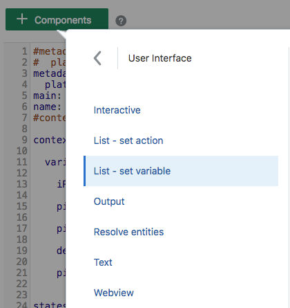

4. From the **Insert After** dropdown, select **startOrderPizza**.
5. Ensure the **Remove Comments** switch is ON.
6. Click **Apply**.
7. Change the state name of the newly added component from `variableList` to `setPizzaSize`.
8. Edit the state to look like the following:

	```
	setPizzaSize:
		component: "System.List"
		properties:
			options: "${pizzaSize.type.enumValues}"
			prompt: "What size of pizza do you want?"
			variable: "pizzaSize"
			nlpResultVariable: "iResult"
		transitions:
			next: "setPizzaTopping"
	```

## Set Pizza Topping
1. Below the `setPizzaSize`
 state, paste the following code (also based on the `System.List`
 component) to create the `setPizzaTopping`state:

	```
	setPizzaTopping:
		component: "System.List"
		properties:
			options: "${pizzaTopping.type.enumValues}"
			prompt: "What type of pizza would you like?"
			variable: "pizzaTopping"
			nlpResultVariable: "iResult"
		transitions:
			next: "setPizzaDeliveryTime"
	```

## Set Pizza Delivery Time
1. Click .
2. Select the **User Interface** category.
3. Select the **Text** template.
4. From the **Insert After** dropdown, select **setPizzaTopping**.
5. Ensure the **Remove Comments** switch is ON.
6. Click **Apply**.
7. Change the state name of the newly added component from `text` to `setPizzaDeliveryTime`.
8. Edit the state to look like the following:

	```
	setPizzaDeliveryTime:
		component: "System.Text"
		properties:
			prompt: "When can we deliver that for you?"
			variable: "deliveryTime"
			nlpResultVariable: "iResult"
			maxPrompts: 3
		transitions:
			actions:
				cancel: "maxError"
				next: "setPizzaOrderMessage"
	```

## Show Pizza Delivery Message
1. Click .
2. Select the **Variables** category.
3. Select the **Set variable** template.
4. From the **Insert After** dropdown, select **setPizzaDeliveryTime**.
5. Ensure the **Remove Comments** switch is ON.
6. Click **Apply**.
7. Change the state name of the newly added component from `setVariable`to `setPizzaOrderMessage`.
8. Edit the state to look like the following:

	```
	setPizzaOrderMessage:
		component: "System.SetVariable"
		properties:
			variable: "pizzaOrderMsg"
			value: 
			- "Thank you for ordering from Pizza King!"
			- "OK, so we are getting you the following items:"
			- "A ${pizzaSize.value} ${pizzaTopping.value} pizza at ${deliveryTime.value.date?long?number_to_time?string(‘HH:mm’)}."
			 
	```

	**Note:** The `text` property value uses the Apache FreeMarker expression `|-` to print multi-line text in a single response bubble. Alternatively, you could have used multiple output text components.

## Show Pizza Order
1. Click .
2. Select the **User Interface** category.
3. Select the **Output** template.
4. From the **Insert After** dropdown, select **setPizzaOrderMessage**.
5. Ensure the **Remove Comments** switch is ON.
6. Click **Apply**.
7. Change the state name of the newly added component from `output`
 to `showPizzaOrder`.
8. Edit the state to look like the following:

	```
	showPizzaOrder:
		component: "System.Output"
		properties:
		text: |-
			<#list pizzaOrderMsg.value as text>${text}
			</#list>
		transitions: 
			return: "done"
	```

## Validate the Dialog Flow

* Click the **Validate** button on the top of the page, and then fix any errors that are revealed.If you have errors that you can’t resolve, you can copy and paste the code from  [complete-dialog-flow.txt](files/complete-dialog-flow.txt) .

<br>
<br>

## Test Your Skill

Now that all of the skill’s pieces are in place, let's test its behaviour.
1. Open the skill tester by clicking  in the bottom of the skill’s left navigation bar.
2. Click **Reset**.
3. In the **Message** field, type `I want to order pizza` and then press Enter.You should see a menu of pizza sizes:

	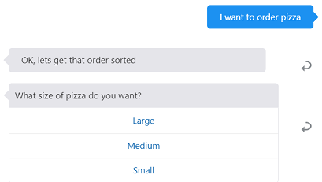

4. In the pizza size menu, select an option, e.g. **Small**.
5. Select a topping e.g. **Veggie**.
6. Enter a delivery time, e.g. `7:30 p.m.`
You should receive an order confirmation similar to the one shown in the image below:

	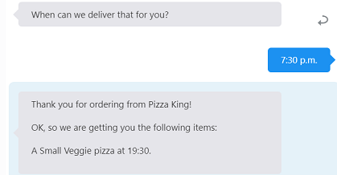

7. Click **Reset**.
8. Now try entering `Dude, can you get me the biggest hot and spicy pizza you can make at noon` and pressing Enter.This time, you should be immediately presented with the results of the order.

	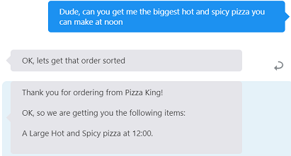

9. Within the **Conversation** tab, scroll down to take a look at the Variable section to see the entity values that were extracted from your input.

	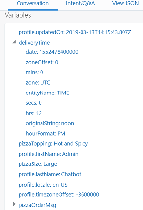

10. Finally, enter `I want to a veggie pizza at 8:00pm` and press Enter. This time the topping menu and the delivery time should be skipped, but the pizza size list should be displayed.

<br>

Congratulations! You have created your first skill and learned key aspects of defining intents, defining entities, designing the conversation flow, and using the tester to evaluate intent resolution and the conversation flow.

<br>

