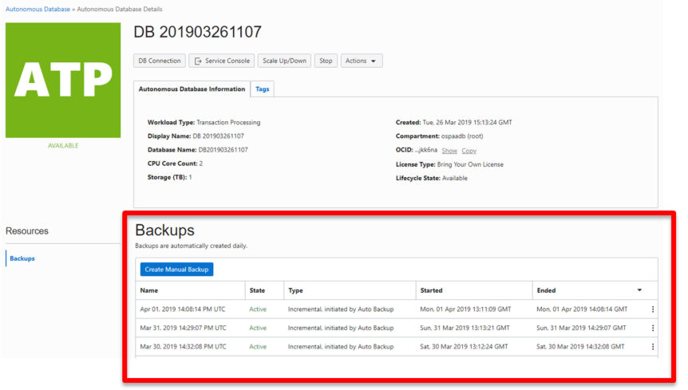
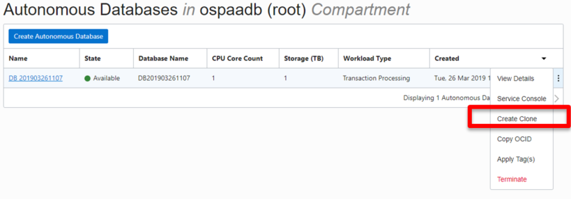
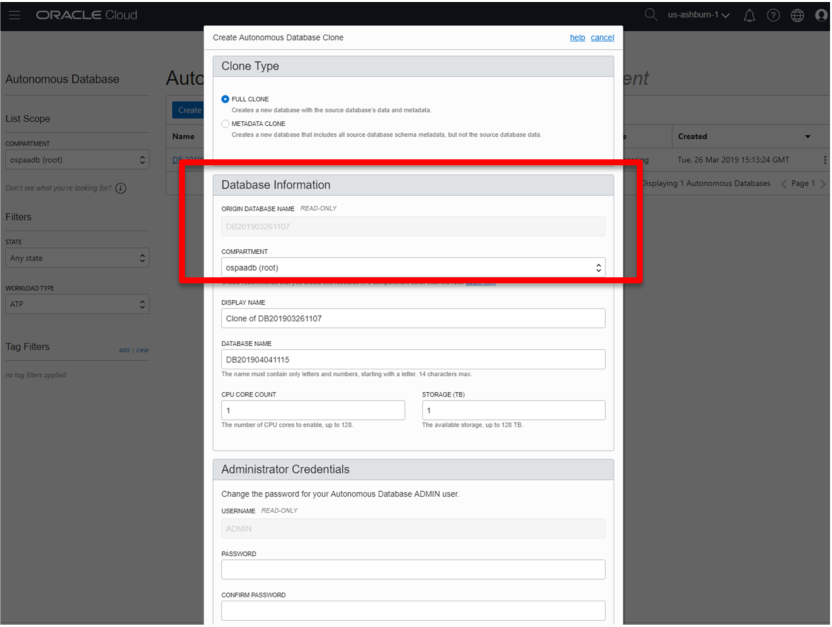
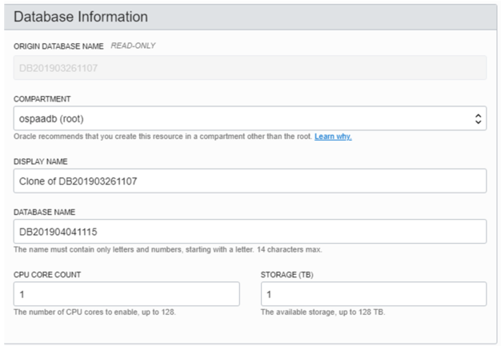
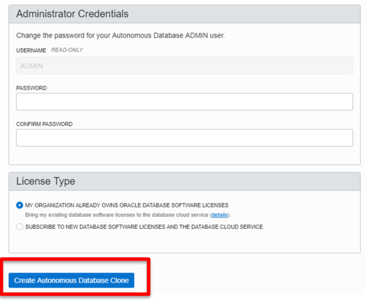
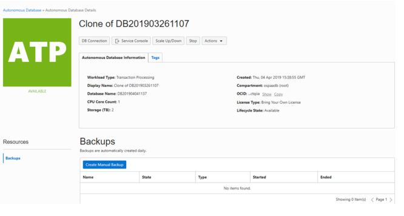

# Backups, Recovery, and Cloning an Autonomous Database

## Table of Contents

- [Module 1: Review Backup information from the Console](#module-1--review-backup-information-from-the-console)
- [Module 2: Perform a Point In Time Recovery](#module-2--perform-a-point-in-time-recovery)
- [Module 3: Cloning an Autonomous Database](#module-3--cloning-an-autonomous-database)

***** 

Backups, Recovery, and Cloning an Autonomous Database
============================================================

Oracle Autonomous Database (ADB) is configured to perform automatic backups of
your database and retain them for 60 days. The schedule for these built-in
backups is to run a full backup every week and incremental backups every day.

You can restore and recover your database to any point-in-time in the 60-day
retention period, or to a manually saved backup, in case you have initiated that
separately.

You can perform on-demand manual backups as well, provided you setup a seprate
OCI Object Storage bucket to store the manual backups. This is ideal when you
want to take a backup before some major application change, or for additional
data retention requirements due to regulations which is beyond the 60 days
provided by the ADB service.

You can initiate recovery for your ADB using the cloud console. ADB
automatically restores and recovers your database to the point-in-time you
specify. The recovery process internally decides which backup to use to provide
you the fastest recovery, either the automatic backups or the manual backups.

Autonomous Database provides cloning where you can choose to clone either the
full database or only the database metadata. Depending on the type of cloning
being performed, this will provide a full point in time copy of the original
database into a new standalone Autonomous Database

## Module 1: Review Backup information from the Console

1. Login in to your database console where you will see backups that were
    created for your database. If your database is new and has not undergone a
    full day of operation you will not see any backup and will not be able to
    perform this lab.

Figure 1-1

2. In the picture above you can see the daily backup that have been performed
    on this database and whether they are an incremental or full backup. 
    
## Module 2: Perform a Point In Time Recovery

1. To perform a point in time recover of your database select the backup you wish
    to recover from and click on the three dots at the far right of the backup,
    and select restore.

Figure 2-1

2. A pop-up will ask to confirm you want to perform a restore from that backup,
    click Restore.

Figure 2-2

3. The database goes into restore mode and is not available until the restore
    is done. The restore and re-start take time so make sure you won’t need your
    database in the immediate future before performing a restore.

Figure 2-3

4. When the restore completes, the database goes into STOPPED status and must
    be restarted by clicking on the Start button.

Figure 2-4

5. Confirm you want to start the database. The database will go into STARTING
    mode. When the startup continues it will switch to AVAILABLE and the restore
    is complete.

Figure 2-4

Figure 2-5

 ## Module 3: Cloning an Autonomous Database

1. Login in to your database console where the Autonomous Database you want to
    clone resides.

Figure 3-1

2. From the dropdown menu (three dots on the right of the database) select
    Create Clone

Figure 3-2

3. The Create Autonomous Database Clone screen comes up. The first option to
    select is whether the clone will be a Full Clone or a Metadata Clone

-   **Full Clone**: creates a new database with the source database’s data and
    metadata.

-   **Metadata Clone**: creates a new database with the source database’s
    metadata without the data

Figure 3-3

4. Next several parameters similar to original database creation must be
    provided:

-   **Compartment**: Select a compartment from the list of available
    compartments.

-   **Display Name**: Specify a user-friendly description or other information
    that helps you easily identify the resource. The display name does not have
    to be unique. You can use the name provided, of the form: Clone of DBname or
    change this to the name you want to use to identify the database. The
    supplied DBname is the name of the source database that you are cloning.

-   **Database Name**: Specify the database name; it must consist of letters and
    numbers only. The maximum length is 14 characters.

-   **CPU Core Count**: Specify the number of cores for your Autonomous
    Transaction Processing database.

-   **Storage (TB)**: Specify the storage you wish to make available to your
    Autonomous Transaction Processing database, in terabytes.

Figure 3-4

-   Administrator Credentials: Set the password for the Autonomous Transaction
    Processing Admin user. This password is for the admin user of the clone
    database, you can use the same or different password than your original
    database.

-   License Type: The type of license you want to use for the Autonomous
    Database.

5. Select **Create Autonomous Database Clone** after filling the information.

Figure 3-5

The clone database will be in provisioning mode and the logo color will
    reflect that.

Figure 3-6

6. Click on Autonomous Database on the top left to return to the Console, where
    you will see your original database and your clone. Notice your original
    database is not affected by the cloning process and continues to run
    uninterrupted.

Figure 3-7

When the cloning process completes, the **State** will change to     **Available**. Select the database when it becomes available and examine and     use it right away.

Figure 3-8

Figure 3-9

**This concludes the backup, recovery, and cloning lab.**

***END OF LAB***

[Back to Top](#table-of-contents) 
