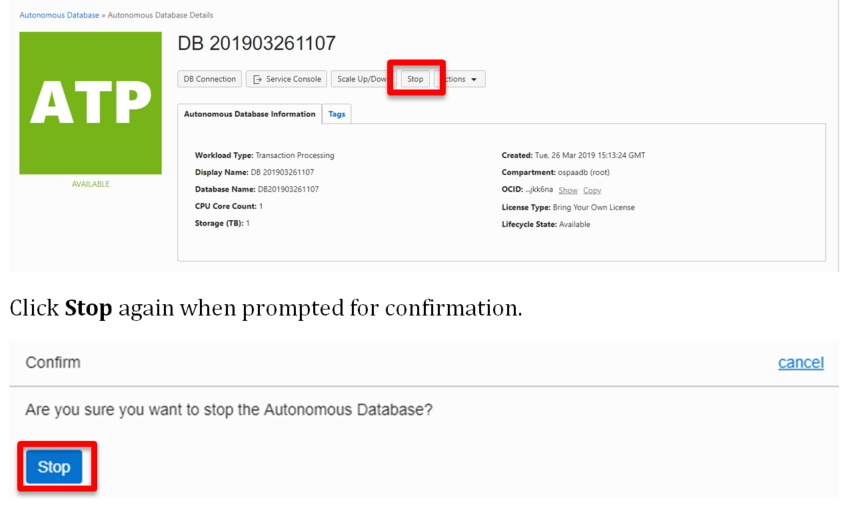
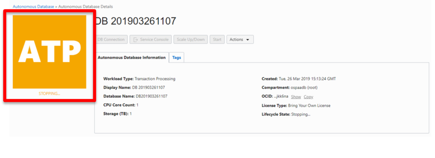
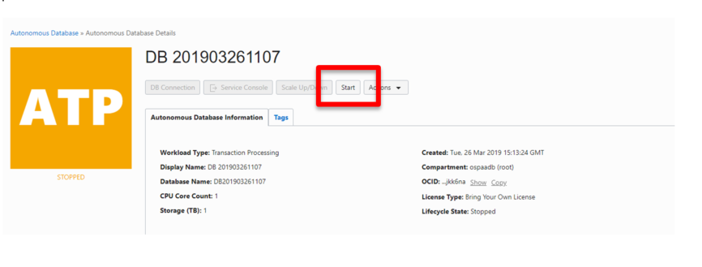
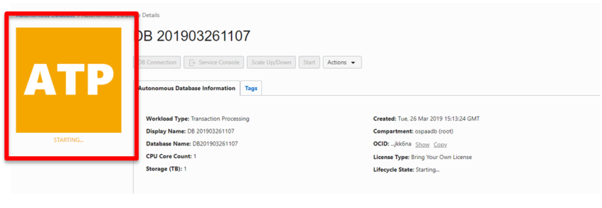

# Start, Stop, and Scale Autonomous Database

## Table of Contents

- [Module 1: Stopping the Autonomous Database](#module-1--stoping-the-autonomous-database)
- [Module 2: Starting the Autonomous Database](#module-2--starting-the-autonomous-database)
- [Module 3: Scaling the Autonomous Database](#module-3--scaling-the-autonomous-database)

***** 

Start, Stop, and Scale Autonomous Database
==================================================

This section outlines the tasks for starting and stopping the service and
scaling the Autonomous Database.

### Objectives

-   Start and Stop the Autonomous Database service

-   Scale the Autonomous Database service

## Module 1: Stopping the Autonomous Database

1. Sign in to your Autonomous Database **Service Console** and browse to the
A**utonomous Database Details** page of your service. Select the Stop button.

Figure 1-1

The ADB service will go into stopping status. Notice the status of **STOPPING**.

Figure 1-2

When the service is stopped, the status will change to **STOPPED**.

Figure 1-3

## Module 2: Starting the Autonomous Database

1. From the **Details** page of your ADB service, click **Start** to start your
service.

Figure 2-1

2. Click **Start** again when prompted for confirmation.

Figure 2-2

The ADB service will take a few seconds to start. For example, if you
provisioned ATP service, you would notice the status of **STARTING** as follows:

Figure 2-3

When the service is started, the status will change to **AVAILABLE**.

Figure 2-4

## Module 3: Scaling the Autonomous Database

1. From the **Details** page of your ADB service, click **Scale Up/Down** to scale
your service.

Figure 3-1

2. In the **Scale Up/Down** pop up, modify the **CPU CORE COUNT** to **2** and
click **Update**.

Figure 3-2

The ADB service will scale. Notice the status of **SCALING IN PROGRESS**. Note
that the ATP square remains green during the scaling process. No interruption to
the service occurs during all scaling operations.

Figure 3-3

When the scaling task is complete, the status will change to **AVAILABLE**. Note
the new **CPU Core Count** is reflected in the service details.

Figure 3-4

3. Use the same process to scale the system back down to 1 CPU by making the CPU
Core Count 1 in the scale pop-up.

**This concludes the starting, stopping, and scaling lab.**

***END OF LAB***

[Back to Top](#table-of-contents)  
