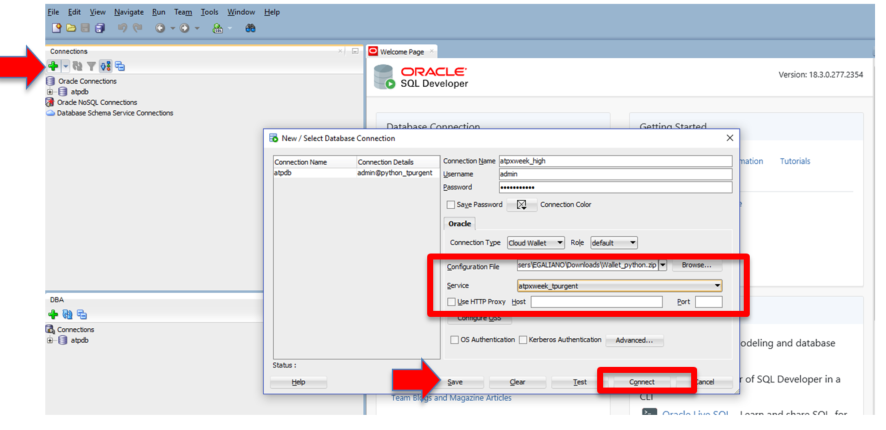
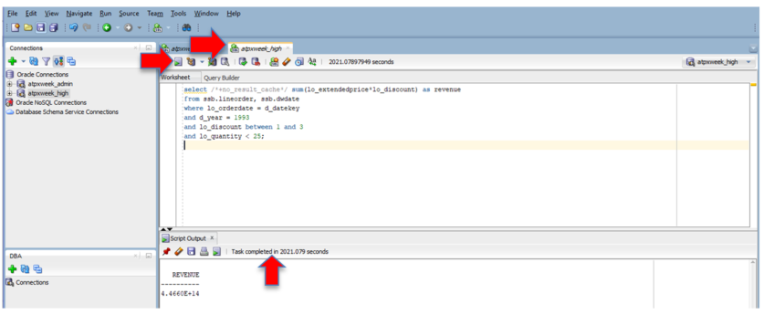
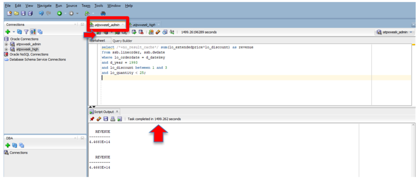
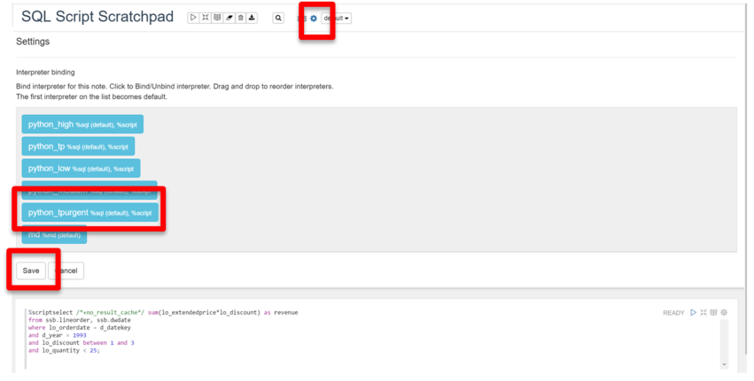
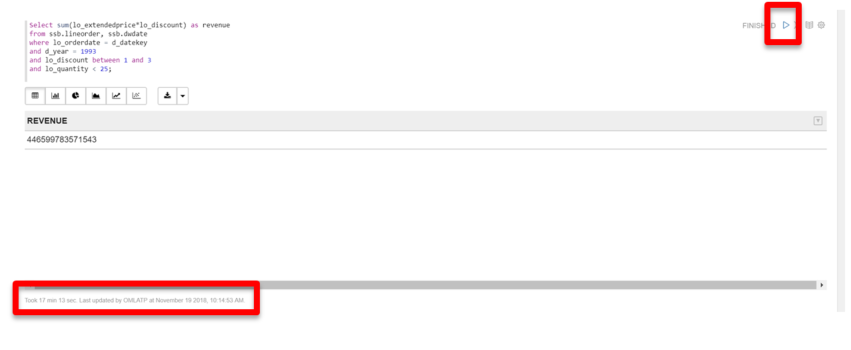
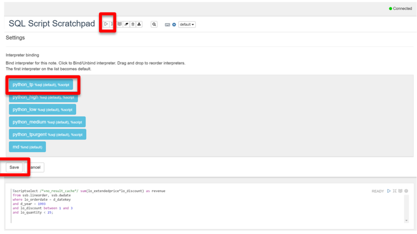
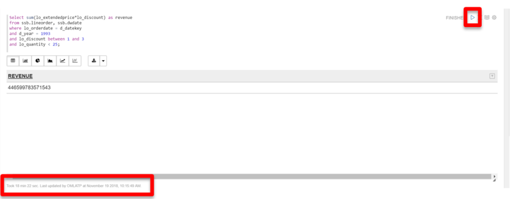

# Autonomous Database Consumer Groups and Workloads

## Table of Contents

- [Module 1: Managing Priorities in Autonomous Database](#module-1--managing-priorities-in-autonomous-database)
- [Module 2: Running the Queries in SQL Developer](#module-2--running-queries-in-sql-developer)
- [Module 3: Running the Queries in OML](#module-3--running-queries-in-oml)

***** 

Autonomous Consumer Groups and Workloads
==================================================


## Module 1: Managing Priorities on Autonomous Transaction Processing

The priority of user requests in Autonomous Transaction Processing is determined
by the database service the user is connected with. Users are required to select
a service when connecting to the database. The service names are in the format:

-   *\$database_name*\_tpurgent

-   *\$database_name* \_tp

-   *\$database_name* \_low

-   *\$database_name* \_medium

-   *\$database_name* \_high

For example, a user connecting with the \_low service uses the consumer group
LOW. The \_tp services are focused on high concurrency low parallelism
operations whereas low, medium, medium and high focus on increasing levels of
serialized execution of highly parallelized operations. The basic
characteristics of these consumer groups are:

-   **tpurgent**: The highest priority application connection service for time
    critical transaction processing operations. This connection service supports
    manual parallelism.

-   **tp**: A typical application connection service for transaction processing
    operations. This connection service does not run with parallelism.

-   **high**: A high priority application connection service for reporting and
    batch operations. All operations run in parallel and are subject to queuing.

-   **medium**: A typical application connection service for reporting and batch
    operations. All operations run in parallel and are subject to queuing.

-   **low**: A lowest priority application connection service for reporting or
    batch processing operations. This connection service does not run with
    parallelism.

As a user you need to pick the database service based on your performance and
concurrency requirements.

In this section you will use the \_tp and \_tpurgent database services to
understand the performance differences between them. For this exercise you will
run queries on the SSB schema sample data set provided in your Autonomous
database. You will run the queries first on the \_tp service and then on the \_
tpurgent service. Since we established connections with both SQL Developer and
Oracle ML you will test both (please note this is a long running query when only
1 or 2 cpu’s are allocated to the environment, it may take up to 20 minutes to
run).

```
Select sum(lo_extendedprice\*lo_discount) as revenue

from ssb.lineorder, ssb.dwdate

where lo_orderdate = d_datekey

and d_year = 1993

and lo_discount between 1 and 3

and lo_quantity \< 25;
```

The expectation is that you will see different parallelization and therefore
different execution with the \_ TPURGENT service vs. the \_TP service. This is
dependent on the number of CPU’s allocated to the database and other activity
that may be running concurrently.

## Module 2: Running the Queries in SQL Developer

1. In the previous lab we already created a connection to the **\_tp** service. We
need to create a new connection to the **\_tpurgent** service to be able to run
our test using both services. Please revisit steps above on how to create a
connection in SQL Developer. Below you will see the completed form. Name your
service **\$dbname_tpurgent** and for service select **\_tpurgent.** Remember to
use your original admin account and password. **Test, save, and connect** to new
service (please notice below that the tpurgent service is selected even though
the name high is appended to the connection name).


<p align="center">Figure 2-1</p>

2. You will end up with two connected connections in the Worksheet the original and
LOW connections:


<p align="center">Figure 2-2</p>

3. You should be connected to the just created **xweek_high** connection, if not
click on the tab labelled xweek_high in the worksheet to connect (see above).
Copy and paste the query above into the Query Builder and select **Run Script
(or F5):**


<p align="center">Figure 2-3</p>

You will see the result in the **Script Output** (bottom right square) including
the query execution time. In this case the query executed in 492.531 seconds.

4. Now run the query in the original service (_TP). Do that by clicking on the tab
with the original connection (in this case atpxweek_admin) which will cause SQL
Developer to connect to your ATP database with that service. Then paste the same
query on the Query Builder and run it. If you already have a query in the Query
Builder from a previous lab you can you can **erase it by hitting Ctrl-D or the
eraser icon** in the same bar as the Run Query icon


<p align="center">Figure 2-4</p>

Notice the difference in timings between your runs. One service will parallelize
operations and the other one will run it with no parallelization. Depending on
how many cpu’s you have allocated to your environment and other workloads
running on the system you will see different results. In another lab you will
learn how to inspect explain plans to determine if operations were parallelized
or ran sequentially.

## Module 3: Running the Queries in OML

Now run the same queries in OML experimenting with different services. OML makes
it easier to do this because Notebooks automatically “see” all services and it’s
easy to prioritize which to use. Notebooks also allow re-running the same query
multiple times without having to make any changes or re-posting the query.

1. Your OML session should still be open from the previous lab, if not go back
through the previous OML lab and skip the part where you create a user and
simply log in as your OML user (you can also use the link in the email you
received when creating your OML user).

2. If not already in **Run SQL Scripts,** select it from Quick Actions:


<p align="center">Figure 3-1</p>

3. After selecting paste the same SQL you just ran on SQL Developer in a new
%script line in the SQL Script Scratchpad:


<p align="center">Figure 3-2</p>

4. Before running the query, explore the different services that can be used to run
the query by selecting the **Interpreter binding** button (next to the
**default** drop down button) which as shown below:


<p align="center">Figure 3-3</p>

Please notice that a new window opens listing all the services available to run
queries. You will see the five services already discussed previously and a new
one specific to OML (md). This is a list of services that will be used in order
of appearance. So the first service OML can connect to going down the list will
be used. A blue color indicates the service is selected, if you click on any of
the services it will turn white, which de-selects it. You can drag and drop any
service up or down the list to specify the order in which they will be
attempted.

5. For the first test we will use the **\_TPURGENT** service so if it is not on the
top of the list drag and drop it on top of the list. Select **Save** when done.


<p align="center">Figure 3-4</p>

6. Now run the query by selecting the **Run This Paragraph** button (highlighted
below) and notice the execution time at the bottom of the results set. Run the
same query several times by selecting the **Run This Paragraph** button again.
The first time running the query OML establishes a connection that will be
reflected in the total execution time, which could be several seconds. With a
short query this will substantially add to the total execution time. With our
long query the connection time is a small portion of the overall execution time.


<p align="center">Figure 3-5</p>

7. Now run the query in the **\_tp** service. Follow the steps above for changing
the service by selecting the **Interpreter binding** button and when the list of
services appears drag the **\_tp** service to the top and **Save:**


<p align="center">Figure 3-6</p>

8. Now run the exact same query as before by selecting the **Run This Paragraph**
button.


<p align="center">Figure 3-7</p>

Notice the difference in timings between your runs. One service will parallelize
operations and the other one will run it with no parallelization. Depending on
how many cpu’s you have allocated to your environment and other workloads
running on the system you will see different results. In another lab you will
learn how to inspect explain plans to determine if operations were parallelized
or ran sequentially.

**Congratulations! You have experimented with the basics of services and resources in ATP and observed the impact they have in execution and scaling of transactions.**

***END OF LAB***

[Back to Top](#table-of-contents) 

