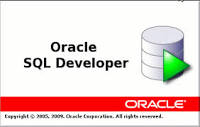
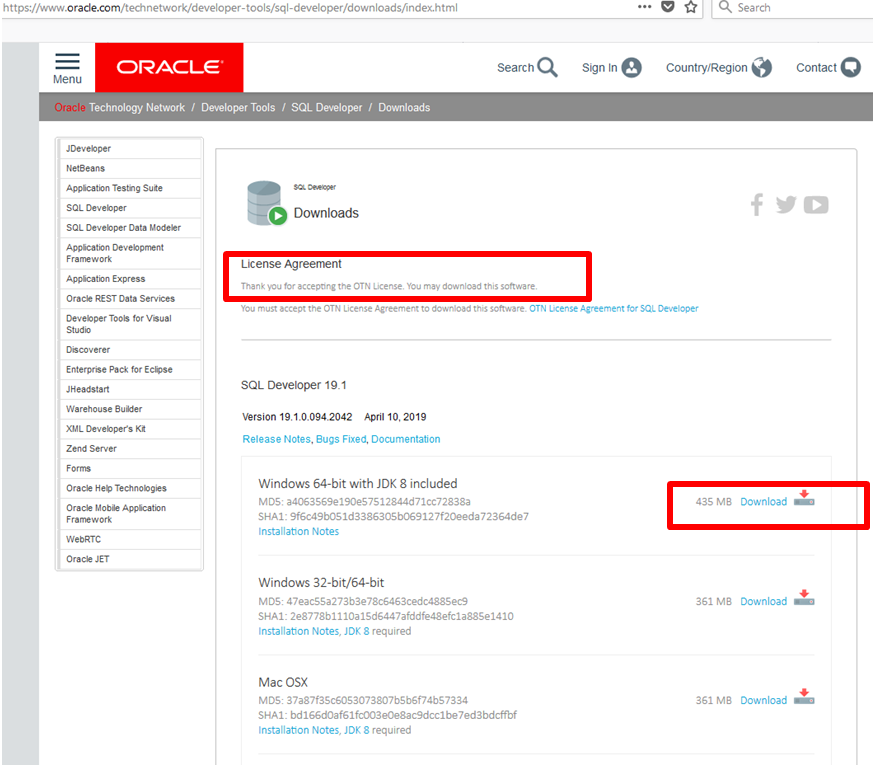
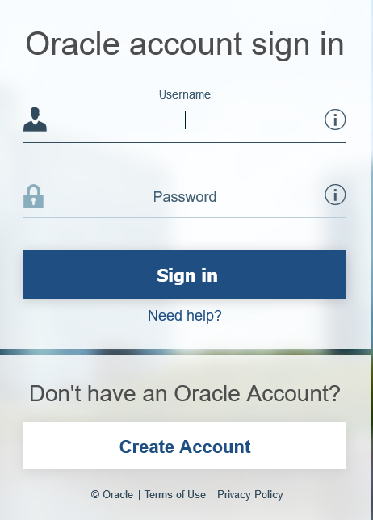
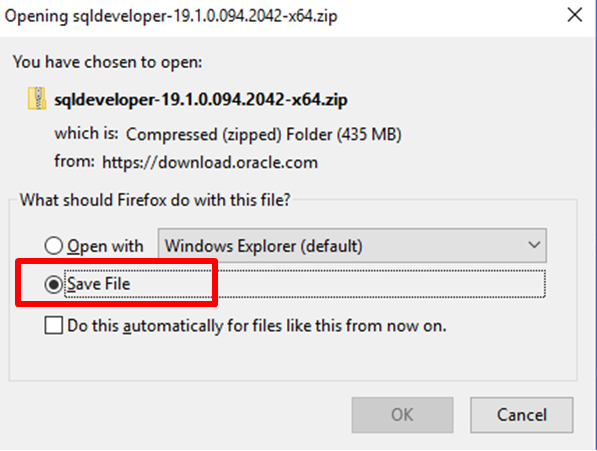
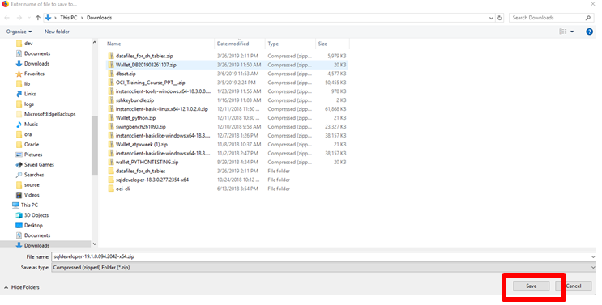
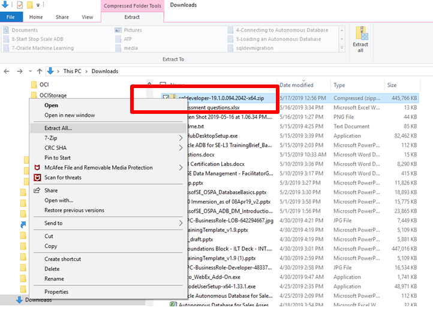
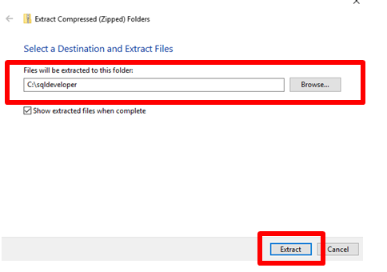
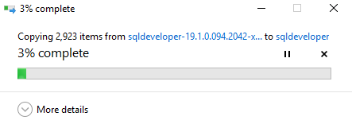
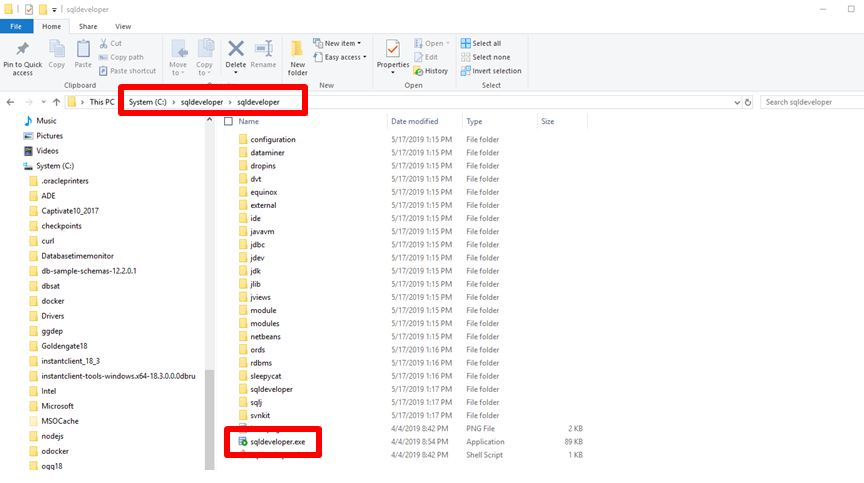
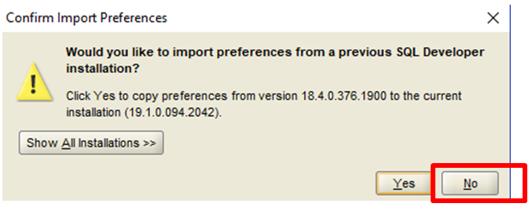



## Who Should Complete This Lab: All Participants

# Oracle SQL Developer

Figure 1

Oracle SQL Developer is a free, integrated development environment that
simplifies the development and management of Oracle Database in both traditional
and Cloud deployments. SQL Developer offers a worksheet for running queries and
scripts, a DBA console for managing the database, a reports interface, a
complete data modelling solution, and a migration platform for moving your 3rd
party databases to Oracle. 

The labs make extensive use of SQL Developer, so you need to install it on your
computer as a pre-requisite.

### Installing Oracle SQL Developer

You can download SQL Developer Version 19.1 (or the latest version if higher
than 19.1) from OTN. Make sure you download the correct version for your type of
computer and operating system, you can also search for Oracle SQL Developer
download if you have problems with the link. Copy the following link and open it in a new browser window to start the installation.

<https://www.oracle.com/technetwork/developer-tools/sql-developer/downloads/index.html>

Once ont he SQL Developer download page:
1. Make sure to accept the License Agreement or the download option won’t appear.
2. Then select your appropriate architecture and download.
3. If you have a windows Machine **make sure you select the option with that has JDK 8 included**. If you have a Mac see instructions below for installing JDK separately.
4. Select **Download**

Figure 2

Select **Download**

5. After selecting download you will be placed in a login window. Log in with your **Oracle SSO account**. If you do not have an account you will have to create an account in this step.

Figure 3

6. Save the zip file to your computer. It should download to your Downloads
directory but you can select a different directory. Select **Save File**

Figure 4

7. The Save screen shows you the directory on your machine where SQL Developer will
be downloaded. Select **Save**

Figure 5

8. After the download completes, open up the Downloads folder on your machine and
right click on the sqldeveloper zip file you just downloaded and select **Extract All**:

Figure 6

9. Select the destination for the installation. Specify **c:\\sqldeveloper** and select **Extract**

Figure 7

10. The extract will begin, this will take several minutes.

Figure 8

11. When the extact completes, a window into the new directory will be openened, otherwise navigate to the new directory. Once there, double click **sqldeveloper.exe** to start it. If you know how to create shortcuts, it is recommeded you create a shortcut and put it in your desktop for easy access in future labs.

Figure 9

12. This will start SQL Devloper and the first time you use it you may be asked if you want to import preferences from previous SQL Developer installations. Select **No**.

Figure 10

This concludes the installation. You may also get a pop-up window asking to allow automated reporting to Oracle, click **OK**.

#### PLEASE NOTE Mac OSX and Linux:

Java SE Development Kit 8u201 is required and can be installed from here (please
read SQL Developer installation notes for Max OSX and Linux RPM:

<http://www.oracle.com/technetwork/java/javase/downloads/jdk8-downloads-2133151.html>

[Back to Top](#oracle-sql-developer)   

