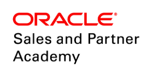
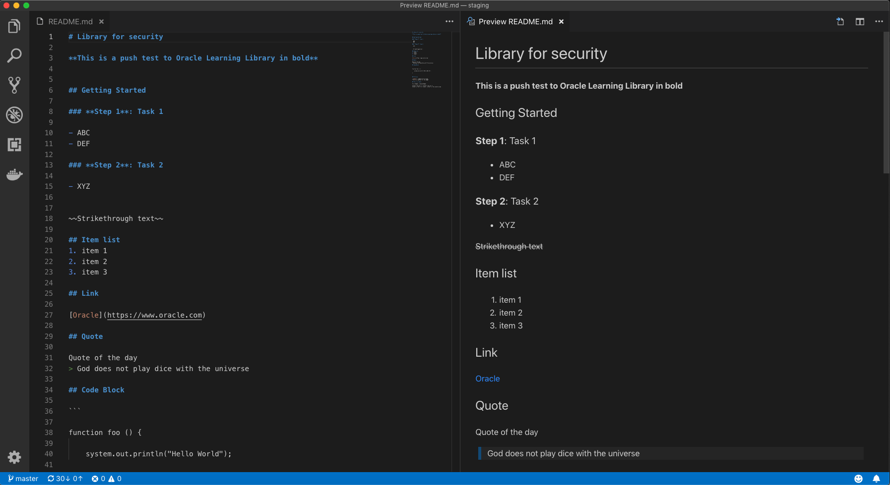

## Library for GitHub OSPA Discussion

### Important Points
* Only selected **OSPA GitHub Admin** individuals will be able to modify Oracle GitHub's Learning-Library (https://github.com/oracle/learning-library) repository (Ale, Dan, John, so far...) Having repository "gatekeepers" will hopefully avoid conflicts on the production repository.
* OSPA management has decided upon individual folders for different teams/products/labs; to date they are: 
  * analytics
  * appdev 
  * appint 
  * data-mgmt
    * adbcertificationlabs
    * adw 
    * atp 
    * big-data-service
    * db19c
    * exadata-cloud 
    * migration 
  * nosql 
  * oci
  * security
 
* GitHub and Git do not support modification (Cloning, Branching, Merging) of individual files and/or folders; so, 'Clones' and 'Branches' are copies of entire Oracle Learning Library.
* GitHub repositories (repos) have limitations on size of individual files **(100MB)** and total size of repository **(1GB)**.
### Contents
* Contents stored on GitHub will be:
  * .md (Markdown) files - These are the main files containing labs instructions
  * .html (HTML5) files - [Optional] If developers want to wrap the content and make it available on a static web site
  * misc. SMALL lab files [Optional]
  * larger files will be **LINKED-to** not included in-line [Optional]

* Developers will FORK the https://github.com/oracle/learning-library 
* Content should be simple and limited to only what is needed to complete the lab; this might include text, partial screenshot pictures, and other things that help the learner complete the demo. 
 -- THIS IS NOT A MARKETING TOOL NOR A PRESENTATION AND "NORMAL" LP FORMATTING MAY NOT APPLY
 ---- No need for "section header" and "title" images; keep images small and to the point if used at all
 ---- These are lab guides; keep it simple and easy; link to complex explanations, videos, etc...
* Developers will be responsible for CE and QA of their own material; peer review will be essential
* We have added a 'common-content' folder (managed by the Admins) containing assets to be used when creating HTML files to provide a common 'wrapper'
* We have added a 'common/images' folder where developers may add images to be shared cross-team
* We have added a Slack channel 'go-ospa-github' for all to share; Developers and Admins will use it to communicate back-and-forth
* Once our process is finalized we will need a webcast recording to show developers the process and tools required to build content 
### Tooling
* We suggest a simple editor for Markdown like the Microsoft Visual Studio Code tool available on [MyDesktop](http://mydesktop.oraclecorp.com/myd/myd_software_licenses.show_complete_list) though any text editor will do

### Suggested Workflow(s) - [Link to Workflow in greater detail](workflow.md)
   1. Developer FORKs learning-library (see GitHub and Git docs) might also find it easy to make local FORK/CLONE of this fork to work with off-line
   1. Developer creates (or gets from somewhere) desired content conforming to team Markdown template adds to ospa-library folder   
   1. Developer will COMMIT changes and test with peers (might make more changes and then COMMIT/test again)
   1. Developer will generate PULL REQUEST
   1. Developer notifies "admins" using go-ospa-github Slack channel that changes are ready to go
   1. Admin reviews changes and if ok MERGEs changes into oracle/learning-library
   
### Resources
[Resource page](resources.md)
