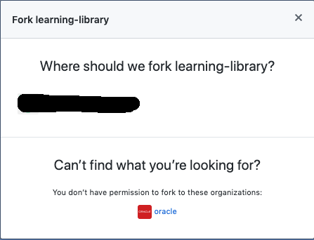
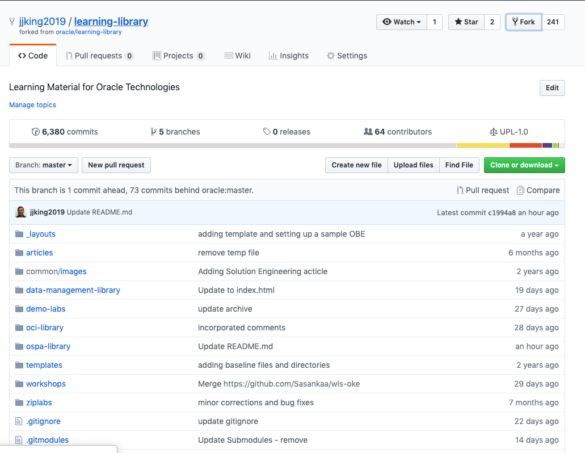
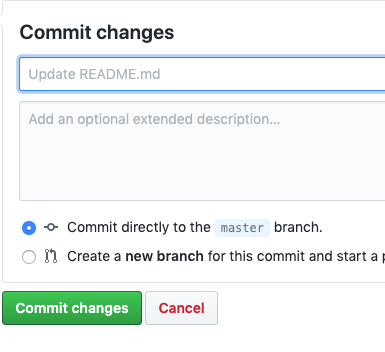
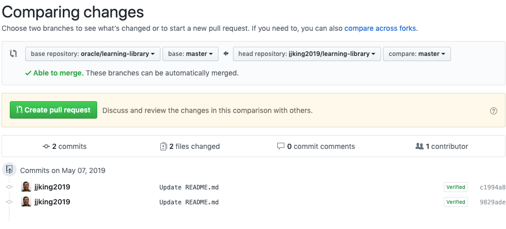
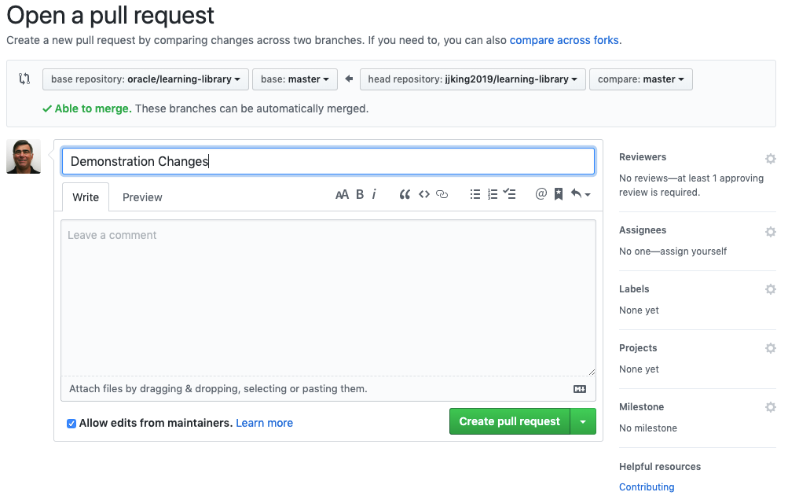
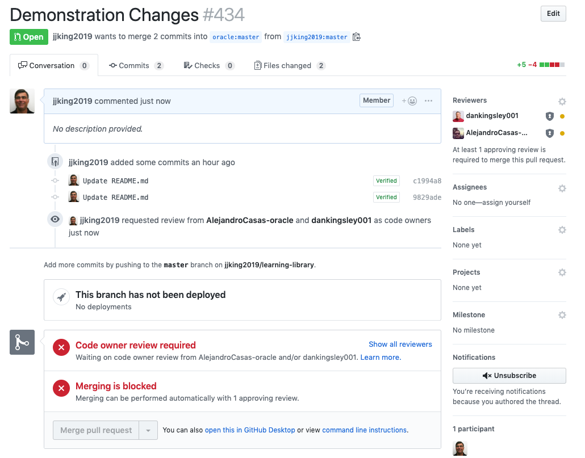
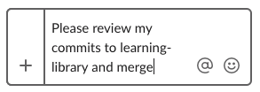

##Suggested Workflow(s) - [RETURN](README.md)

1. Developer FORKs learning-library (see GitHub and Git docs) might also find it easy to make local FORK/CLONE of this fork to work with off-line

   Start with oracle/learning-library   
   

   Click 'Fork' (upper-right corner)  
   

   Select your GitHub account  
   

    You now have your own "Fork" or "Clone" of the Repo  
   

1. Developer creates (or gets from somewhere) desired content conforming to team Markdown template adds to ospa-library folder

1. Developer will COMMIT changes and test with peers (might make more changes and then COMMIT/test again)  
   
   
1. Developer will generate PULL REQUEST  
     
       
     
   

     
1. Developer notifies "admins" using go-ospa-github Slack channel that changes are ready to go  
     
   

1. Admin reviews changes and if ok MERGEs changes into oracle/learning-library
