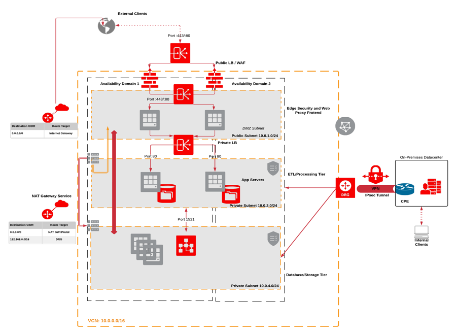

# Network Architectures

This segment of the crawl, walk, run framework provides a standard baseline for best practices around networking architecture. These three (for now) models will provide a great starting point for enterprise customers who are looking to prep their business for OCI. 

## Dependencies

- OCI Tenancy
- Workstation with Terraform installed or quickly spin up [Oracle Cloud Developer Image](https://cloudmarketplace.oracle.com/marketplace/en_US/listing/54030984) from OCI Marketplace **_available directly through Console_**


## Getting Started

Before working through the examples, set up a config file with the required credentials on your Workstation or Instance described in Dependencies. See [SDK and Tool Configuration](https://docs.us-phoenix-1.oraclecloud.com/Content/API/Concepts/sdkconfig.htm) for instructions.

## N-Tier Webapp Architecture

Components within the legacy application or SOA pattern can be tiered in multiple ways. Starting with the 2-Tier Application, a customer may have a single server, or multiple servers handling requests of the application presentation, business, and persistence to that are connected to a stand-alone database.



## SaaS Isolated Architecture

 Network isolation ensures that the applications and data are segregated from the other deployments in the tenancy.


## SaaS Shared Architecture

This ensures that the applications and data are segregated from the other deployments in separate subnets with different security lists and access. This can be achieved using the peering functionality having the hub VCN peered to separate tenant subnets. This patterns generally mapped as a baseline for providing customer management and control (cmc2) across the network


All the phases will need an oci provider which can be defined in the terraform.tfvars or *.auto.tfvars file in every component and the values must reflect your OCI tenancy:
```
provider_oci = {
  tenancy       = ""
  user_id       = ""
  fingerprint   = ""
  key_file_path = ""
  region        = ""
}
```

## Running the code

In order to run the code, you will simply have to go to the directory containing the desired architecture you want to create (e.g thunder/examples/network_architectures/saas\_isolated\_arch) and do the following:

```
# Run init to get terraform modules
$ terraform init

# Create the infrastructure
$ terraform apply --var-file=path_to_provider.auto.tfvars_file

# If you are done with this infrastructure, take it down
$ terraform destroy --var-file=path_to_provider.auto.tfvars_file
```
