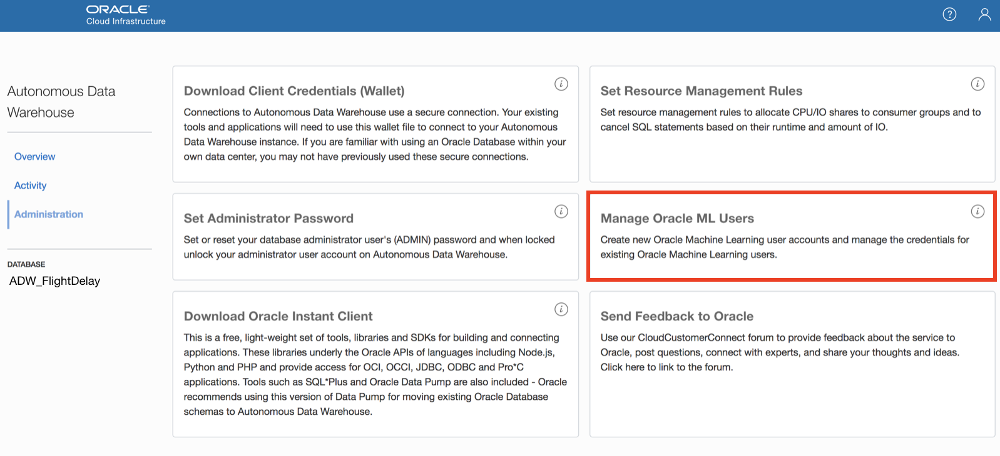
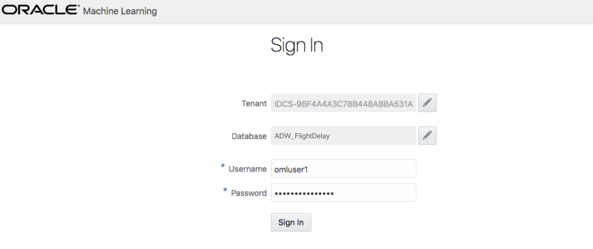
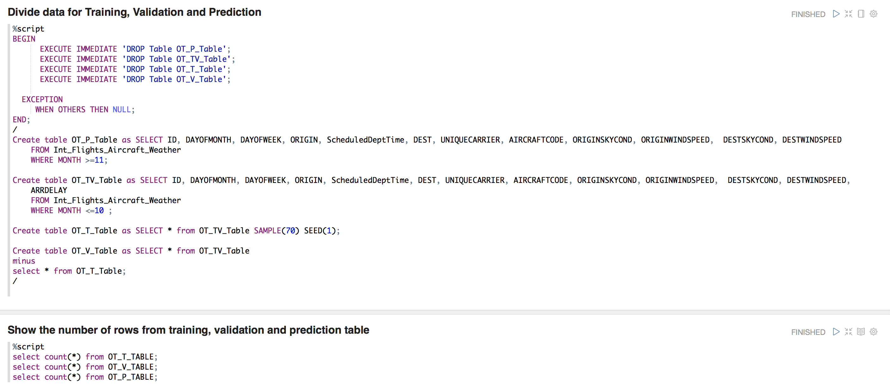
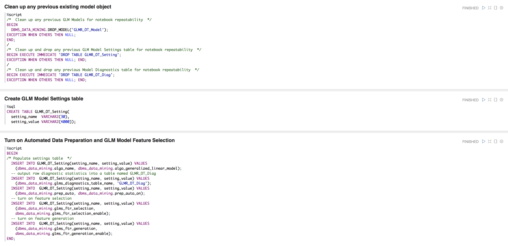

# Building a Machine Learning Model in Oracle Machine Learning (OML) Notebook

## Introduction

This lab walks you through the steps to build a linear regression model in Oracle Machine Learning (OML) Notebook since we learned that linear regression algorithm is one of the best models on previous lab. 

### Objectives
Learn how to build and apply machine learning model in Oracle Machine Learning (OML)

### Required Artifacts
The following lab requires an Oracle Public Cloud account. You may use your own cloud account, a cloud account that you obtained through a trial, or a training account whose details were given to you by an Oracle instructor.

## Part 1. Import Notebook File to OML 

### **STEP 1**: Sign into OML

1.   Go back to the Cloud Console and Click the **Service Console** button on your Autonomous Data Warehouse details page.

2.   Click the **Administration** tab and click **Manage Oracle ML Users** to go to the OML user management page. This will open OML user Administration page as a new tab within your browser.

3. Click the **Home icon** on the top right of Oracle Machine Learning User administration page to go to OML home page.

4. Sign in using your new user account **omluser1**. 

### **STEP 2**: Import Notebook File (Flight Delay Prediction.json) to OML

1. Once you have successfully signed in to OML the application home page will be displayed. Let's click **Notebooks**. 

2. To download the .json notebook file, click [here](./files/flightdelayprediction.json). In the **Notebooks** section, click on **Import** to import the downloaded file. 

## Part 2. Run the imported OML Notebook

1. Let's open the imported OML Notebook (.json). Then, click **interpreter binding** and select **%md** and one of the **%sql and %script** interpreters. 

2. Now, run each paragraph in the OML Notebook (**Flight Delay Prediction.json**) at a time and make sure each paragraph is completed without error. Since you learned that linear regression algorithm is one of the best models, you will build the machine learning model with linear regression algorithm on OML. You will also be using the DBMS pl/sql packages, which are included in ADW as well. These packages allow you to build machine learning models with minimal coding. It will take about 15 minutes to run the entire paragraph in the OML Notebook. 

3. Refer to below explanations about each paragrph. 

  - Here, all data are from 2008. Let’s imagine today is 10/31/2008 and you want to predict future flight delays in November and December of 2008. 
  - Paragraphs 1 & 2: These are to segment the data into training, validation, and prediction parts. 
    

  - Paragraphs 3, 4 & 5: These are to clean up any previously existing model objects with the same name as new model. Then, create setting table and set parameters to build linear regression model. 
    

  - Paragraph 6: This is to train this model on the portion of data you created for training.
    

  - Paragraph 7,8 & 9: These are to show model setting information, attribute name on the model and statistics for each attribute.
  

  - Paragraph 10: To validate our model, you will apply the trained model to the validation portion of the data. Then, store the result in a table in our autonomous data warehouse. Then, you will load it onto OAC for visualization on the following lab.
  

  - Paragraph 11: You will use the model to predict flight delay at each airport and at any given time by applying the model to the future data.  This result is saved as table in ADW for visualization using OAC as well. You will load it onto OAC for visualtion on the following lab. 
  

  - Paragraph 12: This is **optional**. Thanks to the DBMS_Scheduler package included in ADW, you can define repeating schedules, such as "every Tuesday and Friday at 4:00 p.m." or "the second Wednesday of every month.” Using DBMS_ Scheduler, you can get your machine learning model refreshed as new live data comes in, and the model can provide new recommendations. To  run this paragraph, you should define the parameters depend on your choice first. 
  

## Acknowledgements

- **Author** - NATD Solution Engineering - Austin Hub (Joowon Cho)
- **Last Updated By/Date** - Joowon Cho, Solutions Engineer, May 2020

See an issue?  Please open up a request [here](https://github.com/oracle/learning-library/issues).   Please include the workshop name and lab in your request.    Please include the workshop name and lab in your request. 