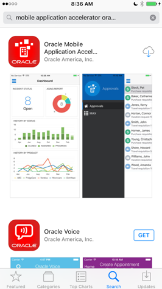

  

Update: March 10, 2017

# Installing Mobile Tools

## Mobile Cloud Service MAX App

### Installing the MAX App on iPhones

To install the MAX App from the App Store:

1. On your iPhone, open the App Store.
2. Search for Oracle MAX App.
3. When prompted, allow MAX to send you notifications.
4. Read through the end user terms and conditions and then tap Agree.
5. Enter your login information:
  - Host
  - Username
  - Password

Tap Sign In.

### Installing the MAX App on Android Devices

To install the MAX App from Google Play:
1. On your phone, open Google Play.
2. In the Play Store, tap Apps.
3. Search for Oracle MAX App.
4. Tap Install.
5. When prompted, allow MAX to send you notifications.
6. Read through the end user terms and conditions and then tap Agree.
7. Enter your login information:

 - Host
 - Username
 - Password

Tap Sign In.

---

# Supported Browsers

Most modern browsers including Chrome, Safari, Internet Explorer, Edge and Firefox are supported.

# Download files needed for LAB 100. Each participant needs a copy of these 2 files.

The files are located under the Touch-the-Cloud/artifacts/mcs/ directory. The 2 files are TTCSalesOrderAPI.raml and ttcsalesorderapi.zip. Users are going to be assigned demo.user[01-10] as their user ids. As a backup in the same directory you will find the final modified files TTCSalesOrderAPI[01-10].raml and ttcsalesorderapi[01-10].zip. These backup files can be used in case of participants running into errors calling the MCS APIs or MCS connectors.

