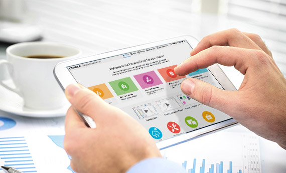
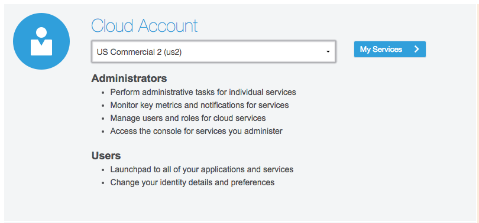
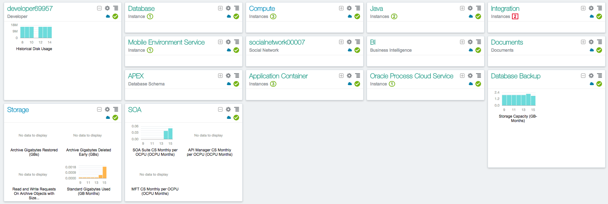
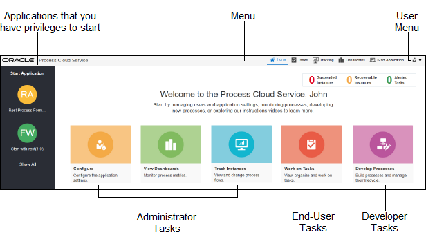
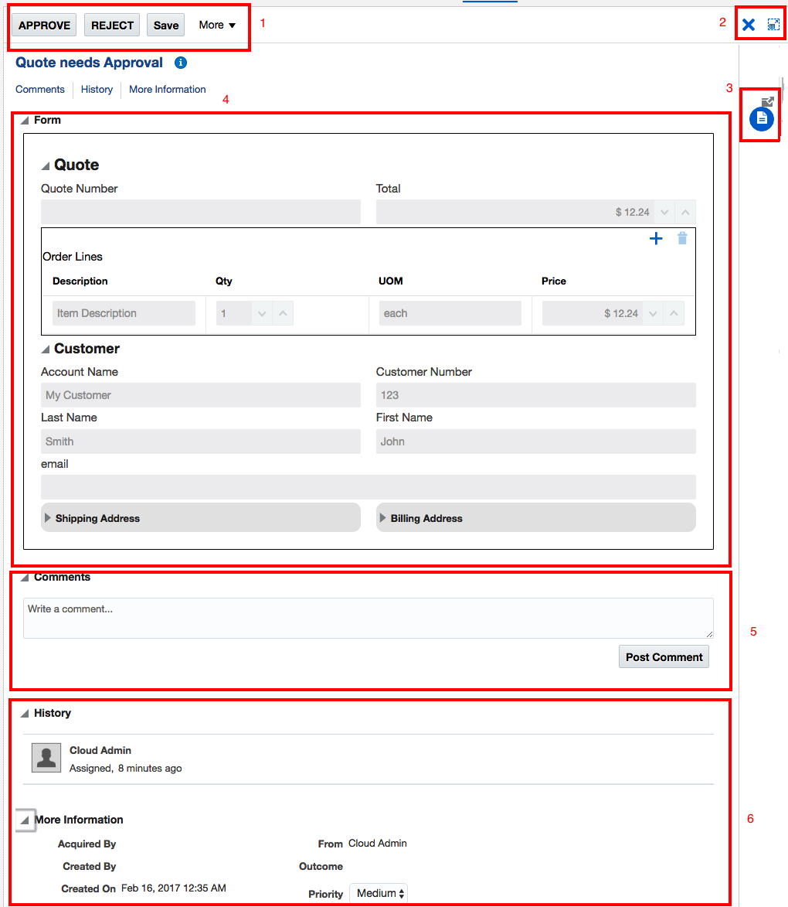

  

## Introduction

This is the second of several labs that are part of the **Oracle Public Cloud Touch the Cloud workshop.** This workshop will walk you through the management, modelling and administration of a typical Quote to Order process.

## Objectives

- User Experience with Process Cloud
- Process Modelling and Configuration

# 

## Requirements for this lab

A deployed process 'Quote to Order' - see Required Environment Setup(TouchTheCloud000.md)

# 

## Process Cloud User Experience

In this section we are going to experience the interaction possible from an end user of the PCS interface.

Each step identify the role, and what the user in the specific role try to achieve. 

### **STEP 1**: Create a Quote (or follow **STEP 1a** for a manual Quote Capture)

---

**Role: John Lee, Field Sales**

On either your mobile phone, or in the Simulator in MCS, go ahead and create a Quote for a customer. This will trigger the Quote to Order process in Process Cloud.

---

### **STEP 2**: Login to Oracle Cloud

---

**Role: Julie Jones, Field Sales**

Since it is Julie's first time signing into Oracle Cloud, she has to figure out how to access Oracle Process Cloud Services.

---

Now we can login as Julie Jones. From any browser, **go to the following URL**:
[https://cloud.oracle.com](https://cloud.oracle.com)

- Click **Sign In** in the upper right hand corner of the browser.

      

- **IMPORTANT** - Under My Services, ask ***your instructor*** which **Region** to select from the drop down list, and **click** on the **My Services** button.

      

- Enter your identity domain and click **Go**

  ***NOTE***: the **Identity Domain, User Name** and **Password** values will be given to you from your instructor.

      

- Once your Identity Domain is set, enter your **User Name** and **Password** and click **Sign In**

      

- Once connected, you will be presented with a Dashboard displaying the various cloud services available to this account. 

      
  
- Click on the **Oracle Process Cloud Service**

    

- Capture the link displayed **Service Instance URL**, for most browsers right-click ***Copy Link Address***
>***Note:***
> Capture this URL, as this is going to be the direct access URL to PCS referenced in this Lab document.

> -The Process Cloud Workspace URL **Copied URL** example https://pcsinstance-domain.process.us2.oraclecloud.com/bpm/workspace

> -The Process Cloud Composer URL **Copied URL** with the "/workspace" replaced by "/composer", which results in https://pcsinstance-domain.process.us2.oraclecloud.com/bpm/composer if applied to the sample above 

### **STEP 3**: Login to Process Cloud Service

---

**Role: Julie Jones, Field Sales**

There are different ways to access the PCS Workspace. The direct access URL can be embedded on an Intranet page, a full set of REST API's can be used to extract the information programmatically or you can use the mobile application supplied by Oracle. 

Julie prefer to go directly to her PCS Workspace using a browser.

---

Oracle Process Cloud Service is divided as three seperate functionalities, and depending on you role, you would be able to access these functionalities. The functionalities is divided in Administrator Tasks, End-User Tasks and Developer Tasks. Since Julie only has access defined as a End-User, so will only see the task relevant to her, **Work on Tasks** and **Track Instances**.

- From Cloud UI dashboard click on the **Service Instance URL** link. ***Or,*** using the captured URL open your browser to the **Copied URL**

      

- The  PCS Landing page gives you a quick glance of the functionality available to you (or in this case Julie Jones).

>

>The above picture gives an explanation of a page, for user with all priviledges granted and shows the different roles associated with each activity.  

### **STEP 4**: Working on Tasks

---

**Role: Julie Jones, Field Sales**

Julie wants to look at her outstanding tasks, and approve the incoming Quote request generated in **STEP 1**. (Although she is not aware of it at the moment, PCS can be configured to send out notifications and reminders to attend to outstanding tasks).

---

- Click **Work on Taks** to access the Task List

      

    In the list we can see the outstanding tasks allocated. You also have the capability to sort, do filtering and peek at task related to 'me'.

- Select a task by hovering over the task with mouse and clicking on it.

     
    >While we are on the task form, let me take the opportunity to breakdown of a typical task form: 
    >1. Action Items - In this instance we have two actions defined, Approve and Reject. The Save functionailty allows you to make some changes, save the state of the task and at a later stage come back to the task to complete. 
    >2. Close Form / Maximize
    >3. Documents Panel Expand, might also include Discussions, if enabled for process
    >4. Form, or also called the payload for the task. This information is the task specific information required to decide on on an action. Depending on the configuration, information can be updated.
    >5. Comments
    >6. Task Information, History and Task Metadata

- Lets follow the happy path, and click on the action ***Approve***
- The page will revert to the task list and you will notice that the task dissapeared from your inbox. In fact, you might also get a green confirmation message that your action was accepted.

