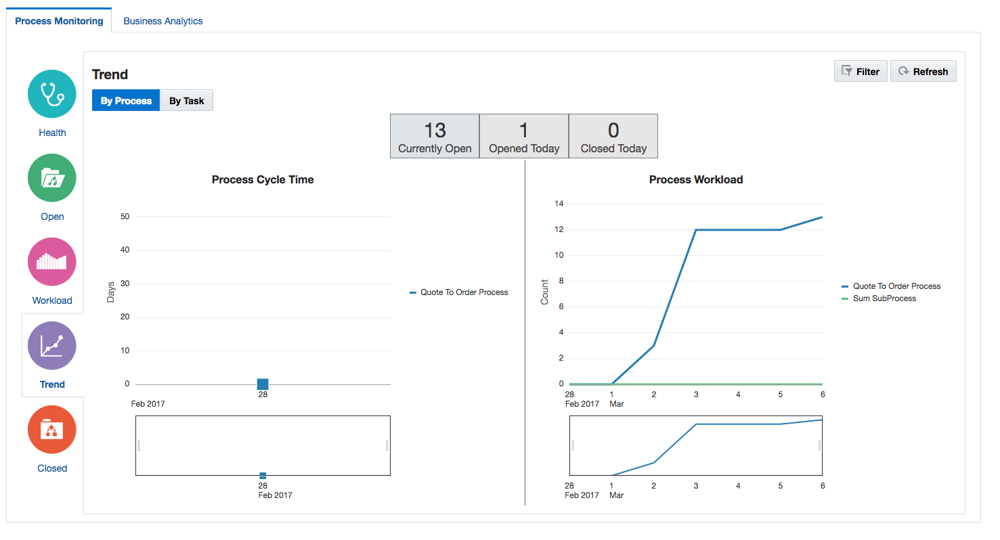
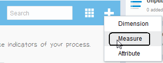
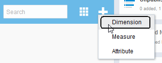
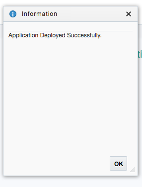
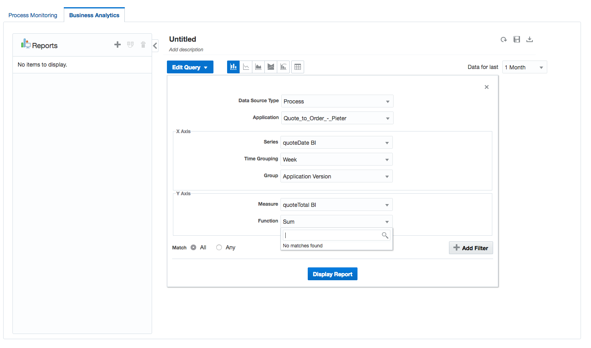

  

Update: March 13, 2017

## Introduction

This is the analytics part of the  **Oracle Public Cloud Touch the Cloud workshop.** This workshop will walk you through the analytics of the  of a typical Quote to Order process.

## Objectives

- Business Analytics Process Cloud

# 

## Requirements for this lab

A deployed process 'Quote to Order' 

# 

## Process Cloud Business Analytics

In this section we are going to configure the Quote to Order process to gather statistics while in flight.

Each step identify the role, and what the user in that specific role is trying to achieve. 

### **STEP 1**: Instance Analytics

---

**Role: Mr Roland Dubois, Process Owner**

  Roland Dubois, sales director and process owner wants to see what is happening to his Quote to Order processes, in a summarized customized view. 
  
---

- Log into the Process Workspace using your .

- On the Process home page click the View Dashboards

   

- On the following page, you will see two categories, Process Monitoring and Business Analytics.

    

    Feel free to look at your current Processes, by clicking on the Open, Workload, Trend and Close graphs.

    Sample Trend Graph:

    

    In the next section we are going to define what should be capture for each process instance, to be used in the business analytics graphs/reports.

### **STEP 2**: Defining Analytics Measures

---

**Role: Mr Roland Dubois, Process Owner**

  Roland Dubois, sales director and process owner wants extract the value of quotes per date

---

- Open your Space and Application in PCS Composer. If unsure look at **Lab 200** - **STEP 3** and **STEP 4** how to get to your cloned PCS application from **Lab 200**.

- Click on the Indicators tab

    

- In this step we are going to create a measure and dimension.
   - Click on the white plus sign, next to Search, and create a Measure (quoteTotal on quoteTotal) and Dimension (quoteDate on quoteDate)

     

     

     

- Next step is deploy the changed application. Click on Publish

- Create a new snapshot to deploy

- Click on Test

- Go ahead and do the deployment of your changed application, by clicking on the bottom deploy icon

- Add yourself to all the roles, to allow you to act as all the different roles in the process flow.

- After the deployment completed, go back to the PCS Workspace, and then Dashboards. 

- Select the Business Analytics Tab

- Create a new report, with the following values

- Click on Untitled, and change the report name to Total Quotes per Week and click on save

  Under the Reports section, you will see an entry for your report. The last step is to generate some information to be displayed in the report. To do this we have to start a couple of processes. See **Lab 200** **STEP 1 (Optional)** on a sample on how to create a couple of instances of your newly deployed application.

  Go ahead and create a couple of instances, and see how the report reflect the capture metrics in the process.

