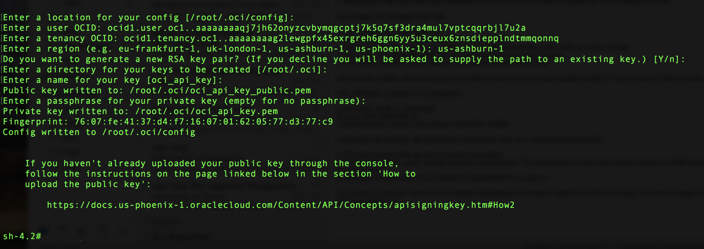
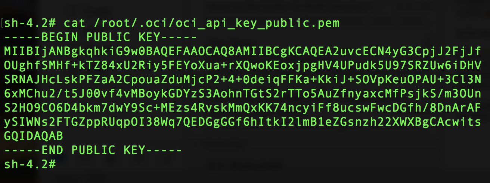

# Lab 1000: Using Kubernetes

## Introduction

A Kubernetes cluster is a group of nodes. The nodes are the machines running applications. Each node can be a physical machine or a virtual machine. The node's capacity (its number of CPUs and amount of memory) is defined when the node is created. A cluster can be organized into namespaces, to divide the cluster's resources between multiple uses.

- a master node (for high availability, typically there will actually be a number of master nodes)
- one or more worker nodes (sometimes known as minions)

The master node in a cluster runs a number of processes:

- kube-apiserver to support API operations via the Kubernetes command line tool (kubectl) and the REST API, and includes admissions controllers required for advanced Kubernetes operations
- kube-controller-manager to manage different Kubernetes components (for example, replication controller, endpoints controller, namespace controller, and serviceaccounts controller)
- kube-scheduler to control where in the cluster to run jobs
- etcd to store the cluster's configuration data

Each worker node runs two Kubernetes processes:

- kubelet to communicate with the master node
- kube-proxy to handle networking

Each worker node also runs the Docker runtime.


To **log issues**, click [here](https://github.com/cloudsolutionhubs/autonomous-transaction-processing/issues/new) to go to the github oracle repository issue submission form.

## Objectives

- To build a Kubernetes cluster in the Oracle Cloud running a node.js application
- Connect Node.js application to an ATP Database service running in the Oracle cloud

## Required Artifacts

-   The following lab requires an Oracle Public Cloud account. You may use your own cloud account, a cloud account that you obtained through a trial, or a training account whose details were given to you by an Oracle instructor.
- Docker installed on your local machine. If you do not have docker please follow this [Mac User link](https://docs.docker.com/docker-for-mac/install/), [Windows User link](https://docs.docker.com/docker-for-windows/install/) and install docker

## Steps

### **STEP 1: Pull the image and Setup OCI**

- First we will pull down the docker image using:


```
docker pull [OPTIONS] NAME[:TAG|@DIGEST]
```

- Second, we will create a directory which we will use later to place our wallet in. When running our docker image we will use the -v option to map the directory to the image and the image will be able to pick up the wallet information

```
mkdir -p ~/tmp/wallet
```

- Now we will launch the container using the image we just pulled.

Note: With this run command we are mapping the local directory ~/tmp/wallet/ to the directory in the image /opt/oracle/database/wallet

```
docker run -it -v ~/tmp/wallet:/opt/oracle/database/wallet NAMEOFIMAGE sh
```


- Once in the image we will setup OCI-CLI like we did in Lab900:

```
oci setup config
```

- Follow the prompts supplying the proper information:



- Add the public key generated in the container to the public keys in your User's list:




### **STEP 2: Deploy the Infratstructure**

- This step is entirely automated and only requires the user to add the compartment ID to deploy the infrastructure

```
./deployInfra.sh
```

- This will prompt you to enter the compartment ID of which to deploy the infrastructure. You can watch as everything is automatically setup for you


