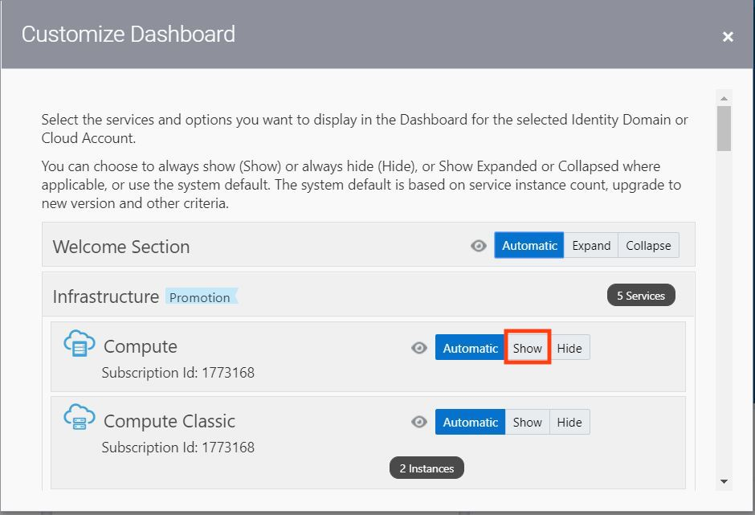
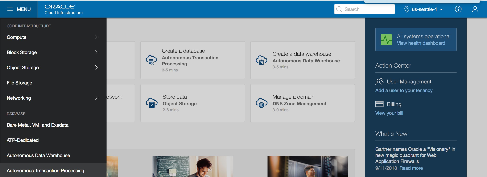

# Lab 100: Provisioning an Autonomous Transaction Processing Database

## Introduction

This lab walks you through the steps to get started using the Oracle Autonomous Transaction Processing Database on Oracle Infrastructure Cloud (OCI). You will provision a new database.

To **log issues**, click [here](https://github.com/oracle/learning-library/issues/new) to go to the github oracle repository issue submission form.

## Objectives

- Learn how to sign-in to the Oracle Public Cloud
- Learn how to provision a new ATP database

## Required Artifacts

- The following lab requires an Oracle Public Cloud account. You may use your own cloud account, a cloud account that you obtained through a trial, or a training account whose details were given to you by an Oracle instructor.

# Section 1. Provisioning an Autonomous Transaction Processing Database Instance

In this section you will be provisioning an ATP database using the cloud console.

## Steps

### **STEP 1: Sign in to Oracle Cloud**

-   Go to [cloud.oracle.com](https://cloud.oracle.com), click **Sign In** to sign in with your Oracle Cloud account.

-   Enter your **Cloud Account Name** and click **My Services**.

-   Enter your Cloud **username** and **password**, and click **Sign In**.

### **STEP 2: Create an ATP Instance**

-   Once you are logged in, you are taken to the cloud dashboard where you can see all the services available to you. To access Oracle Cloud Infrastructure (OCI) dashboard, click on **Customize Dashboard**.

-  Find **Compute** under Infrastructure and click on **Show**

-  Now you should see Compute service under your dashboard. Go ahead and click on **Compute**

-  This will bring you to the service details page. Click on **Open Service Console** on top right of your screen to bring you to OCI dashboard.

-  Once you are on OCI dashboard page, click on the hamburger menu icon on the top left of the screen

-  Click on **Autonomous Transaction Processing** from the menu

-  Click on **Create Autonomous Transaction Processing Database** button to start the instance creation process

-  This will bring up Create ATP Database screen where you specify the configurations of the instance

-  Click on **Click here** to enable compartment selection so that the ATP instance is in a specific compartment

-  Select a compartment of your choice

-  Specify a name for the instance

-  You can update the storage size if needed

-  Then specify the password for the instance

-  Make sure you have everything filled out

-  Click on **Create Autonomous Transaction Processing Database** to start provisioning the instance

-  Once it finishes provisioning, you can click on the instance name to see details of it

You now have created your first Autonomous Transaction Processing Cloud instance.
