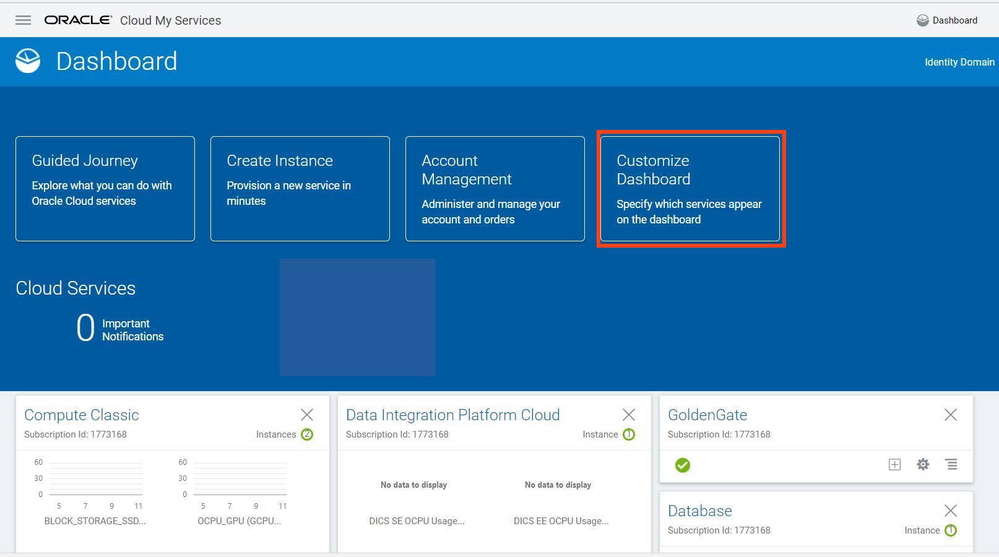
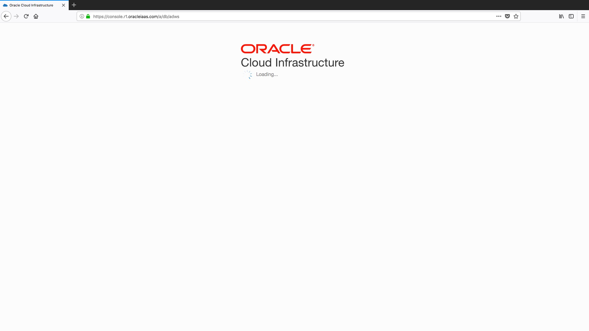
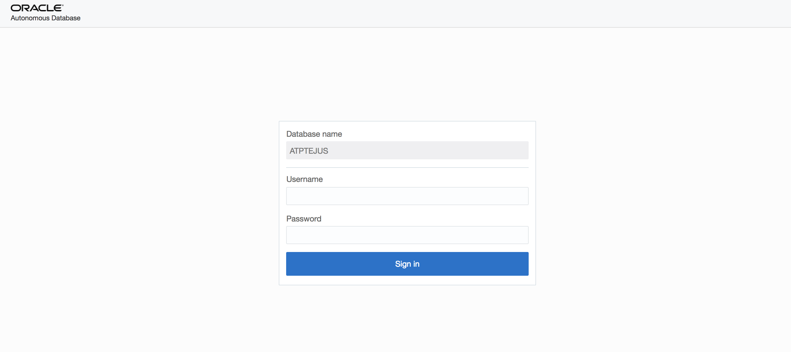
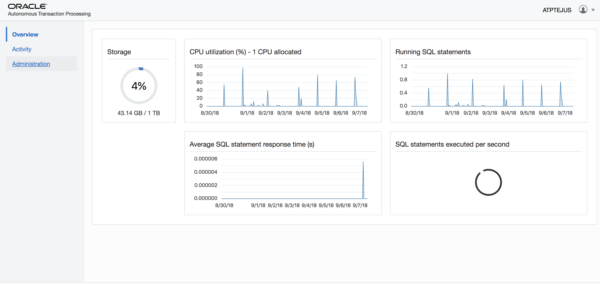
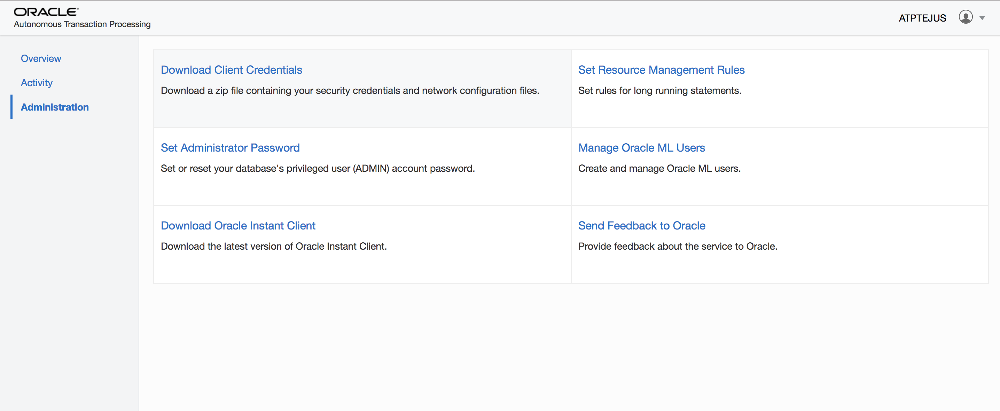
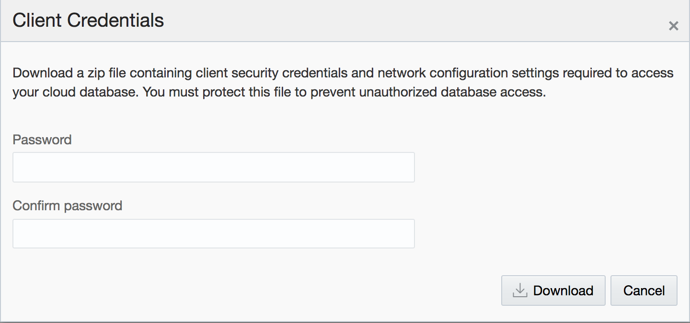
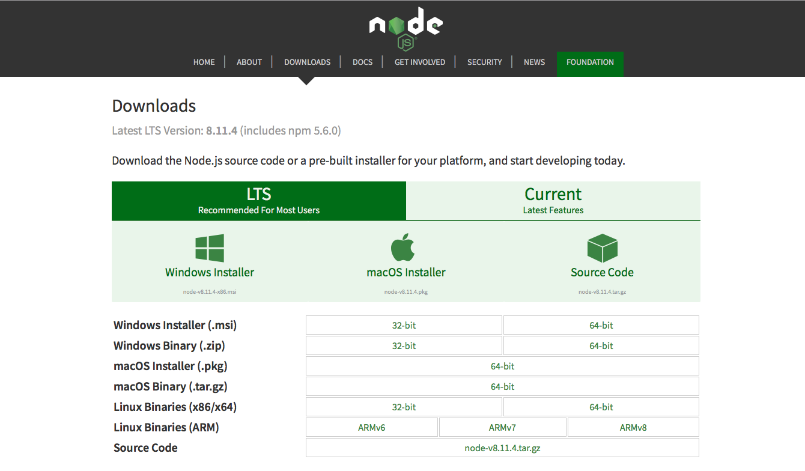
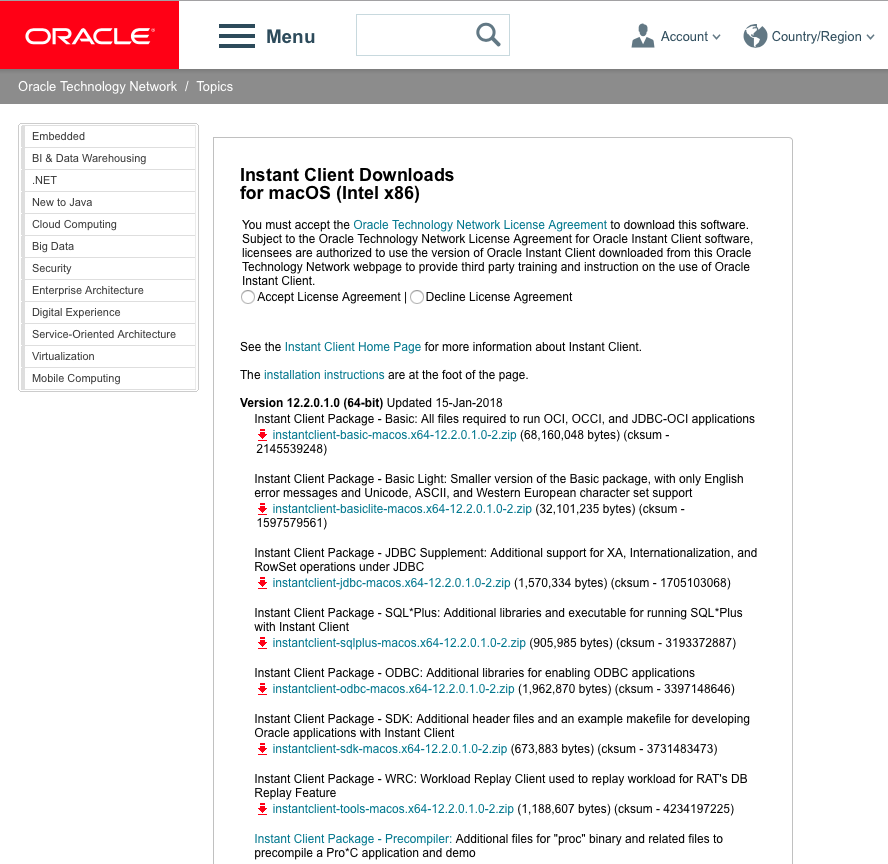
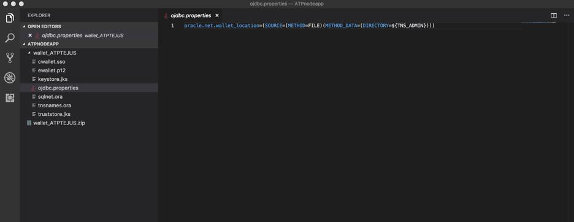
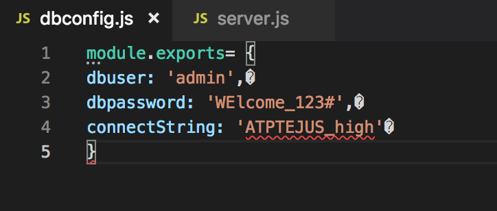

# Lab 100: Building nodejs App with ATP

## Introduction

This lab walks you through the steps to get started using the Oracle Autonomous Transaction Processing on Oracle Infrastructure Cloud (OCI). You will build a node.js app with ATP.

To **log issues**, click [here](https://github.com/oracle/learning-library/issues/new) to go to the github oracle repository issue submission form.

## Objectives

- Log into ATP and download credentials
- Install and configure node.js 
- Run node.js to test connectivity to ATP

## Required Artifacts

-   The following lab requires an Oracle Public Cloud account. You may use your own cloud account, a cloud account that you obtained through a trial, or a training account whose details were given to you by an Oracle instructor.
- Install node.js on your laptop
- Install Oracle instant client 12.2
- Download and unzip ATP secure connectivity file
- Install oracledb node driver 

## Steps

### **STEP 1: Sign in to Oracle Cloud and Download credentials**

-   Go to [cloud.oracle.com](https://cloud.oracle.com), click **Sign In** to sign in with your Oracle Cloud account.


-   Enter your **Cloud Account Name** and click **My Services**.


-   Enter your Cloud **username** and **password**, and click **Sign In**.


### STEP 2: Sign in to ATP 

-   Once you are logged in, you are taken to the cloud dashboard where you can see all the services available to you. To access Oracle Cloud Infrastructure (OCI) dashboard, click on **Customize Dashboard**.



-  Find **Compute** under Infrastructure and click on **Show**


-  Now you should see Compute service under your dashboard. Go ahead and click on **Compute**


-  This will bring you to the service details page. Click on **Open Service Console** on top right of your screen to bring you to OCI dashboard.




-  Once you are on OCI dashboard page, click on the hamburger menu icon on the top left of the screen


-  Click on **Autonomous Transaction Processing** to open service console


-  Click on the instance name to see details of it


- Click on service console and log into the service console by providing username and password



- On the ATP admin screen navigate to admin screen



- On the admin screen download the credentials 



- Provide the passphrase to download the credentials zip file, note the passphrase it is needed to open the zip file



- Download and Install appropriate node.js on you laptop from the following [link](https://nodejs.org/en/download/)

### STEP 3: Download and Install node.js**
- From Node.js website download and install mac OS package. Once the installation is complete, verify node and npm version. 



- Check the node and npm version 
```
node —version
```
```
npm —version
```


### STEP 4: Download and install Oracle Instant Client**
- Download and unzip Oracle Instant Client for Mac OS from the [link](https://www.oracle.com/technetwork/topics/intel-macsoft-096467.html)



- On the download page accept license agreement and download instantclient-basic-macos.x64-12.2.0.1.0-2.zip

- Once downloaded, Unzip the instant client in folder of your choice and add it to your path variable.
```
export PATH-=$PATH:/path_to_instant_client_12.2
```

- Create soft link to libclntsh.dylib.12.1 in either /usr/local/lib or in ~/lib.

```
ls -s ~/Downloads/instantclient_12_2/ libclntsh.dylib.12.1 /usr/local/lib
```

- Now that the instant client is setup lets move on Download the credentials file from Admin console. We have pre-provisioned Oracle ATP that we are going to use for our node application.

### STEP 5: Setup environment variables   for ATP connections**
- Paste Downloaded Credentials zip file here

- Once the file has been downloaded, go and unzip the file in node application folder.

- Unzip the downloaded wallet to file location of where the node app will be installed


- Set up TNS_ADMIN environment variable and point to the database wallet folder.

```
export TNS_ADMIN=/<path_to_unzipped_wallet_folder>
```


- In wallet_ATPTEJUS, you will need to update certain files. Open the wallet files in a text editor.

    * Open ojdbc.properties file and make sure DIRECTORY points to TNS_ADMIN which we set up earlier.
    * Open sqlnet.ora and set up DIRECTORY to TNS_ADMIN

    ```
    WALLET_LOCATION = (SOURCE = (METHOD = file) (METHOD_DATA = (DIRECTORY=${TNS_ADMIN})))
    SSL_SERVER_DN_MATCH=yes
    ```


### STEP 6: Configure and start your Node.js App**

- You can download the files from /scripts/dbconfig.js and /scripts/server.js and copy it to your node project folder.

- Server.js is the application we want to run and dbconfig.js has the database credentials.

- Open dbconfig.js in a text editor and make the following changes:
    * dbuser: admin (your ATP user)
    * dbpassword: ATP admin user password
    * connectString: your_ATP_instance_name_high



- Let us now run server.js

```
node server.js
```


- You have successfully connected your node application to Oracle Autonomous Transaction Processing. 


