# Lab 400: Data Loading into ATP
## Introduction

In this lab, you will be uploading files to the Oracle Cloud Infrastructure (OCI) Object Storage, creating sample tables, loading data into them from files on the OCI Object Storage.

You can load data into Autonomous Transaction Processig Database using Oracle Database tools, and Oracle and 3rd party data integration tools.

You can load data:
- From files local to your client computer
- From files stored in a cloud-based object store

For the fastest data loading experience Oracle recommends uploading the source files to a cloud-based object store, such as Oracle Cloud Infrastructure Object Storage, before loading the data into your Autonomous Transaction Processing Database.

To load data from files in the cloud into your Autonomous Transaction Processing database, use the new PL/SQL DBMS_CLOUD package. The DBMS_CLOUD package supports loading data files from the following Cloud sources: Oracle Cloud Infrastructure Object Storage, Oracle Cloud Infrastructure Object Storage Classic, and Amazon AWS S3.

This lab shows how to load data from Oracle Cloud Infrastructure Object Storage using two of the procedures in the DBMS_CLOUD package:

- Create_credential: Stores the object store credentials in your Autonomous Transaction Processing database schema.
- You will use this procedure to create object store credentials in your ATP admin schema.
- You will use this procedure to load tables in your admin schema with data from data files staged in the Oracle Cloud Infrastructure Object Storage cloud service.

To **log issues**, click [here](https://github.com/oracle/learning-library/issues/new) to go to the github oracle repository issue submission form.

## Objectives

- Learn how to use the SQL Developer Data Import Wizard
- Learn how to upload files to the OCI Object Storage
- Learn how to define object store credentials for ATP
- Learn how to create tables in your database
- Learn how to load data from the Object Store

## Required Artifacts

- Please ensure you are connected to your cloud account and have provisioned an ATP instance. Refer <a href="./LabGuide100ProvisionAnATPDatabase.md" target="_blank">LabGuide100ProvisionAnATPDatabase.md</a>
- You have installed Oracle SQL Developer

## Steps

### **STEP 1: Download the sample data files to your local computer**

- For this lab, you will need a handful of data files.  Click <a href="./files/datafiles.zip" target="_blank">here</a> to download a zipfile of the 5 sample data files for you to upload to the object store. Unzip it to a directory on your local computer.

You will see:
- Sales Data: **sales.csv.gz**
- Customer data: **customers.csv**
- Channel data (with intentional errors): **channels\_error.csv**
- Channel data: **channels.csv**
- Products data: **products.txt**

#### We will be using channels.csv and customers.csv in this workshop, rest of the data sets can be uploaded for your practice.

### **STEP 2: Create target tables for data loading**

- Connected as your user in SQL Developer, copy and paste <a href="./scripts/300/create_tables.txt" target="_blank">this code snippet</a> to SQL Developer worksheet. Take a moment to examine the script. Then click the **Run Script** button to run it.

 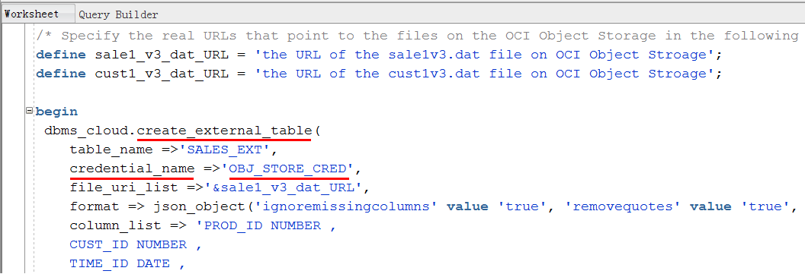

 -   If you want, you can compare your output to <a href="./scripts/300/create_tables_output.txt" target="_blank">this expected output.</a>  It is expected that you may get ORA-00942 errors during the DROP TABLE commands, but you should not see any other errors.

 Note that you do not need to specify anything other than the list of columns when creating tables in the SQL scripts. You can use primary keys and foreign keys if you want, but they are not required.

### **STEP 3: Loading Data using the Data import wizard in SQL Developer**

- Expand ‘**Tables**’ in your user schema object tree. If you don't see any tables, click on the refresh icon (two curved arrows) to refresh the table list.  You will see all the tables you have created previously. Select table **CHANNELS**. Clicking the right mouse button opens the context-sensitive menu in SQL Developer; select ‘**Import Data**’:

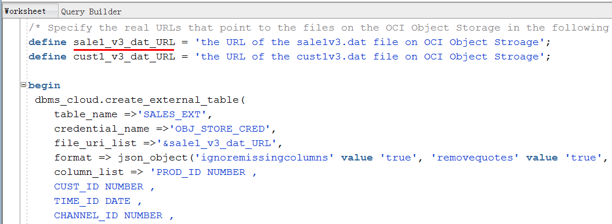

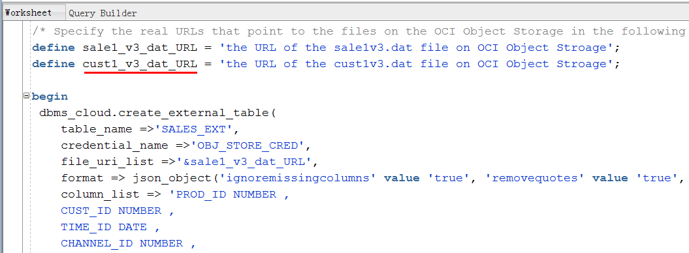

- The Data Import Wizard is started. Enter the following information:

    - Select **Local File** as source for the data load

    - Click the browse button and navigate to the channels.csv file (you extracted this file from the zip file you downloaded at the start of this lab).

After entering this information, you can preview the data and select the appropriate file formats. You will see that the data preview is interactive and changes according to your selection.

When you are satisfied with the file content view, click **NEXT**.

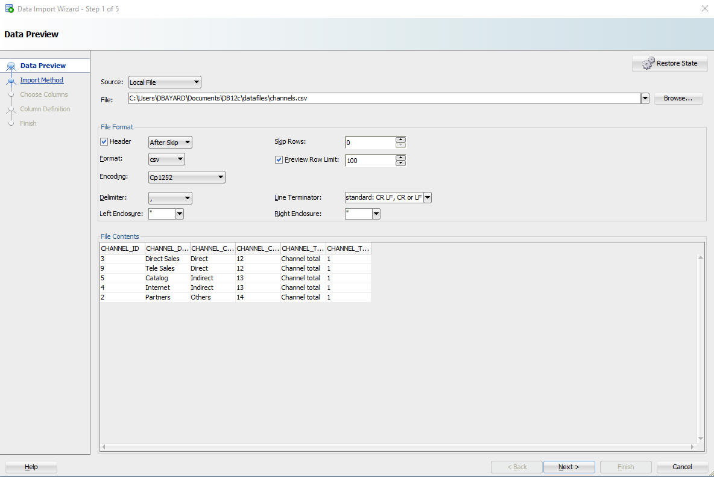

- On Step 2 of the Import Wizard, you control the import method and parameters. Leave the Import Method as Insert. Click **NEXT**.

- The Choose Columns screen lets you select the columns you want to import. Leave the defaults and click **NEXT**.

- The column definition screen shows you whether the sample data violates any of the existing column definitions of table CHANNELS (for a load into a new table you would select the column names and data types for the new table). Click **NEXT**.

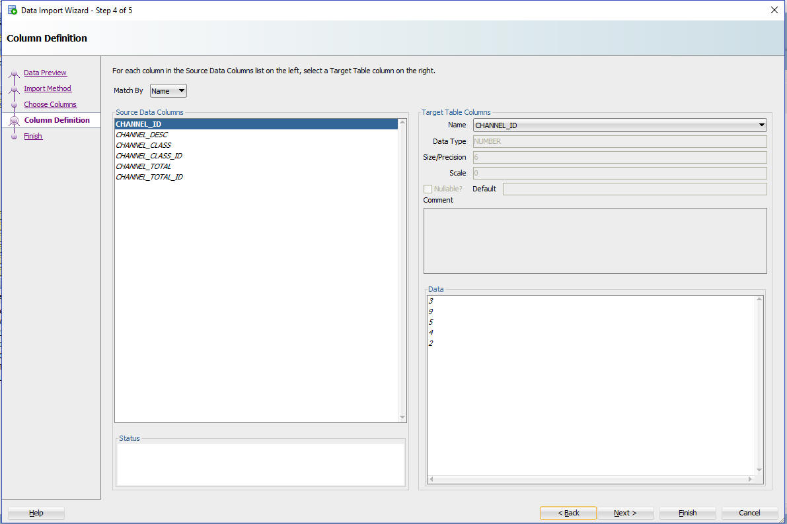

- The final screen reflects all your choices made in the Wizard. Click **FINISH** to load the data into table CHANNELS.

### **STEP 4: Setup the OCI Object Store**

- The easiest way to get to the **OCI Compute Console** is to first navigate to the My Services Dashboard page:

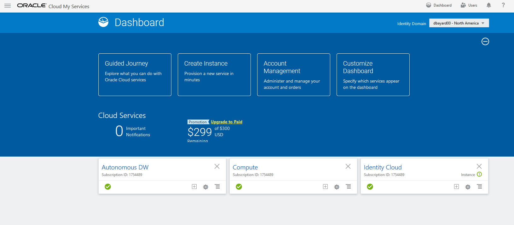

- From the My Services Dashboard page, open the **upper left menu** and expand **Services**.  Under Services, click on the entry titled **Compute**.  *Hint: you might want to right-click on Compute and choose "open in new tab" so that you can keep the My Services Dashboard open*:

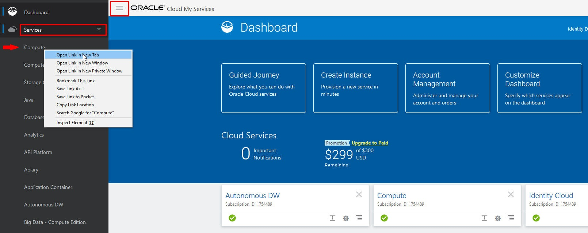

- This should take you to the OCI Compute Console:

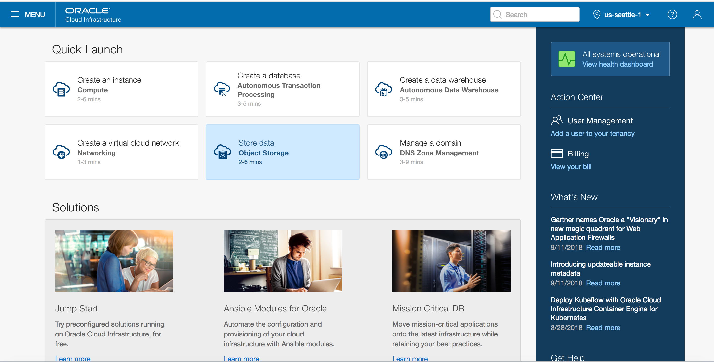

- Navigate to the Storage Tab, then Object Storage

To learn more about the OCI Object Storage, check out this <a href="https://docs.us-phoenix-1.oraclecloud.com/Content/GSG/Tasks/addingbuckets.htm" target="_blank">documentation</a> .

- In the OCI Compute Console, click on the **Storage** tab, then click on **Object Storage** on the left-hand menu:

- Choose the root compartment in the **COMPARTMENT** drop-down if it is not already choosen. The name of your root compartment might be different.

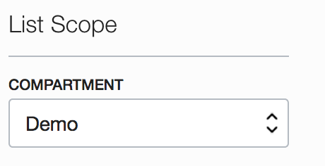

- Create a Bucket for the Object Storage

In OCI Object Storage, a bucket is the terminology for a container of multiple files.

- Click the **Create Bucket** button:

 - **Name your bucket** and click **Create Bucket** button.

- Upload Files to your OCI Object Store Bucket

- Click on your **bucket name** to open it:

- Click on the **Upload Object** button:

- Using the browse button or drag-and-drop select the **customers.csv** file you downloaded earlier and click Upload Object:

#### Note: Repeat this for the **sales.csv.gz**, **products.txt**, and **channels_error.csv** files.

- The end result should look like this with all 4 files listed under Objects:

- Construct the URLs of the Files on Your OCI Object Storage

Construct the URL that points to the location of the customers.csv file staged in the OCI Object Storage. The URL is structured as follows. The values for you to specify are in bold:

 https://swiftobjectstorage.<**region_name**>.oraclecloud.com/v1/<**tenant_name**>/<**bucket_name**>/<**file_name**>

 In this example, the region name is us-ashburn-1, the tenant name is dbayard00, and the bucket name is ATPLab. So the URL of the customers.csv file is: 
 
 https://swiftobjectstorage.us-ashburn-1.oraclecloud.com/v1/dbayard00/ATPLab/customers.csv
 
 Yours would be different.

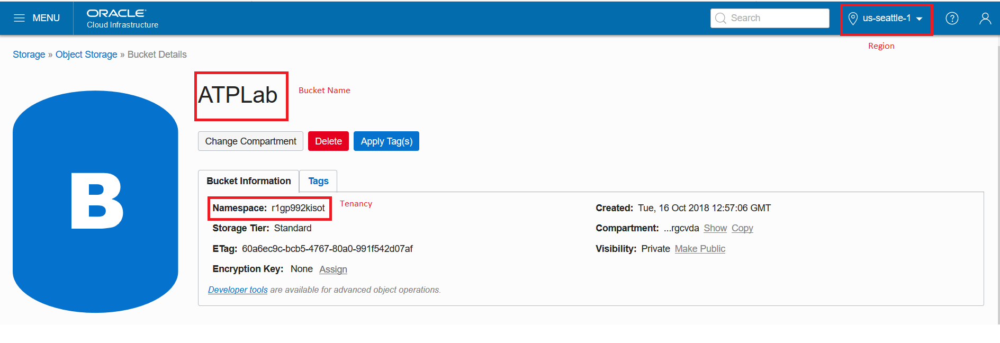

- **Repeat** this for the **sales.csv.gz**, **products.txt**, and **channels\_error.csv** files. 

- **Save** the URLs you constructed to a note. We will use the URLs in the following steps.

#### Creating an Object Store Auth Token

To load data from the Oracle Cloud Infrastructure(OCI) Object Storage you will need an OCI user with the appropriate privileges to read data (or upload) data to the Object Store. The communication between the database and the object store relies on the Swift protocol and the OCI user Auth Token.

- Go back to the **OCI Compute Console** in your browser. In the top menu, click the **Identity**, and then click **Users**. 
    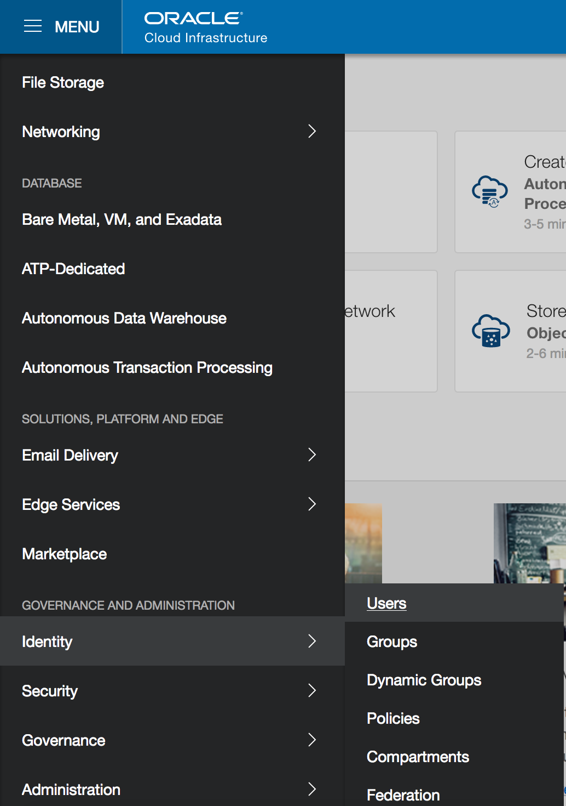

-   Click the **user's name** to view the details.  Also, remember the username as you will need that in the next step.

    

-   On the left side of the page, click **Auth Tokens**.

    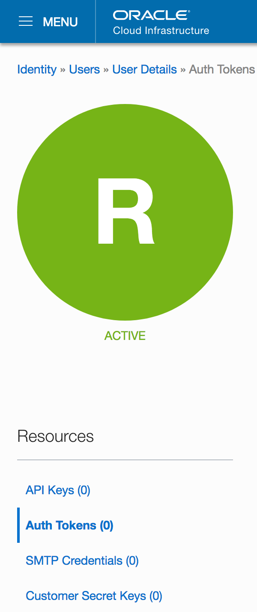

-   Click **Generate Token**.

    

-   Enter a friendly **description** for the token and click **Generate Token**.

    

-   The new Auth Token is displayed. Click **Copy** to copy the Auth Token to the clipboard.  You probably want to save this in a temporary notepad document for the next few minutes (you'll use it in the next step).  You can't retrieve the Auth Token again after closing the dialog box.

    

#### Create a Database Credentials for your User

In order to access data in the Object Store you have to enable your database user to authenticate itself with the Object Store using your OCI object store account and Auth token. You do this by creating a private CREDENTIAL object for your user that stores this information encrypted in your Autonomous Transaction Processing. This information is only usable for your user schema.

-   Connected as your user in SQL Developer, copy and paste <a href="./scripts/300/create_credential.txt" target="_blank">this code snippet</a> to SQL Developer worksheet.

Specify the credentials for your Oracle Cloud Infrastructure Object Storage service: The username will be the **OCI username** (which is not the same as your database username) and the OCI object store **Auth Token** you generated in the previous step.  In this example, the crediential object named **OBJ\_STORE\_CRED** is created. You reference this credential name in the following steps.

 

<!-- -->

-    Run the script. 

- Now you are ready to load data from the Object Store.

### **STEP 5: Load data from the Object Storage using the Data Import Wizard**

- Expand ‘**Tables**’ in your user schema object tree. If you don't see any tables, click on the refresh icon (two curved arrows) to refresh the table list.  You will see all the tables you have created previously. Select table **CUSTOMERS**. Clicking the right mouse button opens the context-sensitive menu in SQL Developer; select ‘**Import Data**’:

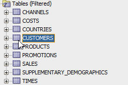

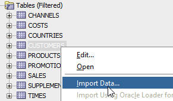

- The Data Import Wizard is started. Enter the following information:

    -   Select **Oracle Cloud Storage** as source for the data load

    -   Enter the URL of **customers.csv** as the file to load. You constructed the URL in STEP 8 Construct the URLs of the Files on Your OCI Object Storage. For example, the URL might look something like:

        https://swiftobjectstorage.us-ashburn-1.oraclecloud.com/v1/dbayard00/ATPLab/customers.csv

    -   Select the Credential you previously created for authentication with the Object Store, **OBJ\_STORE\_CRED**

    -   Click the **Preview** button

After clicking preview, you will likely get a warning about the format which we will fix next.

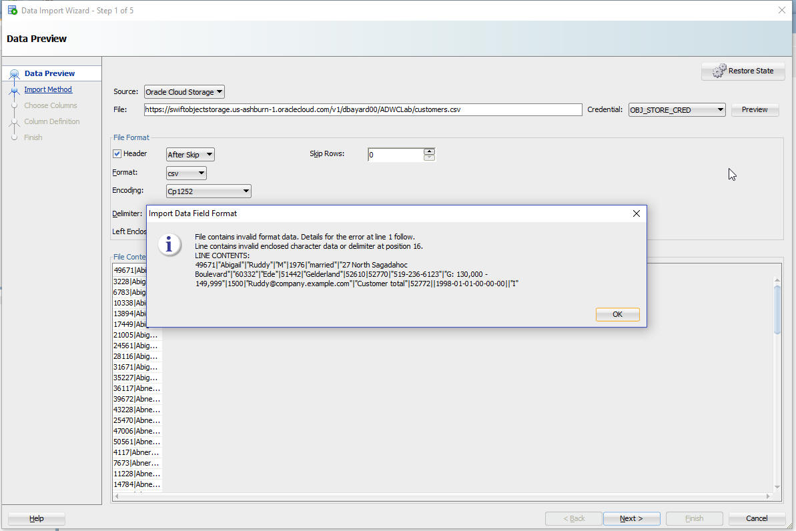

- Now we will fix the file format settings.

     - Click OK to close the Invalid format window if you have not already.

     - Deselect the Header checkbox as this file does not have a header.  When you deselect the checkbox, you will get another Field Format message.  Click OK to acknowledge the message window.

     - Change the delimiter to the vertical bar |

The data should now look much better.

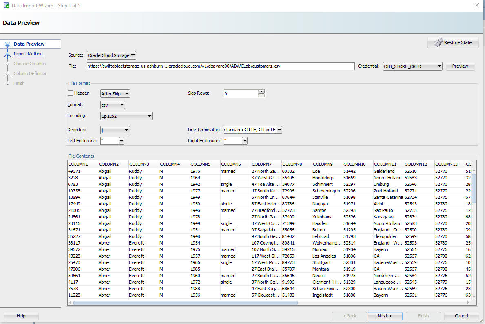

When you are satisfied with the data preview, click **NEXT**.

  - On the Import Method page, you can click on Load Options to see some of the available options.  For this exercise, leave the options at their defaults.  Click **NEXT** to advance to the next page of the wizard.

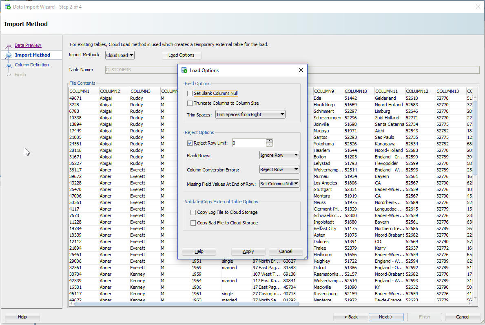

  -   On the Column Definition page, you can control how the fields of the file map to columns in the table.  You can also adjust certain properties.

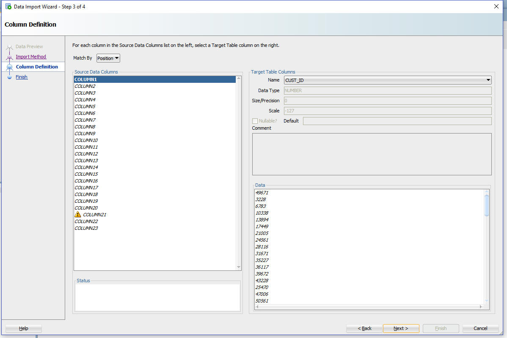

  - Click on the **COLUMN21** with the warning icon beside it.  This is informing us of a data problem.

  - In this case, the date format does not match our data.  Change the format to be YYYY-MM-DD-HH24-MI-SS  (you can type this in the Format field)

  - You also need to change the date format for **COLUMN22** to the same YYYY-MM-DD-HH24-MI-SS format.

  - Click **NEXT**.

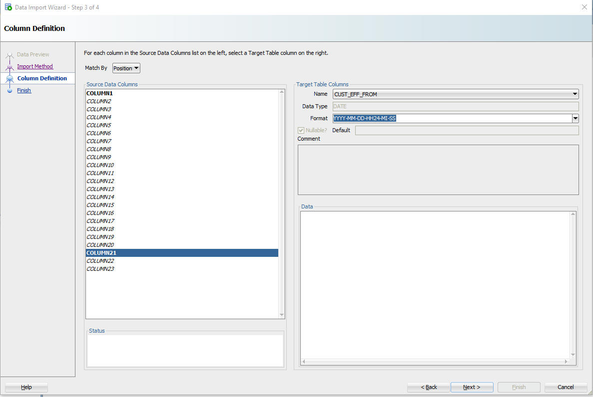

- The last screen before the final data load enables you to test a larger row count than the sample data of the beginning of the wizard to see whether the previously made decisions are satisfying for your data load. Note that we are not loading any data when iterating back and forth between this screen and previous ones. Select **TEST RESULTS** and look at the log, the data you would load, any mistakes and how the external table definition looks like based on your inputs.

&nbsp;&nbsp;&nbsp;&nbsp;&nbsp;&nbsp;&nbsp;When done with your investigation, click **NEXT**.

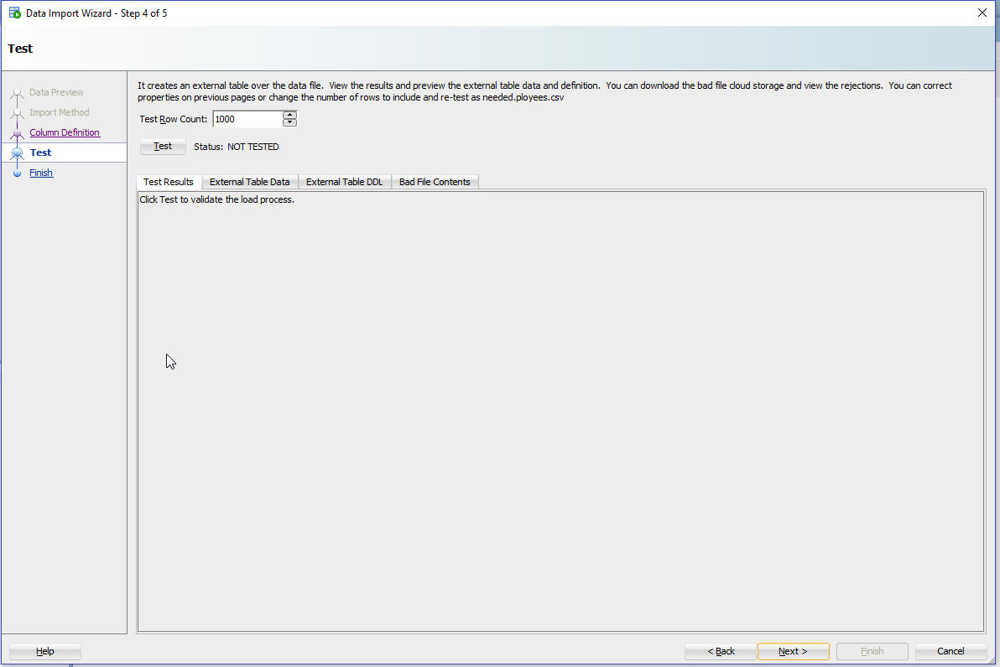

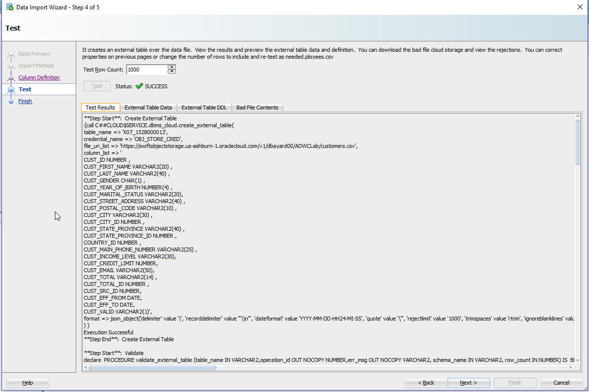

- The final screen reflects all your choices made in the Wizard. Click **FINISH** to load the data into table CUSTOMERS.
