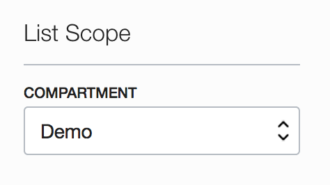
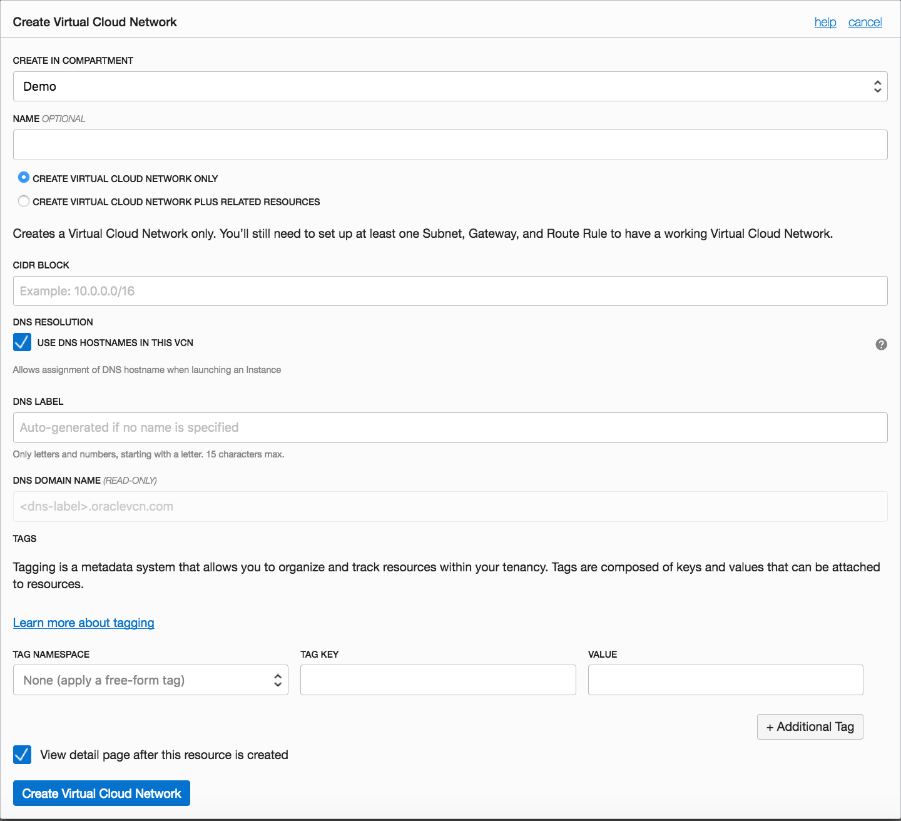
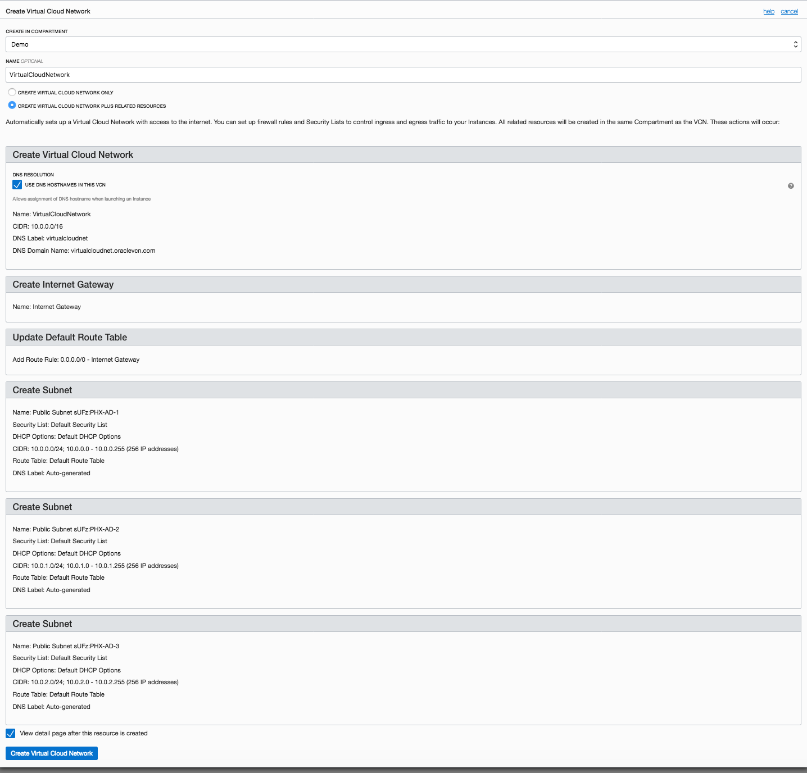
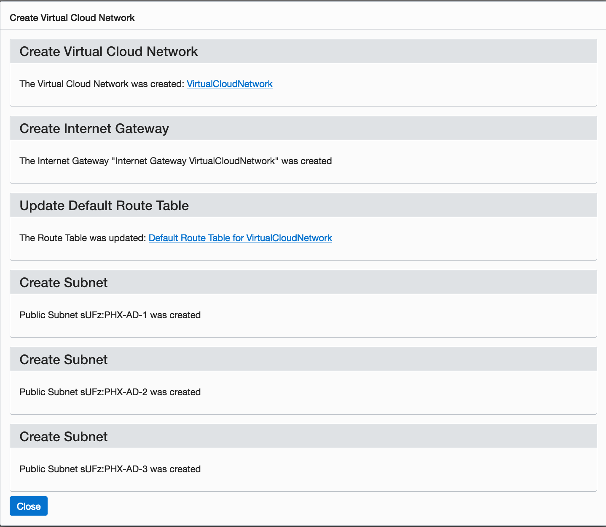
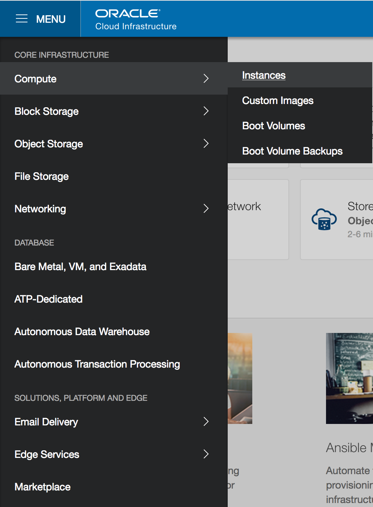
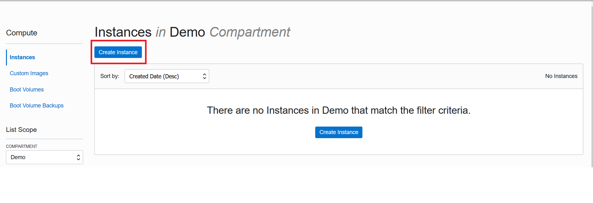
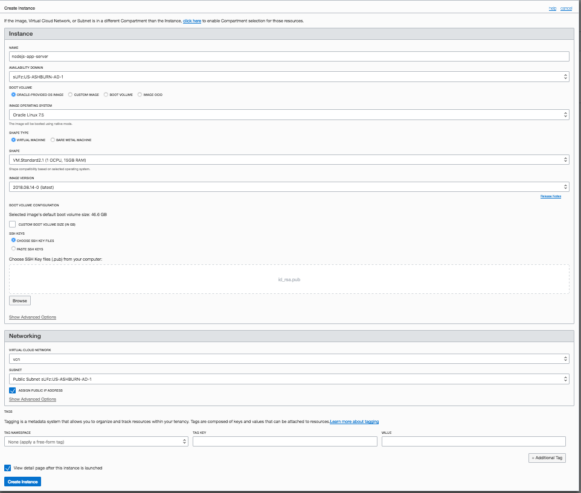
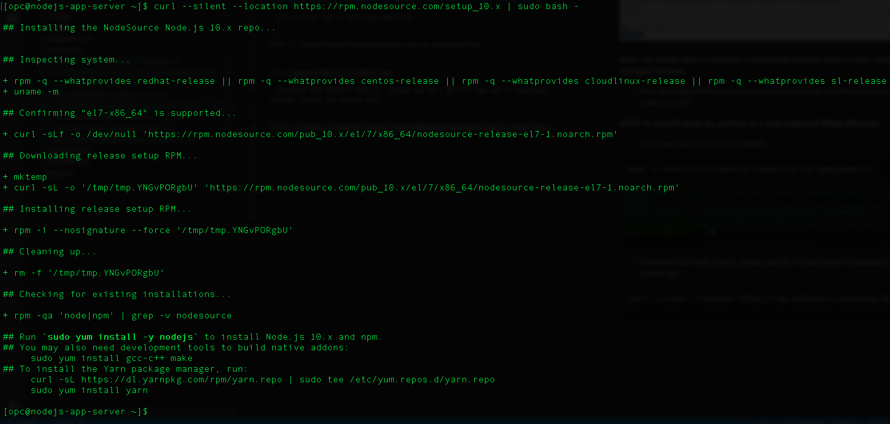

# Lab 500: Configure node.js app with ATP

## Introduction

Autonomous Transaction Processing provides all of the performance of the market-leading Oracle Database in an environment that is tuned and optimized for transaction processing workloads. Oracle Autonomous Transaction Processing (or ATP) service provisions in a few minutes and requires very little manual ongoing administration.


ATP provides a TLS 1.2 encrypted secure connectivity for applications. In fact, using a secure encryption wallet is the only way to connect to an ATP service instance, ensuring every connection to your database is secure, regardless how it gets routed.

To **log issues**, click [here](https://github.com/cloudsolutionhubs/autonomous-transaction-processing/issues/new) to go to the github oracle repository issue submission form.

## Objectives

- Learn how to build a linux node.js application server and connect it to an Oracle ATP database service

## Required Artifacts

- The following lab requires an Oracle Public Cloud account. You may use your own cloud account, a cloud account that you obtained through a trial, or a training account whose details were given to you by an Oracle instructor.

## Steps

### **STEP 2: Create a Virtual Cloud Network**

Virutal Cloud Network (VCN) is a private network that you set up in the Oracle data centers, with firewall rules and specific types of communication gateways that you can choose to use. A VCN covers a single, contiguous IPv4 CIDR block of your choice. See [Default Components that Come With Your VCN](https://docs.cloud.oracle.com/iaas/Content/Network/Concepts/overview.htm#Default). The terms virtual cloud network, VCN, and cloud network are used interchangeably in this documentation. For more information, see [VCNs and Subnets](https://docs.cloud.oracle.com/iaas/Content/Network/Tasks/managingVCNs.htm).

- Login to your Oracle Cloud Infrastructure and Click n **Menu** and select **Network** and **Virtual Cloud Networks**.


In order to create a VCN we need to select a Compartment from the List Scope. For this lab we will be selecting **Demo** compartment.



- After selecting **Demo** compartment click on Create Virtual Cloud Network to create VCN


- THis will bring Create Virtual CLoud Netowrk screen where you will specify the configurations.



- Enter the following the the screen

**Create In Compartment**: Select the sandbox compartment, Demo. By default, this field displays your current compartment.
**Name**: Enter a name for your cloud network.
Check on **Create Virtual Cloud Network Plus Related Resources** option. By selecting this option, you will be creating a VCN with only public subnets. The dialog expands to list the items that will be created with your cloud network.



- Click on Create Virtual Cloud Network.

A confirmation page displays the details of the cloud network that you just created. The cloud network has the following resources and characteristics (some of which are not listed in the confirmation dialog):
- CIDR block range of 10.0.0.0/16
- An internet gateway
- A route table with a default route rule to enable traffic to and from the internet gateway
- A [default security](https://docs.cloud.oracle.com/iaas/Content/Network/Concepts/securitylists.htm#Default) list
- A public subnet in each availability domain




### **STEP 2: Provision a linux compute VM to serve as the app server**

- Provision a linux compute VM to serve as the app server. 

- Log into your Oracle Cloud Infrastructure and click on Menu and select Compute and Instances.



- Click on Create Instance



- In order to create Compute Instance we need to select a Compartment.

Enter the following to Create Linux Instance

- 




- You would need to provision virtual cloud network (VCN) in your compartment to create Compute Instance.

- Note the public IP of the machine provisioned and ssh into this host and configure it to run node.js on ATP.

### **STEP 2: Install node.js, python 2.7 and required libaio libraries**

- ssh as user opc to your host machine.

```
$ssh -i /Users/tejus/Desktop/sshkeys/id_rsa opc@ipaddress
```


- Download and install node.js, python and git. We will need git to download instant client and sample app.

```
$curl --silent --location https://rpm.nodesource.com/setup_10.x | sudo bash -
```



- Install nodejs

```
sudo yum install nodejs
```


- Install python 2.7 if it does not already exist on your machine.

#### Note: OEL 7.5 comes pre-installed with python 2.7

- You can check python version

```
python --version
```


- Ensure libaio is installed and up to date

```
sudo yum install libaio
```


- You can check your node, npm installs using
```
node --version
npm --version
```

- Install git to your host machine.

```
sudo yum install git
```


### **STEP 3: Install and configure Oracle Instant Client**

- Download and install Oracle Instant Client software

#### Note: You can download it from OTN [here](http://www.oracle.com/technetwork/database/database-technologies/instant-client/downloads/index.html)

For simplicity and to facilitate a direct download to your linux host, clone below git repository to your host machine.
```
git clone https://github.com/kbhanush/instantclient_12_2_linux
```

- Unzip the file and move the files to /opt/oracle/instantclient_12_2

```
cd instantclient_12_2_linux/

unzip instantclient-basiclite-linux.x64-12.2.0.1.0.zip

cd instantclient_12_2/

sudo mkdir /opt/oracle

sudo mv /home/opc/instantclient_12_2_linux/instantclient_12_2/ /opt/oracle/instantclient_12_2/
```

- Set LD_LIBRARY_PATH in your bash_profile as

```
export LD_LIBRARY_PATH=/opt/oracle/instantclient_12_2:$LD_LIBRARY_PATH
```


### **STEP 4: Install node oracle drivers through npm**

- Download sample node.js app from git

```
cd /home/opc/

git clone https://github.com/kbhanush/ATPnodeapp
```

- In the node.js app folder install node oracle drivers from npm

```
cd ATPnodeapp/

npm install oracledb
```

- Your sample application consists of 2 files, dbconfig.js and server.js. Set dbuser, dbpassword and connectString in dbconfig.js to point to your ATP database.

```
nano dbconfig.js

module.exports= {
dbuser: 'admin', 
dbpassword: 'xxxxxxxxxx', 
connectString: 'restonHubDB_high' 
}
```

### **STEP 5: Upload connection wallet and run sample app**

- Upload the connection wallet and run sample app

- From your local machine copy the secured wallet file to host machine

```
sudo scp -i ~/priv-ssh-keyfile wallet_RESTONHUBDB.zip opc@ipaddress:/home/opc/ATPnodeapp
```

- ssh back to your host machine and unzip the wallet file

```
unzip wallet_RESTONHUBDB.zip -d wallet_RESTONHUBDB/
```

- Set env variables TNS_AMDIN to point to the wallet folder and edit sqlnet.ora file in wallet folder to point to the wallet.

```
export TNS_ADMIN=/home/opc/ATPnodeapp/wallet_RESTONHUBDB/
```

- Edit sqlnet.ora as follows
```
cd /home/opc/ATPnodeapp/wallet_RESTONHUBDB/

nano sqlnet.ora

WALLET_LOCATION = (SOURCE = (METHOD = file) (METHOD_DATA = (DIRECTORY=$TNS_ADMIN)))
SSL_SERVER_DN_MATCH=yes
```

```
node server.js
```


- Once the server.js is running open up another terminal and ssh into the linux machine and get into your node app folder and run app in background and test with curl.

```
cd home/opc/ATPnodeapp/

curl http://localhost:3050
```

- The application confirms connectivity to your ATP instance.


