# Oracle Application Express: Developing Database Web Applications

# Hands-On-Labs Guide

## Unit 8: Creating and Using Forms

This exercise includes two hands-on-labs.

**HOL 8-1 Updating the Form Pages in the Demo Projects Application**: In this hands-on-lab, you update the default form pages in the Demo Projects application.

**HOL 8-2 Creating a Form on a Table and Linking a Report**: In this hands-on lab, you create a form on the PROJECT\_BUDGET table. Then, you create a classic report on the PROJECT\_BUDGET table and link this report to the form. This lab utilizes the Budget App application.

## HOL 8-1 Updating the Form Pages in the Demo Projects Application

In the Demo Projects application, you create a report that allows each Team Member to see their outstanding tasks.

1.  Navigate to **App Builder** and run the **Demo Projects** application.

2.  In the navigation menu, click **Demo Proj Team Members**.
    Then, click the **Edit** icon (pencil), next to a team member's name to view the modal form page, for the person you selected.
    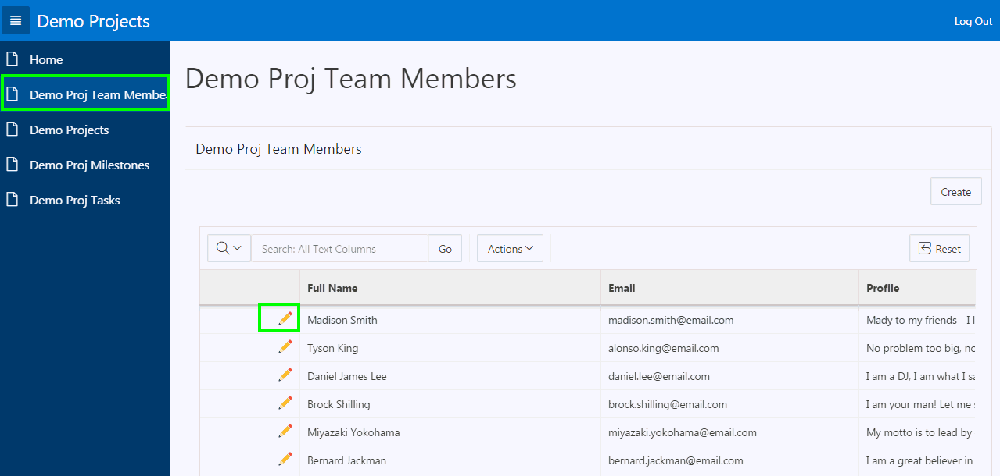

3.  On the Developer Toolbar at the bottom of the page, click **Edit Page 3** to jump to the modal page in Page Designer.
    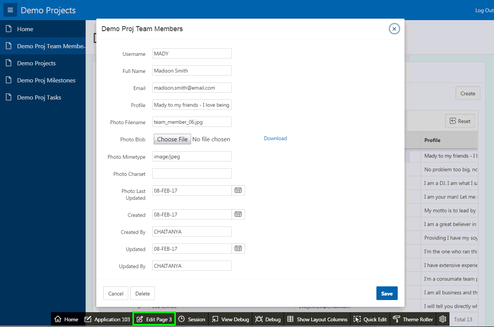

4.  In the property editor &gt; Page &gt; Identification, enter **Maintain Team Member** for both Name and Title.
    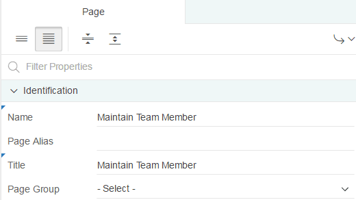

5.  Under Rendering, select the Edit\_Demo\_Proj\_Team\_Members region. In the property editor, navigate to Appearance &gt; Template Options. Click **Use Template Defaults**.
   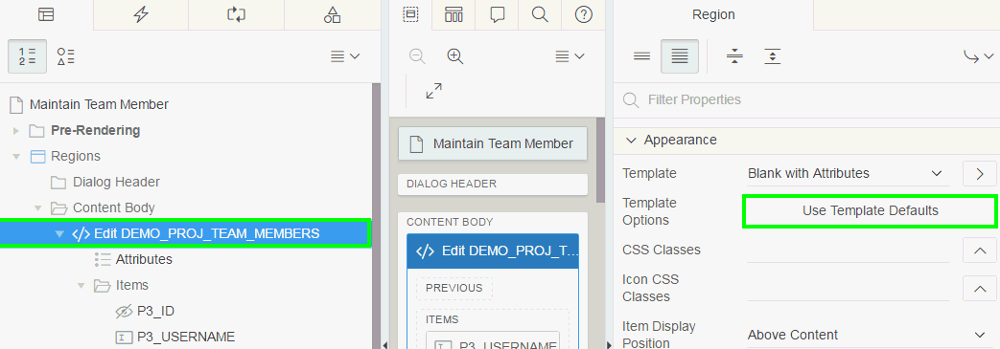

6.  In the Template Options dialog, under Advanced, for Item Width, select **Stretch Form Fields** and click **OK**. Then, click **Save**.  
   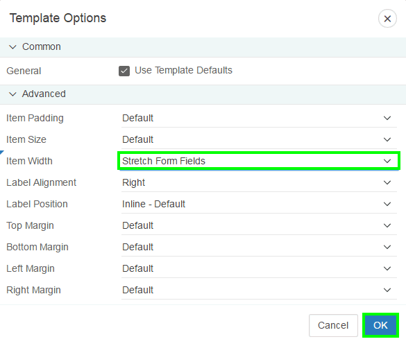

7.  Now, modify the default Project form page to be more visually appealing and consistent with how the Maintain Team Member page was improved. Navigate to the application runtime environment. In the navigation menu, click **Demo Projects**.

8.  Click one of the Project names, to open a modal dialog.  
    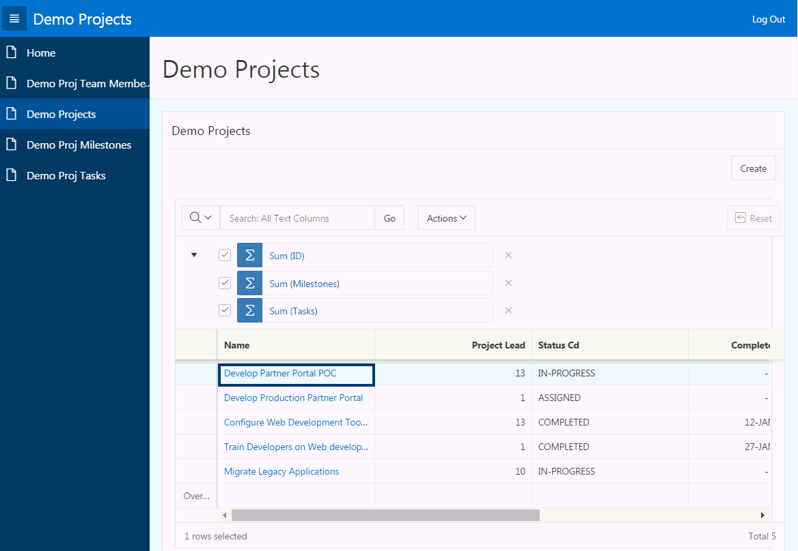

9.  In the runtime environment, after selecting a project, in the Developer Toolbar, click **Edit Page 5**.  
    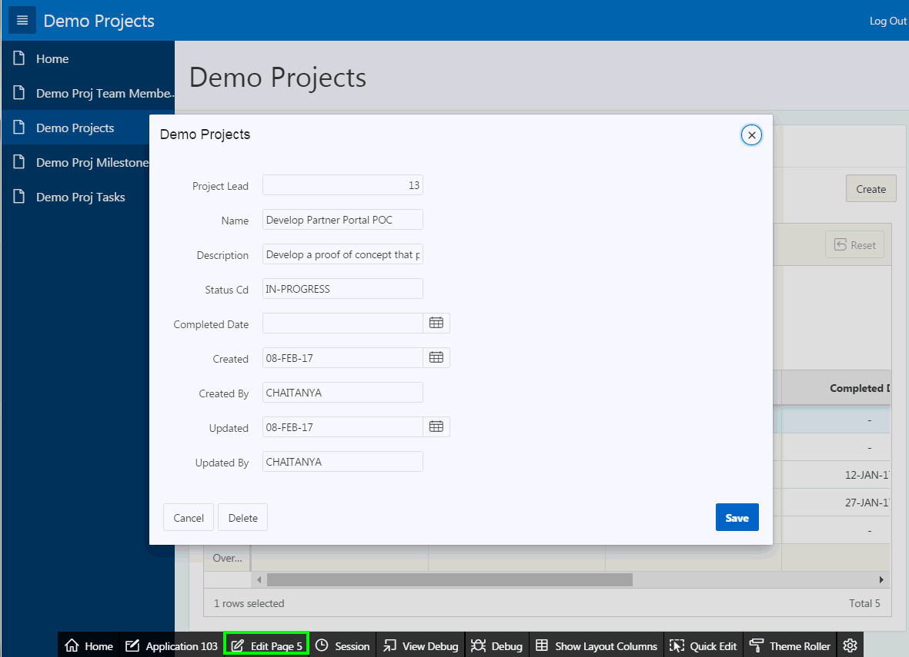

10. In the Property Editor:

	-   Identification: Name - enter **Maintain Project**
	
	-   Identification: Title - enter **Maintain Project**
	    

    Scroll down to Navigation and for Cursor Focus, select **First item on page**. Then, click **Save**.
    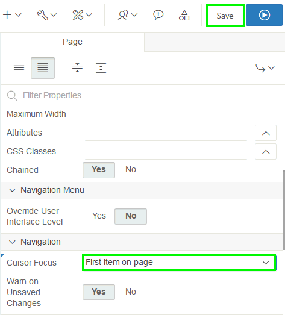

11.  Modify the default Milestone form page to be more visually appealing. In the Demo Projects runtime environment, navigate to the Demo Proj Milestones page and open one of the records by clicking the edit icon (pencil).
    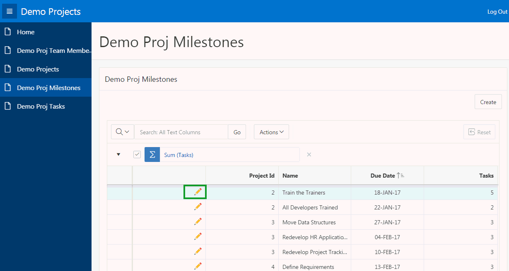

12.  In the Developer Toolbar, click **Edit Page 7**.
    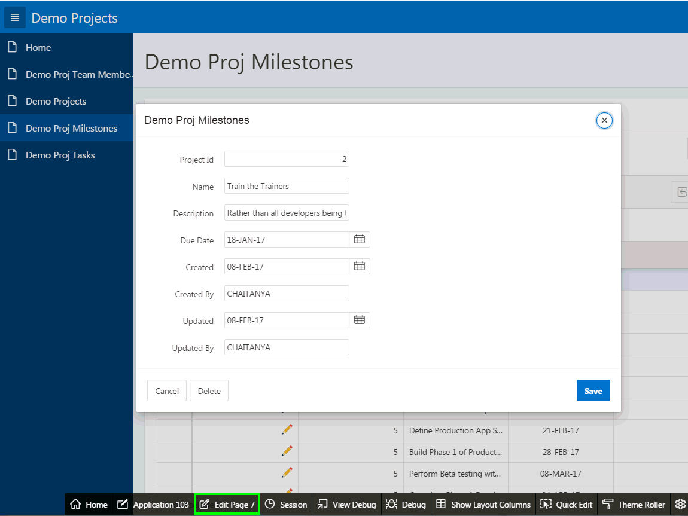

13.  In the Property Editor:

-   Identification: Name - enter **Maintain Milestone**  

-   Identification: Title - enter **Maintain Milestone**  
    

    Scroll down to Navigation and for Cursor Focus, select **First item on page**. Then, click **Save**.  
    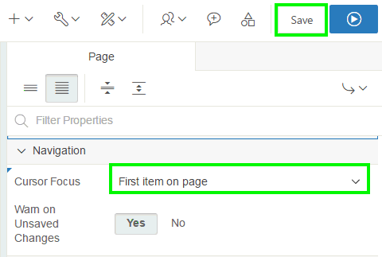

14.  Modify the default Task form page to be more visually appealing. In the Demo Projects runtime environment, navigate to the Demo Proj Tasks page and open one of the records by clicking the edit icon (pencil).

15.  In the runtime environment, view a record by clicking the Edit icon (pencil) for a task.
    

16.  In the Developer Toolbar, click **Edit Page 9**.

17.  In the Property Editor:

-   Identification: Name - enter **Maintain Task** 
-   Identification: Title - enter **Maintain Task**  
	
     
	  Scroll down to Navigation and for Cursor Focus, select **First item on page**.  
	 Then, click **Save**.  
	 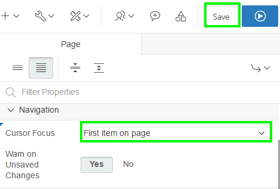

## HOL 8-2: Creating a Form on a Table and Linking a Report

In this lab, you first create a classic report on the PROJECT\_BUDGET table. Then, you create a form on the PROJECT\_BUDGET table. Finally, you link the classic report to the form.

1.  Navigate to **App Builder** and in the applications report, click **Budget App**.
    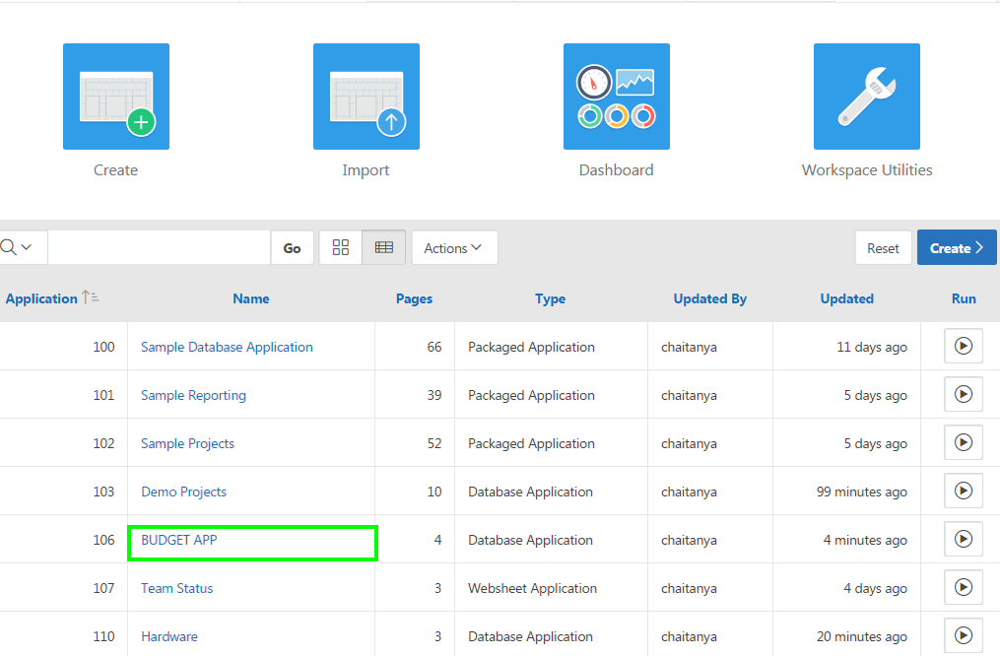

2.  The application home page appears. Now, create a Classic Report on the PROJECT\_BUDGET table. Click **Create Page** and then perform the following steps:

	a)  Select **Report** and click **Next**
	
	b)  Select **Classic Report** and click **Next**
	
	c)  Enter **Project Budget Report** for Page Name and click **Next**
	
	d)  For Navigation, select **Create a new navigation menu entry** and click **Next**
	
	e)  Select **PROJECT\_BUDGET** for Table / View Name and click **Create**.

3.  The report page is created successfully. Now, create a form on the PROJECT\_BUDGET table. Perform the following steps:

	a)  In the page designer toolbar, click **Create** and select **Page**.
	    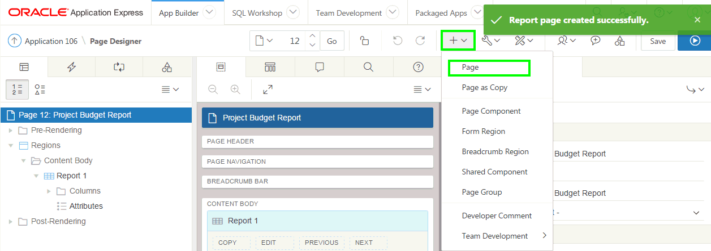
	
	b)  Select **Form** and click **Next**.
	
	c)  Select **Form on a Table** and click **Next**.
	
	d)  Enter **Project Budget Details** for Name, select **Modal Dialog** for Page Mode and click **Next**.
	
	e)  Click **Next**.
	
	f)  Select **PROJECT\_BUDGET** for Table / View Name, ensure that all the columns selected to be displayed and click **Next**.
	
	g)  Click **Create**.

    The form page is created successfully.

4.  The form you just created is a dialog page and so you cannot run it directly. If you click the Save and Run Page, you see this message:  
    

5.  You want to navigate to the Project Budget Report page in the page designer. In the toolbar, click the Navigate to previous page arrow (down arrow).
    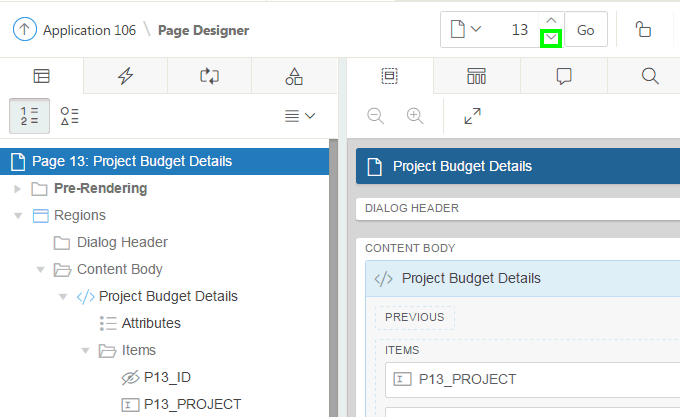

6.  Under Rendering &gt; Regions, select **Report 1**. In the property editor, replace the existing title with **Project Budget Report**.

7.  Under Rendering, expand **Columns** and select **ID**.

8.  In the property editor, select **Link** for Type. Scroll down and locate Link &gt; Target. Click **No Link Defined**.
    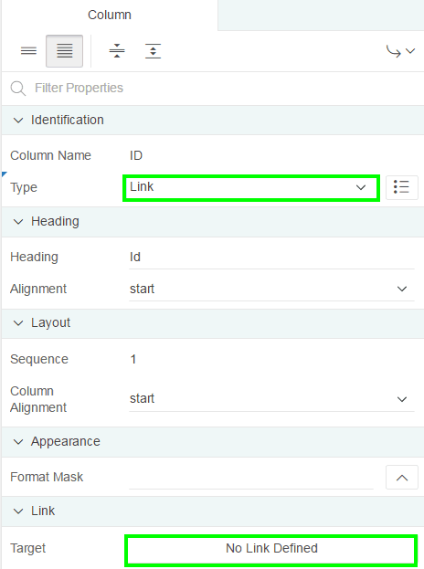

9.  In the Link Builder – Target dialog, select the following:

	-   Target &gt; Type: **Page in this application**
	
	-   Target &gt; Page: Select the form page, Project Budget Details
	
	-   Set Items &gt; Name: **P&lt;*n*&gt;\_ID** where *n* is the page number of the form page
	
	-   Set Items &gt; Value: **\#ID\#**

    Click **OK**.  
    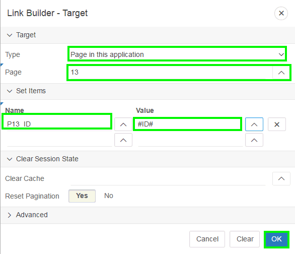

10.  In the property editor, navigate to Link. For Link Text, click the Quick Pick and select **apex-edit-pencil.png**.
    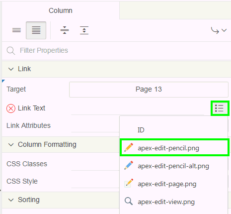

11.  Click **Save**. Then, click **Save and Run Page**.

12.  The Project Budget Report page is displayed.
    **Note**: You might have to log in to the application using username and password. Then, in the navigation menu, click Project Budget Report.\
    Click the Edit icon (pencil) for any row, and you see that the form dialog page is displayed.
    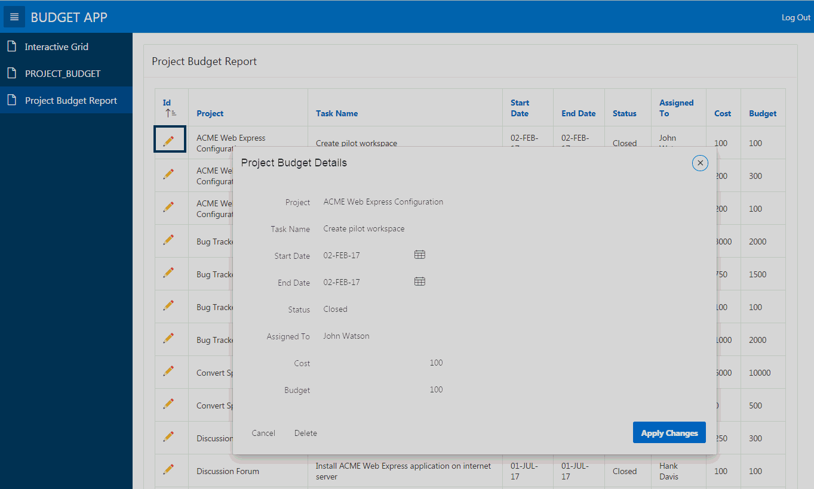

----------
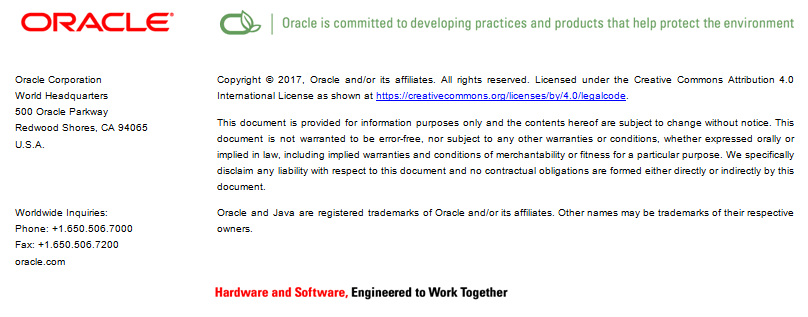
