# Oracle Application Express: Developing Database Web Applications

# Hands-On-Labs Guide

## Unit 12: Using Themes and Theme Styles

This exercise includes three hands-on-labs.

HOL 12-1 and HOL 12-2 use the Demo Projects application.

HOL 12-3 uses the Budget App application.

**HOL 12-1 Updating the Navigation List**: The Demo Projects application uses the Universal Theme. In this lab, you update the navigation list and while creating a list entry, specify user defined attributes.

**HOL 12-2 Updating the Team Members Pages**: In this hands-on lab, you create a Classic Report region and update the report template to use Cards. You specify template options.

**HOL 12-3 Creating and Using Theme Styles**: In this hands-on lab, you use the Budget App application. You use the Theme Roller to save the changes made to the Theme Style and then enable users to apply this Theme Style in the running application.

## HOL 12-1: Updating the Navigation List

In this hands-on lab, you update the navigation list in the Demo Projects application. You create a new list entry and make this new entry as a parent list entry to the Logout entry.

1.  Navigate to **App Builder** and run the **Demo Projects** application.
    In the Developer Toolbar, click **Application&lt;*n*&gt;.

2.  On the application home page, click **Shared Components**.
    Under Navigation, click **Lists**.  
    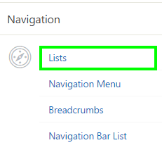

3.  In the Lists report, click **Desktop Navigation Bar**.
    

4.  Click **Create List Entry**.
    

5.  To create a new list entry, input the following:

	-   Image/Class - enter **fa-user**
	
	-   List Entry Label - enter **&APP\_USER.**
	
	-   Target Type - select **URL**
	
	-   URL Target - enter **\#**
	
	-   User Defined Attributes 2 (List Item CSS Classes) - enter **has-username**

    Click **Create List Entry**.
    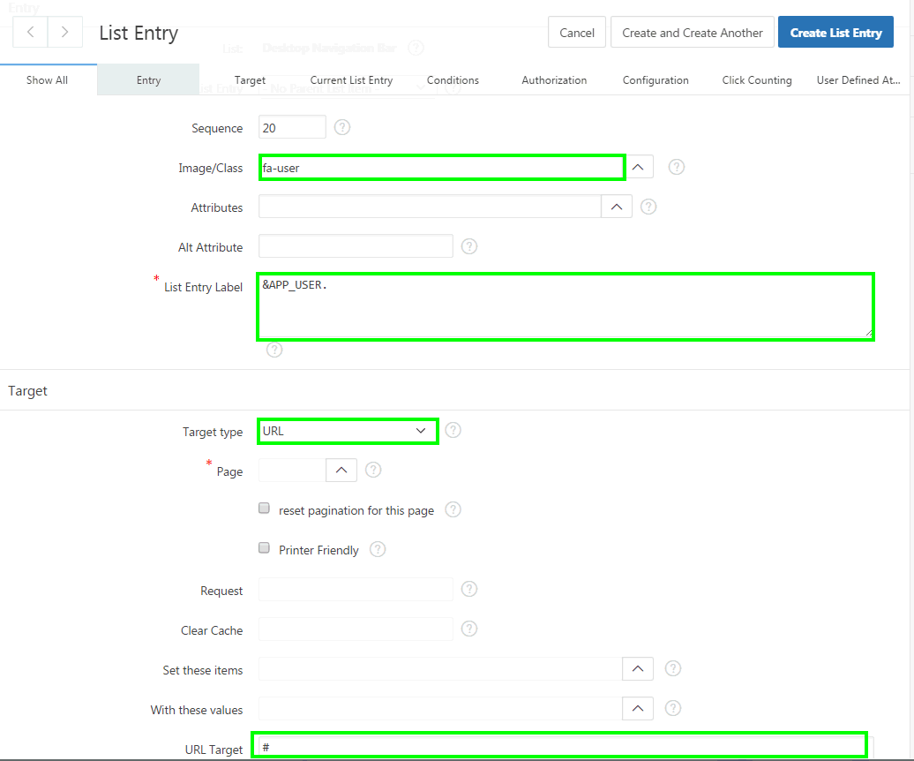  

    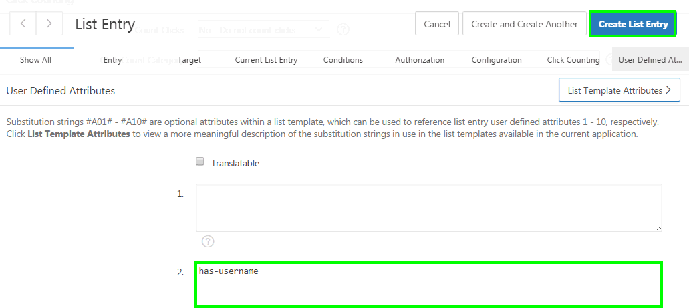

     **Note**: To determine the User Defined Attributes, click List Template Attributes.  

     For Theme: Select **Universal Theme 42**, and for List Template: Select **Navigation Bar**.  

    Verify that \#A02\# Description is List Item CSS Classes.  
    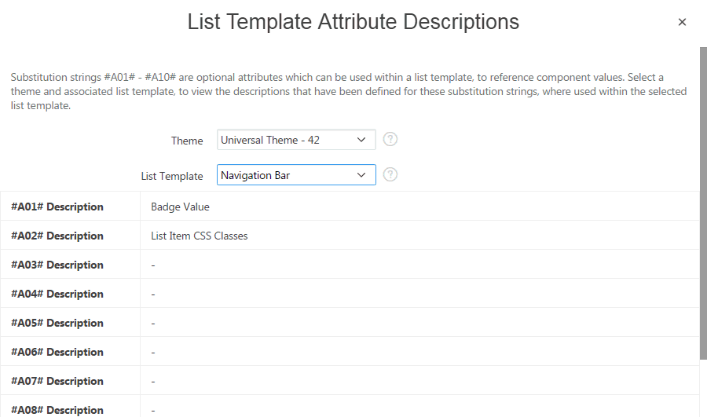
 

6. Place the Logout entry under the new Application User entry. In the report, click the **Log Out** list entry.
    

7. For Parent List Entry, select **&APP\_USER.**.
    Click **Apply Changes**.
    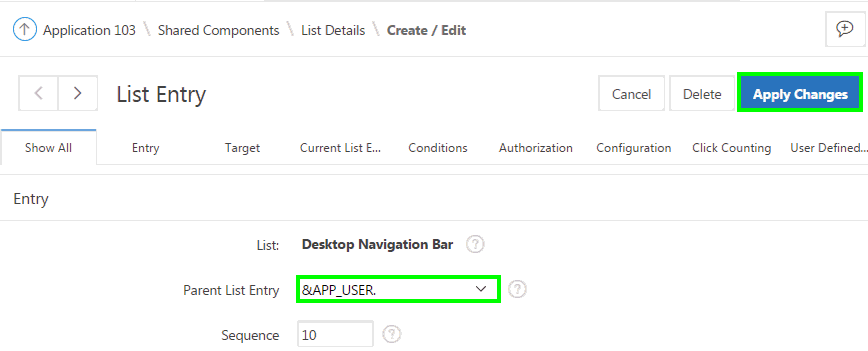

8. Click **Run Page 1**.
    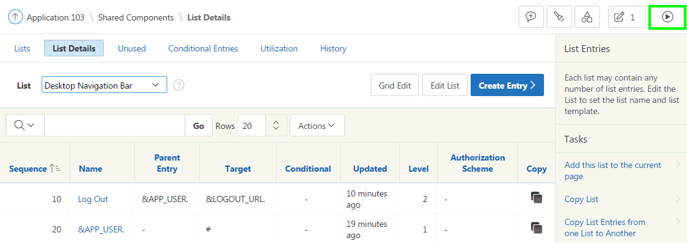

9. The home page looks like:
    
    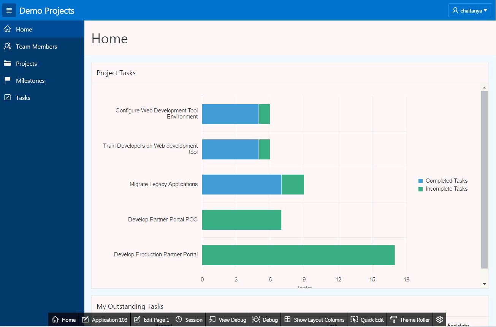

## HOL 12-2: Updating the Team Member Pages

In this lab, you update the Team Member pages by replacing the Interactive Grid with a card region. This will provide a directory of your team members' contact information and roles as though you had a stack of their business cards at hand.

1.  In the Demo Projects application runtime environment, click **Team Members** in the navigation menu.
    In the Developer Toolbar, click **Edit Page 2**.

2.  Update the page properties from Demo Proj Team Members to **Team Members**.
    In the Property Editor, with the page selected, for CSS - Inline, copy and paste the following code:

	      
	      .t-Card-icon img {
	      
	      width: 48px;
	      
	      height: 48px;
	      
	      }
  

    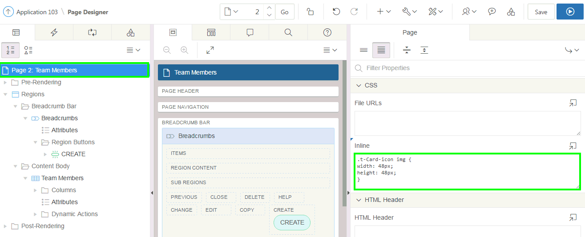
     **Note**: This CSS ensures that the images are all the same size (48 pixels) irrespective of the size of the image uploaded.

3.  This page is an Interactive Grid. You want to convert the report type to a Classic Report type, so that you can utilize one of the built-in templates. Update the Interactive Grid to a Classic Report, and apply the Cards template to display the team members in a more visually pleasing manner.
    Click the **DEMO\_PROJ\_TEAM\_MEMBERS** region and input the following:

	-   Identification: Title - enter **Team Members**
	
	-   Identification: Type - select **Classic Report**

    In the SQL Query attribute, click the **Code Editor** button.
    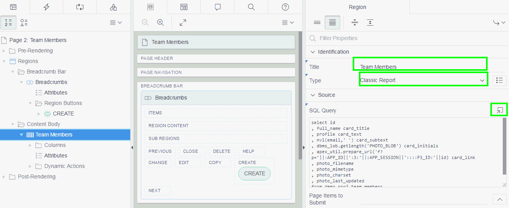

4.  In the Code Editor window, delete the existing SQL Query and copy and paste the following code:

  
	      select id
	      
	      , full_name card_title
	      
	      , profile card_text
	      
	      , nvl(email,' ') card_subtext
	      
	      , dbms_lob.getlength('PHOTO_BLOB') card_initials
	      
	      , apex_util.prepare_url('f?p='||:APP_ID||':3:'||:APP_SESSION||'::::P3_ID:'||id) card_link
	      
	      , photo_filename
	      
	      , photo_mimetype
	      
	      , photo_charset
	      
	      , photo_last_updated
	      
	      from demo_proj_team_members
	      
	      order by created
      

    Then, click **OK**.

     **Note**: This SQL query uses specific column names, such as card\_title, which correspond to the columns required for the Card template.
     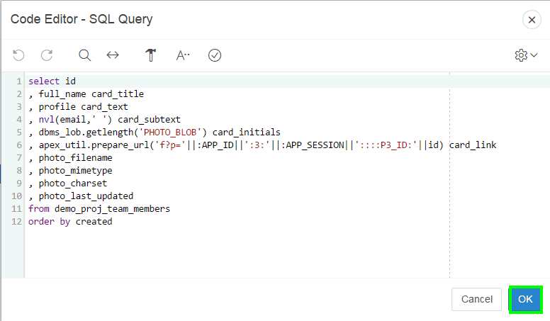

5.  The report region has the required Type and SQL Source, now the report needs to be enhanced to display an image and utilize the correct report template.
    The DEMO\_PROJ\_TEAM\_MEMBERS table includes columns which store an image and the image's associated properties. You can use this information to show the team Member's stored image, instead of the member's initials in the cards report.
    Under the Rendering &gt; Regions, locate Team Members, and expand the **Columns** node.
    Select the **CARD\_INITIALS** column, and input the following:

	-   Identification: Type - select **Display Image**
	
	-   BLOB Attributes: Table Name - select **DEMO\_TEAM\_MEMBERS**
	
	-   BLOB Attributes: BLOB Column - select **PHOTO\_BLOB**
	
	-   BLOB Attributes: Primary Key Column 1 - select **ID**
	
	-   BLOB Attributes: Mime Type Column - select **PHOTO\_MIMETYPE**
	
	-   BLOB Attributes: Filename Column - select **PHOTO\_FILENAME**
	
	-   BLOB Attributes: Last Updated Column - select **PHOTO\_LAST\_UPDATED**
    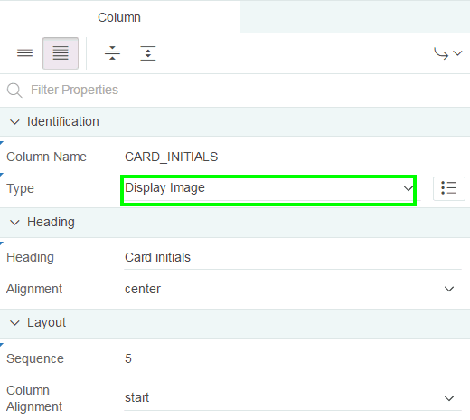 
    
    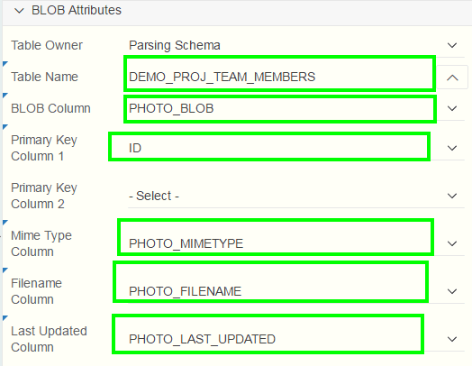

6.  Under Rendering, expand the Team Members region. Select **Attributes**.
    In the property editor, locate Appearance. For Template, select **Cards**.
    Click **Template Options**.
    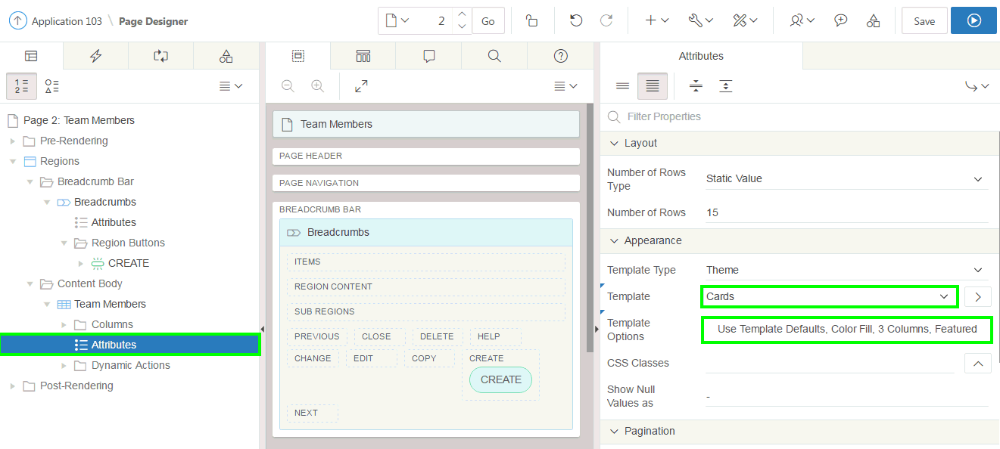

7.  In the Template Options dialog:

	-   Style - select **Basic**
	
	-   Icons - select **Display Initials**
	
	-   Layout - select **4 Columns**
	
	-   Body Text - select **3 Lines**   
	    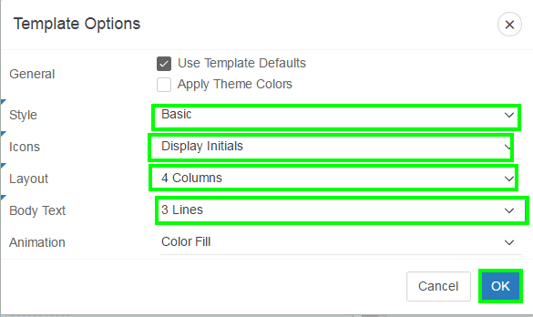

    Click **OK**.

8.  Click **Save**. Then, click **Save and Run** Page to see the new cards.
    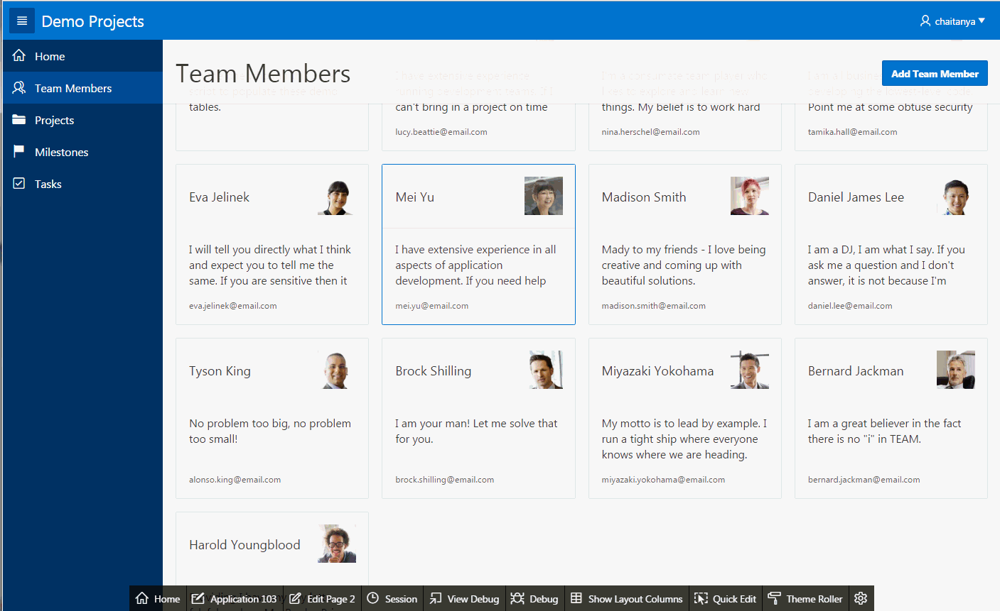

## HOL 12-3: Using Themes and Theme Styles

In this hands-on lab, you use the Theme Roller to save a Theme Style. Then, you enable end users to apply this style while running the application.

1.  Navigate to **App Builder** and then run the **Budget App** application.
    In the Developer Toolbar, click **Theme Roller**.
    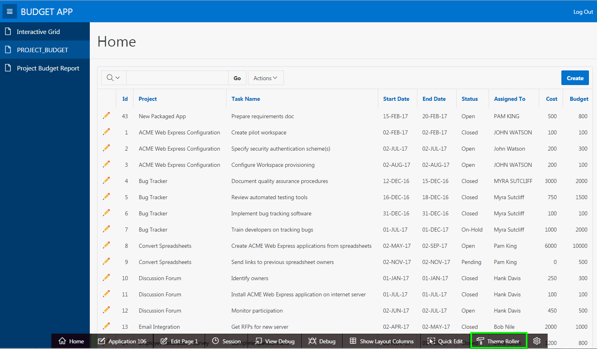

2.  The current Theme Style is Vita.
    Under Global Colors, click the color swatch to select new colors.
    To edit a specific component, expand a group and select new colors or styling of the component you wish to edit.
    Modify the look by specifying colors of your choice and preview the changes. Once you are done, click **Save As**.
    
    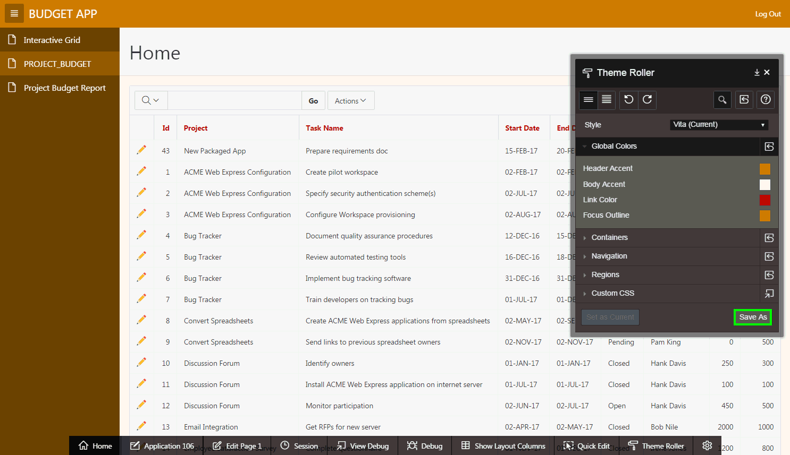

3.  In the Save As dialog, enter **Vita (Copy)** for Style Name and click **Save**.  
    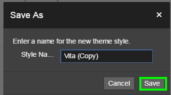

4.  Click **OK**.  
    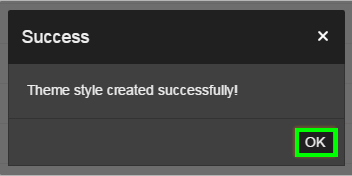

5.  Click Application &lt;*n*&gt; in the Developer Toolbar.
    In the application home page, click **Shared Components**.
    Under User Interface, click **User Interface Attributes**.
   
    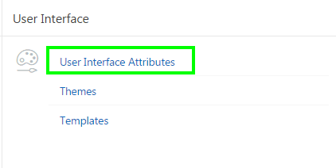

6.  Under User Interfaces, click the **Edit** icon for Desktop.
    

7.  Under Attributes, select **Yes** for Enable End Users to Choose Theme Style.
    Notice that the new Theme Style you saved is displayed under Theme Style list.
    Click **Apply Changes**.
    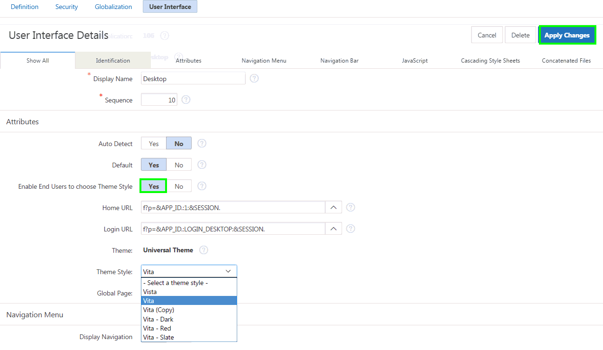

8.  Now, run the application. At the bottom of the page, click the **Customize** link.

9.  Using the Customize dialog, users can specify their Theme Style while running the application. Select the Theme Style that you saved in step 3 above, and click **Apply Changes**.

    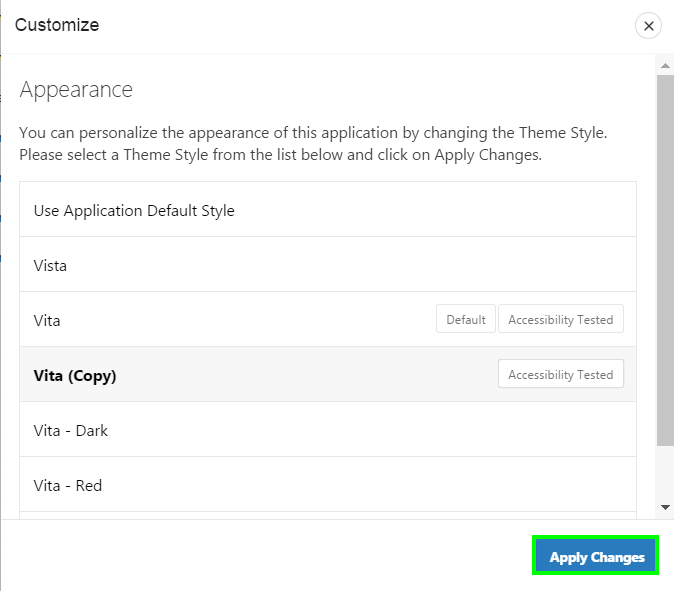

10.  The Theme Style is applied and you see a message that says Preferences changed for user &lt;*username*&gt;.
     

----------

