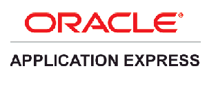
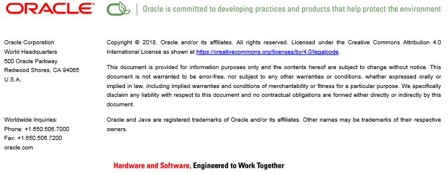

 
#Oracle Application Express: Developing Database Web Applications

#Hands-On-Labs Guide

##Overview

This series of hands-on labs is designed to teach you how to build applications using Application Express. The primary vehicle for teaching is a single use case which is expanded on with each lab.

The primary use case is that your team tracks projects you are currently working on. Rather than using a spreadsheet or some commercial project tracking tool you have been tasked with building a Web application so that the team has a custom application that meets everyone's requirements. The DBA has created a script which creates various tables and populates them with the current data.

In this series of hands-on-labs, you also quickly build two simple applications. You use a spreadsheet to create the Budget App application that allows everyone to maintain the project cost and budget data. The Hardware application is used to make purchasing decisions of the hardware in different departments. You will then greatly improve these two applications and utilize a number of techniques such as Interactive Grids, and Interactive Reports.

Prerequisites
=============

The steps and screenshots in this hands-on-labs use Oracle Application Express 5.1.

To run these hands-on-labs, you need to:

-   Obtain an Oracle Application Express Workspace and a Workspace Administrator /Developer user account. Select the most appropriate option from those listed below to obtain a Workspace:

    -   [apex.oracle.com](http://apex.oracle.com/) - Request a workspace on Oracle’s free 'development only' service for evaluating the technology.

    -   [Oracle Database Cloud Service](https://cloud.oracle.com/database) - Request service on the Oracle Database Cloud Service. Once provisioned you will be provided access to your cloud service which includes an Oracle Application Express Workspace.

    -   [Oracle Database 11g Express Edition](http://www.oracle.com/technetwork/products/express-edition/overview/index.html) - Download Oracle XE and install on your laptop or desktop machine and then [download](http://www.oracle.com/technetwork/developer-tools/apex/downloads/index.html) and install the latest Oracle Application Express release.

    -   [Oracle VM Virtual Box](http://www.oracle.com/technetwork/database/enterprise-edition/databaseappdev-vm-161299.html) - Download Oracle VM Virtual Box and then import the [Database Application Development Appliance](http://www.oracle.com/technetwork/database/enterprise-edition/databaseappdev-vm-161299.html) which includes Oracle Database 12c, Application Express and a number of labs pre-installed.

-   The **apex-course-labs.zip** file extracted into your working directory.

The apex-course-labs.zip file includes the scripts required by some of the steps in the hands-on labs. For each unit, an application export file is also included. This application export is basically the completed application for all the hands-on labs in the unit. If you are unable to perform the hands-on labs in any unit, you can simply import and install the application export file for that particular unit. For example, application export for unit 16 is demo projects app-export-unit 16.sql.

----------

