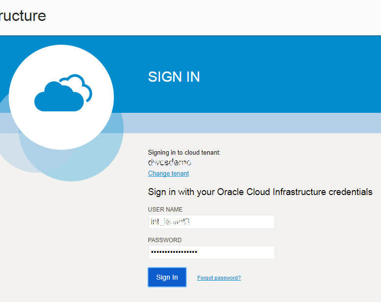
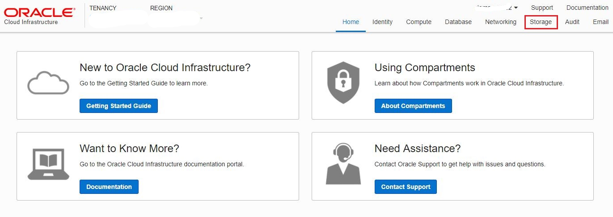
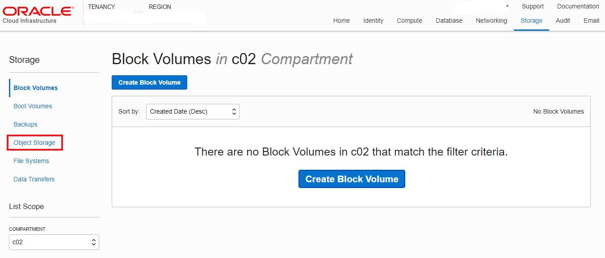
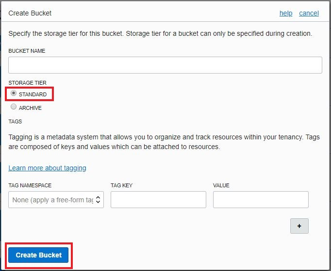
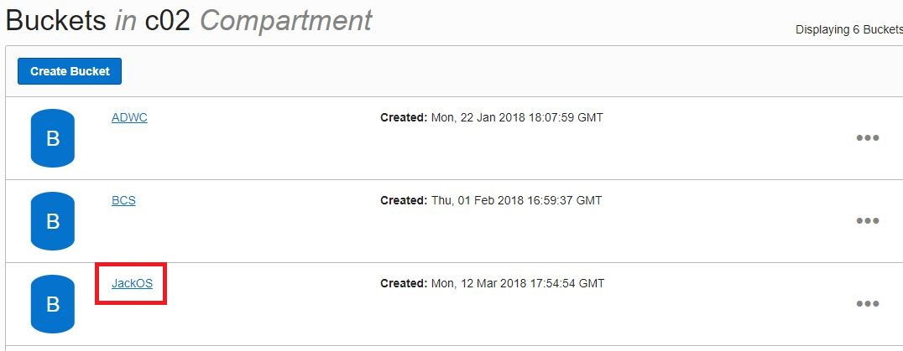
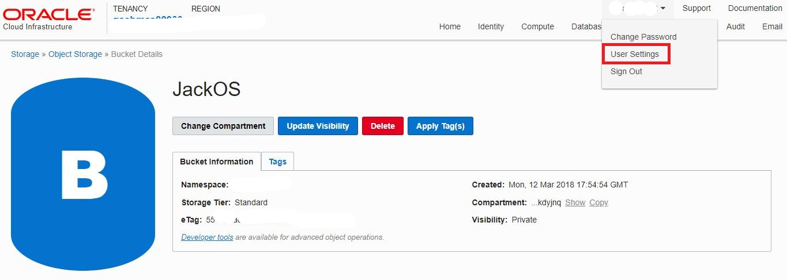
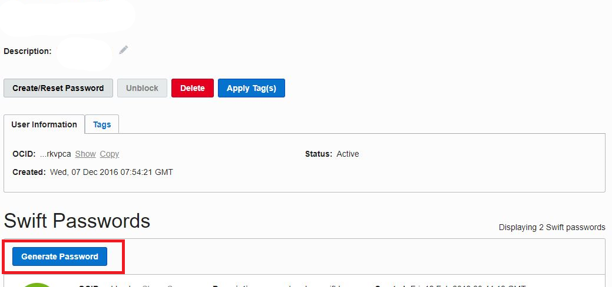

Update: March 12, 2018


# Introduction

This is the second of several labs that are part of the **Oracle Autonomous Data Warehouse Cloud Workshop**. This workshop will walk you through several use cases of using an autonomous data warehouse.

This lab walks you through some examples using the Oracle
Autonomous Data Warehouse Cloud with Object Storage. You will create and Object Storage bucket, upload data files, and use SQL developer to query those data files.

This lab shows you only the functional aspects of ADWC. It does not have exercises to test the performance of ADWC as the lab environment is not running on Exadata.

**Please direct comments to: Tom Huang (tom.huang@oracle.com).**

## Objectives
- Learn how to use OCI Object Storage
    - Create buckets
    - Upload Files
- Learn how to use SQL Developer with ADWC and Object Storage
    - Copy object storage file data to internal tables in Autonomous Data Warehouse Cloud using SQL Developer
    - Create external tables that reference files in object storage


## Required Artifacts
- The following lab requires an Oracle Public Cloud trial account.


# OCI Object Storage
Oracle Object Storage is a web-based interface that provides the ability to accelerate a broad range of high performance applications with your choice of high IO block storage, and durable, high-throughput object storage.

Key features of Oracle Machine Learning:
- Persistent IO-intensive block storage and high-throughput object storage options to handle multiple application types, and data at different lifecycle stages.
- Each is manageable through the console and by CLI.

### **Step 1**: Go to OCI console <https://console.us-phoenix-1.oraclecloud.com>. Enter the Clout Tenant provided by your Oracle Cloud administrator in the **Cloud Tenant** field and Select **Continue**.
### **Step 2**: Log in to your Oracle Cloud Infrastructure Console with the following credentials provided by your Oracle Cloud administrator.

**Username**: &lt;username&gt;

**Password**: &lt;password&gt;



### **Step 3**: Enter the Object Storage Console.
- Select the **Storage** tab in the navigation bar



- Select **Object Storage** in the side menu



### **Step 4**: Select Create Bucket to create the storage bucket to upload your source files into. You will later copy this data into database tables in your Autonomous Data Warehouse Cloud.

- Select **Create Bucket**


- Enter the following information:

  -   **Bucket Name** - &lt;yourname&gt;OS. &lt;&lt; Prefix your storage bucket name with a unique name (you can use your name, for example), e.g. JackOS. Since all users will be using the same cloud account, it is important that you use a unique bucket name.

  -   **Storage Tier** - Standard &lt;&lt; Do not select Archive as this tier will store its data differently.

Select **Create Bucket**.



### **Step 5**:  Upload files to your storage bucket.

Here we will download two files. One CSV and one JSON file. In later steps, we will use SQL Developer to query the data inside these files.

- Download Insurance.csv from github repository:
    - Open the following link in a new tab: <https://raw.githubusercontent.com/unofficialoraclecloudhub/autonomous-campaign/master/workshops/adwc-trialcampaigns/objectstorage/Insurance.csv>
    - Right Click anywhere on browser page and select **Save as...**
    - Save file

- Download colors.json from github repository:
  - Open the following link in a new tab: <https://raw.githubusercontent.com/unofficialoraclecloudhub/autonomous-campaign/master/workshops/adwc-trialcampaigns/objectstorage/colors.json>
  - Right Click anywhere on browser page and select **Save as...**


- Go back to OCI Object Storage Console

- Select your bucket name in the list of buckets. i.e. &lt;yourname&gt;OS



- Let's upload the CSV file.

  - Select **Upload Object**

  

  - Select **Browse** and select your recently saved csv file.

  

  - Select **Upload Object** and the popup will disappear.

- Now lets upload the Json file.

  - Select **Upload Object**

  

  - Select **Browse** and select your recently saved json file.

  

  - Select **Upload Object** and the popup will disappear.


### **Step 6**: Retrieve swift password.

 - Select \<username\> dropdown and select **User Settings**.

  

 - Select **Swift Passwords**.

  

 - Select **Generate Password**.

  

 - Give a brief description, i.e. "dbms cloud api credential" and Select **Generate Password**

  

 - Record / Copy the newly generated password for the next step.


Next, we are going to use our Autonomous Data Warehouse Cloud instance connected with SQL Developer to interact with the data files residing in our recently create Object Storage bucket.


# Querying Data Files in Object Storage

### **Step 1**:  Connect Autonomous Data Warehouse Cloud instance to data in Object Storage

- Go to the SQL Developer console that you connected in a previous lab. Here's a reference to that lab section: <https://github.com/unofficialoraclecloudhub/autonomous-campaign/blob/master/workshops/adwc-trialcampaigns/LabGuide100.md#connecting-to-the-database-using-sql-developer>


- Use DBMS_CLOUD API to create credentials.

As the user you created, run the following command, replacing \<oci-username\> with your OCI username, and \<swift-password\> with the swift password you generated in step 6

```

set define off
begin
  DBMS_CLOUD.create_credential(
    credential_name => 'OBJ_STORE_CRED',
    username => '<oci-username>',
    password => '<swift-password>'
  );
end;
/

```

This commands utilizes DBMS Cloud API to store your swift password as a credential when your Autonomous Data Warehouse Cloud / SQL Developer tries to connect to Object Storage.


### **Step 2**:  Create an internal table for CSV file

Now that we have set up an Object Storage bucket and connected SQL Developer to our Autonomous Data Warehouse Cloud, we can start interacting with the data files that we uploaded. It is possible to copy file data to internal tables or connect to the file through an external table. In this lab we will do both.

- Create the schema for your internal table.

```

CREATE TABLE INSURANCE (policyID NUMBER(20), statecode VARCHAR(20), county VARCHAR(20));

```

- Use DBMS_CLOUD API to copy the data into the new table.

**Note:** you will need to replace \<region\> , \<tenant\> , and \<bucket\> in the file_uri_list parameter.

You can find tenancy and region here:

  

Use this information for the **file_uri_list** parameter in the DBMS_CLOUD function.

```

begin
 dbms_cloud.copy_data(
    table_name =>'INSURANCE',
    credential_name =>'OBJ_STORE_CRED',
    file_uri_list =>'https://swiftobjectstorage.<region>.oraclecloud.com/v1/<tenant>/<bucket>/Insurance.csv',
    format => json_object('delimiter' VALUE ',')
 );
end;
/

```

Now you can query this table and retrieve data that previously only existed in Object Storage.


### **Step 3**:  Create an external table for CSV file

If for whatever reason you'd like to keep your data in Object Storage, you can create external tables. Instead of storing the data, it will store the connection to Object Storage so that it can quickly retrieve the data.

**Note:** you will need to replace \<region\> , \<tenant\> , and \<bucket\> in the file_uri_list parameter.

You can find tenancy and region here:

  


```

begin
 dbms_cloud.create_external_table(
    table_name =>'INSURANCE_EXT_CSV',
    credential_name =>'OBJ_STORE_CRED',
    file_uri_list =>'https://swiftobjectstorage.<region>.oraclecloud.com/v1/<tenant>/<bucket>/Insurance.csv',
    format => json_object('delimiter' VALUE ','),
    column_list => 'policyID NUMBER(20), statecode VARCHAR(20), county VARCHAR(20)'
 );
end;
/

```

Now you can query this external table the same way you would query an internal table.


### Bonus Step: Query JSON data

One of the benefits of the Oracle Database 18c that powers Autonomous Data Warehouse Cloud is the ability to natively query JSON data. With Object Storage and the DBMS_CLOUD API in SQL Developer, you can query external JSON files.


- Create external table for JSON file

```

begin
 dbms_cloud.create_external_table(
    table_name =>'COLORS_EXT_JSON',
    credential_name =>'OBJ_STORE_CRED',
    file_uri_list =>'https://swiftobjectstorage.<region>.oraclecloud.com/v1/<tenant>/<bucket>/colors.json',
    column_list => 'co_document VARCHAR(32767)'
 );
end;
/

```

Notice that there's only one column for the json document. To query this data, use the following syntax:

```

select co.co_document from COLORS_EXT co;

select co.co_document.colors.color from COLORS_EXT co;

```
