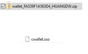
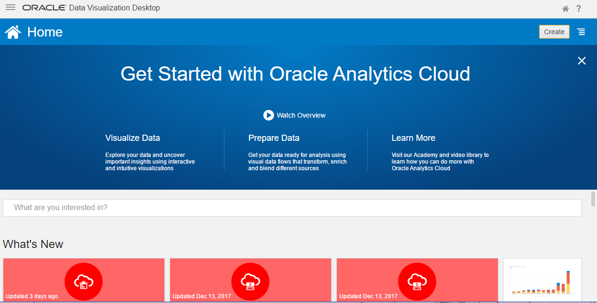
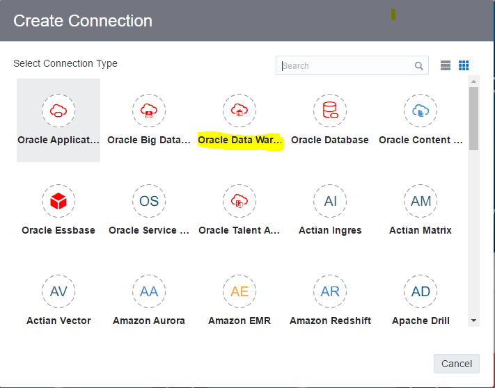
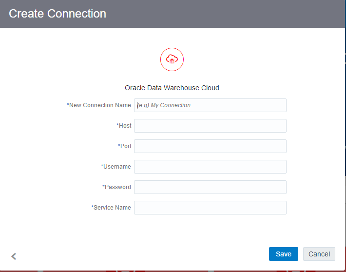
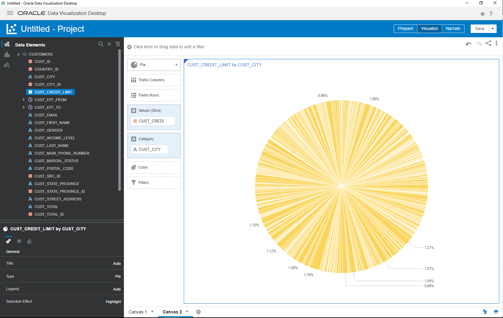

## Introduction

This is the fourth of several labs that are part of the **Oracle Autonomous Data Warehouse Cloud Service Workshop**. This workshop will walk you through the connection of ADWCS to Data Visualization Desktop. This lab will elaborate on how you can connect your already created ADWCS instance (which has data already loaded into data warehouse) to DVD and perform beautiful visualizations in DVD.

At this point, you should have performed the following:

1. Existing ADWCS instance: You should create and launch the ADWCS instance. Note down the details such as host, service name and port number of your instance. These details will be required when connecting to DVD, more on this later.

2. You have desired data loaded into your data warehouse, which will be used as the data source for connecting to DVD

***To log issues***, click here to go to the [github oracle](https://github.com/oracle/cloud-native-devops-workshop/issues/new) repository issue submission form.

## Objectives
- Creating ADWC Instance and Loading Data
- Set Up Local Environment
- Create New Data Visualization Desktop Connection
- Prepare Data Set and Create Visualization

## Required Artifacts
- The following lab requires an Oracle Public Cloud account that will be supplied by your instructor.

# STEP 1: Do you have the instance and data? 

## Creating ADWC Instance and Loading Data

At this stage you should have the ADWCS instance, up and running in the Oracle Pubic Cloud and data already loaded into your database in the data warehouse.

If you do not have the ADWCS instance and have not loaded the data yet, please refer and complete all the previous labs and then start here.

# STEP 2: Set Up Local Environment

Once you have the ADWCS instance up and running, you will have access to cwallet.sso file into C:\<YourPCUser>\AppData\Local\Temp\DVDesktop\bitmp\DWCS 

## Create New Data Visualization Desktop Connection 

### STEP 2.1

Start DVD Version 4, Click on "Create" on top right of window.

### STEP 2.2

Click on Connection Icon. In Create Connection window, search data warehouse and click on Oracle Data Warehouse.

### STEP 2.3

On this window, you will need information from the tnsnames.ora file in the ADWC wallet folder

### STEP 2.4

        New Connection Name: give name for instance
        Host: host name from tnsnames.ora for your service
        Post: port number from tnsnames.ora for your service
        Username: database admin username while creating ADWC instance
        Password: database admin password while creating ADWC instance

Find the service for you and copy the host, port, and service name to DVD 

For username and password, it will be your database’s username and password. So, save the username and password while creating the ADWC instance.

### STEP 2.5

Click on OK to save connection. If it says “Invalid Wallet file”, please follow step 2 to make sure the cwallet file is in the right folder. 

# STEP 3: Create Data Set and Create Visualization

Once the connection is saved, create a data set using that connection. 

In this window, you can either select the columns you would like to visualize or just enter in a SQL statement.
You can save the data set to create a new visualization project.

Now you have a visualization that is pulling data from ADWC! 

Wohoo!!

### You have now completed this lab
