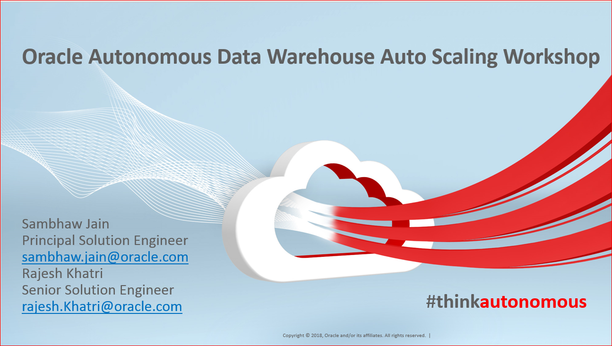

  

January 21, 2019

Version 1.0

you should follow the instructions available here: [Auto_Scale_ADW_Demo_Setup.md](Auto_Scale_ADW_Demo_Setup.md)

### Before you begin
#### Purpose
The purpose of this document is to help setting up the Autonomous data warehouse Auto scaling demo on your tenancy. This document covers systematic process to install the demo into any tenancy on oracle cloud.

Time to Complete
Approximately 180 minutes.

Topics covered in this document

**1. ADWCS Provisioning**

**2. DBaaS Provisioning**

**3. APEX and ORDS Installation**

**4. Auto Scaling Demo Installation**

### Notional Architecture

#### What Do You Need?
Before starting this instruction, you should:
-	Have already procured and activated a trial or paid subscription to the following cloud services.
-	Oracle Database Cloud - Database as a Service (DBaaS). Don't have a subscription? Go to Oracle Store or [Oracle Try It](https://cloud.oracle.com/database)
-	Capacity requirement 
-	**Minimum 2 OCPU for DBaaS 256GB of storage**
-	**Minimum 5 OCPU for Autonomous Data warehouse cloud and 1 TB of storage**
-	Subscription to Oracle Autonomous Data Warehouse
-	Your Oracle Cloud user name, password, and identity domain

locate your account details in the New Account Information email that you received from Oracle Cloud when your user account was set up. If you do not have your New Account Information email, contact your account administrator.
-	Tenancy in Oracle Cloud Infrastructure, including the creation of a compartment and the setting of access to resources (see Oracle Cloud Infrastructure documentation for setting up your tenancy).
-	Oracle SQL Developer (see Oracle Technology Network download site). Version 18.3 or later. Versions 18.2 or later contain enhancements for key Autonomous Data Warehouse features. 
Note:
If you are a Windows user on 64-bit platform, download the 'Windows 64-bit with JDK 8 included' distribution as it includes the files necessary to run SQL Developer and connect to your Autonomous Data Warehouse database. 

If you are using a SQL Developer version earlier than 18.2, see the documentation topic Connecting with Oracle SQL Developer (earlier than Version 18.2).
-	Have installed PuTTY for Windows. PuTTY is available from many sites, but you can reach the main download site [Download putty](http://www.putty.org)
-	Have installed the latest version of Oracle SQL Developer from [SQL Developer Download](http://www.oracle.com/technetwork/developer-tools/sql-developer/downloads/index.html)
-	Have one of the supported browsers:
1.	Microsoft Internet Explorer: version 9 or 10; set Browser Mode to IE9 or IE10
2.	Mozilla Firefox: version 24 and later
3.	Google Chrome: version 29 and later
4.	Apple Safari: version 6

