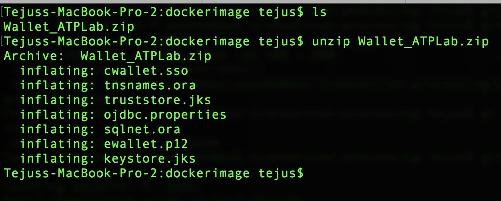

# Docker Image: Downloading and Using docker images for Autonomous Database workshops

## Introduction

Using pre-configured docker images to build applications on Oracle Autonomous Transaction Processing service.

To **log issues**, click [here](https://github.com/oracle/learning-library/issues/new) to go to the github oracle repository issue submission form.

## Pre-requisites

- A working docker installation on your local machine

#### Note: You may download the docker images by issuing the following docker commands from your local windows, mac or linux machines

```
docker pull pix.ocir.io/oradbclouducm/openworld/atpclient:slim
```

OR

```
docker pull pix.ocir.io/oradbclouducm/openworld/atpclient:medium
```

## Steps

### **STEP 1: Connecting to your ATP database using SQL*Plus**

- Provision an Autonomous Transaction Processing database

- Please follow instructions in **[Lab guide 100](LabGuide100ProvisionAnATPDatabase.md)** to provision an ATP database.

- Once you have successfully created ATP database download the connection wallet .zip file to a folder on your local host machine. Please refer to **[Lab guide 200](LabGuide200SecureConnectivityAndDataAccess.md)** **STEP 1: Download the secure connection wallet for your provisioned instance** how to download connection wallet .zip file.

Example:

For Mac user:

```
$ ~/wallet/Wallet_ATPLab.zip
```

Fow Windows user:

```
C:\wallet\Wallet_ATPLab.zip
```

- Unzip the wallet .zip file in the downloaded folder. 

Example:

```

cd ~/wallet/

unzip Wallet_ATPLab.zip
```



- Replace the default wallet folder location with env variable TNS_ADMIN

- Open ther Wallet_APTLab folder and edit sqlnet.ora as below

```
cd ~/wallet/

nano sqlnet.ora
```


```
WALLET_LOCATION = (SOURCE = (METHOD = file) (METHOD_DATA = (DIRECTORY=$TNS_ADMIN)))
SSL_SERVER_DN_MATCH=yes
```

- Launch a docker container using the following command while mounting the local /waller folder to the container volume **/opt/oracle/database/wallet**

```
$ docker run -i -p 3050:3050 -v ~/wallet:/opt/oracle/database/wallet -t  atpclient:slim
```

Note that the target folder on the container cannot be anything other than **/opt/oracle/database/wallet**. 

If the image does not exist in your local docker repository, it will be downloaded from docker hub.

- Once inside the docker container, you may then 

    - Instantly connect to your Autonomous Transaction Processing database using SQL *Plus

    ```
    $ sqlplus username/password@connectString
    ```
    **username**: admin

    **password**: Password you specified while creating ATP database

    **connectString**: yourdatabasename_high

### **STEP 2: Connecting to your ATP database using SQLCL**

Once inside the docker container, you may then 

    - Instantly connect to your Autonomous Transaction Processing database using SQLCL

    ```
    $ sql /nolog
    ```

- Once you are connected to SQL, set **cloudconfig** to your waller .zip file in the container.

```
SQL> set cloudconfig /opt/oracle/database/wallet/Wallet_ATPLab.zip
```

- SQL responds with message **Using temp directory:/tmp/oracle_cloud_config7810793155150074004**

- You may then connect with your database credentials

```
SQL > connect username/password@connectString
```

**username**: admin

**password**: Password you specified while creating ATP database

**connectString**: yourdatabasename_high


### **STEP 3: Connecting to your ATP database using OCI-CLI**

Similarly, to connect using SQL *Plus, simply launch it with your database credentials

```
$ sqlplus username/password@connectSting
```

To follow OCI Command Line Interface with your OCI cloud account credentials follow detailed step-by0step instructions in **[Lab guide 900](LabGuide900ConfigureOCI-CLI.md)**