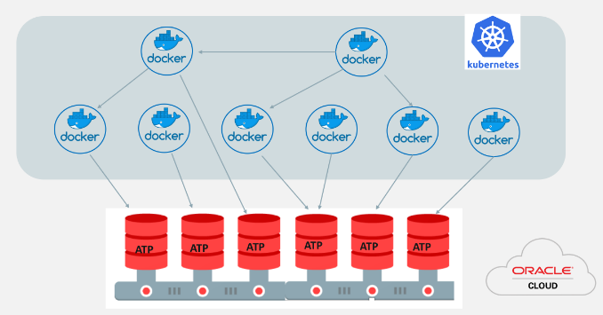
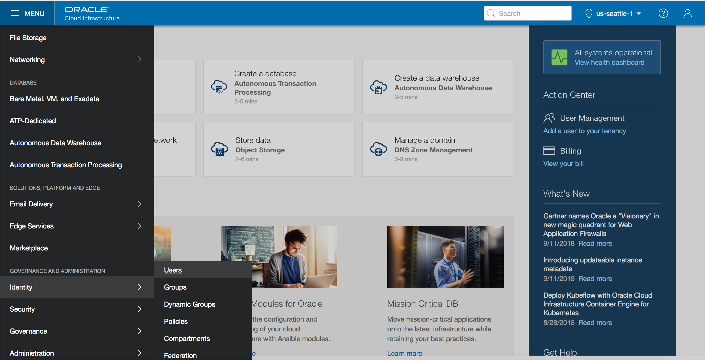
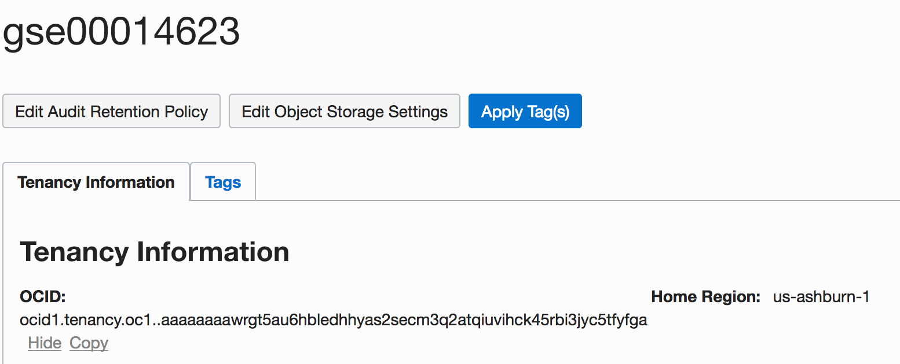
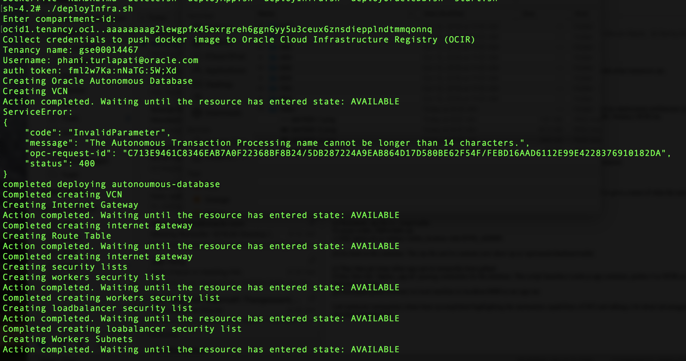

# Lab 1000: Using Kubernetes

## Introduction

A Kubernetes cluster is a group of nodes. The nodes are the machines running applications. Each node can be a physical machine or a virtual machine. The node's capacity (its number of CPUs and amount of memory) is defined when the node is created. A cluster can be organized into namespaces, to divide the cluster's resources between multiple uses.

- a master node (for high availability, typically there will actually be a number of master nodes)
- one or more worker nodes (sometimes known as minions)

The master node in a cluster runs a number of processes:

- kube-apiserver to support API operations via the Kubernetes command line tool (kubectl) and the REST API, and includes admissions controllers required for advanced Kubernetes operations
- kube-controller-manager to manage different Kubernetes components (for example, replication controller, endpoints controller, namespace controller, and serviceaccounts controller)
- kube-scheduler to control where in the cluster to run jobs
- etcd to store the cluster's configuration data

Each worker node runs two Kubernetes processes:

- kubelet to communicate with the master node
- kube-proxy to handle networking

Each worker node also runs the Docker runtime.




To **log issues**, click [here](https://github.com/cloudsolutionhubs/autonomous-transaction-processing/issues/new) to go to the github oracle repository issue submission form.

## Objectives

- To build a Kubernetes cluster in the Oracle Cloud running a node.js application
- Connect Node.js application to an ATP Database service running in the Oracle cloud

## Required Artifacts

-   The following lab requires an Oracle Public Cloud account. You may use your own cloud account, a cloud account that you obtained through a trial, or a training account whose details were given to you by an Oracle instructor.
- Docker installed on your local machine. If you do not have docker please follow this [Mac User link](https://docs.docker.com/docker-for-mac/install/), [Windows User link](https://docs.docker.com/docker-for-windows/install/) and install docker

## Steps

### **STEP 1: Pull the Docker image**

- First we will pull down the docker image using:


```
docker pull [OPTIONS] NAME[:TAG|@DIGEST]
```

- Second, we will create a directory which we will use later to place our wallet in. When running our docker image we will use the -v option to map the directory to the image and the image will be able to pick up the wallet information

```
mkdir -p ~/tmp/wallet
```

- Now we will launch the container using the image we just pulled.

Note: With this run command we are mapping the local directory ~/tmp/wallet/ to the directory in the image /opt/oracle/database/wallet

```
docker run -it -v ~/tmp/wallet:/opt/oracle/database/wallet -p 3050:3050 NAMEOFIMAGE sh
```


### **STEP 2: Setup OCI config**

- Once in the image we will setup OCI-CLI like we did in Lab900:

```
oci setup config
```

- The command prompts you for the information required for the config file and the API public/private keys. The setup dialog generates an API key pair and creates the config file.


- Once you run the above command, you will need to enter the following:

    - **Enter a location for your config [/Users/tejus/.oci/config]**: Press Return key
    - **Enter a user OCID**: This is located on your user information page in OCI console

    Login to OCI console and click on Menu, Identity and Users. Click on the User and navigate to User Details page. Copy the User OCID.

    

    


    - **Enter a tenancy OCID**: This is located in the bottom left of your OCI console
    
    Login to OCI console click on User icon on top right corner on the page and click on Tenancy and copy Tenancy OCID

    

    

    - **Enter a region (e.g. eu-frankfurt-1, uk-london-1, us-ashburn-1, us-phoenix-1)**: Select a region

    - **Do you want to generate a new RSA key pair? (If you decline you will be asked to supply the path to an existing key.) [Y/n]**: Y
    - **Enter a directory for your keys to be created [/Users/tejus/.oci]**: Press Return key
    - **Enter a name for your key [oci_api_key]**: Press Return key
    - **Enter a passphrase for your private key (empty for no passphrase)**: Press Return key
    

### **STEP 3: Deploy the Infratstructure**

- This step is entirely automated and only requires the user to add the compartment ID to deploy the infrastructure

```
./deployInfra.sh
```

- This will prompt you to enter the compartment ID of which to deploy the infrastructure. You can watch as everything is automatically setup for you



This process can take upwards of 10 minutes while everything is configured

- When it is over you will see a message like below:


### **STEP 4: Deploy the Node Application**

- First we will git clone the Node application named aOne to our container:

```
git clone https://github.com/cloudsolutionhubs/aOne-oow.git
```


- Second we .....


