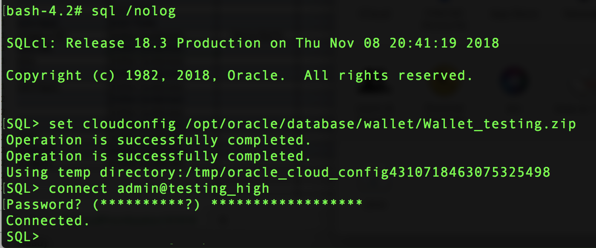
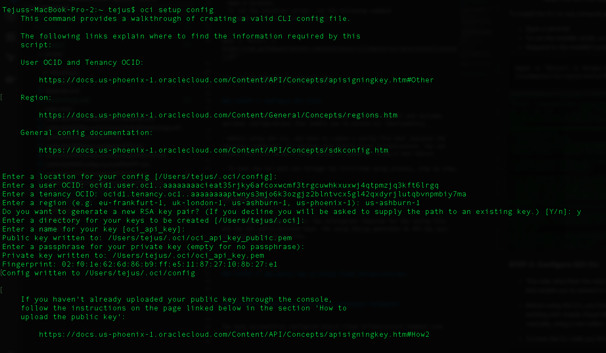
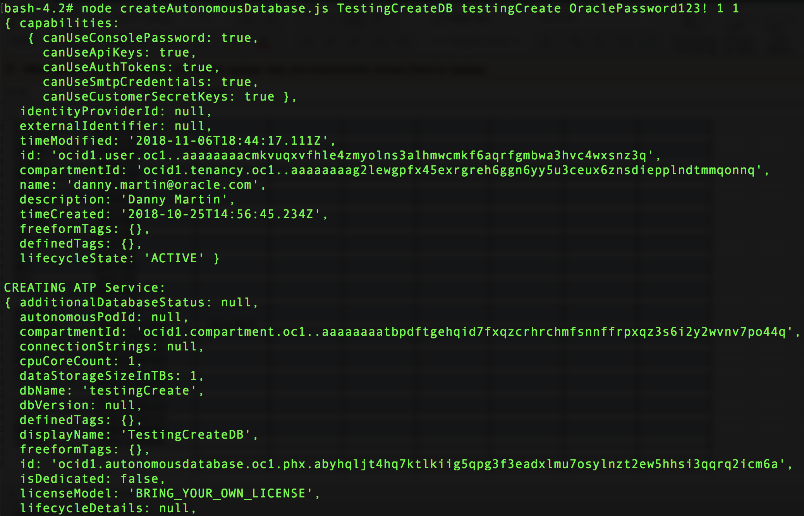

<table class="tbl-heading"><tr><td class="td-logo">

November 08, 2018
</td>
<td class="td-banner">
# Lab 11: Docker Images for instant connectivity to Oracle Autonomous Database
</td></tr><table>

# Rapid Application Development with Oracle Autonomous Database

Introduction about the image

To **log issues**, click [here](https://github.com/oracle/learning-library/issues/new) to go to the github Oracle repository issue submission form.

## Objectives

- Connect Oracle ATP to Python
- Connect Oracle ATP to Java
- Connect Oracle ATP to Node
- Utilize Terraform to control ATP
- Utilize OCI-CLI to control ATP

README files with usage directions and example scripts have been added to each language folder in the image and are also listed below.

## **Pull the Docker image**

- First we will pull down the docker image using:

```
docker pull phx.ocir.io/oradbclouducm/openworld/atpclient:full
```

- Second, we will create a directory which we will use later to place our wallet in. When running our docker image we will use the -v option to map the directory to the image and the image will be able to pick up the wallet information

```
mkdir -p ~/tmp/wallet
```

- Now we will launch the container using the image we just pulled.

Note: With this run command we are mapping the local directory ~/tmp/wallet/ to the directory in the image /opt/oracle/database/wallet.
This command also maps the port 3050 to your local machine port 3050 which will be used for the node application.

```
docker run -it -p 3050:3050 -v ~/tmp/wallet:/opt/oracle/database/wallet phx.ocir.io/oradbclouducm/openworld/atpclient:full /bin/bash
```


## **Get Started Connecting to ATP**

- Get started connecting to a database using SQL and SQLPLUS *if you have already created an ATP instance*. 

**Please make sure:**

- **You have downloaded your wallet of the database you created and placed the files in the local directory mapped to /opt/oracle/database/wallet in your container**

- **For SQL CL you will need the zip file in /opt/oracle/database/wallet**

SQL CL

```
sql /nolog
```

```
SQL> set cloudconfig /opt/oracle/database/wallet/Wallet_testing.zip
```

```
SQL> connect admin@testing_high
```



SQL PLUS

- Edit the sqlnet.ora file in /opt/oracle/database/wallet and change the line ?/network/admin:

Before:
```
WALLET_LOCATION = (SOURCE = (METHOD = file) (METHOD_DATA = (DIRECTORY="?/network/admin")))
SSL_SERVER_DN_MATCH=yes
```

After:
```
WALLET_LOCATION = (SOURCE = (METHOD = file) (METHOD_DATA = (DIRECTORY="/opt/oracle/database/wallet")))
SSL_SERVER_DN_MATCH=yes
```

- Now, run:

```
sqlplus admin@testing_high
```


## **Setup OCI config**

- Once in the image we will setup OCI-CLI like we did in [Lab900](https://cloudsolutionhubs.github.io/autonomous-transaction-processing/workshops/autonomous-transaction-processing/?page=LabGuide900ConfigureOCI-CLI.md):

```
oci setup config
```

- The command prompts you for the information required for the config file and the API public/private keys. The setup dialog generates an API key pair and creates the config file.




- Once you run the above command, you will need to enter the following:

    - **Enter a location for your config [/Users/tejus/.oci/config]**: Press Return key
    - **Enter a user OCID**: This is located on your user information page in OCI console

    Login to OCI console and click on Menu, Identity and Users. Click on the User and navigate to User Details page. Copy the User OCID.

    

    


    - **Enter a tenancy OCID**: This is located in the bottom left of your OCI console
    
    Login to OCI console click on User icon on top right corner on the page and click on Tenancy and copy Tenancy OCID

    

    

    - **Enter a region (e.g. eu-frankfurt-1, uk-london-1, us-ashburn-1, us-phoenix-1)**: Select a region

    - **Do you want to generate a new RSA key pair? (If you decline you will be asked to supply the path to an existing key.) [Y/n]**: Y
    - **Enter a directory for your keys to be created [/Users/tejus/.oci]**: Press Return key
    - **Enter a name for your key [oci_api_key]**: Press Return key
    - **Enter a passphrase for your private key (empty for no passphrase)**: Press Return key
  
## OCI CLI

These commands can be used anywhere as long as you have run `oci setup config` 

-   Example scripts can be found in **/opt/oracle/tools/oci**

-   Here is a list of several OCI commands with their **required** options:

**Creating Database**
```

oci db autonomous-database create --admin-password [password] --compartment-id [OCID] --cpu-core-count [integer] --data-storage-size-in-tbs [integer] --db-name [Database Name]

```

**Deleting Database**
```

 oci db autonomous-database delete --autonomous-database-id [OCID]

```

**Get Database**
```

oci db autonomous-database get --autonomous-database-id [OCID]

```

**Listing Databases**
```

oci db autonomous-database list --compartment-id [OCID]

```

**Restore Database**
```

oci db autonomous-database restore --autonomous-database-id [OCID] --timestamp [datetime]

```

**Start Database**
```

oci db autonomous-database start --autonomous-database-id [OCID]

```

**Stop Database**
```

oci db autonomous-database stop --autonomous-database-id [OCID]

```

**Update Database**
```

oci db autonomous-database update --autonomous-database-id [OCID] --cpu-core-count [integer]

```

## Python

These scripts are intended to help any python developer get started connecting to Oracle Autonomous Database, as well as easily creating, updating, restoring, starting, stopping, etc. Follow the instructions to use the scripts already created here. Feel free to go into the code and learn for yourself as you get started.

### Getting Started

Assuming you have setup oci using ```oci setup config``` change directories to /opt/oracle/tools/python/ and you will see two directories **sdk** and **apps**

- **Edit your /root/.oci/config file and add the compartmentid line at the bottom like so**:


### **APPLICATION EXAMPLE**:

- /opt/oracle/tools/python/apps

In this simple python application, we are connecting to an existing ATP database, creating a table, and loading in the data from sales.csv into the table. We then do a simple query of that data and output that we are connected to the database

**Please make sure:**

- **You have downloaded your wallet of the database you created and placed the files in the local directory mapped to /opt/oracle/database/wallet in your container**

- **You have edited /root/.oci/config to point to the correct compartmentid where the database is located**

- Edit the sqlnet.ora file in /opt/oracle/database/wallet and change the line ?/network/admin: 

Before:
```
WALLET_LOCATION = (SOURCE = (METHOD = file) (METHOD_DATA = (DIRECTORY="?/network/admin")))
SSL_SERVER_DN_MATCH=yes
```

After:
```
WALLET_LOCATION = (SOURCE = (METHOD = file) (METHOD_DATA = (DIRECTORY="/opt/oracle/database/wallet")))
SSL_SERVER_DN_MATCH=yes
```

- Now you can run all applications

```
python exampleConnection.py ADMIN OraclePassword123! salesdb_low
```


### **SDK EXAMPLES**:

- /opt/oracle/tools/python/sdk

In the scripts below we are utilizing python's sdk Signer function and the REST APIs available to create, update, access, etc. in regards to Autonomous Transaction Processing.

**Create Database**

```

args: DBNAME DISPLAYNAME PASSWORD CPUCOUNT STORAGEINTBS

python createAutonomousDatabase.py salesDatabase salesDB OraclePassword123! 2 3

```


**Delete Database**

```

python deleteAutonomousDatabase.py ocid1.autonomousdatabase.oc1.iad.abuwcljss3jw6ch4phusrfjsz2g3ly2ymjvldaex5acg6gy5mwp3zhfxcfra

```

**Get Database**

```

python getAutonomousDatabase.py ocid1.autonomousdatabase.oc1.iad.abuwcljss3jw6ch4phusrfjsz2g3ly2ymjvldaex5acg6gy5mwp3zhfxcfra

```

**List Database**

```

python listAutonomousDatabase.py

```

**Start Database**

```

python startAutonomousDatabase.py ocid1.autonomousdatabase.oc1.iad.abuwcljss3jw6ch4phusrfjsz2g3ly2ymjvldaex5acg6gy5mwp3zhfxcfra

```

**Stop Database**

```

python stopAutonomousDatabase.py ocid1.autonomousdatabase.oc1.iad.abuwcljss3jw6ch4phusrfjsz2g3ly2ymjvldaex5acg6gy5mwp3zhfxcfra

```

**Update Database**

```

python updateAutonomousDatabase.py ocid1.autonomousdatabase.oc1.iad.abuwcljss3jw6ch4phusrfjsz2g3ly2ymjvldaex5acg6gy5mwp3zhfxcfra cpuCoreCount storageSizeInTBs

```

**Restore Database**

```

python restoreAutonomousDatabase.py ocid1.autonomousdatabase.oc1.iad.abuwcljss3jw6ch4phusrfjsz2g3ly2ymjvldaex5acg6gy5mwp3zhfxcfra timestamp

```

## **Java**

These scripts are intended to help any java developer get started connecting to Oracle Autonomous Database, as well as easily creating, updating, restoring, starting, stopping, etc. 

### Script Examples

The scripts have been added to the classpath to make demoing the functionality easier. For these scripts you can be anywhere within the image

listed as `COMMAND [-h for help] [arg_1 arg_2 ...]` 

```

createAutonomousDatabase DBNAME DISPLAYNAME PASSWORD CPUCOUNT STORAGEINTBS

```

```

deleteAutonomousDatabase DBOCID

```

```

getAutonomousDatabase DBOCID

```

```

listAutonomousDatabases

```

```

startAutonomousDatabase DBOCID

```

```

stopAutonomousDatabase DBOCID

```

```

updateAutonomousDatabase CPUCount StorageInTBs DBOCID

```

### Application

**Please make sure:**

- **You have downloaded your wallet of the database you created and placed the files in the local directory mapped to /opt/oracle/database/wallet in your container**

- **You have edited /root/.oci/config to point to the correct compartmentid where the database is located**

- Edit the sqlnet.ora file in /opt/oracle/database/wallet and change the line ?/network/admin:

Before:
```
WALLET_LOCATION = (SOURCE = (METHOD = file) (METHOD_DATA = (DIRECTORY="?/network/admin")))
SSL_SERVER_DN_MATCH=yes
```

After:
```
WALLET_LOCATION = (SOURCE = (METHOD = file) (METHOD_DATA = (DIRECTORY="/opt/oracle/database/wallet")))
SSL_SERVER_DN_MATCH=yes
```

- Now you can connect with applications

To connect to your ATP database for building an application you can test with:

```

ATPConnectionTest DB_USER DB_PASSWD WALLET_DIR -sn service-name

```


`ATPConnectionTest` can also be called directly 
if you include a file, `db.config`, like
```text
 DB_USER=admin
 DB_PASSWD=Welcome123456!
 WALLET_DIR=/opt/oracle/database/wallet
```
to do this either place the db.config file in the `target` folder
or specify the file location like this 
```bash
ATPConnectionText -c /tmp/db.config
```

-   Please ensure that you have moved your wallet into the correctly mapped directory

### Building 

-   For your reference:

Uses 
- JDK 1.8+
- Maven 3.5
- [Java SDK from GitHub](https://github.com/oracle/oci-java-sdk/releases)
- [JDBC for Oracle Database](https://www.oracle.com/technetwork/database/application-development/jdbc/downloads/index.html)
- [Picocli](https://picocli.info/)

```bash
# you will have to download most deps 
# and place them in the ${BASEDIR}/lib folder
# install the rest
mvn install 

# make that jar
mvn package
```


## NODE.JS

These scripts are intended to help any nodejs developer get started connecting to Oracle Autonomous Database, as well as easily creating, updating, restoring, starting, stopping, etc. Follow the instructions to use the scripts already created here. Feel free to go into the code and learn for yourself as you get started.

### Getting Started

Assuming you have setup oci using ```oci setup config``` change directories to /opt/oracle/tools/python/ and you will see two directories **sdk** and **apps**

- Edit your /root/.oci/config file and add the compartmentid line at the bottom like so:


### **APPLICATION EXAMPLE**:

- /opt/oracle/tools/nodejs/apps

In this simple node application we are connecting to the database 

**Please make sure:**

- **You have downloaded your wallet of the database you created and placed the files in the local directory mapped to /opt/oracle/database/wallet in your container**

- **You have edited /root/.oci/config to point to the correct compartmentid where the database is located**

- Edit the sqlnet.ora file in /opt/oracle/database/wallet and change the line ?/network/admin:

Before:
```
WALLET_LOCATION = (SOURCE = (METHOD = file) (METHOD_DATA = (DIRECTORY="?/network/admin")))
SSL_SERVER_DN_MATCH=yes
```

After:
```
WALLET_LOCATION = (SOURCE = (METHOD = file) (METHOD_DATA = (DIRECTORY="/opt/oracle/database/wallet")))
SSL_SERVER_DN_MATCH=yes
```

- Now you can run all applications

-   Edit the dbconfig.js file to properly have the correct user, password, and connection string

-   Run:
```
node server.js
```


### **SDK EXAMPLES**:

- /opt/oracle/tools/nodejs/sdk

**Create Database**

```

args: DBNAME DISPLAYNAME PASSWORD CPUCOUNT STORAGEINTBS

node createAutonomousDatabase.js salesDatabase salesDB OraclePassword123! 2 3

```




**Delete Database**

```

node deleteAutonomousDatabase.js ocid1.autonomousdatabase.oc1.iad.abuwcljss3jw6ch4phusrfjsz2g3ly2ymjvldaex5acg6gy5mwp3zhfxcfra

```

**Get Database**

```

node getAutonomousDatabase.js ocid1.autonomousdatabase.oc1.iad.abuwcljss3jw6ch4phusrfjsz2g3ly2ymjvldaex5acg6gy5mwp3zhfxcfra

```

**List Database**

```

node listAutonomousDatabase.js

```

**Start Database**

```

node startAutonomousDatabase.js ocid1.autonomousdatabase.oc1.iad.abuwcljss3jw6ch4phusrfjsz2g3ly2ymjvldaex5acg6gy5mwp3zhfxcfra

```

**Stop Database**

```

node stopAutonomousDatabase.js ocid1.autonomousdatabase.oc1.iad.abuwcljss3jw6ch4phusrfjsz2g3ly2ymjvldaex5acg6gy5mwp3zhfxcfra

```

**Update Database**

```

node updateAutonomousDatabase.js ocid1.autonomousdatabase.oc1.iad.abuwcljss3jw6ch4phusrfjsz2g3ly2ymjvldaex5acg6gy5mwp3zhfxcfra cpuCoreCount storageSizeInTBs

```

**Restore Database**

```

node restoreAutonomousDatabase.js ocid1.autonomousdatabase.oc1.iad.abuwcljss3jw6ch4phusrfjsz2g3ly2ymjvldaex5acg6gy5mwp3zhfxcfra timestamp

```

## Terraform

### About / Setup
Utilize Terraform to create and destroy your ATP instances

- Please set your environment variables with the below command:

```
source /opt/oracle/tools/terraform/env-vars.sh
```


### Example Scripts 
These scripts are very simple and do all the work for you. 

- Enter the /opt/oracle/tools/terraform directory and run:

```
terraform init
```

- Follow the instructions after running **terraform apply** and your database will create with the parameters entered

```
bash-4.2# terraform apply
var.autonomous_database_cpu_core_count
  Enter a value: 1

var.autonomous_database_data_storage_size_in_tbs
  Enter a value: 1

var.autonomous_database_db_name
  Enter a value: DBNAME

var.autonomous_database_display_name
  Enter a value: dannysDB
```

- The password to your database will be output after it has finished creating. The user is ADMIN

- To destroy the database created:

```
terraform destroy
```

- To update the database created, simply run terraform apply again and you can update the CPU Count and the data storage in TBs as well as the display name with the prompts.

### List directory

- Enter the `/opt/oracle/tools/terraform/list` directory and run:

```
source /opt/oracle/tools/terraform/list/env-vars.sh
```

```
terraform init
```

```
terraform apply
```

And now you will see all the database instances in the given compartment

### Backup

- Enter the `/opt/oracle/tools/terraform/backup` directory and run:

```
source /opt/oracle/tools/terraform/backup/env-vars.sh
```
Enter the database OCID you would like to backup

```
terraform init
```

```
terraform apply
```

And now your database will run a backup

### Get Database details

- Enter the `/opt/oracle/tools/terraform/getATP` directory and run:

```
source /opt/oracle/tools/terraform/getATP/env-vars.sh
```
Enter the database OCID for which you would like to view the details

```
terraform init
```

```
terraform apply
```

And now several details of that database will be displayed


## **More Information**:

- [Autonomous Database REST API Information](https://docs.cloud.oracle.com/iaas/api/#/en/database/20160918/AutonomousDatabase/)

