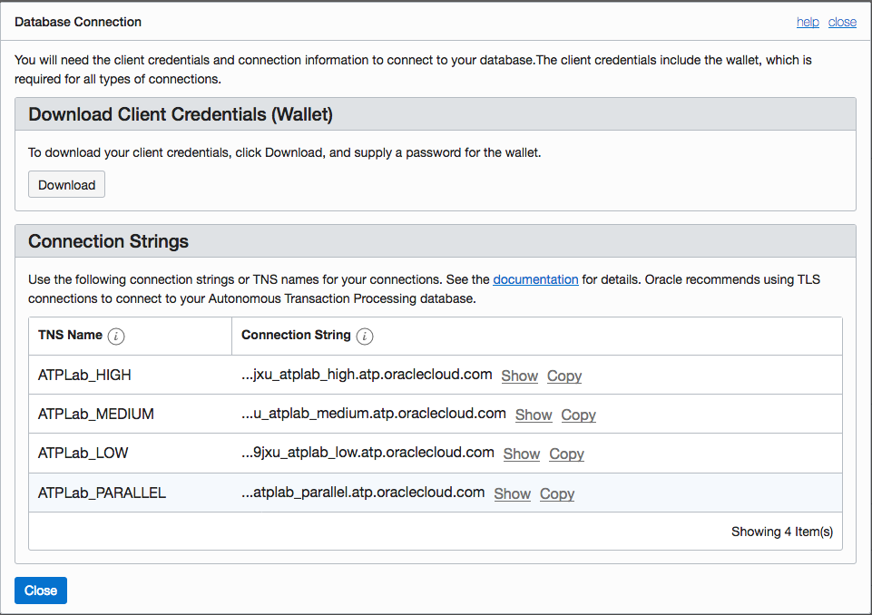
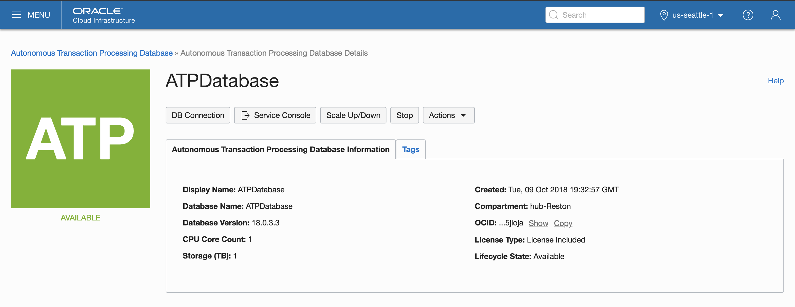
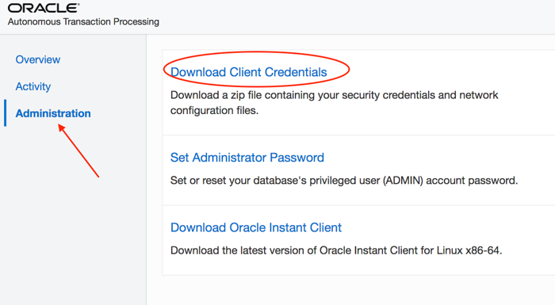
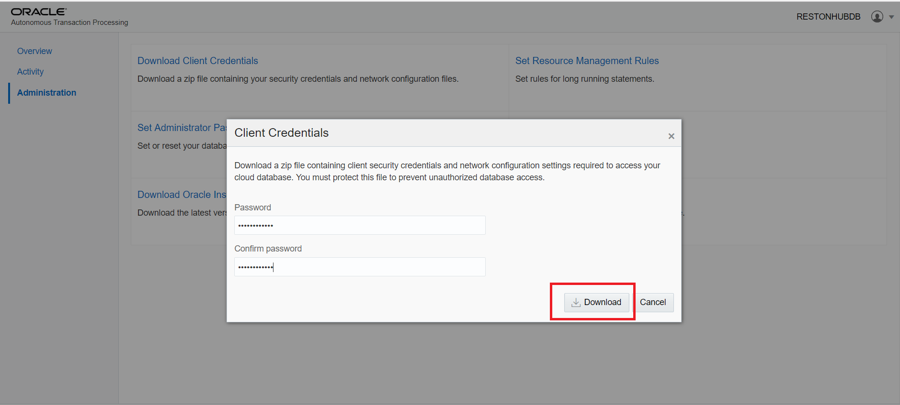
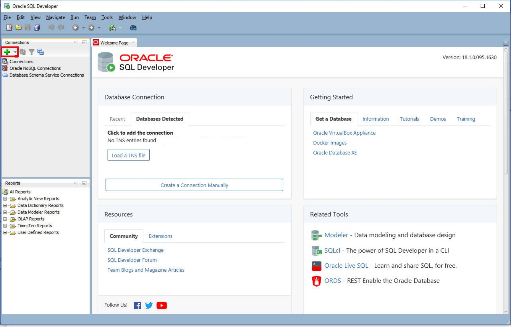

# Lab 200: Secure Connectivity and Data Access

## Introduction

Autonomous Transaction Processing provides all of the performance of the market-leading Oracle Database in an environment that is tuned and optimized for transaction processing workloads. Oracle Autonomous Transaction Processing ( or ATP ) service provisions in a few minutes and requires  very little manual ongoing administration.

In this lab we will configure a secure connection using Oracle SQL Developer.

To **log issues**, click [here](https://github.com/oracle/learning-library/issues/new) to go to the github oracle repository issue submission form.

## Objectives

- Learn how to configure a secure connection using Oracle SQL Developer

## Required Artifacts

- Please ensure you are connected to your cloud account and have provisioned an ATP instance. Refer <a href="./LabGuide100ProvisionAnATPDatabase.md" target="_blank">here</a> on how provision an ATP database.


## Steps

### **STEP 1: Download the secure connection wallet for your provisioned instance**

- Log into your cloud account using your tenant name, username and password.

- On the ATP console, select your ATP instance provisioned in <a href="./LabGuide100ProvisionAnATPDatabase.md" target="_blank">LabGuide100ProvisionAnATPDatabase.md</a>.


- Click Service Console button and provide username (admin) and password (WElcome_123#) and click on Sign in.




- Once you sign in you will be navigated to ATP overview page



- From the Admin panel, select ‘Download Client Credentials’. Provide a keystore password and download the file to your local machine. You will need this file and keystore password to connect to the database later.



#### Please use below Keystore password to download the client credentials
```
WElcome_123#
```



- The credentials zip file contains the encryption wallet, Java keystore and other relevant files to make a secure TLS 1.2 connection to your database from client applications. Store this file in a secure location.

### **STEP 2: Connect to ATP instance using Oracle SQL Developer**

- Launch SQL Developer from tbe desktop and click Add Connection on top left.



Enter the following in New database connection

**Connection Name**: Name for your connection

**Username**: admin

**Password**: WElcome_123#

**Connection Type**: Cloud PDB

**Role**: Default

**Configuration File**: Click on Browse and select the wallet file you downloaded

**Service**: 'databasename_high' Database name followed by suffix low, medium or high. These suffixes determine degree of parallelism used and are relevant for a DSS workload. For OLTP workloads it's safe to select any of them.


- Test your connection and save. The **Status** bar will show **Success** if it is a successful connection.


Click on **Connect**. You now have a secure connection to your cloud database.


You now have connected your Autonomous Transaction Processing Cloud instance to Oracle SQL Developer.