# Lab 400: Data Loading into ATP
## Introduction

In this lab, you will be uploading files to the Oracle Cloud Infrastructure (OCI) Object Storage, creating sample tables, loading data into them from files on the OCI Object Storage.

You can load data into Autonomous Transaction Processig Database using Oracle Database tools, and Oracle and 3rd party data integration tools.

You can load data:
- From files local to your client computer
- From files stored in a cloud-based object store

For the fastest data loading experience Oracle recommends uploading the source files to a cloud-based object store, such as Oracle Cloud Infrastructure Object Storage, before loading the data into your Autonomous Transaction Processing Database.

To load data from files in the cloud into your Autonomous Transaction Processing database, use the new PL/SQL DBMS_CLOUD package. The DBMS_CLOUD package supports loading data files from the following Cloud sources: Oracle Cloud Infrastructure Object Storage, Oracle Cloud Infrastructure Object Storage Classic, and Amazon AWS S3.

This lab shows how to load data from Oracle Cloud Infrastructure Object Storage using two of the procedures in the DBMS_CLOUD package:

- Create_credential: Stores the object store credentials in your Autonomous Transaction Processing database schema.
- You will use this procedure to create object store credentials in your ATP admin schema.
- You will use this procedure to load tables in your admin schema with data from data files staged in the Oracle Cloud Infrastructure Object Storage cloud service.

To **log issues**, click [here](https://github.com/oracle/learning-library/issues/new) to go to the github oracle repository issue submission form.

## Objectives

- Learn how to use the SQL Developer Data Import Wizard
- Learn how to upload files to the OCI Object Storage
- Learn how to define object store credentials for ATP
- Learn how to create tables in your database
- Learn how to load data from the Object Store

## Required Artifacts

- Please ensure you are connected to your cloud account and have provisioned an ATP instance. Refer <a href="./LabGuide100ProvisionAnATPDatabase.md" target="_blank">LabGuide100ProvisionAnATPDatabase.md</a>
- You have installed Oracle SQL Developer

## Steps

### **STEP 1: Download the sample data files to your local computer**

- For this lab, you will need a handful of data files.  Click <a href="./files/datafiles.zip" target="_blank">here</a> to download a zipfile of the 2 sample data files for you to upload to the object store. Unzip it to a directory on your local computer.

You will see:
- Customer data: **customers.csv**
- Channel data: **channels.csv**

### **STEP 2: Create target tables for data loading**

- Connected as your user in SQL Developer, copy and paste <a href="./scripts/300/create_tables.txt" target="_blank">this code snippet</a> to SQL Developer worksheet. Take a moment to examine the script. Then click the **Run Script** button to run it.

 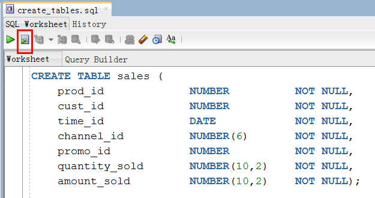

 -   If you want, you can compare your output to <a href="./scripts/300/create_tables_output.txt" target="_blank">this expected output.</a>  It is expected that you may get ORA-00942 errors during the DROP TABLE commands, but you should not see any other errors.

 Note that you do not need to specify anything other than the list of columns when creating tables in the SQL scripts. You can use primary keys and foreign keys if you want, but they are not required.

### **STEP 3: Loading Data using the Data import wizard in SQL Developer**

- Expand ‘**Tables**’ in your user schema object tree. If you don't see any tables, click on the refresh icon (two curved arrows) to refresh the table list.  You will see all the tables you have created previously. Select table **CHANNELS**. Clicking the right mouse button opens the context-sensitive menu in SQL Developer; select ‘**Import Data**’:

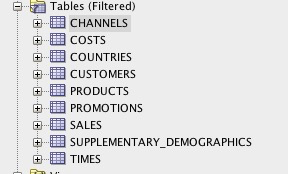

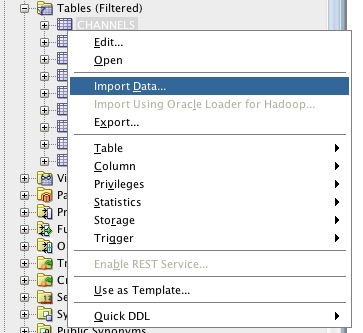

- The Data Import Wizard is started. Enter the following information:

    - Select **Local File** as source for the data load

    - Click the browse button and navigate to the channels.csv file (you extracted this file from the zip file you downloaded at the start of this lab).

After entering this information, you can preview the data and select the appropriate file formats. You will see that the data preview is interactive and changes according to your selection.

When you are satisfied with the file content view, click **NEXT**.

- On Step 2 of the Import Wizard, you control the import method and parameters. Leave the Import Method as **Insert**. Click **NEXT**.

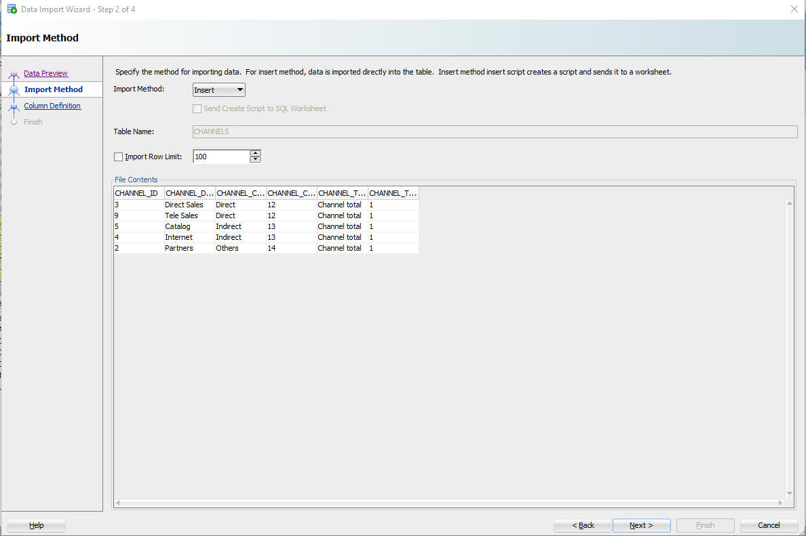

- The Choose Columns screen lets you select the columns you want to import. Leave the defaults and click **NEXT**.

- The column definition screen shows you whether the sample data violates any of the existing column definitions of table CHANNELS (for a load into a new table you would select the column names and data types for the new table). Click **NEXT**.

- The final screen reflects all your choices made in the Wizard. Click **FINISH** to load the data into table CHANNELS.

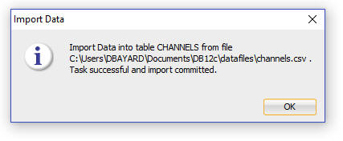

### **STEP 4: Setup the OCI Object Store**

- Login to your Oracle Cloud Infrastructure console.

- Click on **Menu** then Object Storage and selct Object Storage

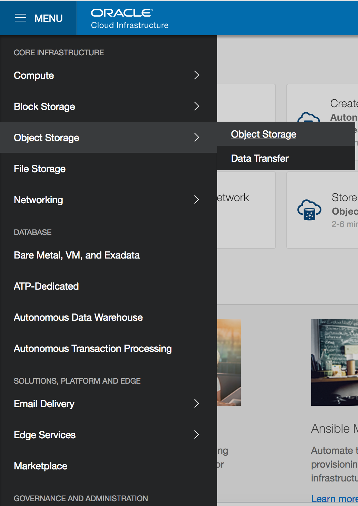

#### In order to create a New Bucket in Object Storage we need to select a Compartment from List Scope.

- Choose the Demo compartment in the **COMPARTMENT** drop-down if it is not already choosen.

- Create a Bucket for the Object Storage

In OCI Object Storage, a bucket is the terminology for a container of multiple files.

- Click the **Create Bucket** button:

 - **Name your bucket**

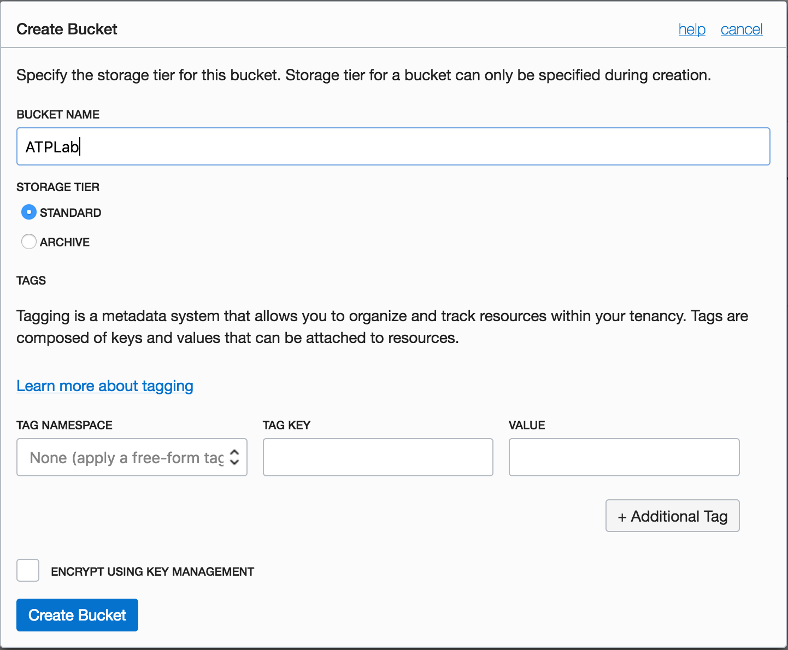

Oracle Cloud Infrastructure offers two distinct storage class tiers to address the need for both performant, frequently accessed "hot" storage, as well as less frequently accessed "cold" storage. Storage tiers help you maximize performance where appropriate and minimize costs where possible.

Use **Object Storage** for data to which you need fast, immediate, and frequent access. Data accessibility and performance justifies a higher price point to store data in the Object Storage tier.

Use **Archive Storage** for data to which you seldom or rarely access, but that must be retained and preserved for long periods of time. The cost efficiency of the Archive Storage tier offsets the long lead time required to access the data. For more information, see Overview of [Archive Storage](https://docs.cloud.oracle.com/iaas/Content/Archive/Concepts/archivestorageoverview.htm).

You have an option to **Encrypt using Key Management**. Oracle Cloud Infrastructure Key Management provides you with centralized management of the encryption of your data. You can use Key Management to create master encryption keys and data encryption keys, rotate keys to generate new cryptographic material, enable or disable keys for use in cryptographic operations, assign keys to resources, and use keys for encryption and decryption.

 You can find more details on Key Management [here](https://docs.cloud.oracle.com/iaas/Content/KeyManagement/Concepts/keyoverview.htm).

 For this workshop please do not checking **Encrypt using Key Management**.

- Click **Create Bucket** button to create the bucket in Demo Compartment

To learn more about the OCI Object Storage, check out this <a href="https://docs.us-phoenix-1.oraclecloud.com/Content/GSG/Tasks/addingbuckets.htm" target="_blank">documentation</a> .

Upload File to your OCI Object Store Bucket

- Click on your **bucket name** to open it:

- Click on the **Upload Object** button:

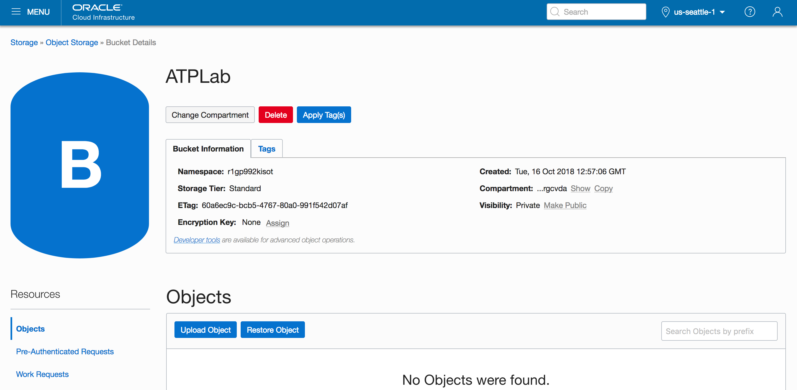

- Using the browse button or drag-and-drop select the **customers.csv** file you downloaded earlier and click Upload Object:

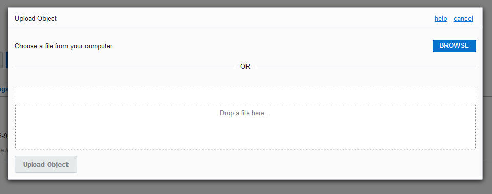

- The end result should look like this with customers.csv files listed under Objects:

- Construct the URL of the File on your OCI Object Storage

Construct the URL that points to the location of the customers.csv file staged in the OCI Object Storage. The URL is structured as follows. The values for you to specify are in bold:

 https://swiftobjectstorage.<**region_name**>.oraclecloud.com/v1/<**tenant_name**>/<**bucket_name**>/<**file_name**>

 #### region_name: Type in the region you have created your Object storage in.
 #### tenant_name: Type in your tenancy name.
 #### bucket_name: Type in your bucket name which you created in Object Storage.
 #### file_name: customers.csv

 In the belwo example of constructed URL, the region name is us-seattle-1, the tenant name is r1atpdemo6, and the bucket name is ATPLab. So the URL of the customers.csv file is:
 
 https://swiftobjectstorage.us-seattle-1.oraclecloud.com/v1/r1atpdemo6/ATPLab/customers.csv
 
 Yours would be different, please change the above mentioned details and save your URL.

 

- **Save** the URL you constructed to a note. We will use the URL in the following steps.

#### Creating an Object Store Auth Token

To load data from the Oracle Cloud Infrastructure(OCI) Object Storage you will need an OCI user with the appropriate privileges to read data (or upload) data to the Object Store. The communication between the database and the object store relies on the Swift protocol and the OCI user Auth Token.

- Go back to the **OCI Console** in your browser. In the top menu, click the **Identity**, and then click **Users**. 
    

-   Click the **user's name** to view the details.  Also, remember the username as you will need that in the next step.

For this lab we will be using admin user.

-   On the left side of the page, click **Auth Tokens**.

    

-   Click **Generate Token**.

    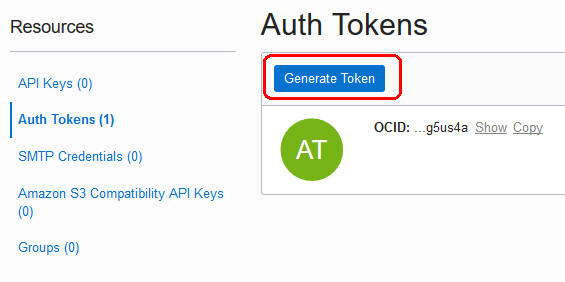

-   Enter a friendly **description** for the token and click **Generate Token**.

    

-   The new Auth Token is displayed. Click **Copy** to copy the Auth Token to the clipboard. Save this in a temporary notepad document for the next few minutes (you'll use it in the next step). **You can't retrieve the Auth Token again after closing the dialog box**.

    

#### Create a Database Credentials for your User

In order to access data in the Object Store you have to enable your database user to authenticate itself with the Object Store using your OCI object store account and Auth token. You do this by creating a private CREDENTIAL object for your user that stores this information encrypted in your Autonomous Transaction Processing. This information is only usable for your user schema.

-   Connected as your user in SQL Developer, copy and paste <a href="./scripts/300/create_credential.txt" target="_blank">this code snippet</a> to SQL Developer worksheet.

Specify the credentials for your Oracle Cloud Infrastructure Object Storage service: The username will be the **OCI username** (in our case it is **your email address**) and the OCI object store **Auth Token** you generated in the previous step.  In this example, the crediential object named **OBJ\_STORE\_CRED** is created. You reference this credential name in the following steps.

 

<!-- -->

-    Run the script. 

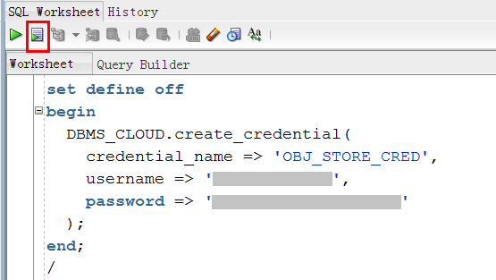

- Verify the script output. 

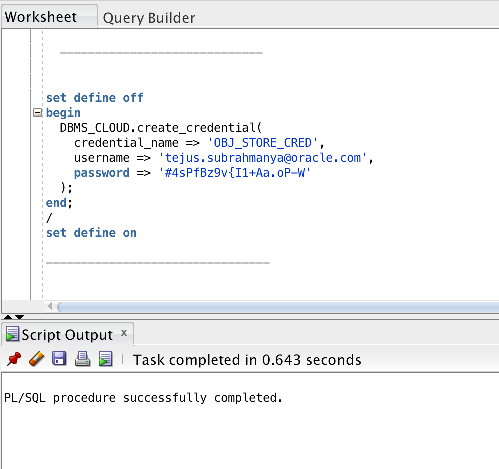

- Now you are ready to load data from the Object Store.

### **STEP 5: Load data from the Object Storage using DBMS_CLOUD**

 You can use the PL/SQL package DBMS_CLOUD directly to load the data from object store. This is the preferred choice for any load automation.

 - Connect as your user in SQL Developer, copy and paste <a href="./scripts/300/load_data.txt" target="_blank">this code snippet</a> to SQL Developer worksheet. We use the **copy\_data** procedure of the **DBMS\_CLOUD** package to copy the data (customers.csv) staged in your object store.

 - At the top of the script, specify the Object Store base URL in the definition of the **base\_URL** variable. You have constructed and saved the URL in the step "Construct the URLs of the Files on Your OCI Object Storage".

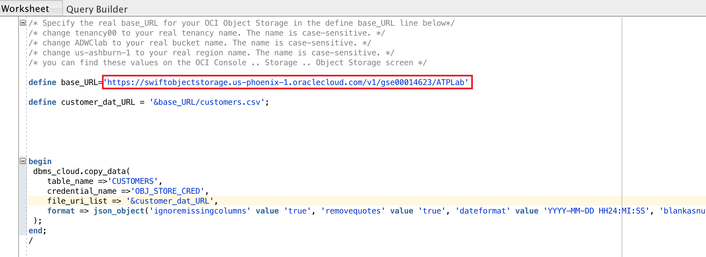

- For the **credential_name** parameter in the **copy\_data** procedure, it is the name of the credential you defined in the step "Create a Database Credential for Your User".  You probably don't need to change this.

-  For the **format** parameter, it is a list of DBMS_CLOUD options (which are documented <a href="https://docs.oracle.com/en/cloud/paas/autonomous-data-warehouse-cloud/user/dbmscloud-reference.html">here</a>).

- Run the script and verify Script output. 

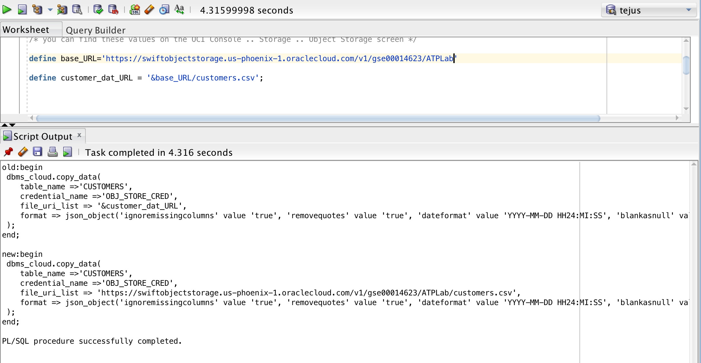

- Verify the data by clicking on CUSTOMERS table and Data tab in SQL Developer.

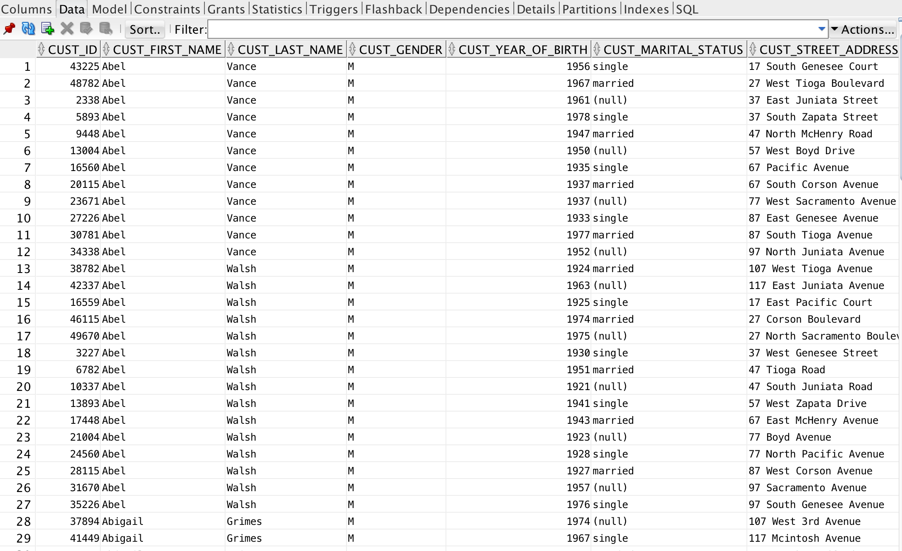

You have successfully loaded the sample data from Object storage to customers table using DBMS_CLOUD.