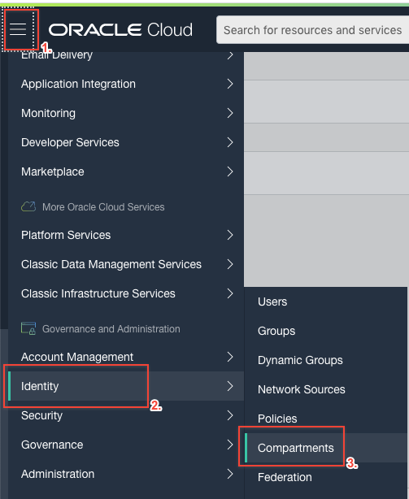
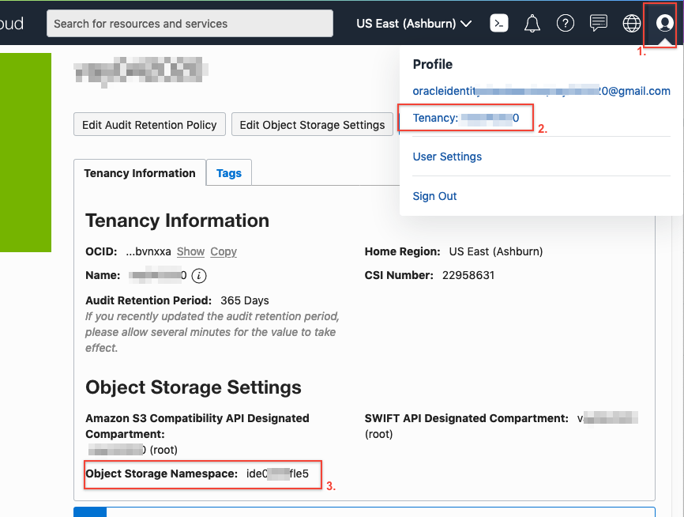
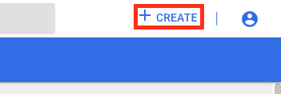
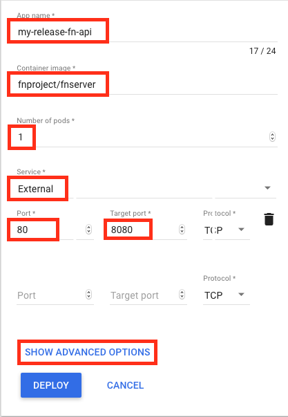
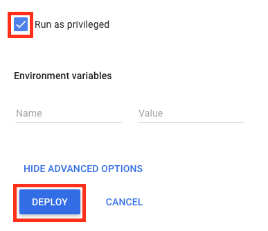
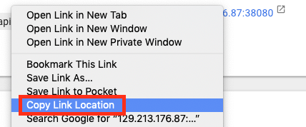
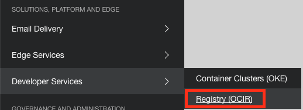
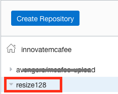
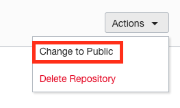

  

## Introduction

This is the fifth lab that is part of the **Oracle Public Cloud Container Native Development workshop.** This workshop will walk you through the process of moving an existing application into a containerized CI/CD pipeline and deploying it to a Kubernetes cluster in the Oracle Public Cloud.

You will take on 2 personas during the workshop. The **Lead Developer Persona** will be responsible for configuring the parts of the automated build and deploy process that involve details about the application itself. The **DevOps Engineer Persona** will configure the parts of the automation involving the Kubernetes infrastructure. To containerize and automate the building and deploying of this application you will make use of Wercker Pipelines for CI/CD, OCI Registry for a container registry, and OCI Container Engine for Kubernetes for provisioning a Kubernetes cluster on Oracle Cloud Infrastructure.

During this lab, you will take on the **Lead Developer Persona** and extend your application using a serverless function. You will install an Fn Server on your Kubernetes cluster, download your function code from GitHub, try out your function locally, deploy your function to the Fn Server on Kubernetes, and test it in the product catalog application.

**_To log issues_**, click here to go to the [GitHub oracle](https://github.com/oracle/learning-library/issues/new) repository issue submission form.

## Objectives

**Extend Your Application Using a Function**

  - Clone the Function Repository
  - Deploy Your Function to Fn on Kubernetes
  - Deploy Fn Server to Kubernetes
  - Deploy Your Function to Fn Server on Kubernetes
  - Test Your Function in the Product Catalog

## Required Artifacts
- The following lab requires:
  - an Oracle Cloud Trial Account
  - a [GitHub account](https://github.com/join)

# Extend Your Application Using a Function

## Deploy Your Function to Fn on Kubernetes

### **STEP 1**: Configure Cloud Shell and deploy function

- Click Launch Cloud Shell, from the navigation bar.

    

- Check and confirm that the Fn CLI is set up to use the context for your region (for example, us-ashburn-1).

    ```bash
    <copy>
    fn inspect ctx
    </copy>
    ```

- Set the region 
  
    ```bash
    <copy>
    fn use context us-ashburn-1
    </copy>
    ```

- Update the function's compartment ID. Use the compartment we created in Step 2.

    ```bash
    <copy>
    fn update context oracle.compartment-id [YOUR COMPARTMENT OCID]
    </copy>
    ```
- To find the compartment OCID, click the hamburger menu to top left, click **Identity** and then click **Compartments**.

    

- Copy the OCID of the compartment

    

- Update the Oracle Cloud Infrastructure Registry location where you will push images.

    ```bash
    <copy>
    fn update context registry iad.ocir.io/[YOUR TENANCY NAMESPACE]/
    </copy>
    ```

- Namespace can be found by clicking on User on top right, click on **Tenancy**.
  
    


- Since we are pushing to a remote Fn Server, Fn will use Oracle's Docker registry, OCIR, as the container registry. Log in to Registry. When prompted for a password, enter the auth token that you just generated. Use the Auth Token we created in Lab 200, if you didn't take the note create new auth token by following steps in Lab 200 -> Step 10.

    

   ```bash
    <copy>
    docker login -u [YOUR TENANCY NAMESPACE]/[YOUR USERNAME] iad.ocir.io
    </copy>
   ``` 

    

- You’re ready to deploy functions. Git clone the repository

  ```bash
    <copy>
    git clone https://github.com/derekoneil/image-resize.git && cd image-resize
    </copy>
  ```


### **STEP 2**: Deploy Fn Server to Kubernetes

- We are going to use the Kubernetes Dashboard **Create An App** wizard to deploy Fn to Kubernetes. This is suitable for a test environment, but does not account for production best practices. For a production deployment, consider using [Helm](https://github.com/kubernetes/helm#install) and the [fn-helm chart](https://github.com/fnproject/fn-helm) to bring up your Fn Server.

- Log in to the [Kubernetes Dashboard](http://localhost:8001/api/v1/namespaces/kube-system/services/https:kubernetes-dashboard:/proxy/) from your local machine. If you have stopped it, restart `kubectl proxy`.

- Click the **Create** button

  

- Click the **Create An App** tab -- this gives us the form-based deployment and service creation page, rather than the pre-written yaml options.

  

- Fill out the form with the following values. Then click **Show Advanced Options**

  - App name: **my-release-fn-api** (this name must match the URL that our Product Catalog application is looking for)
  - Container image: **fnproject/fnserver** (this is the official Fn Project Fn Server image)
  - Number of Pods: **1** (this can be customized)
  - Service: **External** (this will create a load balancer for our service)
  - Port: **80** (this must match the port that the Product Catalog will try to access)
  - Target Port: **8080** (this is the port that Fn is listening on inside its container)
  - Click **Show Advanced Options**

  

- In the Advanced Options section, check the box for **Run as privileged**, then click **Deploy**

  

- On the Overview page, you'll see your **new Deployment** being created:

  

- We also expect a **Service** of type **Load Balancer** to be created. **Scroll down** to the **Services** table to check.

  

- Click on the service name, **my-release-fn-api**. Look for the **External endpoints** field. If it is filled in with an IP address and port, your load balancer is finished provisioning. If it is not, wait a moment and refresh this page.

  

- We need this load balancer URL to set an environment variable that points your local Fn installation to the Fn Server we've deployed to the Kubernetes cluster. Right click the link and choose **Copy Link Location** to store it in your clipboard.

  

- In your _Cloud Shell session_ , create an environment variable called `FN_API_URL`:

  ```bash
  <copy>
  export FN_API_URL= [Paste-URL-From-Clipboard]
  </copy>
  ```

- For example  
  ```bash
  export FN_API_URL=http://129.213.66.131/
  ```

  - **NOTE**: You can alternatively get the load balancer IP address from `kubectl`, which is useful for scripting and automation:  `export FN_API_URL=http://$(kubectl get svc --namespace default my-release-fn-api -o jsonpath='{.status.loadBalancer.ingress[0].ip}'):38080/`

  - Verify that the environment variable was set correctly by running the following command. Note that your IP address will differ from the screenshot. Ensure that your URL contains a **trailing forward slash**.

    ```bash
    <copy>
    echo $FN_API_URL
    </copy>
    ```

    

### **STEP 3**: Deploy Your Function to Fn Server on Kubernetes

- In your _Cloud Shell session_, change directories to cloned function directory from **STEP 2**.

  ```bash
  <copy>
  cd ~/image-resize
  </copy>
  ```

  


- Now we're ready to **Deploy the function** (and application) to the remote Fn Server using the same command you used in **STEP 3**, but without the --local flag.

  ```bash
  <copy>
  fn deploy --create-app --app imgconvert
  </copy>
  ```

  

- Now the function has been pushed to our _Private_ Docker repository in OCIR (since new repositories are private by default in OCIR). We could provide our Auth Token to the Fn Server running in Kubernetes to allow it to pull our image, but let's instead make our OCIR repository public, so that it can be pulled without authentication. Open the **OCI Console** website in a browser _on your local machine_. From the Developer Services section of the navigation menu, choose **Registry (OCIR)**

  

- Click on **resize128**, the name of our function and our Docker repository

  

- From the Actions drop down, click **Change to Public**

  

- If it is public will look like this

    

- Now, back in the _Cloud Shell session_, test the function using **curl**, but this time using the URL of the remote Fn Server:

    

  ```bash
  <copy>
  curl -X POST --data-binary @"sample-image.jpg" -H "Content-Type: application/octet-stream" ${FN_API_URL}/t/imgconvert/resize128 > thumbnail-remote.jpg
  </copy>
  ```

- Our function is deployed and available on our remote Fn Server, which is running in our Kubernetes cluster. The last thing to verify is that the product catalog application is able to find and use our function. Let's test out the upload image feature.

### **STEP 4**: Test Your Function in the Product Catalog

- Open the **product catalog** website in a browser _on your local machine_. If you don't have the URL, you can look in the Kubernetes dashboard for the **external endpoint** of the product-catalog-service, or you can run the following command from your _Cloud Shell session_:

  ```bash
  echo http://$(kubectl get svc --namespace default product-catalog-service -o jsonpath='{.status.loadBalancer.ingress[0].ip}'):$(kubectl get svc --namespace default product-catalog-service -o jsonpath='{.spec.ports[0].port}')
  ```

  

- Click any of the **product images** to open the detail view.

  

- In the **Upload an image** pane, click **Choose file**. Select any JPG or PNG image from your machine (or [load the sample image](https://github.com/derekoneil/image-resize/raw/master/sample-image.jpg), right click, and choose 'Save Image As' first) and click **open**.

  

- You'll see a loading spinner in the upload pane while your browser uploads the full size image to the product catalog server. The product catalog server invokes your function (resolved using Kubernetes DNS service at the URL `http://my-release-fn-api/t/imgconvert/resize128`). The thumbnail is returned to the product catalog server, which passes it back to your browser to be displayed. If everything worked correctly, you'll see the generated thumbnail displayed in the upload pane.

  

- Congratulations! You've just used the Fn Project to create and deploy a new serverless function to extend your application!

**You have completed the Container Native Application Development Workshop**
