# Provision Kubernetes Using Terraform


## Introduction

This is the second of several labs that are part of the **Oracle Public Cloud Container Native Development workshop.** This workshop will walk you through the process of moving an existing application into a containerized CI/CD pipeline and deploying it to a Kubernetes cluster in the Oracle Public Cloud.

You will take on 2 personas during the workshop. The **Lead Developer Persona** will be responsible for configuring the parts of the automated build and deploy process that involve details about the application itself. The **DevOps Engineer Persona** will configure the parts of the automation involving the Kubernetes infrastructure. To containerize and automate the building and deploying of this application you will make use of Wercker Pipelines for CI/CD, Docker Hub for a container registry, and Terraform for provisioning a Kubernetes cluster on Oracle Cloud Infrastructure.

During this lab, you will take on the **DevOps Engineer Persona**. You will provision a Kubernetes cluster and all of the infrastructure that it requires using Terraform. Terraform will provision the Virtual Cloud Network, Load Balancers, Kubernetes Master and Worker instances, and etcd instance required to support your cluster.

**_To log issues_**, click here to go to the [GitHub oracle](https://github.com/oracle/learning-library/issues/new) repository issue submission form.

## Objectives

**Automate Deployment to Kubernetes**

- Create and Deploy to a Kubernetes Cluster
  - Set Up Oracle Cloud infrastructure
  - Provision Kubernetes Using Terraform
  - Configure and Run Wercker Deployment Pipelines
  - Deploy and Test the Product Catalog Application

## Required Artifacts

- The following lab requires:
  - an Oracle-provided VirtualBox or Cloud-hosted Client Image
  - an Oracle Public Cloud account that will be supplied by your instructor, or a Trial Account
  - a [GitHub account](https://github.com/join)
  - a [Docker Hub account](https://hub.docker.com)

# Provision Kubernetes Using Terraform

## Set Up Oracle Cloud infrastructure

### **STEP 1**: Log in to your OCI dashboard

- From any browser, go to:

    [https://cloud.oracle.com/en_US/sign-in](https://cloud.oracle.com/en_US/sign-in)

- Enter your **Cloud Account Name** in the input field and click the **My Services** button. If you have a trial account, this can be found in your welcome email. Otherwise, this will be supplied by your workshop instructor.

  

- Enter your **Username** and **Password** in the input fields and click **Sign In**. If you have a trial account, these can be found in your welcome email. Otherwise, these will be supplied by your workshop instructor.

  

**NOTE**: If you have used your trial account already, you may have been prompted to change the temporary password listed in the welcome email. In that case, enter the new password in the password field.

- In the top left corner of the dashboard, click the **hamburger menu**

  

- Click to expand the **Services** submenu, then click **Compute**

  

- On the OCI Console sign in page, enter the same **Username** as you did on the previous sign in page. If you are using a trial account and this is your first time logging into the OCI Console, enter the **temporary password** from your trial account welcome email. If you have already visited the OCI Console and changed your password, enter your **new password**. Otherwise, this password will be supplied by your workshop instructor.

  

### **STEP 2**: Locate or Create a Compartment for your Kubernetes nodes

Compartments are used to isolate resources within your OCI tenant. User-based access policies can be applied to manage access to compute instances and other resources within a Compartment.

- Hover over the **Identity** menu in the top navigation bar and click **Compartments**

  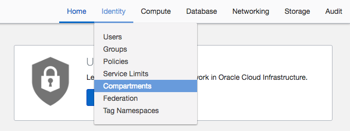

- If your workshop instructor has directed you to use a pre-created compartment **_do not create a new one_**. Locate the compartment in the list and click **Copy** next to the displayed OCID. **Paste** this OCID into a text file or elsewhere for safe keeping. We will use it to tell Terraform where to set up our cluster in a later step. Proceed to **STEP 3**.

  Otherwise, if you are using a trial account or paid account, proceed to the next instruction to create a compartment.

  

- Click **Create Compartment**

  

- In the **Name** field, enter `kubernetes`. Enter a description of your choice. Click **Create Compartment**.

  

- In a moment, your new Compartment will show up in the list. Locate it and click **Copy** in the OCID display. **Paste** this OCID into a text file or elsewhere for safe keeping. We will use it to tell Terraform where to set up our cluster in a later step.

  

### **STEP 3**: Create and upload a new API key

An API key is required for Terraform to authenticate to OCI in order to create compute instances for your Kubernetes master and worker nodes.

- Open a terminal window and run each of the following commands, one at a time, pressing **Enter** between each one. These commands will create a new directory called `.oci`, generate a new PEM private key, generate the corresponding public key, and copy the public key to the clipboard. For more information on this process, including the alternate commands to protect your key file with a passphrase, see the [official documentation](https://docs.us-phoenix-1.oraclecloud.com/Content/API/Concepts/apisigningkey.htm#two).


  ```bash
  mkdir ~/.oci
  openssl genrsa -out ~/.oci/oci_api_key.pem 2048
  openssl rsa -pubout -in ~/.oci/oci_api_key.pem -out ~/.oci/oci_api_key_public.pem
  cat ~/.oci/oci_api_key_public.pem | xclip -sel clip
  ```

- In your browser window showing the OCI Console, click the **Identity** menu item. You will be brought to the **Users** menu. Find your username in the list and hover over the **three dots** menu at the far right of the row, then click **View User Details**.

  

- Click **Add Public Key**

  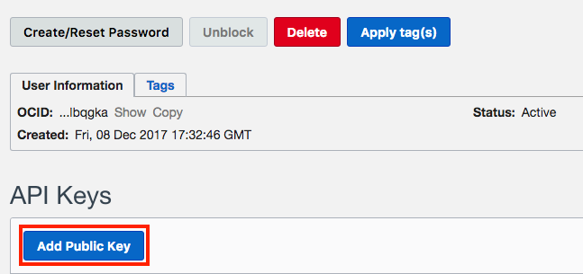

- **Paste** the public key from your clipboard into the text field and click **Add**. Note: The public key was copied to the clipboard when you ran the `cat` command from the terminal window, which copied the results to the clipboard using the `clip` command.

  

- **Leave this browser window open**, as we will need to copy and paste some of this information into the Terraform configuration file.

## Provision Kubernetes Using Terraform

### **STEP 4**: Download and Configure the OCI Terraform Kubernetes Installer

- The Oracle OCI Terraform Provider has already been installed for you, so the next step is to change to the Terraform Kubernetes Installer directory from the same **terminal window**:

  ```bash
  cd ~
  cd terraform-kubernetes-installer
  ```

- Initialize this Terraform installer by running the following command:

  ```bash
  terraform init
  ```

- Verify proper installation of both Terraform and the OCI provider by running the following command from your **terminal window**:

  ```bash
  terraform --version
  ```
  You should see a version for `Terraform` as well as a version for the `provider.oci` plugin. It is OK if those versions differ from the screenshot below.

  

- Once you have Terraform and the OCI provider set up, you are ready to configure the Kubernetes installer with your OCI account information. Start by making a copy of the included TFVARS example file to edit. Run the following from your **terminal window**:

  ```bash
  cp terraform.example.tfvars terraform.tfvars
  ```

- Open the `terraform.tfvars` file in your text editor of choice. On Linux you could run:

  ```bash
  gedit terraform.tfvars
  ```

- You should still have a browser tab open to your **User Details** page in the OCI Console. You will first remove the **#** comment character and replace in the values  in the terraform.tfvars file on lines **2, 4, 6, and 7**. **NOTE**: The **region** parameter may not already be present in your tfvars file. If it is not there, add it on a new line after the user_ocid parameter on line 6.

  

- You will replace lines **2, 4, 6, and 7** with the values from the OCI Console, referring to the following screenshot for where to find them.

  

- As an example, Your terraform.tfvars file should now appear similar to the image shown below:

  

- Now follow the same process of removing the comment character **#**, and fill in the OCI Compartment ID on **line 3**. Paste the value that you saved to a text file after creating the kubernetes **compartment** in the OCI Console. If you have lost it, you can retrieve it from the OCI Console compartment list (refer to **STEP 2**).

  ```
  compartment_ocid = "Compartment OCID"
  ```

- The last piece of information we need to provide about your OCI tenant is the private key corresponding to the public API key you uploaded to the OCI console previously. Provide the path and the private key file on **line 5** using the path below:

  _Note:_ If using the VNC Provided environment, use this private_key_path

  ```
  private_key_path = "/u01/app/demo/homes/oracle/.oci/oci_api_key.pem"
  ```

  _Note:_ If using the Virtual Box Image, use this private_key_path

  ```
  private_key_path = "/home/oracle/.oci/oci_api_key.pem"
  ```
- The rest of the terraform.tfvars file controls the parameters used when creating your Kubernetes cluster. You can control how many OCPUs each node receives, whether nodes should be virtual machines or bare metal instances, how many availability domains to use, and more. We will modify five of the lines in the remainder of the file.

- First, we will specify that we want only one OCPU in each of the worker and master nodes. This reduces the hourly cost of running our cluster. On **lines 15 and 16**, uncomment the **k8sMasterShape** and **k8sWorkerShape** parameters, and set both values to **VM.Standard1.1**:

  ```
  k8sMasterShape = "VM.Standard1.1"
  k8sWorkerShape = "VM.Standard1.1"
  ```

- Next, we will specify the type of load balancers we want for the master and etcd VMs -- 400Mbps in this case. Alter **lines 30 and 31** to read:

  ```
  etcdLBShape = "400Mbps"
  k8sMasterLBShape = "400Mbps"
  ```

- The last change we will make is to open up the allowed Kubernetes master inbound IP address range, so that we can access our cluster from the internet. On **line 38**, remove the pound sign at the beginning of the line to uncomment it.

  ```
  master_https_ingress = "0.0.0.0/0"
  ```

  **NOTE**: The 0.0.0.0/0 value means that any IP address can access your cluster. A better security practice would be to determine your externally-facing IP address and restrict access to only that address. If you'd like, you can find out your IP address by running `curl ifconfig.co` in a terminal window, and place that address into the `master_https_ingress` parameter (e.g. `master_https_ingress = "11.12.13.14/32"`). Note that if you need remote assistance with the workshop, you may need to open this back up to 0.0.0.0/0 to allow access to your cluster.

### **STEP 5**: Provision Kubernetes on OCI

- Now we are ready to have Terraform provision our Kubernetes cluster. **Save and close** your terraform.tfvars file. In your open **terminal window**, run the following command to have Terraform evaluate the various network and compute infrastructure that we are asking to be provisioned.

  ```bash
  terraform plan
  ```

  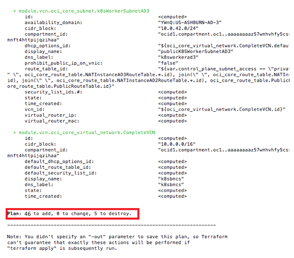

- If the output of the plan step looks correct, you are ready to actually provision the infrastructure by running the following command in your **terminal window**. Note that Terraform will prompt you to type `yes` after it recomputes the required plan in order to begin provisioning.

  ```bash
  terraform apply
  ```

  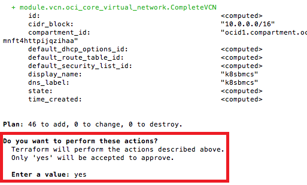

- It will take several minutes to create the required Virtual Cloud Networks, load balancers, and compute instances that make up a Kubernetes cluster. If you'd like, you can observe the objects being created in the **OCI Console** -- click on **Compute** or **Networking** from the navigation menu and be sure to select the **kubernetes compartment** from the dropdown on the left side of the page.

  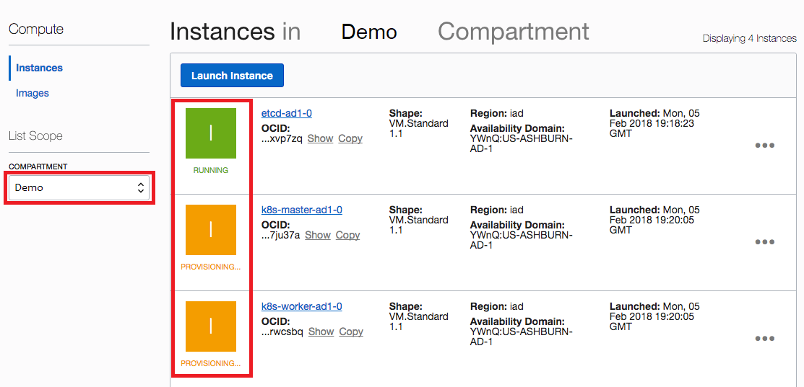

- When provisioning is complete, Terraform will output the details of all created infrastructure to the terminal:

  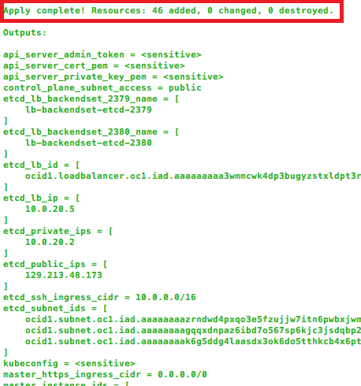

- During provisioning, Terraform generated a `kubeconfig` file that will authenticate you to the cluster. Let's configure and start the kubectl proxy server to make sure our cluster is accessible. Since you are using an Oracle-provided client image, `kubectl` -- the Kubernetes command line interface, has been **pre-installed** for you.

- You will need to set an environment variable to point `kubectl` to the location of your Terraform-generated `kubeconfig` file. Then you can start the Kubernetes proxy server, which will let you view the cluster dashboard at a localhost URL. Since you're using the Oracle-provided client image, we'll add the `KUBECONFIG` environment variable to your bash profile; that way it will be set for all new shells that you open. Enter the following command into your terminal window:

  ```bash
  echo "export KUBECONFIG=`pwd`/generated/kubeconfig" >> ~/.bashrc
  source ~/.bash_profile
  kubectl proxy
  ```

  **NOTE**: Should you need to change the IP address of your cluster in the future, you can configure `kubectl` with the updated connection information by running the following command, which will pass the current address and authentication details to `kubectl`:

  `terraform output kubeconfig | tr '\n' '\0' | xargs -0 -n1 sh -c`

- Now that the proxy server is running, navigate to the **[Kubernetes dashboard](http://localhost:8001/api/v1/namespaces/kube-system/services/http:kubernetes-dashboard:/proxy/)** in a new browser tab.

  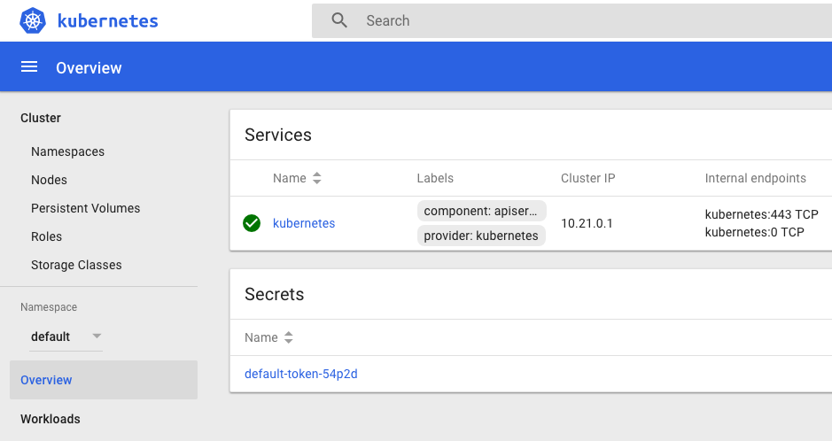

- Great! We've got Kubernetes installed and accessible -- now we're ready to get our microservice deployed to the cluster. The next step is to tell Wercker how and where we would like to deploy our application. In your **terminal window**, press **Control-C** to terminate **kubectl proxy**. We will need the terminal window to gather some cluster info in another step. We'll start the proxy again later.

## Configure and Run Wercker Deployment Pipelines

### **STEP 6**: Define Kubernetes Deployment Specification

- From a browser, navigate to your forked twitter-feed repository on GitHub. If you've closed the tab, you can get back by going to [GitHub](https://github.com/), scrolling down until you see the **Your repositories** box on the right side of the page, and clicking the **twitter-feed** link.

  

- Click **Create new file**

  

- In the **Name your file** input field, enter `kubernetes.yml.template`

  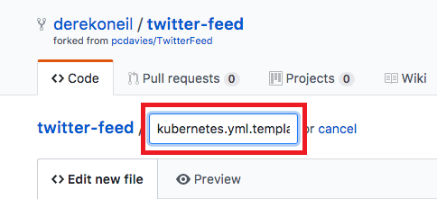

- **Copy** the YAML below and **paste** it into the file editor.

  >This configuration consists of two parts. The first section (up to line 28) defines a **Deployment**, which tells Kubernetes about the application we want to deploy. In this Deployment we instruct Kubernetes to create two Pods (`replicas: 2`) that will run our application. Within those pods, we specify that we want one Docker container to be run, and compose the link to the image for that container using environment variables specific to this workflow execution (`image: ${DOCKER_REPO}:${WERCKER_GIT_BRANCH}-${WERCKER_GIT_COMMIT}`).

  >The second part of the file defines a **Service**. A Service defines how Kubernetes should expose our application to traffic from outside the cluster. In this case, we are asking for a cluster-internal IP address to be assigned (`type: ClusterIP`). This means that our twitter feed will only be accessible from inside the cluster. This is ok, because the twitter feed will be consumed by the product catalog application that we will deploy later. We can still verify that our twitter feed is deployed properly -- we'll see how in a later step.

  >A `.yml` file is a common format for storing Kubernetes configuration data. The `.template` suffix in this file, however, is not a Kubernetes concept. We will use a Wercker step called **bash-template** to process any `.template` files in our project by substituting environment variables into the template wherever `${variables}` appear. You'll add that command to a new pipeline in the next step.

```yaml
apiVersion: extensions/v1beta1
kind: Deployment
metadata:
  name: twitter-feed-v1
  labels:
    commit: ${WERCKER_GIT_COMMIT}
spec:
  replicas: 2
  selector:
    matchLabels:
      app: twitter-feed
  template:
    metadata:
      labels:
        app: twitter-feed
        commit: ${WERCKER_GIT_COMMIT}
    spec:
      containers:
      - name: twitter-feed
        image: ${DOCKER_REPO}:${WERCKER_GIT_BRANCH}-${WERCKER_GIT_COMMIT}
        imagePullPolicy: Always
        ports:
        - name: twitter-feed
          containerPort: ${PORT}
          protocol: TCP
      imagePullSecrets:
        - name: wercker
---
apiVersion: v1
kind: Service
metadata:
  name: twitter-feed
  labels:
    app: twitter-feed
    commit: ${WERCKER_GIT_COMMIT}
spec:
  ports:
  - port: 30000
    targetPort: ${PORT}
  selector:
    app: twitter-feed
  type: ClusterIP
---
```

- At the bottom of the page, click **Commit new file**

  

- Since you've committed to the repository, Wercker will trigger another execution of your workflow. We haven't defined the deployment pipelines yet, so this will just result in a new entry in Wercker's Runs tab and a new image pushed to the container registry. You don't need to do anything with those; you can move on to the next step.

### **STEP 7**: Define Wercker Deployment Pipelines

- Click the file **wercker.yml** and then click the **pencil** button to begin editing the file.

  

- **Copy** the YAML below and **paste** it below the pipelines we defined earlier.

  >This will define a new **Pipeline** called deploy-to-cluster. The pipeline will make use of a new type of step: **kubectl**. If you have used Kubernetes before, you will be familiar with kubectl, the standard command line interface for managing Kubernetes. The kubectl Wercker step can be used to execute Kubernetes commands from within a Pipeline.

  >The **deploy-to-cluster** Pipeline will prepare our kubernetes.yml file by filling in some environment variables. It will then use kubectl to tell Kubernetes to apply that configuration to our cluster.

```yaml
#Deploy our container from the Docker Hub to Kubernetes
deploy-to-cluster:
    box:
        id: alpine
        cmd: /bin/sh
    steps:

    - bash-template

    - script:
        name: "Visualise Kubernetes config"
        code: cat kubernetes.yml

    - kubectl:
        name: deploy to kubernetes
        server: $KUBERNETES_MASTER
        #username: $KUBERNETES_USERNAME
        token: $KUBERNETES_TOKEN
        insecure-skip-tls-verify: true
        command: apply -f kubernetes.yml
```

- At the bottom of the page, click **Commit new file**

  

- Since you've committed to the repository again, Wercker will once again trigger an execution of your workflow. We still haven't configured the deployment pipelines in Wercker yet, so we'll still end up with a new Run and a new image, but not a deployment to Kubernetes.

### **STEP 8**: Set up deployment pipelines in Wercker

- Open **[Wercker](https://app.wercker.com)** in a new tab or browser window, or switch to it if you already have it open. In the top navigation bar, click **Pipelines**, then click on your **twitter-feed** application.

  

- On the **Runs** tab you can see that Wercker has triggered another execution of our build and publish workflow, but it has not executed our new deploy-to-cluster pipeline. This is because we have not added the new pipeline to the workflow definition yet. Let's do that now -- click on the **Workflows** tab, then click the **Add new pipeline** button.

  

- Enter `deploy-to-cluster` into both the Name and YML Pipleine name fields. Click **Create**.

  

- Click the **Workflows** tab again to get back to the editor.

- Click the **plus** button to the right of the **push-release** pipeline to add to the workflow. In the **Execute Pipeline** drop down list, select **deploy-to-cluster** and click **Add**

  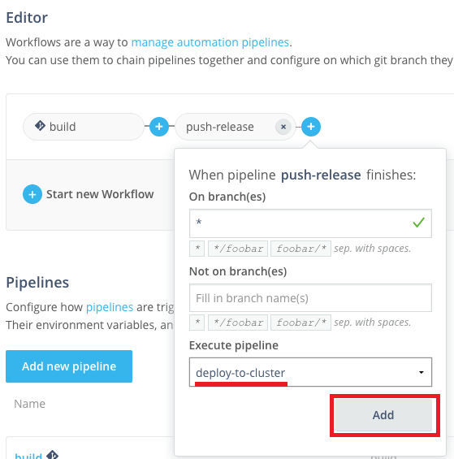

- Your overall Workflow should now have three Pipelines:

  

- Now we've got our workflow updated with our deployment pipelines, but there's one more thing we need to do before we can actually deploy. We need to set two environment variables that tell Wercker the address of our Kubernetes master and provide an authentication token for Wercker to issue commands to Kubernetes.

### **STEP 9**: Set up environment variables in Wercker

- Our first step is to set our cluster's authentication token as a Wercker environment variable. In your **terminal window**, change to the correct directory, and run the following command to copy the token to your clipboard:

  ```bash
  cd ~/terraform-kubernetes-installer/
  terraform output api_server_admin_token | xclip -sel clip
  ```

- Back in your Wercker browser tab, click the **Environment** tab. In the key field of the empty row below the last environment variable, enter the key **KUBERNETES_TOKEN**. In the value field, **paste** the token we just copied. Check the **Protected** box and click **Add**.

  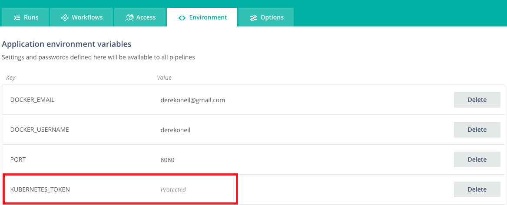

- The other environment variable we need to add is the address of the Kubernetes master we want to deploy to. We can get the URL from `kubectl`. Run the following command in your **terminal window** to copy the URL to your clipboard:

  ```bash
  echo $(kubectl config view | grep server | cut -f 2- -d ":" | tr -d " ") | xclip -sel clip
  ```

- In your Wercker browser tab, add a new environment variable with the key **KUBERNETES_MASTER**. In the value field, **paste** the value you copied from `kubectl`. The value **must start with https://** for Wercker to communicate with the cluster. When finished, click **Add**.

  

- Now we're ready to try out our workflow from start to finish. We could do that by making another commit on GitHub, since Wercker is monitoring our source code. We can also trigger a workflow execution right from Wercker. We'll see how in the next step.

### **STEP 10**: Trigger a retry of the pipeline

- On your Wercker application page in your browser, click the **Runs** tab. Your most recent run should have successful build and push-release pipelines. Click the **push-release** pipeline.

  

- From the **Actions** menu, click **deploy-to-cluster**.

  

- In the dialog box that appears, click **Execute pipeline**

  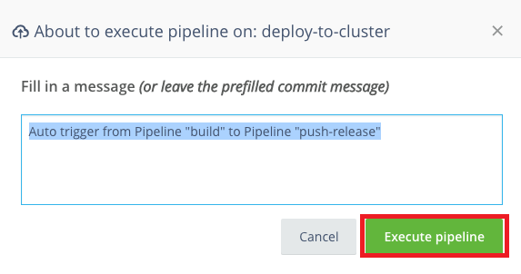

- Click the **Runs** tab so you can monitor the execution of the pipeline. Within a minute or so, the deployment pipeline should complete successfully. Now we can use the Kubernetes dashboard to inspect and validate our deployment.

  

### **STEP 11**: Validate deployment

- In a terminal window, start the **kubectl proxy** using the following command. Your `KUBECONFIG` environment variable should still be set from a previous step. If not, reset it.

  ```bash
  kubectl proxy
  ```

- In a browser tab, navigate to the [**Kubernetes dashboard**](http://localhost:8001/api/v1/namespaces/kube-system/services/http:kubernetes-dashboard:/proxy/)

- Click on the **Overview** menu option in the Kubernetes dashboard **left-hand menu**. In the pods section, you should see two twitter-feed pods running. Click the **name of one of the pods** to go to the detail page.

  

- On the pod detail page, in the top menu bar, click **Exec**. This will give us a remote shell on the pod where we can verify that our application is up and running.

  

- In the shell that is displayed, **paste** the following command and press **Enter**.

  **NOTE:** You may need to use **ctrl-shift-v** to paste. Alternatively, you can use the mouse-driven browser menu to paste the command.

  `curl -s http://$HOSTNAME:8080/statictweets | head -c 100`

- You should the first 100 characters of the JSON data being returned by our twitter feed service. Our microservice has been deployed successfully! But the twitter feed service is just one part of our product catalog application. Let's deploy the rest of the application so we can validate that everything works together as expected. Leave this browser tab open, as we will use it in a later step.

  

**NOTE**: You may be wondering why we had to use the Kubernetes remote terminal to test our application. Remember the kubernetes.yml file that we created earlier -- we specified a cluster-internal IP address for our twitter-feed service. This means that only other processes inside the cluster can reach our service. If we wanted to access our service from the internet, we could have used a load balancer instead.

## Deploy and Test the Product Catalog Application

### **STEP 12**: Download the Product Catalog Kubernetes YAML file

- From a browser, navigate to your forked twitter-feed repository on GitHub. If you've closed the tab, you can get back by going to [GitHub](https://github.com/), scrolling down until you see the **Your repositories** box on the right side of the page, and clicking the **twitter-feed** link.

  

- Click on the **alpha-office-product-catalog.kubernetes.yml** file.

  

- **Right click** on the **Raw** button and choose **Save Link As**. In the save file dialog box that appears, note the location of the file and click **Save**

  

**NOTE**: This YAML file contains the configuration for a Kubernetes deployment and service, much like the configuration for our twitter feed microservice. In a normal development environment, the product catalog application would be managed by Wercker as well, so that builds and deploys would be automated. In this workshop, however, you will perform a one-off deployment of a pre-built Docker image containing the product catalog application from within the Kubernetes dashboard.

### **STEP 13**: Deploy and test the Product Catalog using the Kubernetes dashboard

- Switch back to your **Kubernetes dashboard** browser tab. If you have closed it, navigate to the Kubernetes dashboard at [**Kubernetes dashboard**](http://localhost:8001/api/v1/namespaces/kube-system/services/http:kubernetes-dashboard:/proxy/)

- In the upper right corner of the dashboard, click **Create**.

  

- Click the **Upload a YAML or JSON file** radio button, then click the **three dots** button to browse for your file. In the dialog, select the YAML file you just downloaded from GitHub and click **Open**, then click **UPLOAD**.

  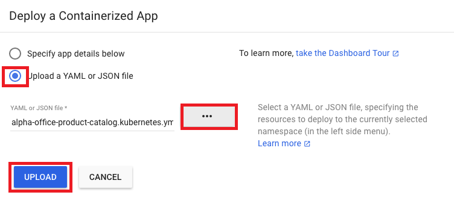

- In the left side navigation menu, click **Overview**. You should see two new product-catalog-app pods being created and soon change state to Running.

  

- Instead of a cluster-internal IP address, the product-catalog-service will be exposed to the internet via a load balancer. The load balancer will take a few minutes to be instantiated and configured. Let's check on its status--click **Services** from the left side menu, then click on the **product-catalog-service**.

  

- On the service detail page, you will see a field called **External endpoints**. Once the load balancer has finished provisioning, the External endpoints field will be populated with a link to the product catalog application. If the link is not shown yet, wait a few minutes, refresh your browser, and check again. Once the link is displayed, **click it** to launch the site in a new tab.

  

- You should see the product catalog site load successfully, validating that our new Kubernetes deployment and service were created correctly. Let's test the twitter feed functionality of the catalog. Click the first product, **Crayola New Markers**. The product's twitter feed should be displayed.

  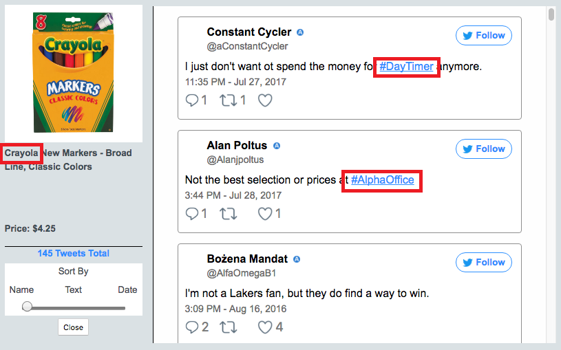

  **NOTE**: You may have noticed that we did not need to alter the pre-built product catalog container with the URLs of the twitter feed pods or service. The product catalog app makes use of Kubernetes DNS to resolve the service name (twitter-feed) into its IP address. Kubernetes DNS assigns a DNS name to every service defined in your cluster, so any service can be looked up by doing a DNS query for the name of the service (prefixed by _`namespace.`_ if the service is in a different namespace from the requester). The product catalog server uses the following JavaScript code to make an HTTP request to the twitter feed microservice:

  `request('http://twitter-feed:30000/statictweets/color', function (error, response, body) { ... });`

- Some tweets are indeed displayed, but they aren't relevant to this product. It looks like there is a bug in our twitter feed microservice! Continue on to the next lab to explore how to make bug fixes and updates to our microservice.

**You are now ready to move to the next lab.**
