# Automate Deployment to Kubernetes


## Introduction

This is the second of several labs that are part of the **Oracle Public Cloud Container Native Development workshop.** This workshop will walk you through the process of moving an existing application into a containerized CI/CD pipeline and deploying it to a managed Kubernetes service in the Oracle Public Cloud.

You will take on 2 personas during the workshop. The **Lead Developer Persona** will be responsible for configuring the parts of the automated build and deploy process that involve details about the application itself. The **DevOps Engineer Persona** will configure the parts of the automation involving the Kubernetes infrastructure. To containerize and automate the building and deploying of this application you will make use of Wercker Pipelines, Oracle Container Registry, and Oracle Container Engine.

During this lab, you will take on the **DevOps Engineer Persona**. You will create a Kubernetes cluster and deploy your twitter feed microservice and the product catalog application. You'll also create both internal and external facing services in Kubernetes to expose only some of your application's entry points to the internet.

**_To log issues_**, click here to go to the [GitHub oracle](https://github.com/oracle/learning-library/issues/new) repository issue submission form.

## Objectives

**Create and Deploy to a Kubernetes Cluster**
- Set Up Oralce Cloud infrastructure
- Configure Wercker Cluster
- Configure and Run Wercker Deployment Pipelines
- Deploy and Test the Product Catalog Application

## Required Artifacts

- The following lab requires:
  - an Oracle Public Cloud account that will be supplied by your instructor.
  - a [GitHub account](https://github.com/join)

# Containerize Your Java Application and Automate Builds

## Set Up Oralce Cloud infrastructure

### **STEP 1**: Log in to your OCI dashboard

- From any browser, go to:

    [https://cloud.oracle.com/en_US/sign-in]()

- Enter your **Cloud Account Name** in the input field and click the **My Services** button. If you have a trial account, this can be found in your welcome email. Otherwise, this will be supplied by your workshop instructor.

  

- Enter your **Username** and **Password** in the input fields and click **Sign In**. If you have a trial account, these can be found in your welcome email. Otherwise, these will be supplied by your workshop instructor.

  

**NOTE**: If you have used your trial account already, you may have been prompted to change the temporary password listed in the welcome email. In that case, enter the new password in the password field.

- In the top left corner of the dashboard, click the **hamburger menu**

  

- Click to expand the **Services** submenu, then click **Compute**

  

- On the OCI Console sign in page, enter the same **Username** as you did on the previous sign in page. If you are using a trial account and this is your first time logging into the OCI Console, enter the **temporary password** from your trial account welcome email. If you have already visited the OCI Console and changed your password, enter your **new password**. Otherwise, this password will be supplied by your workshop instructor.

  

### **STEP 2**: Create a Compartment for your Kubernetes nodes
Compartments are used to isolate resources within your OCI tenant. User-based access policies can be applied to manage access to compute instances and other resources within a Compartment.

- Hover over the **Identity** menu in the top navigation bar and click **Compartments**

  

- Click **Create Compartment**

  

- In the **Name** field, enter `wercker`. Enter a description of your choice. Click **Create Compartment**.

  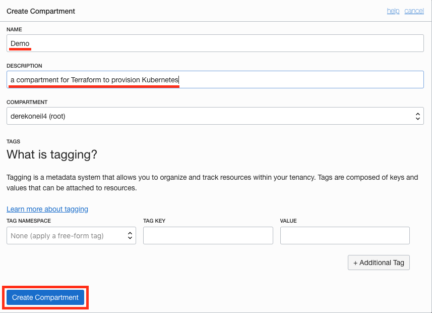

- In a moment, your new Compartment will show up in the list. Locate it and click **Copy** in the OCID display. **Paste** this OCID into a text file or elsewhere for safe keeping. We will use it to tell Wercker where to set up our Cluster in a later step.

  

### **STEP 3**: Create and upload a new API key
An API key is required for Wercker to authenticate to OCI in order to create compute instances for your Kubernetes worker nodes.

- Open a terminal window and run each of the following commands, one at a time, pressing **Enter** between each one. These commands will create a new directory called .oci, generate a new PEM private key, generate the corresponding public key, and copy the public key to the clipboard. For more information on this process, including the alternate commands to protect your key file with a passphrase, see the [official documentation](https://docs.us-phoenix-1.oraclecloud.com/Content/API/Concepts/apisigningkey.htm#two).
```
mkdir ~/.oci
openssl genrsa -out ~/.oci/oci_api_key.pem 2048
openssl rsa -pubout -in ~/.oci/oci_api_key.pem -out ~/.oci/oci_api_key_public.pem
cat ~/.oci/oci_api_key_public.pem | pbcopy
```
  

- In your browser window showing the OCI Console, hover over your username in the top right corner and click **User Settings**

  

- Click **Add Public Key**

  

- **Paste** the public key from your clipboard into the text field and click **Add**.

  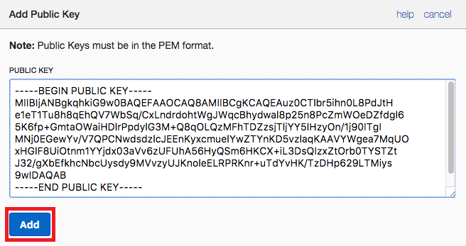

- **Leave this browser window open**, as we will need to copy and paste some of this information into Wercker.

### **STEP 4**: Create a new Cloud Credential in Wercker

- **Open** [Wercker](https://app.wercker.com) in a new tab or browser window, or switch to it if you already have it open. In the top navigation bar, click **Clusters**, then **Cloud Credentials**.

  

- Before we can create a new Kubernetes cluster, we must give Wercker the identity information for our OCI tenant, user, and compartment. We also need to give Wercker the private API key that we just generated.

  If your workshop instructor has specified an organization for you to use, **select it** from the drop down list in the top left part of the page. Then click **New Cloud Credential**.

  

- In the **Name** field, enter a name of your choice to identify your credential. For the next three fields, you will **copy and paste** values from the OCI Console User Details screen into the Wercker form. The image below shows where to find the User OCID, Tenancy OCID, and Key Fingerprint. We will fill in the API Private Key field next.

  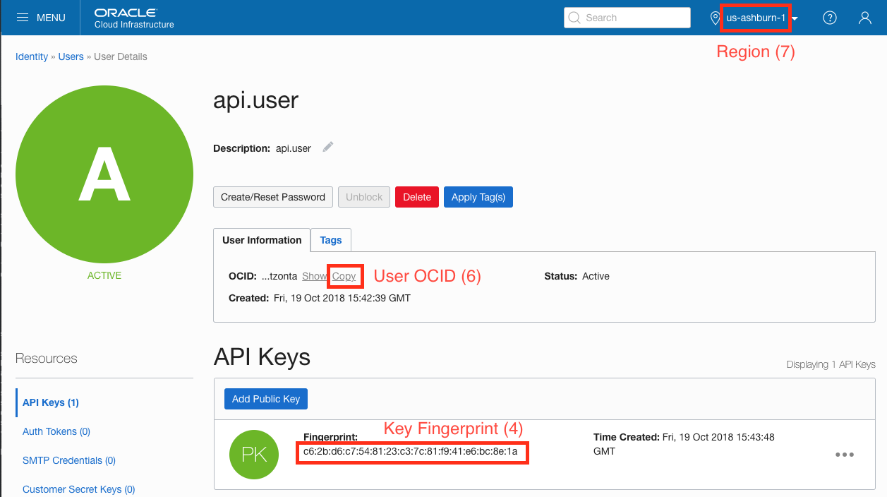

- In a terminal window, run the following command to copy your **API Private Key**

  `cat ~/.oci/oci_api_key.pem | pbcopy`

- **Paste** your private key into the **API Private Key** field in the Wercker form in your browser. Then click **Create**.

  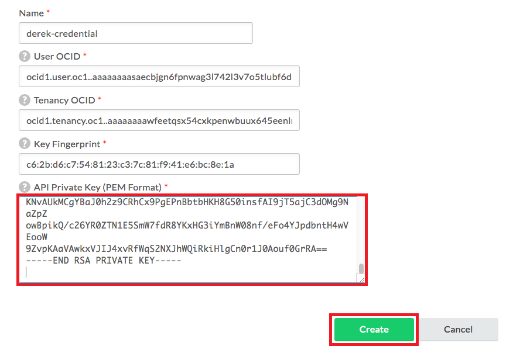  

## Configure Wercker Cluster

### **STEP 5**: Create a Cluster in Wercker

- **Open** [Wercker](https://app.wercker.com) in a new tab or browser window, or switch to it if you already have it open. In the top navigation bar, click **Clusters**, then **Create**.

    

- **Select** the same organization you did when you created your cloud credential in the previous step. Then **select** your cloud credential from the drop down list.

  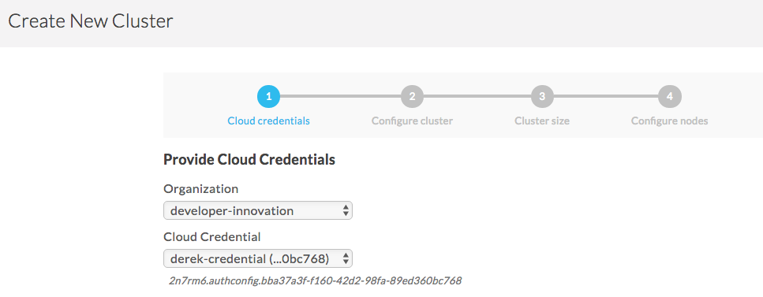  

- In the Compartment OCID field, enter the value that you saved to a text file after creating the wercker **compartment** in the OCI Console. If you have lost it, you can retrieve it from the OCI Console compartment list (refer to **STEP 2**). Once you have entered it, click **Next**

  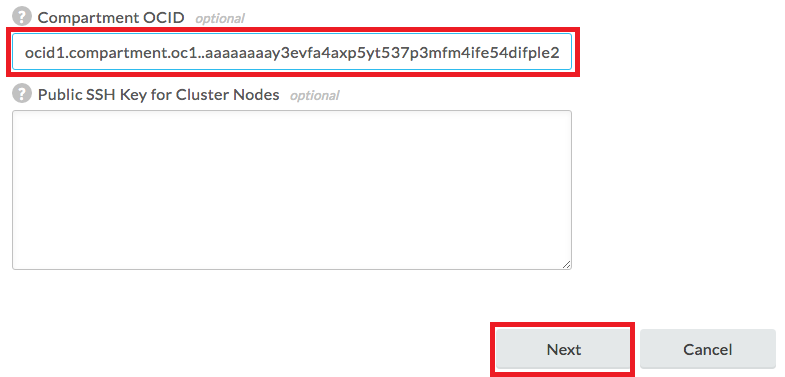  

- Enter a **name** for your cluster and click **Next**

  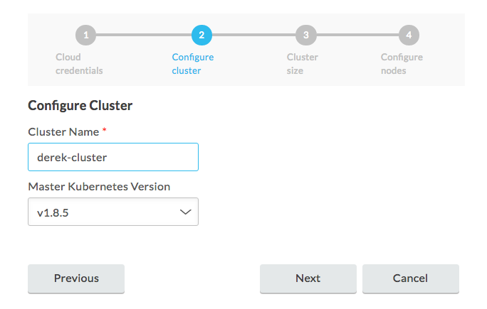  

- Leave the default **small** size selected for your cluster and click **Next**

  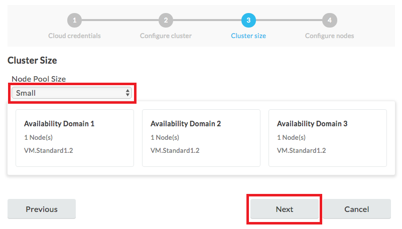  

  **NOTE**: We are selecting small virtual machines to run our cluster in this workshop, but you could have chosen any shape--including bare metal instances--for your nodes.

- Leave the default OS and Kubernetes versions selected and click **Launch**

  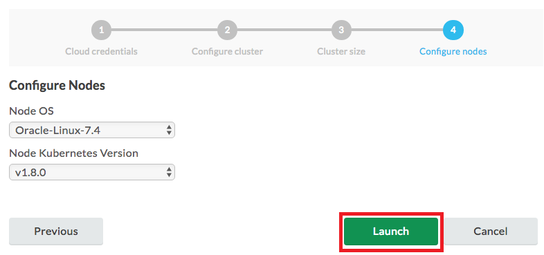  

- Wercker will begin provisioning nodes in your OCI compartment. Wercker will show you a **Get Started** page with a **Download kubeconfig file** button. Click that button, as we will need the kubeconfig file to monitor our cluster later.

  In a few minutes, the **Cluster Status** and **Node Status** on your summary page will move from provisioning to running. No need to sit and wait for that -- feel free to move on to the next step, where we will tell Wercker how we would like to deploy our application to Kubernetes.

  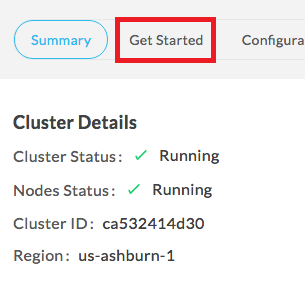

## Configure and Run Wercker Deployment Pipelines

### **STEP 7**: Define Wercker Deployment Pipelines

- From a browser, navigate to your forked twitter-feed repository on GitHub. If you've closed the tab, you can get back by going to [GitHub](https://github.com/), scrolling down until you see the **Your repositories** box on the right side of the page, and clicking the **twitter-feed** link.

  

- Click **Create new file**

  

- In the **Name your file** input field, enter **kubernetes.yml.template**

  

- **Copy** the YAML below and **paste** it into the file editor.  
  >This configuration consists of two parts. The first section (up to line 28) defines a **Deployment**, which tells Kubernetes about the application we want to deploy. In this Deployment we instruct Kubernetes to create two Pods (`replicas: 2`) that will run our application. Within those pods, we specify that we want one Docker container to be run, and compose the link to the image for that container using environment variables specific to this workflow execution (`image: ${DOCKER_REPO}:${WERCKER_GIT_BRANCH}-${WERCKER_GIT_COMMIT}`).

  >The second part of the file defines a **Service**. A Service defines how Kubernetes should expose our application to traffic from outside the cluster. In this case, we are asking for a cluster-internal IP address to be assigned (`type: ClusterIP`). This means that our twitter feed will only be accessible from inside the cluster. This is ok, because the twitter feed will be consumed by the product catalog application that we will deploy later. We can still verify that our twitter feed is deployed properly -- we'll see how in a later step.

```yaml
apiVersion: extensions/v1beta1
kind: Deployment
metadata:
  name: twitter-feed-v1
  labels:
    commit: ${WERCKER_GIT_COMMIT}
spec:
  replicas: 2
  selector:
    matchLabels:
      app: twitter-feed
  template:
    metadata:
      labels:
        app: twitter-feed
        commit: ${WERCKER_GIT_COMMIT}
    spec:
      containers:
      - name: twitter-feed
        image: ${DOCKER_REPO}:${WERCKER_GIT_BRANCH}-${WERCKER_GIT_COMMIT}
        imagePullPolicy: Always
        ports:
        - name: twitter-feed
          containerPort: ${PORT}
          protocol: TCP
      imagePullSecrets:
        - name: wercker          
---
apiVersion: v1
kind: Service
metadata:
  name: twitter-feed
  labels:
    app: twitter-feed
    commit: ${WERCKER_GIT_COMMIT}
spec:
  ports:
  - port: 30000
    targetPort: ${PORT}
  selector:
    app: twitter-feed
  type: ClusterIP
---
```

- At the bottom of the page, click **Commit new file**

  


### **STEP 7**: Define Wercker Deployment Pipelines

- From a browser, navigate to your forked twitter-feed repository on GitHub. If you've closed the tab, you can get back by going to [GitHub](https://github.com/), scrolling down until you see the **Your repositories** box on the right side of the page, and clicking the **twitter-feed** link.

  

- Click the file **wercker.yml** and then click the **pencil** button to begin editing the file.

  

- **Copy** the YAML below and **paste** it below the pipelines we defined earlier.

  >This will define two new **Pipelines** called inject-secret and deploy-to-cluster. Both pipelines will make use of a new type of step: **kubectl**. If you have used Kubernetes before, you will be familiar with kubectl, the standard command line interface for managing Kubernetes. The kubectl Wercker step can be used to execute Kubernetes commands from within a Pipeline.

  >The **inject-secret** Pipeline will create a new Kubernetes secret that contains our Wercker authentication token (we'll generate one in the Wercker app later). This will allow Kubernetes to authenticate when it tries to pull our Docker image from the Oracle Container Registry.

  >The **deploy-to-cluster** Pipeline will prepare our kubernetes.yml file by filling in some environment variables. It will then use kubectl to tell Kubernetes to apply that configuration to our cluster.

```yaml
#Inject our Wercker application token into Kubernetes to authenticate container pulls
#delete any existing Wercker secret before creating, to accommodate secret changes
inject-secret:
    box:
        id: alpine
        cmd: /bin/sh
    steps:

    - kubectl:
        name: delete secret
        server: $KUBERNETES_MASTER
        token: $KUBERNETES_TOKEN
        insecure-skip-tls-verify: true
        command: delete secret wercker; echo delete registry secret

    - kubectl:
        name: create secret
        server: $KUBERNETES_MASTER
        token: $KUBERNETES_TOKEN
        insecure-skip-tls-verify: true
        command: create secret docker-registry wercker --docker-server=$DOCKER_REGISTRY --docker-username=$DOCKER_USERNAME --docker-password=$KUBERNETES_TOKEN --docker-email=$DOCKER_EMAIL; echo create registry secret

#Deploy our container from the Oracle Container Registry to the Oracle Container Engine (Kubernetes)
deploy-to-cluster:
    box:
        id: alpine
        cmd: /bin/sh
    steps:

    - bash-template

    - script:
        name: "Visualise Kubernetes config"
        code: cat kubernetes.yml

    - kubectl:
        name: deploy to kubernetes
        server: $KUBERNETES_MASTER
        #username: $KUBERNETES_USERNAME
        token: $KUBERNETES_TOKEN
        insecure-skip-tls-verify: true
        command: apply -f kubernetes.yml
```

- At the bottom of the page, click **Commit new file**

  

### **STEP 8**: Set up deployment pipelines in Wercker

- Open **[Wercker](https://app.wercker.com)** in a new tab or browser window, or switch to it if you already have it open. In the top navigation bar, click **Pipelines**, then click on your **twitter-feed** application.

  

- On the **Runs** tab you can see that Wercker has triggered another execution of our build and publish workflow, but it has not executed our new inject-secret and deploy-to-cluster pipelines. This is because we have not added the new pipelines to the workflow definition yet. Let's do that now -- click on the **Workflows** tab, then click the **Add new pipeline** button.

  

- Enter **inject-secret** into both the Name and YML Pipleine name fields. Click **Create**.

  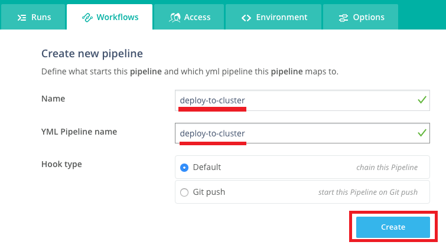

- Repeat that process to create the **deploy-to-cluster** pipeline. Then click the **Workflows** tab again to get back to the editor.

- Click the **plus** button to the right of the **push-release** pipeline to add to the workflow. In the **Execute Pipeline** drop down list, select **inject-secret** and click **Add**

  

- Now click the **plus** button to the right of **inject-secret** and add the **deploy-to-cluster** pipeline to your workflow.

  

- Now we've got our workflow updated with our deployment pipelines, but there's one more thing we need to do before we can actually deploy. We need to set two environment variables that tell Wercker the address of our Kubernetes master and provide an authentication token for Kubernetes to use to pull Docker images from our registry.

### **STEP 9**: Set up environment variables in Wercker

- Our first step is to generate an authentication token for Kubernetes. Click to open the **User Menu** in the upper right hand corner of Wercker, then click **Settings**

  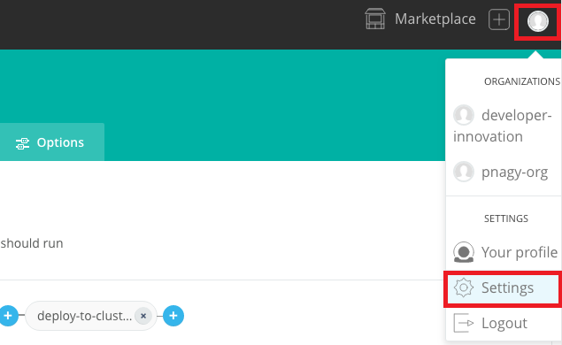

- Click **Personal Tokens** in the left side menu. Enter a name for your token, such as **OCI Token**, and click **Generate**.

  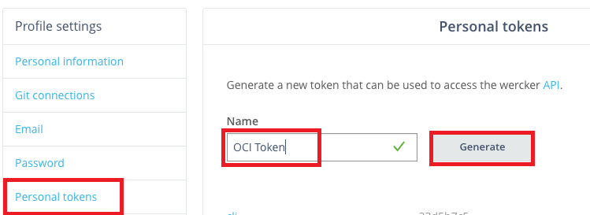

- **Copy** the generated token to the clipboard. Return to your application page in Wercker by clicking **back** in your browser twice. Once there, click the **Environment** tab. In the key field of the empty row below the PORT environment variable, enter the key **KUBERNETES_TOKEN**. In the value field, **paste** the token we just generated. Check the **Protected** box and click **Add**.

  

- The other environment variable we need to add is the address of the Kubernetes master we want to deploy to. We can find it on the clusters page. In the top navigation bar, click **Clusters**. Find your cluster in the list and **copy** its **Kubernetes Address**.

  

- Use the browser's **back** button to get back to the environment variable page for your application. Add a new environment variable with the key **KUBERNETES_MASTER**. In the value field, type **https://** and then **paste** the value you copied from the clusters page. When finished, click **Add**.

- Now we're ready to try out our workflow from start to finish. We could do that by making another commit on GitHub, since Wercker is monitoring our source code. We can also trigger a workflow execution right from Wercker. We'll see how in the next step.

### **STEP 10**: Trigger a retry of the pipeline

- On your Wercker application page in your browser, click the **Runs** tab. Your most recent run should have successful build and push-release pipelines. Click the **push-release** pipeline.

  

- From the **Actions** menu, click **inject-secret**.

  

- In the dialog box that appears, click **Execute pipeline**

  

- Click the **Runs** tab so you can monitor the execution of the pipelines. Within a couple of minutes, all four pipelines should complete successfully. Now we can use the Kubernetes dashboard to inspect and validate our deployment.

  

### **STEP 11**: Validate deployment

- You should have already downloaded the **kubeconfig file** from Wercker when you created your cluster. If you did not, download it now by going to Wercker, clicking **Clusters**, clicking your **cluster name**, clicking the **Get started** tab, and clicking **Download kubeconfig File**.

  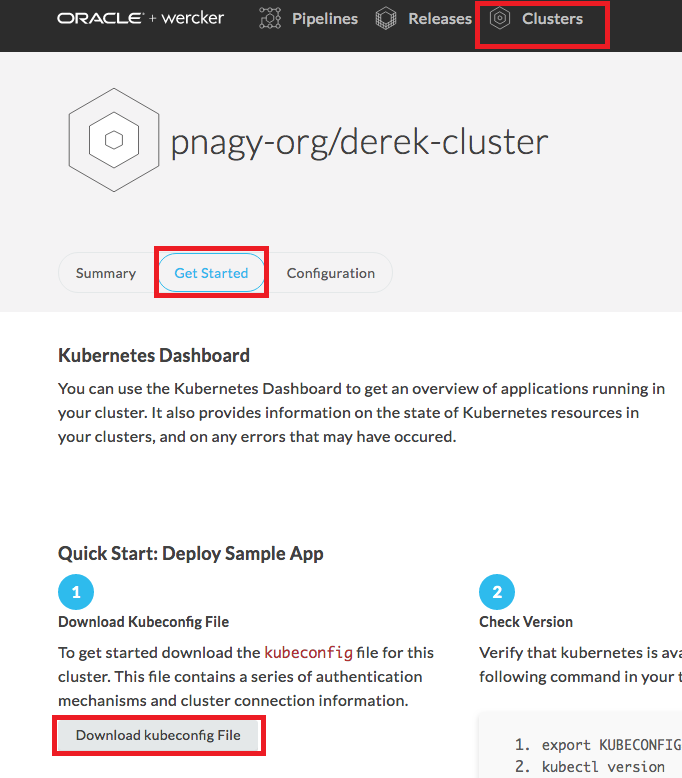

- You will need to install kubectl to use the Kubernetes dashboard. Install it by following the instructions for your OS in the **[Kubernetes docs](https://kubernetes.io/docs/tasks/tools/install-kubectl/)**.

- In a terminal window, **run** the following two commands. If your downloaded kubeconfig file is in a different location, modify the path in the first command to match.

```bash
export KUBECONFIG=~/Downloads/kubeconfig
kubectl proxy
```

- In a browser tab, navigate to the Kubernetes dashboard at [http://localhost:8001/ui]()

- You should see the overview page. In the pods section, you should see two twitter-feed pods running. Click the **name of one of the pods** to go to the detail page.

  

- On the pod detail page, in the top menu bar, click **Exec**. This will give us a remote shell on the pod where we can verify that our application is up and running.

  

- In the shell that is displayed, **paste** the following command and press **Enter**.

  `curl -s http://$HOSTNAME:8080/statictweets | head -c 100`

- You should see some JSON data being returned by our twitter feed service. Our microservice has been deployed successfully! But the twitter feed service is just one part of our product catalog application. Let's deploy the rest of the application so we can validate that everything works together as expected. Leave this browser tab open, as we will use it in a later step.

  

**NOTE**: You may be wondering why we had to use the Kubernetes remote terminal to test our application. Remember the kubernetes.yml file that we created earlier -- we specified a cluster-internal IP address for our twitter-feed service. This means that only other processes inside the cluster can reach our service. If we wanted to access our service from the internet, we could have used a load balancer instead.

## Deploy and Test the Product Catalog Application

### **STEP 12**: Download the Product Catalog Kubernetes YAML file

- From a browser, navigate to your forked twitter-feed repository on GitHub. If you've closed the tab, you can get back by going to [GitHub](https://github.com/), scrolling down until you see the **Your repositories** box on the right side of the page, and clicking the **twitter-feed** link.

  

- Click on the **alpha-office-product-catalog.kubernetes.yml** file.

  

- Right click on the **Raw** button and choose **Save Link As**. In the save file dialog box that appears, note the location of the file and click **Save**

  

**NOTE**: This YAML file contains the configuration for a Kubernetes deployment and service, much like the configuration for our twitter feed microservice. In a normal development environment, the product catalog application would be managed by Wercker as well, so that builds and deploys would be automated. In this workshop, however, you will perform a one-off deployment of a pre-built Docker image containing the product catalog application from within the Kubernetes dashboard.

### **STEP 13**: Deploy and test the Product Catalog using the Kubernetes dashboard

- Switch back to your **Kubernetes dashboard** browser tab. If you have closed it, navigate to the Kubernetes dashboard at [http://localhost:8001/ui]()

- In the upper right corner of the dashboard, click **Create**.

  

- Click the **Upload a YAML or JSON file** radio button, then click the **three dots** button to browse for your file. In the dialog, select the YAML file you just downloaded from GitHub and click **Open**, then click **UPLOAD**.

  

- In the left side navigation menu, click **Overview**. You should see two new product-catalog-app pods being created and soon change state to Running.

  

- Instead of a cluster-internal IP address, the product-catalog-service will be exposed to the internet via a load balancer. The load balancer will take a few minutes to be instantiated and configured. Let's check on its status--click **Services** from the left side menu, then click on the **product-catalog-service**.

  

- On the service detail page, you will see a field called **External endpoints**. Once the load balancer has finished provisioning, the External endpoints field will be populated with a link to the product catalog application. If the link is not shown yet, wait a few minutes, refresh your browser, and check again. Once the link is displayed, **click it** to launch the site in a new tab.

  

- You should see the product catalog site load successfully, validating that our new Kubernetes deployment and service were created correctly. Let's test the twitter feed functionality of the catalog. Click the first product, **Crayola New Markers**. The product's twitter feed should be displayed.

  

- Some tweets are indeed displayed, but they aren't relevant to this product. It looks like there is a bug in our twitter feed microservice! Continue on to the next lab to explore how to make bug fixes and updates to our microservice.
