# Kubernetes Blue/Green Deployments


## Introduction

This is the first of several labs that are part of the **Oracle Public Cloud Container Native Development workshop.** This workshop will walk you through the process of moving an existing application into a containerized CI/CD pipeline and deploying it to a managed Kubernetes service in the Oracle Public Cloud.

You will take on 2 personas during the workshop. The **Lead Developer Persona** will be responsible for configuring the parts of the automated build and deploy process that involve details about the application itself. The **DevOps Engineer Persona** will configure the parts of the automation involving the Kubernetes infrastructure. To containerize and automate the building and deploying of this application you will make use of Wercker Pipelines, Oracle Container Registry, and Oracle Container Engine.

During this lab, you will take on the **DevOps Engineer Persona** and perform a Blue/Green deployment of your microservice to Kubernetes. In a Blue/Green deployment, you will run the new version of the microservice without bringing down the old version. Once the new version is fully available, you will reroute traffic to the new version by reconfiguring the load balancer service.

**_To log issues_**, click here to go to the [GitHub oracle](https://github.com/oracle/learning-library/issues/new) repository issue submission form.

## Objectives

- Perform a Blue/Green Deployment to Kubernetes
  - Update Existing Deployment and Service with Blue Color Labels
  - Validate Deployment Color In Kubernetes and Application
  - Increment Application Version and Switch Color to Green
  - Validate Blue Deployment Still Serves Traffic
  - Reconfigure Service to Switch to Green Deployment
  - Validate Green Deployment Now Serves Traffic

## Required Artifacts

- The following lab requires:
  - an Oracle Public Cloud account that will be supplied by your instructor.
  - a [GitHub account](https://github.com/join)

# Perform a Blue/Green Deployment to Kubernetes

## Update Existing Deployment

### **STEP 1**: Update Existing Deployment and Service with Blue Color Labels

- In a browser, navigate to your forked twitter-feed repository on GitHub. If you've closed the tab, you can get back by going to [GitHub](https://github.com/), scrolling down until you see the **Your repositories** box on the right side of the page, and clicking the **twitter-feed** link.

  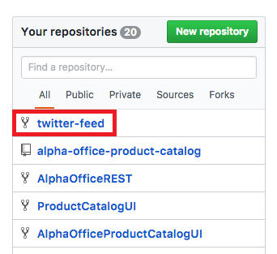

- Click the **kubernetes.yml.template** file

  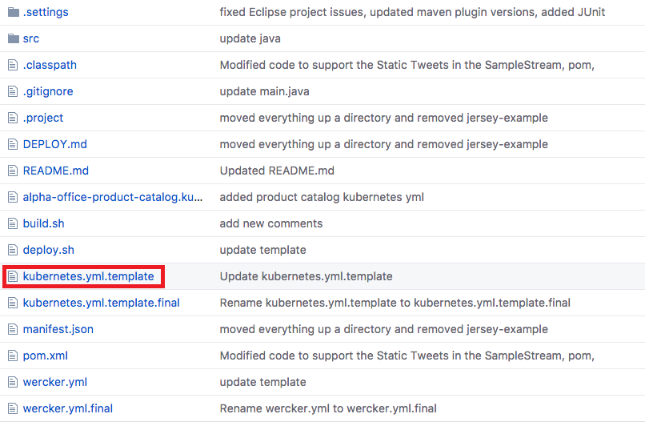

- Click the **pencil icon** to edit the file

  

- After **line 16** in the **spec.template.metadata.labels** section of your Deployment definition, paste the following label on a new line:

`color: blue`
This label will identify our Kubernetes pods as the blue version of the code.

  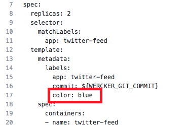

- After **line 26**, in the **spec.template.spec.containers** section of your Deployment definition, paste the following YAML. This will create and mount a volume on our pods that uses the Kubernetes [Downward API](https://kubernetes.io/docs/tasks/inject-data-application/downward-api-volume-expose-pod-information/) to expose the pod's labels to our application. The application will display the pod's color so we can see which version (blue or green) served our webpage.

```yaml
        volumeMounts:
            - name: podinfo
              mountPath: /tmp
              readOnly: false
      volumes:
        - name: podinfo
          downwardAPI:
            items:
            - path: "labels"
              fieldRef:
                fieldPath: metadata.labels
```

**NOTE**: YAML files are sensitive to indentation -- make sure that `volumeMounts` is indented to the same level as `ports` on line 23. Also ensure that `volumes` is indented to the same level as `containers` on line 19. Your file should look like this:

  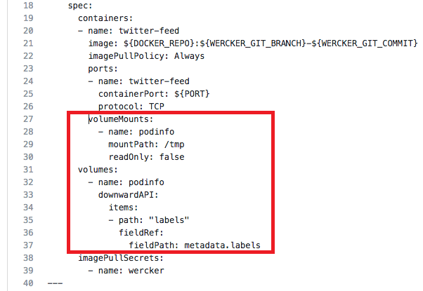

- After **line 53**, in the **spec.selector** section of your Service definition, paste the following label on a new line:

`color: blue`
This selector will instruct your load balancer to only route traffic to the blue version of our code.

  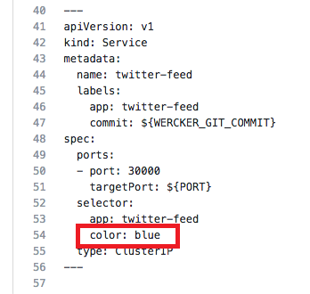

- At the bottom of the page, click **Commit changes**. Wercker will kick off execution of your build and deploy pipelines, which will result in an updated version of your microservice running in Kubernetes.

  

### **STEP 2**: Validate Deployment Color In Kubernetes and Application

- Open **[Wercker](https://app.wercker.com)** in a new tab or browser window, or switch to it if you already have it open. In the top navigation bar, click **Pipelines**, then click on your **twitter-feed** application.

  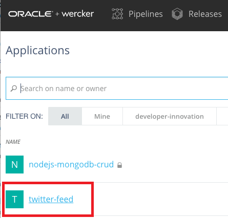

- Monitor the execution of your workflow. Within a few minutes, each pipeline should complete successfully.

  

- Once the workflow has finished, navigate to the [**Kubernetes dashboard**](http://localhost:8001/api/v1/namespaces/kube-system/services/http:kubernetes-dashboard:/proxy/) in a new tab. On the **Overview** page, click on one of the **twitter-feed-v1** pods to view the details.

  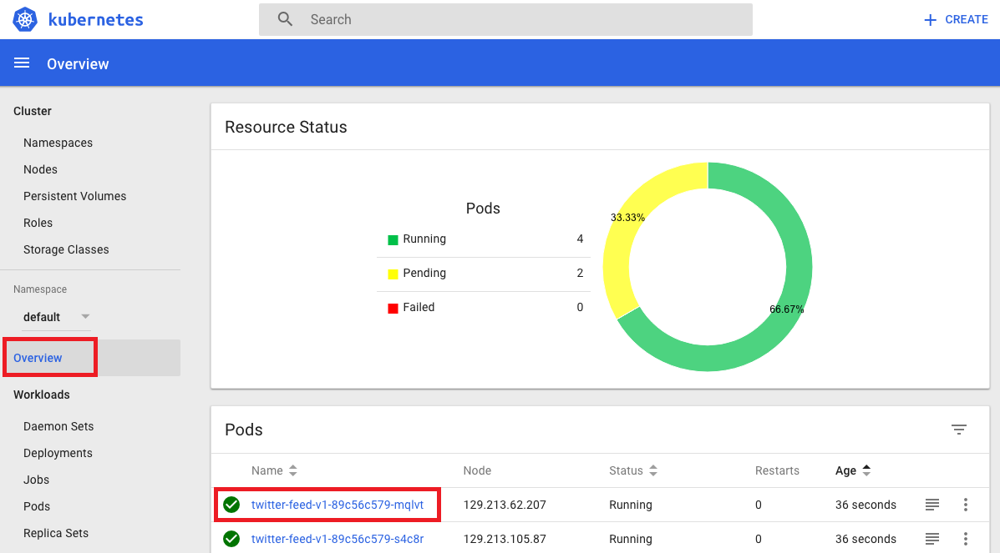

- On the pod details page, note that the label **color: blue** has been added to the pod.

  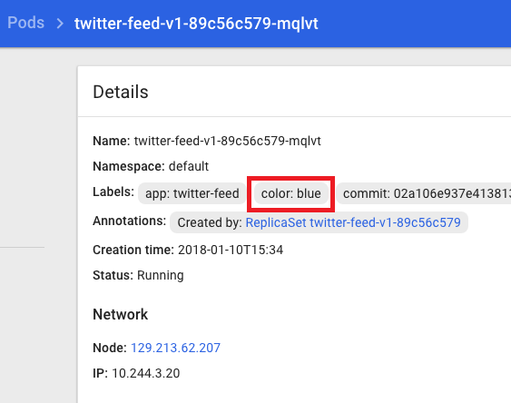

- In the left side navigation menu, click **Services**. In the row for the **product-catalog-service**, click the **External endpoint link** to load the product catalog application.

  

- In the product catalog application, you'll see that the title now indicates which color the twitter feed pod is that is serving our application. Of course it is currently a blue pod, as we haven't yet deployed the new (green) version of our application. Let's do that now, but leave this tab open, as we will come back to it a few more times to verify which color deployment is live.

  

### **STEP 3**: Increment Application Version and Switch Color to Green

- Return to your forked **twitter-feed** repository on [GitHub](https://github.com). Once again, click the **kuberetes.yml.template** file and begin editing it by clicking the **pencil icon**.

  

- On **line 4**, in the **metadata.name** field of your deployment, change the version number of your application to `v2`.

  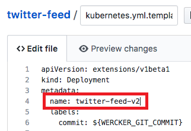

- Change **line 17**, in the **spec.template.metadata.labels** section of your deployment, to read `color: green`.

  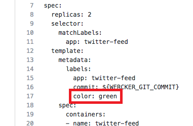

**NOTE**: We are not making any code changes to our microservice between v1 and v2 -- the only difference will be the color label.

- At the bottom of the page, click **Commit changes**. Wercker will once again kick off execution of your build and deploy pipelines. Because we changed the name of the deployment, however, Kubernetes will not replace our existing v1/blue pods with this new version. Both sets of pods will be kept up and running. But, since we did not change the selector in the twitter-feed service, the blue pods will still be the ones serving traffic. Let's make sure that is the case.

  

### **STEP 4**: Validate Blue Deployment Still Serves Traffic

- Switch to your **[Wercker](https://app.wercker.com)** browser tab and go to the twitter-feed **Runs tab**. Monitor the execution of your workflow. Within a few minutes, each pipeline should complete successfully.

  

- Once the workflow has finished, navigate to the [**Kubernetes dashboard**](http://localhost:8001/api/v1/namespaces/kube-system/services/http:kubernetes-dashboard:/proxy/) in a new tab. On the **Overview** page, note that you now have four twitter-feed pods, two blue v1 pods, and two green v2 pods.

  

- Switch to the browser tab where you loaded the **product catalog** application. Refresh the page. The title bar should still indicate that it is using the blue/v1 version of the twitter feed. Now let's reconfigure the load balancer to cut traffic over to the green pods.

  

### **STEP 5**: Reconfigure Service to Switch to Green Deployment

- To cut over to our green deployment, we will use the Kubernetes dashboard GUI to alter the Kubernetes Service that exposes our twitter feed microservice. In a production setting, you could perform this switch in a number of ways. It could be handled by scripting the commands directly using kubectl, by altering the service definition in version control and having Wercker apply it, or by using a different automation framework such as Jenkins.

- Navigate or switch tabs to the [**Kubernetes dashboard**](http://localhost:8001/api/v1/namespaces/kube-system/services/http:kubernetes-dashboard:/proxy/). In the left side navigation menu, click **Services**, then click on the **twitter-feed** service.

  

- Note that the service lists the blue v1 pods as its targets in the **Pods** list. At the top of the page, click the **EDIT** button.

  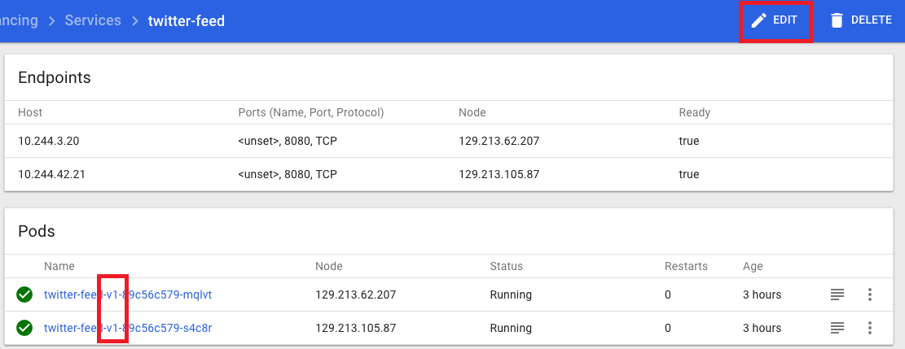

- On **line 29**, change the selector to read `"color": "green"`. Then click the **UPDATE** button.

  

- Note that the targets in the **Pods** list immediately change to the green v2 pods.

  

### **STEP 6**: Validate Green Deployment Now Serves Traffic

- Switch back to the browser tab with the **product catalog** application. Refresh the page. You'll see that the title bar now indicates that we are using the green pods.

  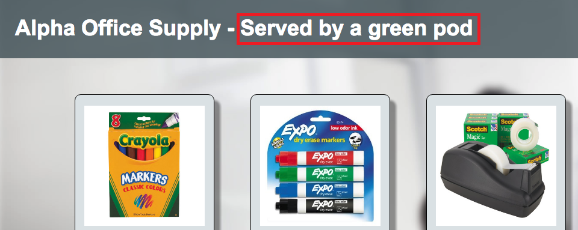

- If an unexpected issue were to arise with the green code version, it would be very easy to undo the change we made to the Service and switch back over to the blue pods, since they are still running. Eventually, the blue version can be taken down by deleting the Deployment that created them. Once again this can be accomplished through the GUI, the kubectl CLI, or via an automation system like Wercker.
