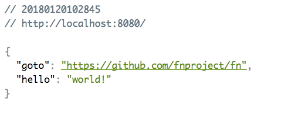
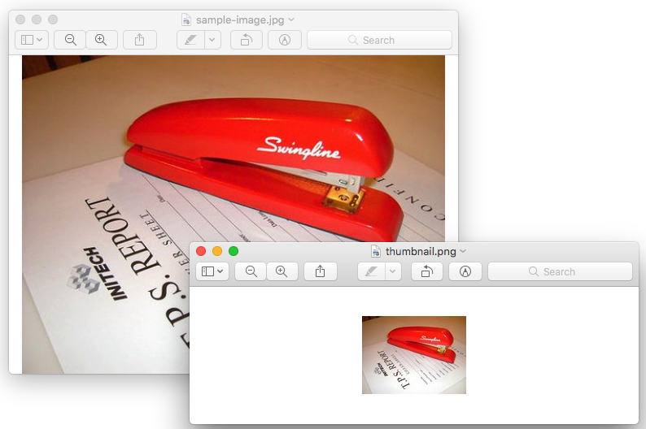
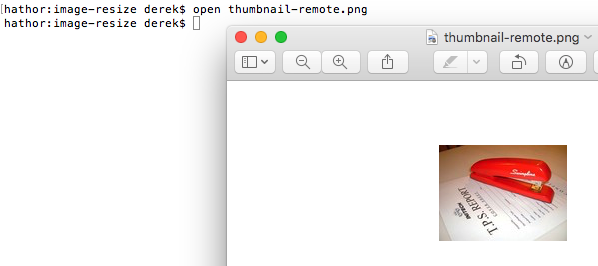
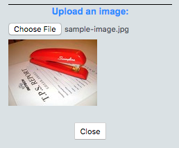

  

## Introduction

This is the fifth lab that is part of the **Oracle Public Cloud Container Native Development workshop.** This workshop will walk you through the process of moving an existing application into a containerized CI/CD pipeline and deploying it to a Kubernetes cluster in the Oracle Public Cloud.

You will take on 2 personas during the workshop. The **Lead Developer Persona** will be responsible for configuring the parts of the automated build and deploy process that involve details about the application itself. The **DevOps Engineer Persona** will configure the parts of the automation involving the Kubernetes infrastructure. To containerize and automate the building and deploying of this application you will make use of Wercker Pipelines for CI/CD, Docker Hub for a container registry, and Terraform for provisioning a Kubernetes cluster on Oracle Cloud Infrastructure.

During this lab, you will take on the **Lead Developer Persona** and extend your application using a serverless function. You will install an Fn Server on your Kubernetes cluster, download your function code from GitHub, try out your function locally, deploy your function to the Fn Server on Kubernetes, and test it in the product catalog application.

**_To log issues_**, click here to go to the [GitHub oracle](https://github.com/oracle/learning-library/issues/new) repository issue submission form.

## Objectives

**Extend Your Application Using a Function**

- Run Your Function Locally
  - Start an Fn Server on Your Local Machine
  - Clone the Function Repository
  - Deploy the Function Locally
  - Test the Function Using curl
- Deploy Your Function to Fn on Kubernetes
  - Install Helm on Your Local Machine
  - Deploy Fn Server to Kubernetes Using Helm
  - Deploy Your Function to Fn Server on Kubernetes
  - Test Your Function in the Product Catalog

## Required Artifacts
- The following lab requires:
  - an Oracle-provided VirtualBox or Cloud-hosted Client Image
  - an Oracle Public Cloud account that will be supplied by your instructor, or a Trial Account
  - a [GitHub account](https://github.com/join)
  - a [Docker Hub account](https://hub.docker.com/)

# Extend Your Application Using a Function

## Run Your Function Locally

### **STEP 1**: Start an Fn Server on Your Local Machine

- Since you are using the Oracle-provided client image, **Fn is pre-installed** for you. Let's start up a local Fn Server. From a terminal, run `fn start`.

  

- You should see the Fn logo printed to the console, as well as a message indicating the port that the Fn Server is using: `Fn serving on ':8080'`. From a browser, navigate to **[http://localhost:8080](http://localhost:8080)**, substituting the port listed in the log message for 8080 if it differs. You should see a 'hello world' message in your browser, confirming that the Fn Server is up and running.

  

### **STEP 2**: Clone the Function Repository

- Now we're ready to get a copy of the image resizing function and test it out on our local Fn Server. From a new **terminal window**, clone the Git repository into a directory of your choice using the following command:

  `cd ~ && git clone https://github.com/derekoneil/image-resize.git && cd image-resize`

  

**NOTE**: Functions deployed to Fn are packaged in Docker containers. You can use any programming language to write your functions, and you can deploy them to any Fn Server -- local, running on your server, or hosted in the cloud. The function you just cloned actually involves no code at all, it is simply a Dockerfile that installs and executes the open source command line tool ImageMagick. Using functions like this is a quick and easy way to convert open source or command line tools to auto-scaling web services.

### **STEP 3**: Deploy the Function Locally

- Now that you have the function 'code', you can deploy it to the local Fn Server you started earlier by running the following command in your terminal window:

  `fn deploy --app imgconvert --local`

**NOTE**: The `--app imgconvert` tells Fn to create a new application named imgconvert and associate this function with it. In general, the application can be named anything you like, but by default the name will show up in the function URL. Since the product catalog application is expecting the app to be named `imgconvert`, don't alter the name.

  

### **STEP 4**: Test the Function Using curl

- With the function deployed to our local Fn Server, we can use **curl** to test it. Execute the following command while still in the image-resize directory in your terminal window:

`curl -X POST --data-binary @"sample-image.jpg" -H "Content-Type: application/octet-stream" http://localhost:8080/r/imgconvert/resize128 > thumbnail.jpg`

  

- Open both the **original and resized images** using one of the following commands to verify that the function did it's job -- which is to resize the image to 128px x 128px.

  `eog sample-image.jpg & eog thumbnail.jpg &`

**NOTE**: You can also use your OS's file explorer to open the images if the above commands don't work.

  

- Now that we've tested our function locally, it's time to set up a remote Fn Server on Kubernetes and deploy our function to the cloud.

## Deploy Your Function to Fn on Kubernetes

### **STEP 5**: Deploy Fn Server to Kubernetes Using Helm

- Since you are using the Oracle-provided client image, the **fn-helm installer** has been downloaded for you. Change directories to the installer with the following command:

  `cd ~/fn-helm`

- Since you opened a new terminal window in the previous step, the `KUBECONFIG` environment variable is no longer set. You could add the export command to `~/.bash_profile` so it is set for every new shell you open. For now, let's just export it locally one more time: 

  `export KUBECONFIG=/home/oracle/terraform-kubernetes-installer/generated/kubeconfig`

- Initialize Helm and upgrade the server-side version (Tiller) by running:

  `helm init --upgrade`

- Prepare the **dependencies** of the Fn chart by running:

  `helm dep build fn`

  

- By default, the server-side component of Helm (Tiller) does not have permissions to perform actions in the `default` namespace. Create a Service Account and bind to the Cluster Admin role to allow Tiller access. **NOTE**: In a production environment, you would want to restrict Tiller to a more limited role than Cluster Admin.

  ```bash
  kubectl create serviceaccount --namespace kube-system tiller
  kubectl create clusterrolebinding tiller-cluster-rule --clusterrole=cluster-admin --serviceaccount=kube-system:tiller
  kubectl patch deploy --namespace kube-system tiller-deploy -p '{"spec":{"template":{"spec":{"serviceAccount":"tiller"}}}}'      
  helm init --service-account tiller --upgrade
  ```
- Install the **Fn chart** by running:

  `helm install --name my-release fn`

  

- As directed by the output of the install command, set the `FN_API_URL` environment variable by waiting for the load balancer to be provisioned and using its external IP address in the URL.

  - To check the status of the load balancer from the command line, run:

    `kubectl get svc --namespace default -w my-release-fn-api`

    

  - Once the **External-IP** field is populated (which could take up to 5 minutes), set the **FN_API_URL** environment variable using the following command:

    ```bash
    export FN_API_URL=http://$(kubectl get svc --namespace default my-release-fn-api -o jsonpath='{.status.loadBalancer.ingress[0].ip}'):80
    ```

    

    **NOTE**: You can also find out the API URL from the [Kubernetes dashboard](). To check the status of the load balancer from the [Kubernetes dashboard](), click **Services** from the left side navigation menu and look at the **External endpoints** column of the **my-release-fn-api** service.   

    

  - Verify that the environment variable was set correctly by running the following command. Note that your IP address will differ from the screenshot.

    `echo $FN_API_URL`

    

### **STEP 6**: Deploy Your Function to Fn Server on Kubernetes

- In the same **terminal window** from the previous step, change directories to cloned function directory from **STEP 2**.

  `cd ~/image-resize`

  

- Since we are pushing to a remote Fn Server, Fn will use Docker Hub as the container registry. We need to set the FN_REGISTRY environment variable to tell Fn which Docker Hub user to push to.

  `export FN_REGISTRY=your-docker-hub-registry`

  

- Log in to **Docker Hub** by running the following command and entering your Docker Hub **username and password** at the prompts:

  `docker login`

  

- **Deploy the function** (and application) to the remote Fn Server using the same command you used in **STEP 3**, but without the --local flag.

  `fn deploy --app imgconvert`

  

- Test the function using **curl**, but this time using the URL of the remote Fn Server:

  ```bash
  curl -X POST --data-binary @"sample-image.jpg" -H "Content-Type: application/octet-stream" $FN_API_URL/r/imgconvert/resize128 > thumbnail-remote.jpg
  ```

  

- Open **thumbnail-remote.jpg** (using the same method you used in the local test) to verify the function was successful:

    `eog thumbnail-remote.jpg`

  

- Our function is deployed and available on our remote Fn Server, which is running in our Kubernetes cluster. The last thing to verify is that the product catalog application is able to find and use our function. Let's test out the upload image feature.

### **STEP 7**: Test Your Function in the Product Catalog

- Open the **product catalog** website in a browser. If you don't have the URL, you can look in the Kubernetes dashboard for the **external endpoint** of the product-catalog-service, or you can run the following command from your terminal window:

  ```bash
  echo http://$(kubectl get svc --namespace default product-catalog-service -o jsonpath='{.status.loadBalancer.ingress[0].ip}'):$(kubectl get svc --namespace default product-catalog-service -o jsonpath='{.spec.ports[0].port}')
  ```

  

- Click any of the **product images** to open the detail view.

  

- In the **Upload an image** pane, click **Choose file**. Select an image (the sample image or any other) and click **open**.

  

- You'll see a loading spinner in the upload pane while your browser uploads the full size image to the product catalog server. The product catalog server invokes your function (resolved using Kubernetes DNS service at the URL `http://my-release-fn-api/r/imgconvert/resize128`). The thumbnail is returned to the product catalog server, which passes it back to your browser to be displayed. If everything worked correctly, you'll see the generated thumbnail displayed in the upload pane.

  

- Congratulations! You've just used the Fn Project to create and deploy a new serverless function to extend your application!

**You have completed the Container Native Application Development Workshop**
