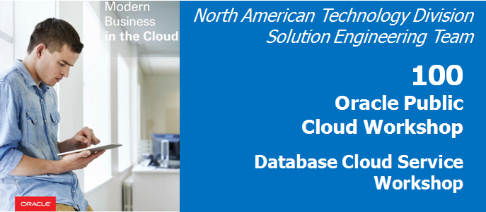

Update January 25, 2018

## Introduction

This is the first of several labs that are part of the Oracle Public Cloud Database Cloud Service workshop. These labs will give you a basic understanding of the Oracle Database Cloud Service and many of the capabilities around administration and database development.  Note that this workshop uses Oracle's Oracle Compute Infrastructure (OCI) Database VM service, and not the legacy 'Classic' service or Bare Metal service.

This lab will walk you through creating a new Database Cloud Service, and then have you connect into the Database image using the ssh private key to familiarize yourself with the image layout. Next you will learn how to create a ssh tunnel to access ports that are closed on a remote OPC instance. Using the tunnels, you will learn how to access various Database consoles.  

**Note:  It will be helpful to have a notepad open as a holding place to copy and paste various items throughout all the labs.** 

Note that if you performed the setup steps for this and the following labs some of these steps will be familiar.

- To log issues and view the Lab Guide source, go to the [github oracle](https://github.com/oracle/learning-library/tree/master/workshops/dbcs-dba-oci) repository.

## Objectives
-	Familiarize yourself with the Oracle Cloud Infrastructure.
-	Backup your local database to the Oracle Cloud.
-	Create a Virtual Cloud Network (VCN).
-	Create Database Cloud Service.
-   SSH configuration.
-   Explore VM and consoles.

## Required Artifacts

-   The following lab requires a VNC Viewer to connect to an Image running on Oracle's IaaS Compute Service.

## Log into the Oracle Cloud Infrastructure Console

### **STEP 1**:  Log into your Oracle Cloud Account

### **STEP 2**:  Access Database Console and Copy Public IP for WorkshopImage

-	You will be accessing the **Database (OCI)** service.  If it is not already visible select `Customize Dashboard`.

	

-	Scroll down and select `Show` for `Database (OCI)`.  Do **not** select just `Database` (the one above).  Then close the window.

	

-	Select **Database (OCI)** Service and then Console.

	

		

-	Then select Database - DB Systems.

	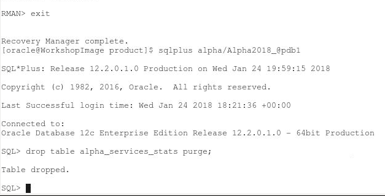	

-	Note the **Public IP Address** on the WorkshopImage.  Write this down.  We will be using it several times throughout the labs.

	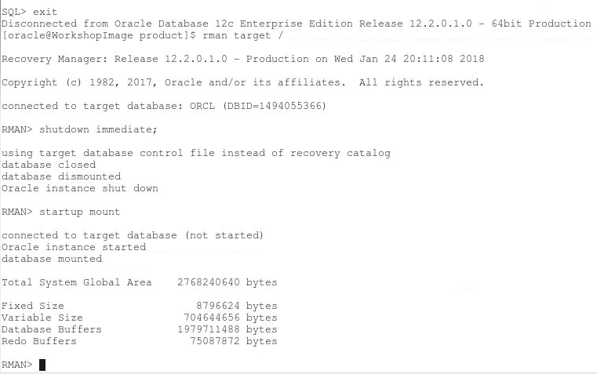	

### **STEP 3**:  Connect to the WorkshopImage using your VNC Viewer

-	If you do not already have a VNC Viewer, download realvnc or tightvnc from the internet and install on your computer. Run the VNC Viewer and enter the Public IP you just copied, along with appending :1. You will be prompted for a password.  If you ran the setup instructions for vnc server you would have entered this password yourself.  Obtain this from the person who ran the setup for you if it was another person.

	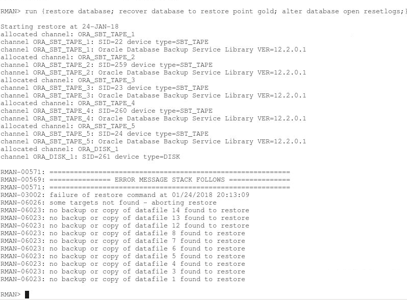	

-	You will log into the following desktop.

		

## Create Database Cloud Service

### **STEP 4**:  Create a Virtual Cloud Network (VCN)

-	Open the browser on the image desktop.  Note that while you can use your own browser on your own desktop, in step 5 below you will need a public key, and to keep things simple we'll be using the same key that was used to create the WorkshopImage, and so you need to be running the browser inside the image to select the key (below).

	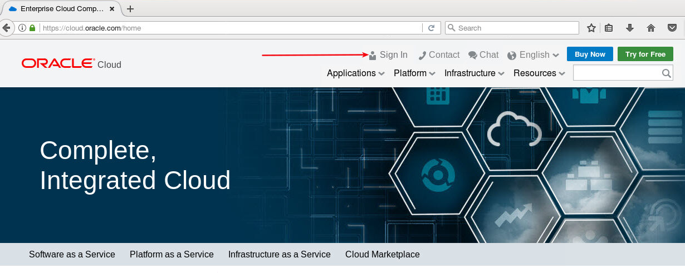	

-	Log into your cloud account.

		

-	Go to Networking - Virtual Cloud Networks.  Note that if you previously set up a VCN as part of the setup process you can use that VNC instead of creating another in this step.

		

-	Select Compartment `Demo`.

	

-	Next select `Create Virtual Cloud Network`.  Those that previously ran the setup steps may choose to use the existing VCN.

	

-	Take defaults for all the fields except ensure you select `CREATE VIRTUAL CLOUD NETWORK PLUS RELATED RESOURCES` option.

	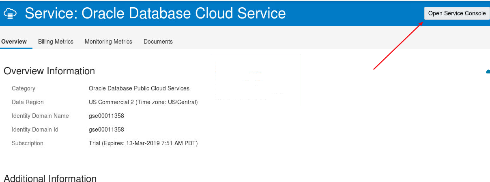

-	Scroll to the bottom and save and close.

	

	

### **STEP 5**:  Create a Database Cloud Service

-	Select Database - DB Systems.

	

-	Select Launch DB System

	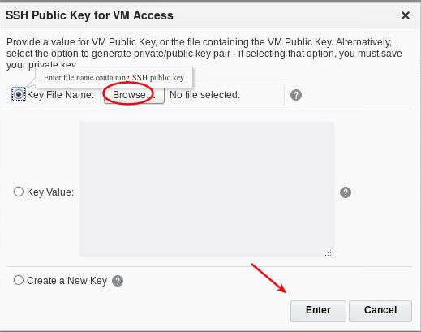

-	Enter the follwing details:
	- **Display Name:**  `Alpha01A-DBCS`
	- **Availability Zone:**  Select what is available.  Note depending on capacity you may need to try more than one zone.  If you do not have capacity then you will be advised when you save the configuration, after which you can try another zone.
	- **Shape Type:**  `VM.Standard1.1`
	- **Software Edition:**  `Enterprise Edition` (note if you select Standard Edition you will not be able to migrate transportable tablespaces in lab 200).
	- **Available Storage Size:** 256GB
	- **Licence Type:**  `License Included`

	

-	Scroll down and select SSH public key.

	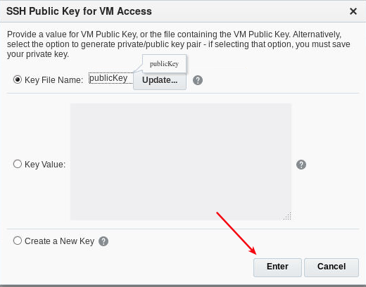

-	Select File System on the left and select the tmp directory

	

-	Select publicKey.pub file.

	

-	Select the VCN you just created.  The other VCN that was created for WorkshopImage during setup will also work.

	

-	Select the available Client Subnet (only one should be available in the dropdown), and enter `alpha` as the HOSTNAME PREFIX.

	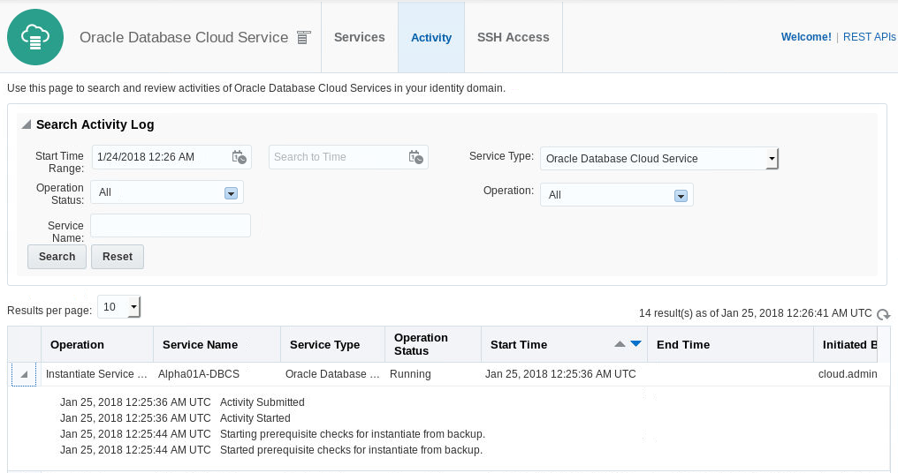

-	Enter the following database details:
	- **Database Name:** `ORCL`
	- **Database Version:** `12.2.0.1` (note it is important to select this version)
	- **PDB Name:**  `PDB1`
	- **Database Admin Password:** `ALpha2018__` (with two underscores)
	- **Do not select automatic backup**

	

-	Launch DB System.  Note this will take approximately 70 minutes to create.

	

## SSH Configuration and Image Exploration

### **STEP 6**:  Record the IP Addresses of the Database Cloud Service

-	Log back into the Cloud Console to copy the IP address of the new Alpha01A-DBCS instance.

	

-	Note the Private and Public IP addresses of the `Alpha01A-DBCS` instance.  Write these down, we will use them later.

	

### **STEP 7**:  Open a New SSH Connection to Browse the Database Image

-	Since we will be using a terminal window frequently we will pin the terminal window to the panel.  Open a new terminal window on the VNC desktop and enter the following.

	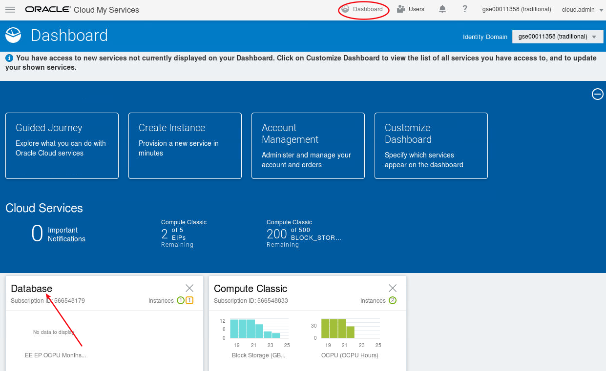

-	Open a new terminal window.

	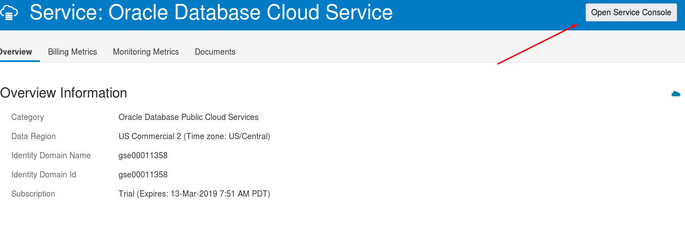

-	Enter the following to connect.
	- `ssh -o StrictHostKeyChecking=no -i /tmp/privateKey opc@<Alpha01A-DBCS IP>`

-	Enter the following to review the image layout.
	- `sudo su - oracle`
	- `. oraenv` note there is a space between dot and ora - enter `ORCL`
	- `env | grep ORA`
	- `cd $ORACLE_HOME`
	- `ls`
	- `exit`

	

## Create Connection in SQL Developer

### **STEP 8**:  Set up CDB Connection in SQL Developer

-	Open SQL Developer off the desktop and select the View - SSH menu.

	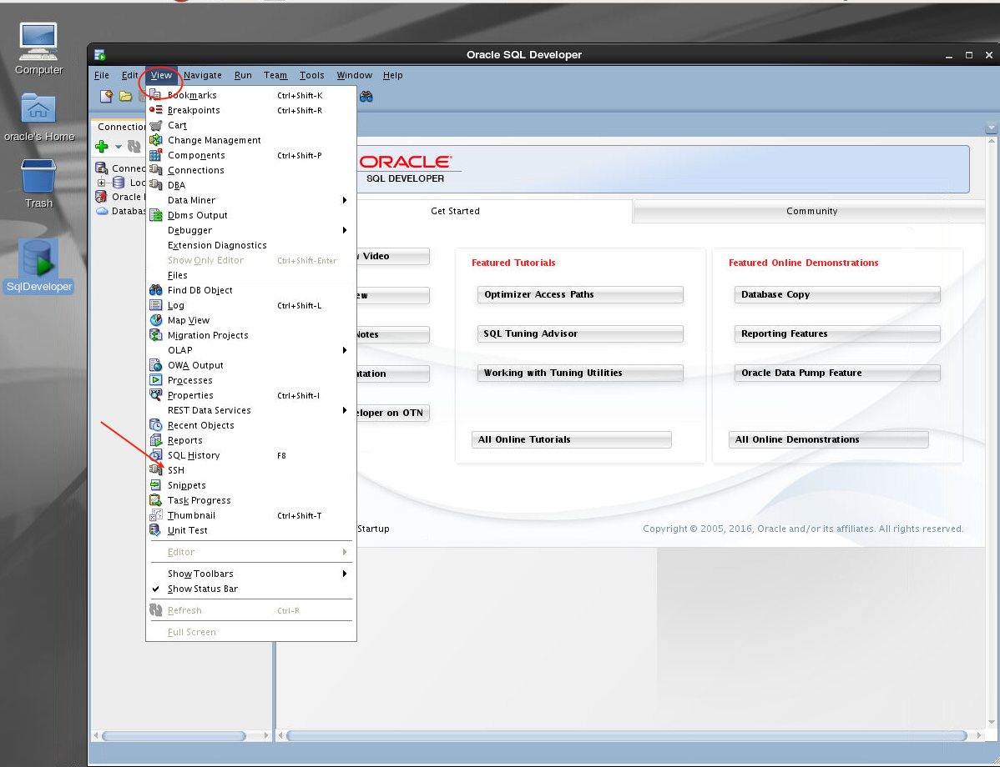

-	Right click on SSH Host and select New SSH Host.

	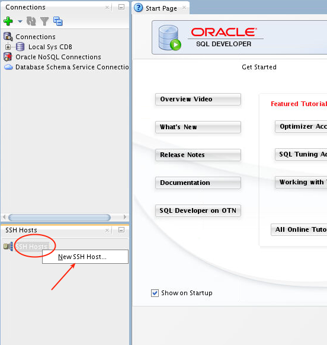

-	Enter the following.
	- **Name:** `Alpha01A-DBCS`
	- **Host:** `<Alpha01A-DBCS IP>`
	- **Username:** `opc`
	- Select Use Key File

	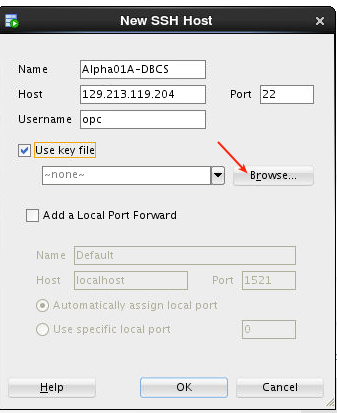

-	Select `privateKey` in the `/tmp` directory.

	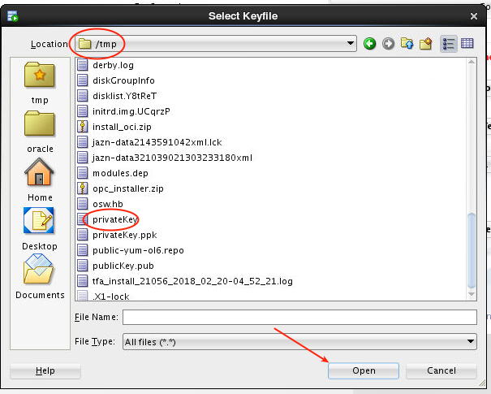

-	Add a Local Port Forward.  Be sure to specify the private IP (not public one you have  been using).
	- **Name:** `Database`
	- **Host:** `<Private IP for Alpha01A-DBCS>`
	- **Use specific local port:** `1530`

	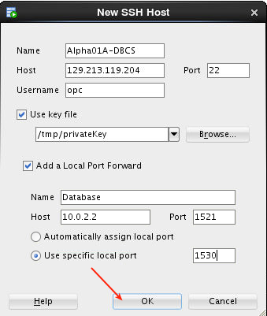

-	Test the tunnel by right clicking on it and select test.

	

	

-	In a separate window log into the Cloud Console and select the `Alpha01A-DBCS` instance.  We will copy/paste the host and database name from the instance information.

	

-	The connect string will be a concatination of the Database Unique Name and the Host Domain Name.

	

-	Go back to SQL Developer and create a new connection.  Right click on Connections and then select the New Connection.

	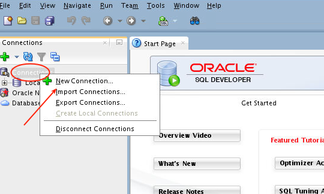

-	Enter the following and then select Test:
	- **Connection Name:** `Alpha01A-DBCS
	- **Username:** `sys`
	- **Password:** `ALpha2018__`
	- **Connection Type:** `SSH`
	- **Role:** `SYSDBA`
	- **Port Forward:** `Database (Alpha01A-DBCS)
	- **Service Name:** `<your database unique name.hostname>` from above

	

-	Select Connect.

	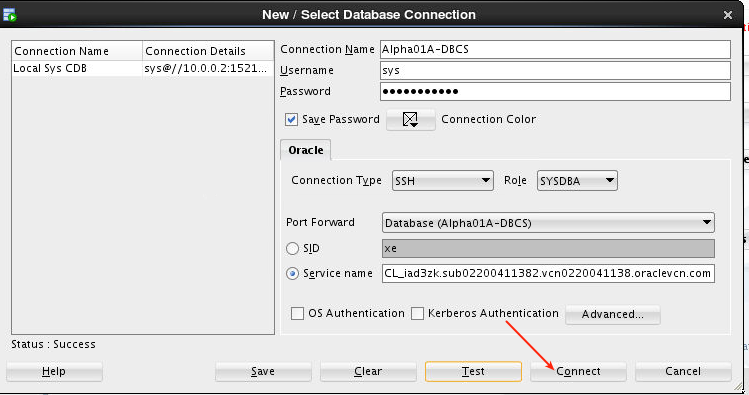

### **STEP 9**:  Access Enterprise Manager DB Express

-	We first need to configure the http port.  To verify whether the EM Express port is configured we need to set the http port.  Using the connection you just created above enter these commands one by one, hightlight them and then execute them.
-	`exec dbms_xdb_config.sethttpport(5500);`
-	`select dbms_xdb.gethttpport() from dual;`

	

	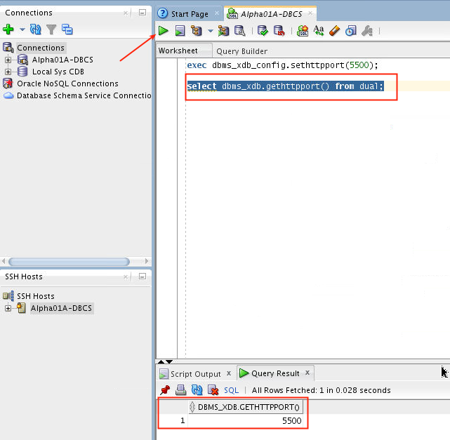

-	We will use tunneling to access the EM Express Console on Alpha01A-DBCS, which is running on port 5500.  Since we are doing this from the WorkshopImage, and that image is also running EM Express on 5500, we will tunnel using 5555 (an arbitrary open port).  Open a terminal window and enter the following.  Note - do **NOT** close the window after the tunnel is opened.  Note you are entering BOTH the private and public IPs.
	- `ssh -o StrictHostKeyChecking=no -i /tmp/privateKey -L 5555:<Private IP of Alpha01A-DBCS>:5500 opc@<Alpha01A-DBCS IP>`

	

-	Open a Firefox Browser and enter the following URL.  Note you will be prompted to confirm a security exception - accept all the prompts.
	- `http://localhost:5555/em`

	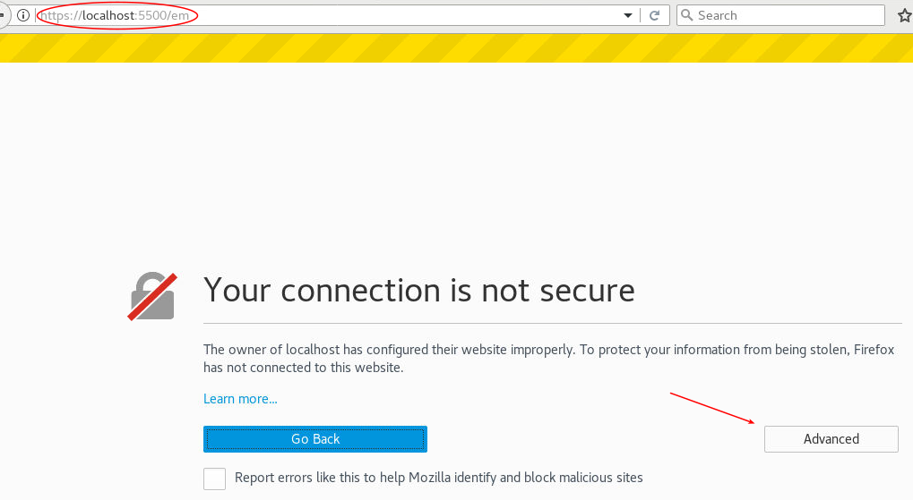

	

	

-	Login with the following details.  Note the first time you log in it will take a minute or two.
	- **User Name:** `sys`
	- **Password:** `ALpha2018__` (two underscores)
	- **check as sysdba:** 

	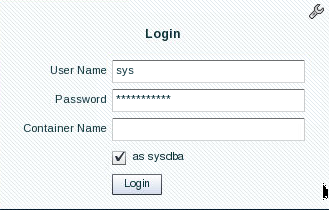

-	You may encounter a but whereby the browser fails to fully open the web page.  This is due to an adobe-flash bug with certain browsers.  To resolve this go (while the browser is locked opening the page) to tools (top menu in the browser) and select `tools > Web Developer > Debugger`.

	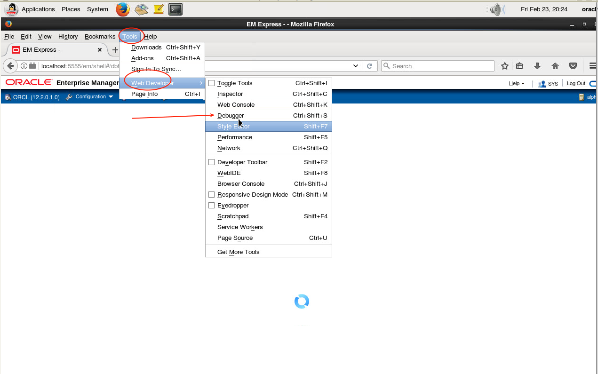

	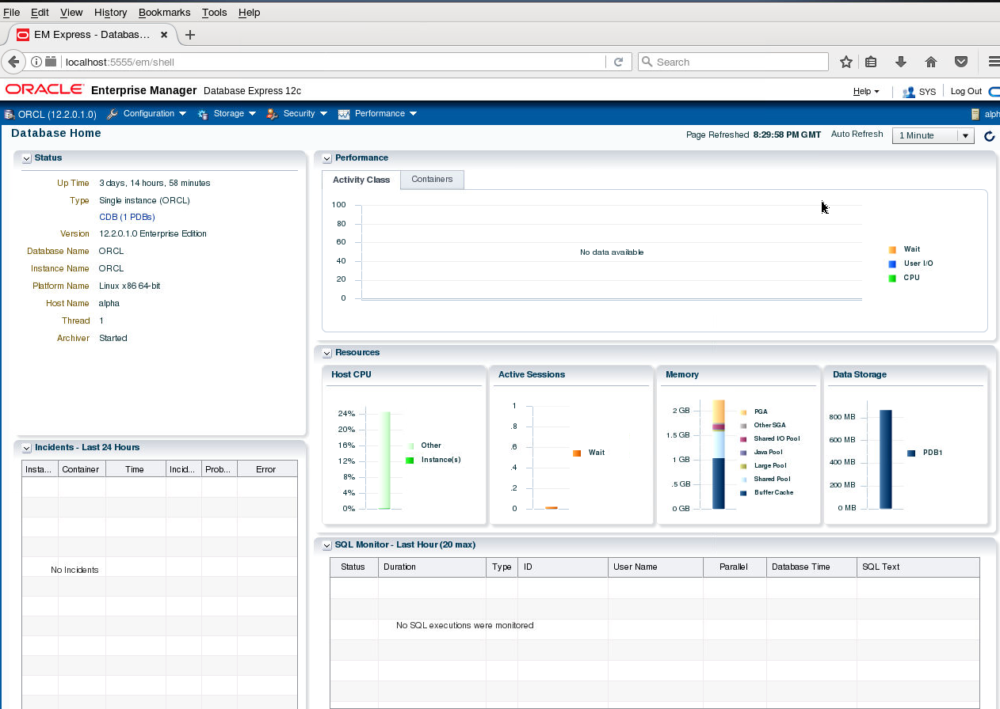

This completes Lab 100.  You can proceed to Lab 200.