# Docker on the Oracle Cloud Demo Lab

 

Updated: June 23, 2018

## Introduction
_Time to Complete: 40 minutes_

In this lab, you look at various application components deployed in three Docker containers. The AlphaOffice application offers a list of products from a catalog which includes four Docker containers. Refer to the `Product Catalog Application` section of the diagram below. 

**NOTE:** In this lab, the "database" product catalog is bundled with the REST service and the product listing is provided via JSON. In a follow-up lab, you use an Oracle or MYSQL database as the datasource.

The AlphaOffice UI container retrieves catalog information from a REST service (written in Node.js) running in a separate container. It also uses sample Twitter feed data from a REST service (written in Java), also running in its own container, and combines the data into a unified front end.


The AlphaOffice UI is shown below.


## Objectives

- Connect into your account using VNC Viewer
- Perform some docker commands to see various aspects of the set up
- Use the AlphaOffice application
- Edit the UI Docker container and make small changes to the application.

## Technology Overview

### What is Docker? What is a container?

- Docker is the company and containerization technology.
- [Docker Documentation](https://docs.docker.com)
- A container is a runtime instance of a docker image: [Container Documentation](https://docs.docker.com/glossary/?term=container)

Containers have been around for many years. Docker created a technology that allows developers to create and package containers into applications that are portable and lightweight.

### VM vs Container


While containers may sound like a virtual machine (VM), the two are distinct technologies. With VMs each virtual machine includes the application, the necessary binaries and libraries and the entire guest operating system.

Whereas, Containers include the application, all of its dependencies, but share the kernel with other containers and are not tied to any specific infrastructure, other than having the Docker engine installed on it’s host – allowing containers to run on almost any computer, infrastructure and cloud.

### Prerequisite

Once the infrastructure is provisioned you can access your enironment using `VNC Viewer`. Please download and install from: [VNC Viewer](https://www.realvnc.com/en/connect/download/viewer/)

## Instructions

### Access Your Environment

- Click **Launch Demo Lab**.
   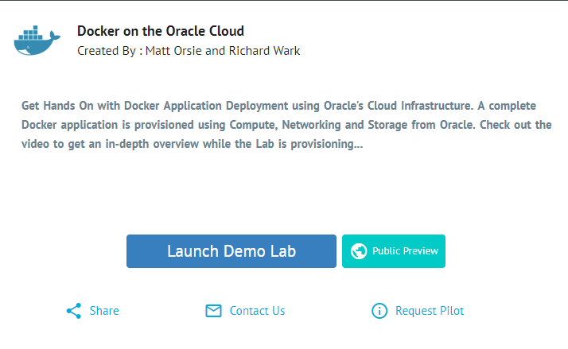

- In 6 minutes the Oracle IaaS infrastructure including the Application already running and deployed will be available.

  

- While you're waiting, check out the short video that gives an overview of this session.

  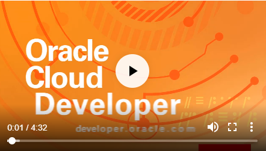

- When the environment is ready you will see the following along with the connect string to put into VNC Viewer. (In this example 129.213.56.126:1. Your IP address will be different)

  

- **NOTE: You have 30 minutes** before the environment will go away.

  


### **STEP 1**: Start VNC Viewer

Using VNC Viewer to connect to your provisioned account.

- Enter the connect string you were given (Example Shown below).

  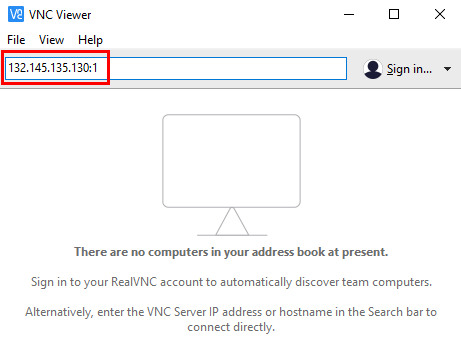

- If presented with this prompt, click **Continue**.

  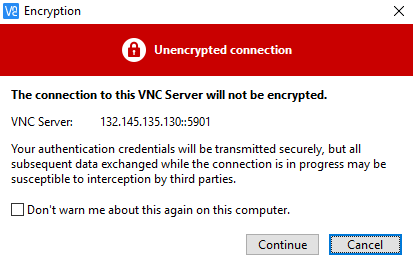

- Enter the VNC password  **Qloudable**. 

  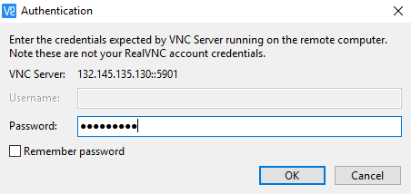

- Your Desktop is displayed.

  

 ### **STEP 2**: Run the AlphaOffice Application

- Click the **Applications** tab and select **Firefox Web Browser**.

  

- **Type** the URL: **localhost:8085**

  

- The Application is displayed. **NOTE:** There is a typo in the tab (Aplha). You will fix this in a few minutes...

  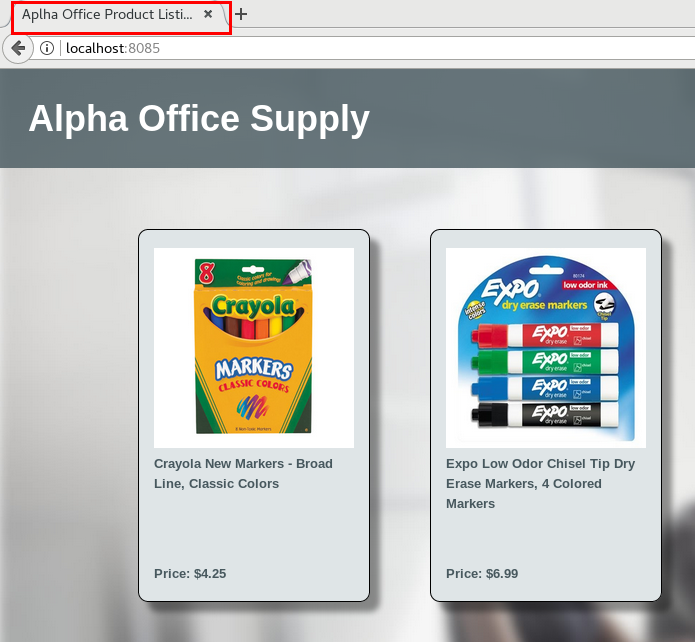

- Click the **Crayola Markers** product to see associated Twitter feeds.

  

- **Minimize the browser**. Later in this Lab, you make a change to the application and return to this page to see your change.

### **STEP 3**: Run Docker Commands

Run some Docker commands to explore details about the installation and the AlphaOffice containers.

- Open a terminal session. On the desktop **right-click** and select **Open Terminal**

    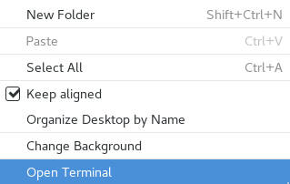

- **Type** the following:

```
su - opc
docker version
```

This logs you into the `opc` user and shows the current Docker version (`18.03`)

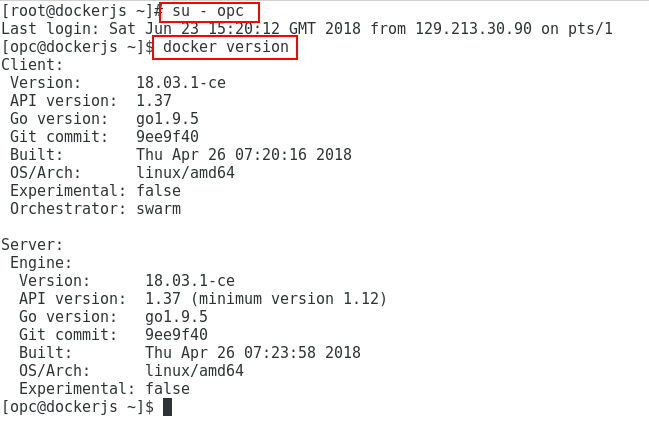

- **Type** the following to view the Docker containers that are running.

```
docker ps
```

  

The output shows three containers running named:
```
alphaofficeui
restclient
twitterfeed
``` 
The unique container ID that docker assigns at runtime is shown along with the startup command and the networking ports that the containers have exposed. These are mapped to the HOST operating sytem's server ports for external consumption. The TwitterFeed Java application is running on port 9080, the RESTClient is on port 8002 and the AlphaOffice UI is on port 8085.

Docker uses a default network called `bridge` and assigns virtual IP addresses to each container. Any containers on the same network subnet can implicity see each other.

- **Type** the following:

```
docker network ls
```

  

- `docker inspect` displays the details associated with a particular container. Storage locations, storage volumes, storage types, networking subnet, IP address and much more. To get information on the `restclient` container, for example, **Type** the following:

```
docker inspect restclient
```

- Scroll through the JSON output. 

  

The output above shows the Creation Date, container status, The process ID (`2351`) on the HOST operating system, the path location on the HOST where container specific information is stored (`/var/lib/docker/...`), the type of storage overlay that Docker is using on the HOST opearating system (In this case, `overlay2`).

- Take the PID (Process ID) of the `restclient` container and see what is running on the HOST (In this example the process ID is 2390. Substitute your <PID> in its place).

- **Type** the following:

```
ps -ef | grep <PID>
```

A Node.js application `server.js` is running.


- Let's look at the `restclient` container and see what is running. **Type** the following sequence:

```
docker exec -it restclient bash
ps -ef
exit
```
- Notice that the same application is running.

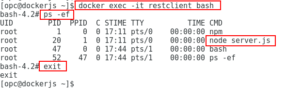

- View the `restclient` inspection output. Notice the output shows the arbitrarily assigned hostname (You can give the container a hostname on startup if you want), and the HOST exposed network port (`8002`).

  

- In addition, notice the output shows networking specifics for the container: the Docker virtual network that it is on (`bridge`), the ports the container is using (`8002`) and the assigned IP address (`172.17.0.4`).

    

 - **Cut and Paste** the following to get a list of all IP addresses from the current running containers:

 ```
 docker ps -q | xargs -n 1 docker inspect --format '{{range .NetworkSettings.Networks}}{{.IPAddress}}{{end}} {{ .Name }}' | sed 's/ \// /'
 ```
Example output (your IP assignments may vary):

    

### **STEP 4**: Make changes to the AlphaOffice application

In this step, you make a couple of changes to the AlphaOfficeUI application. One will correct a typo and another will change the background image. The tasks you follow in this step are as follows:

- Copy the new background image into the container
- Connect to the AlphaOfficeUI container
- Install the vim text editor
- Fix a typo and specify the new background image
- Save (docker commit) a copy of the changes to a NEW docker image
- Start up and test the AlphaOfficeUI container using the NEW image

#### **STEP 4a**: Copy a New Background Image

Copy a background image file into the running AlphaOfficeUI container. This file is in the `/home/opc/AlphaOfficeSetup` directory.

**NOTE:** Make sure you are still logged in as the `opc` user. You can check by typing `whoami`. If not, type `su - opc` to login as the opc user.

- **Type or Cut and Paste** the following:

```
docker cp /home/opc/AlphaOfficeSetup/dark_blue.jpg alphaofficeui:/pipeline/source/public/Images
```

  Example: `docker cp /home/opc/AlphaOfficeSetup/dark_blue.jpg alphaofficeui:/pipeline/source/public/Images`

#### **STEP 4b**: Install the VIM editor in the UI container

Even though the original AlphaOfficeUI image could have been set up ahead of time with any needed client tools you will install it now.

- Connect into the `alphaofficeui` container:

```
docker exec -it alphaofficeui bash
```

- **Type** the following:

```
apt-get update
```

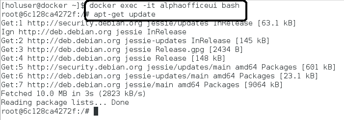


- Verify the "**dark_blue.jpg**" file is in the container by **typing** the following:

```
ls /pipeline/source/public/Images
```


#### **STEP 4c**: Edit the alpha.html file   

- Edit the `alpha.html` file to fix a typo - Note, if you are unfamiliar with `vim`, you'll find information at this URL: [VIM](http://vimsheet.com). The commands are very similar to vi.

```
vim /pipeline/source/public/alpha.html
```

- Fix the header title to read "**Alpha Office Product Catalog**". You can also change the body title to whatever you want:

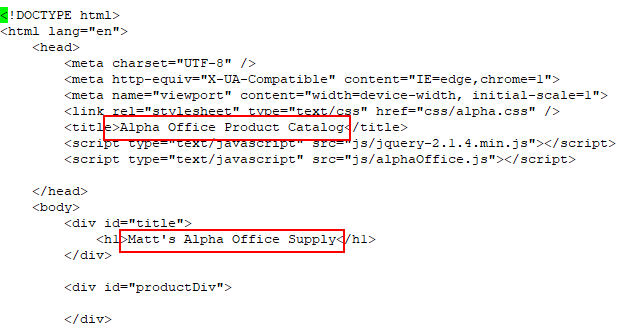

- Save the file and exit by hitting the **ESC** key and then holding the **SHIFT** key down and typing "**Z**" TWICE

#### **STEP 4d**: Edit the alpha.css file

- **Type** the following:

```
vim /pipeline/source/public/css/alpha.css
```

- Change the background image reference to **dark_blue.jpg**


- Save the file and exit by hitting the **ESC** key and then holding the **SHIFT** key down and typing "**Z**" TWICE

- **Exit** out of the container:

```
exit
```

#### **STEP 4e**: Commit a NEW Docker image

- Save a copy of your modifed docker container and give it a new name. (**NOTE:** You're back out in the HOST now). You can assign whatever <`image-name`> you want.
**NOTE:** \<image-name> must be in lower case.

- **Type** the following:

```
docker commit alphaofficeui jumpstart/<image-name>
```
  
- Example: `docker commit alphaofficeui jumpstart/alphaoffice-new`

- **Type** the following:

```
docker images
```

 - The new image is available:


#### **STEP 4f**: Start a container based on your new image

**Stop** and **remove** the currently running AlphaOfficeUI container. Then, start a new container based on your changes.

- **Type** the following:

```
docker stop alphaofficeui
docker rm alphaofficeui
```

Start a container using your new Docker image.

- Let's take a look at what the docker **run** command options do:
    - "-d" flag runs the container in the background
    - "--restart unless-stopped" Restarts the container if it goes down unexpectedly... UNLESS it is stopped manually
    - "--name" The name of the container will be "alphaofficeui"
    - "-p" Port 8085 is mapped from the container to the same port on the HOST

- **Cut and Paste OR Type** the following:

```
docker run -d --restart unless-stopped --name=alphaofficeui -p=8085:8085 jumpstart/<image-name>
```

- Example: `docker run -d --restart unless-stopped --name=alphaofficeui -p=8085:8085  jumpstart/alphaoffice-new`

- Verify the new container is running by **typing** the following:

```
docker ps
```


- If your browser is still minimized then maximize it and refresh the AlphaOffice tab. If it's closed, then restart Firefox from the Desktop `Applications` tab and go to:

```
http://localhost:8085
```


# Where do I go from here?

If you would like to experience a more in-depth look at how this Docker infrastructure was created in the Oracle Cloud and how the AlphaOffice application can be deployed using an Oracle OR MYSQL database as the RESTclient datasource please go to: **\<link-goes-here>**

- **NOTE:** When the Lab's allotted time has expired (30 minutes) you will see the following:

  

**This completes the Jump Start**
