# Docker on Windows the Oracle Cloud

Updated: November 5, 2018

## Introduction

This document is a broad brush flow for assistance regarding the hands-on Docker experience if Ledcor decides they’d like to look at a .NET Core application (in this example an ASP app) running in the Oracle Cloud. This will cover options for Linux and Windows instances running in a Compute Cloud Service.
NOTE: Oracle trial accounts will only be able to run the Linux and Windows 2016 (VM) versions as they no longer include Bare Metal shapes. As such the preferred Windows Docker usage (IMO) of running Linux Docker containers on top of Hyper-V cannot be done in the trial accounts (last option documented below). However, the “Docker Toolbox for Windows” option can be shown on a Windows 2016 Standard VM shape. All variations are noted here for completeness.

This document is not a step by step flow to the entire end game. Rather, tt assumes familiarity with OCI, Docker and Windows.

### Exploring some Options

[Bring your Windows image to the Oracle Cloud](https://blogs.oracle.com/cloud-infrastructure/bring-your-own-image-of-windows-server-to-oracle-cloud-infrastructure)

[Windows 2016 Datacenter on the Oracle Cloud](https://blogs.oracle.com/cloud-infrastructure/windows-server-2016-datacenter-on-oracle-cloud-infrastructure)

## Running an ASP .NET Core app on Oracle Linux 7.x:

- Using the compute instance from the Docker workshop run the following docker command:

  ```
  docker run -d -p 80:80 --name aspdotnet wvbirder/aspdotnet
  ```

- Open up a browser and go to the Linux VM’s public IP address:

  The docker image was created with a DockerFile located in the same directory as the application source for the ASP application. It was then pushed to DockerHub as wvbirder/aspdotnet.

  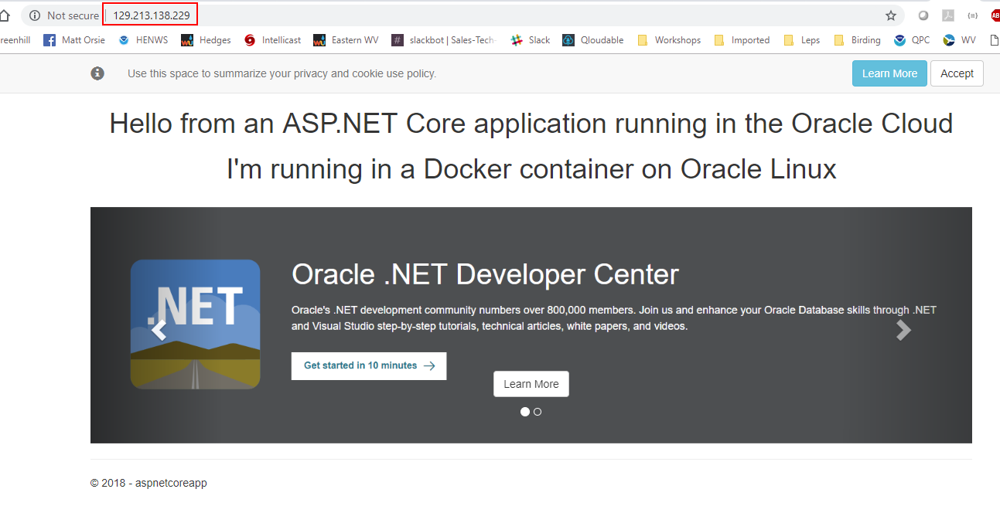

- Bash into the running container to see some of the ASP application specifics.

  ```
  docker  exec –it aspdotnet  bash
  ```

- Type **exit** to leaver the container.

- You’ll see the application contents, etc.

  

- Showing the contents of `aspnetcoreapp.runtimeconfig.json`:

  ```
  root@5639aaec3082:/app# more *runtime*   
  {
    "runtimeOptions": {
      "tfm": "netcoreapp2.1",
      "framework": {
        "name": "Microsoft.AspNetCore.App",
        "version": "2.1.1"
      },
      "configProperties": {
        "System.GC.Server": true
      }
    }
  }
  ```

## Flow to Create this Application and then Dockerize

- Install the [.NET Core SDK](https://www.microsoft.com/net/download) for Windows, macOS, or Linux.

- Create a new ASP .NET Core application.

  ```
  dotnet new webApp -o aspnetcoreapp
  cd aspnetcoreapp
  ```

-	Install the HTTPS development certificate.

    ```
    dotnet dev-certs https –trust
    ```

- Run the application locally.

   ```
   dotnet run
   ```
  
- In a browser go to: http://localhost:5001

  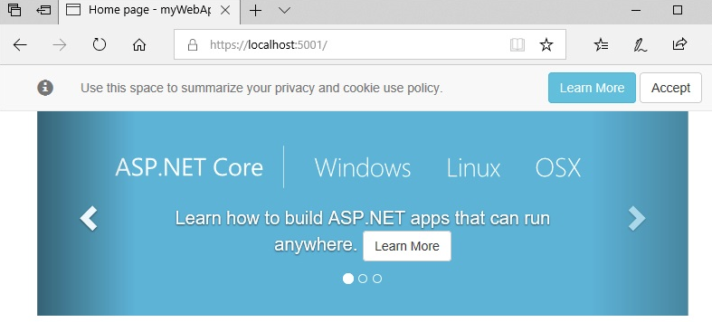

- Now that is tested and running, add a `Dockerfile` (case sensitive) into the directory with the follow contents:

  ```
  FROM microsoft\/dotnet:sdk AS build-env
  WORKDIR /app
  
  # Copy csproj and restore as distinct layers
  COPY *.csproj ./
  RUN dotnet restore
  
  # Copy everything else and build
  COPY . ./
  RUN dotnet publish -c Release -o out
  
  # Build runtime image
  FROM microsoft/dotnet:aspnetcore-runtime
  WORKDIR /app
  COPY --from=build-env /app/out .
  EXPOSE 80/tcp
  ENTRYPOINT ["dotnet", "aspnetcoreapp.dll"]
  ```

- Create a `.dockerignore` file in the same directory to exclude unwanted binary andbuild files. This reduces the Docker image size. Put the following in the file:

  ```
  bin\
  obj\
  ```

-	The contents of the directory will look like:

    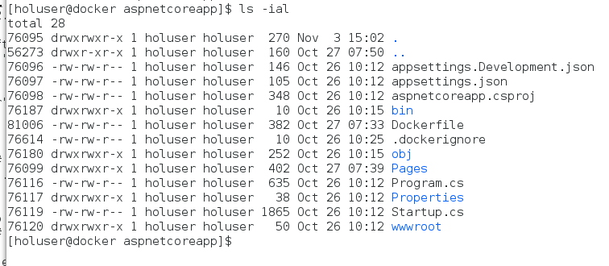

- Build the Docker image: **Don’t forget the period .**

  ```
  docker build -t aspnetcoreapp .
  ```

- Example Outout:

  ```
  docker build -t aspnetcoreapp .
  Sending build context to Docker daemon  4.518MB
  Step 1/11 : FROM microsoft/dotnet:sdk AS build-env
   ---> 6baac5bd0ea2
  Step 2/11 : WORKDIR /app
   ---> 4c545e370389
  Removing intermediate container 5b1dcc3f60e0
  Step 3/11 : COPY *.csproj ./
   ---> 233a7569671e
  Removing intermediate container a31830f912c2
  Step 4/11 : RUN dotnet restore
   ---> Running in fc8dcbf2eb26
    Restoring packages for /app/aspnetcoreapp.csproj...
    Generating MSBuild file /app/obj/aspnetcoreapp.csproj.nuget.g.props.
    Generating MSBuild file /app/obj/aspnetcoreapp.csproj.nuget.g.targets.
    Restore completed in 3.63 sec for /app/aspnetcoreapp.csproj.
   ---> 72b0eff319b0
  Removing intermediate container fc8dcbf2eb26
  Step 5/11 : COPY . ./
   ---> 4067965d6250
  Removing intermediate container 597453a00221
  Step 6/11 : RUN dotnet publish -c Release -o out
   ---> Running in 159ded68d1a9
  Microsoft (R) Build Engine version 15.8.169+g1ccb72aefa for .NET Core
  Copyright (C) Microsoft Corporation. All rights reserved.
  
    Restoring packages for /app/aspnetcoreapp.csproj...
    Generating MSBuild file /app/obj/aspnetcoreapp.csproj.nuget.g.props.
    Generating MSBuild file /app/obj/aspnetcoreapp.csproj.nuget.g.targets.
    Restore completed in 4.73 sec for /app/aspnetcoreapp.csproj.
    aspnetcoreapp -> /app/bin/Release/netcoreapp2.1/aspnetcoreapp.dll
    aspnetcoreapp -> /app/bin/Release/netcoreapp2.1/aspnetcoreapp.Views.dll
    aspnetcoreapp -> /app/out/
   ---> 5739f62dec78
  Removing intermediate container 159ded68d1a9
  Step 7/11 : FROM microsoft/dotnet:aspnetcore-runtime
   ---> 1fe6774e5e9e
  Step 8/11 : WORKDIR /app
   ---> Using cache
   ---> 61b764b4d413
  Step 9/11 : COPY --from=build-env /app/out .
   ---> 48f3a19b8c7c
  Removing intermediate container 3a0646463675
  Step 10/11 : EXPOSE 80/tcp
   ---> Running in e9003bb9e1aa
   ---> 04421c88e77b
  Removing intermediate container e9003bb9e1aa
  Step 11/11 : ENTRYPOINT dotnet aspnetcoreapp.dll
   ---> Running in 2bc34a127eaf
   ---> ce7c422a70e1
  Removing intermediate container 2bc34a127eaf
  Successfully built ce7c422a70e1
  Successfully tagged aspnetcoreapp:latest
  ```

- The Docker image is created. Now, create a new container based on the image. Verify using **docker ps**.

  ```
  docker run -d -p 80:80 --name aspdotnet aspnetcoreapp
  ```

    

- Verify the application is running by going to a browser. (Go to the IP address (Or, if the browser is on the local machine use http://localhost))

## Running in OCI on a Windows 2016 Standard VM 

This option uses `Docker Toolbox for Windows` (Which includes VirtualBox and a bash shell)

- Create a Compute instance using a VCN you already have in place. **Note the Public IP address and the Initial Password for the opc user**

  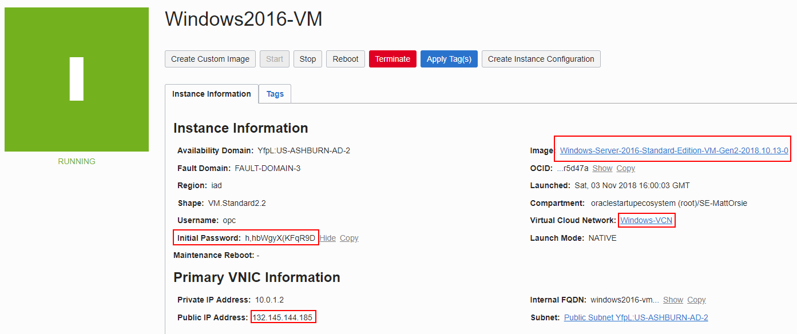

- Go to your VCN and **open port 3389** in the Ingress Rules (RDP uses port 3389)

  

- Using RDP, Login into your instance. You’ll be prompted for the Initial password and to change the password for the opc user. Change it and log in.

  

- Using Internet Explorer add `https://*.google.com` and `https://*.docker.com` as Trusted Sites in the browser Internet Security options:

  

- In this exmaple we downloaded and installed `Chrome` and then `Docker Toolbox for Windows`. Decided to use Chrome instead of IE.

- Once Docker Toolbox is installed double click the **Docker Quickstart** desktop icon. 

  

- This will configure a VirtualBox image and do an initial setup. It obtains a local IP address from DHCP and assigns to the Docker Linux image running in vBox:

  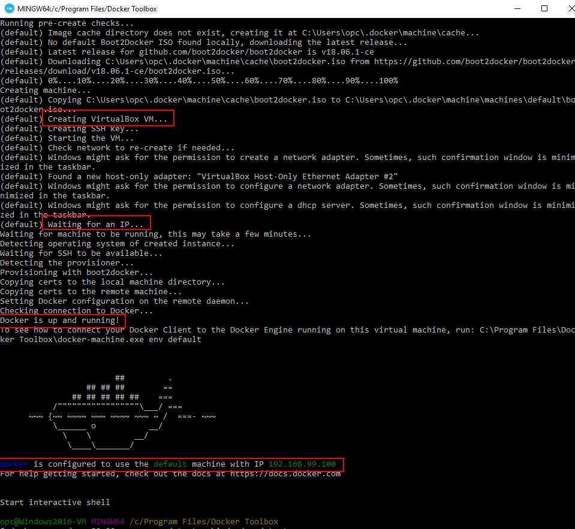

- Run the aspdotnet application.

  ```
  docker run -d -p 80:80 --name aspdotnet wvbirder/aspdotnet
  ```

  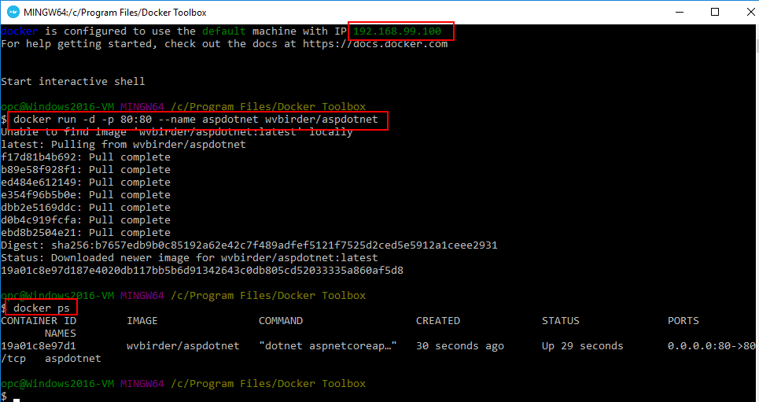

- Test in a local browser using the IP address: (The default IP using `Docker Toolbox for Windows` will be: **192.168.99.100**)

  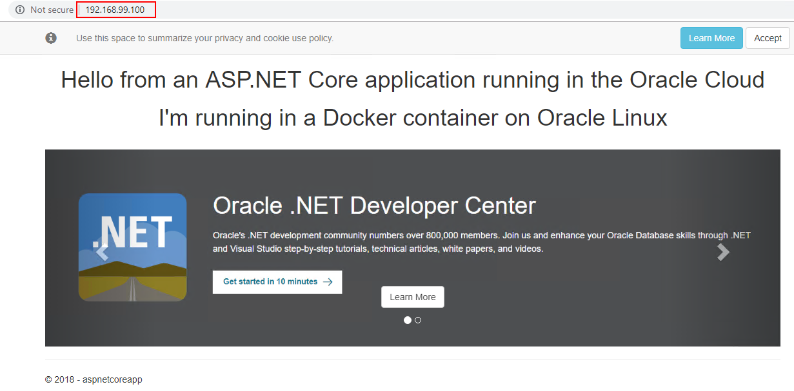

## Running in OCI on Windows 2016 DataCenter using Bare Metal 

This option uses `Docker for Windows`  running on top of Hyper-V

- Create the compute instance using a VCN you already have in place. **Note the Public IP address and the Initial Password for the opc user**

  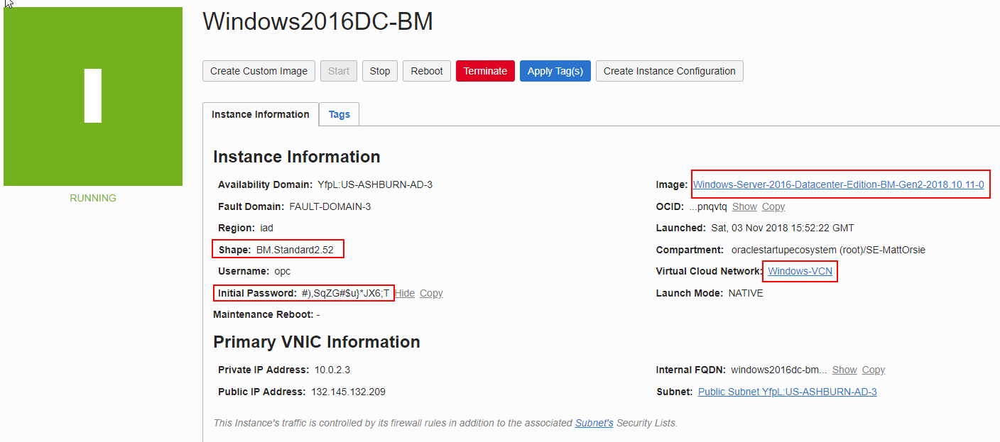

- Go to your VCN and **open port 3389** in the Ingress Rules (RDP uses port 3389)

  

- Using RDP login into your instance. You’ll be prompted for the Initial password and to change the password for the opc user. Change it and log in.

  

- Using Internet Explorer add `https://*.google.com` and `https://*.docker.com` as Trusted Sites in the browser Internet Security options:

      

- **Enable Hyper-V** by going into `Server Manager` and enabling that Role: (Make sure you select the virtual VNIC (checkbox) during this multi-step enablement. After Configuration and reboot Hyper-V will show up in the `Roles and Server Groups` section)

  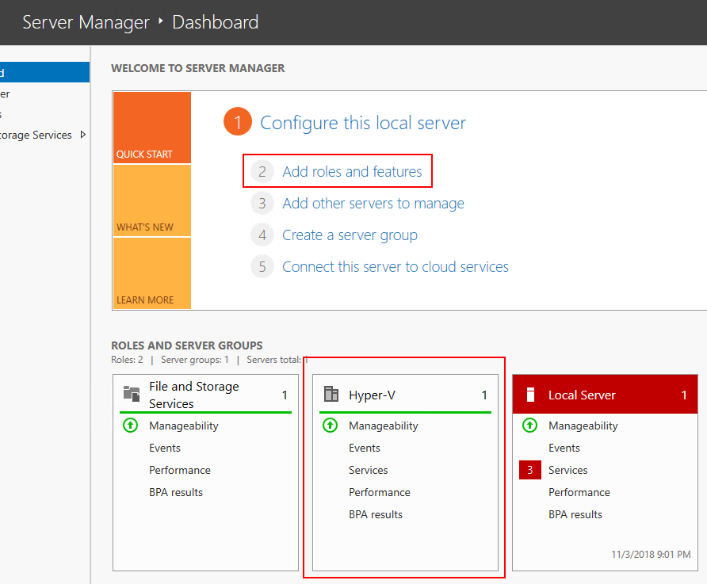

- The system will require reboots to install and enable the Hyper-V service.

- After the reboot, login and you can verify seeing Hyper-V **Running** as a System Service:

  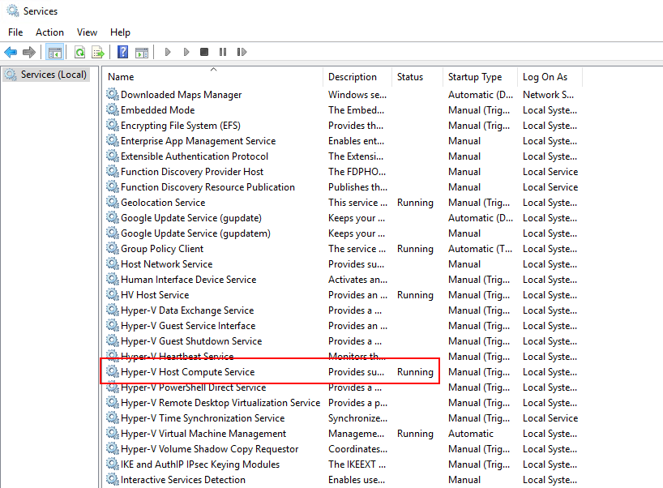

- Once Hyper-V is enabled you will download and install [Docker for Windows](https://docs.docker.com/docker-for-windows/install/)

  

- If the installation and setup went OK the System Tray will show Docker as running:

  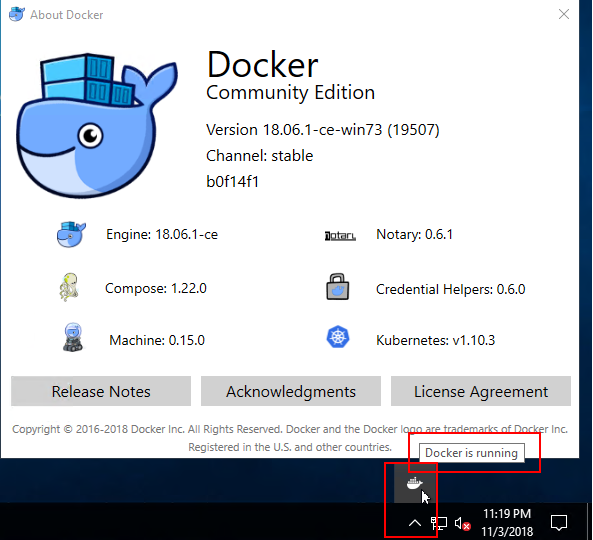

- **Open up a Powershell** and run the `aspdotnet` application.

  ```
  docker version
  docker run -d -p 80:80 --name aspdotnet wvbirder/aspdotnet
  ```

  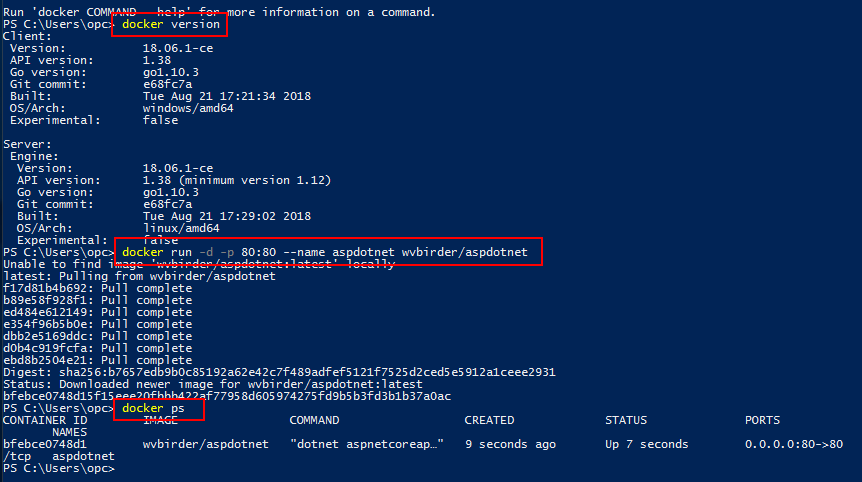

- Going to `localhost` in the local browser confirms:

  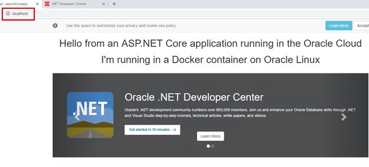


# Where do I go from here?

Check out the [Oracle .NET Developer Center](https://www.oracle.com/database/technologies/appdev/dotnet.html)


