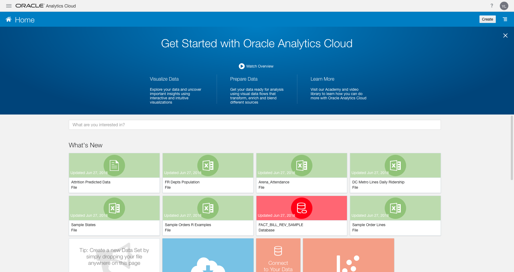
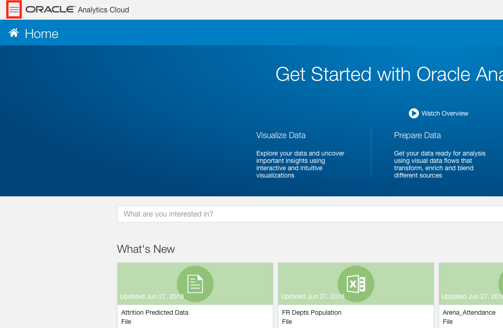
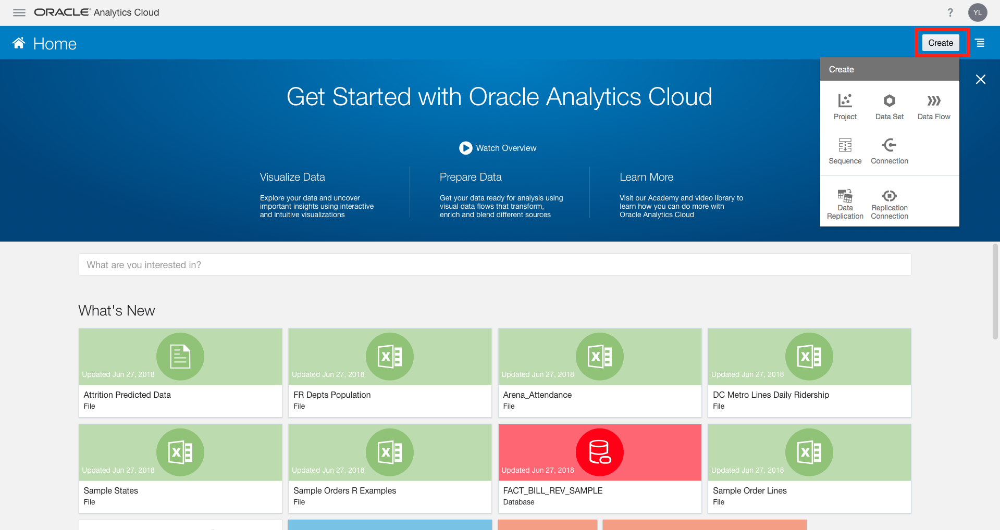

Updated: Aug 14, 2018

## Lab 1: Getting Started with OAC DV5

## Objectives

This section focuses on getting started with OAC5 DV and introducing users to the DV interface.

Key Take Aways from this lab:
- Starting up an OAC5 instance 
- Learning and getting acclimatized to the DV interface

### 1b) Reviewing the Home page and the primary menus

On logging into OAC5, you will see the home page.

  

1. Start by clicking on the hamburger menu in the top-left of the UI. This will open the drawer menu.

    
    
2. You can use this menu to navigate through the application.

    
    
    
    
    The application follows standard web and application interface protocols, thus supporting both left and right click interactions. In terms of general navigation, there are 4 key menus accessible at the top of the screen or via a hamburger menu in the top left (not all screens will show the top menu bar but the hamburger navigation is always available).

    - **Home**: Application start up page from where you can view existing projects and folders or create new ones. **Projects** in DV are a collection of visualizations and the underlying data sources. **Folders** are simply means by which to organize projects.
    
    - **Data Visualization**: This is where you will spend a good portion of your time when analyzing data. It allows you to manage and edit all facets of a project (e.g. the visualizations and the source data).
    
    - **Data Sources**: This page allows you to **Display** or **Create Data Sources** (instances of data such as a specific Excel file); **Connections** (connections to data sources such as a database or SaaS application to pull data files); or **Data Flows** (ability to curate data from data sources including adding calculations, merging multiple sources, and managing columns).
    
    - **Console**: Administrative menu for managing **Custom Plugins** (e.g. new types of analyses obtained from the Oracle Analytics Store or custom built) and **Maps** layers (e.g. new backgrounds for map based analyses).
    
3. At the top-right of the UI, click on the Create button.

    
    
    This window allows you to create a Visualization project, a data set, a connection to an external source, a data flow, a sequence...

4. Click on hamburger icon at the top right of the UI, next to Create.

    

5. Select the Customize option.

    
    
    
    
    This menu allows you to customize the components of your home page.

Now that you can start OAC and navigate around DV, let’s get started with some analyses!