## Lab 1 - Getting Started with OACv5 DV

## Objectives

This section focuses on getting started with OACv5 DV and introducing users to the DV interface.

Key takeaways from this lab:
- Starting an Autonomous OAC instance 
- Learning and getting acclimatized to the DV interface

### 1a) Provisioning an Oracle Autonomous Analytics Cloud Instance

1. Open your browser and navigate to [cloud.oracle.com](cloud.oracle.com). Click on **Sign In**.

    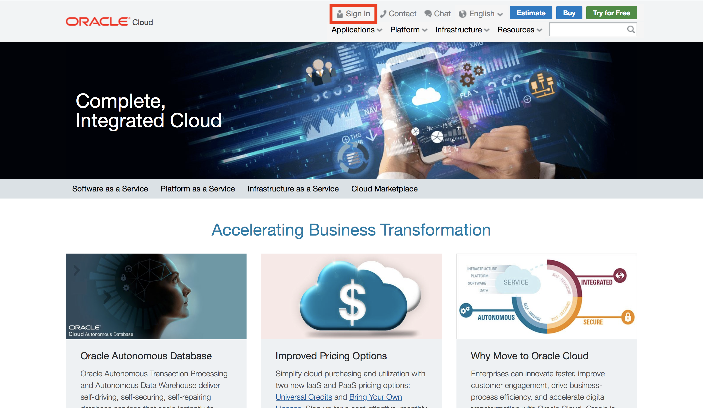  

2. Enter your cloud account name and click on **My Services**.
    
    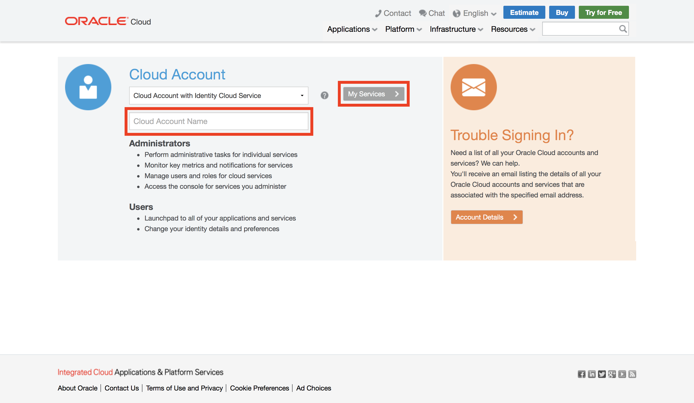  
    
3. Enter your username and password and click on **Sign In**.
    
    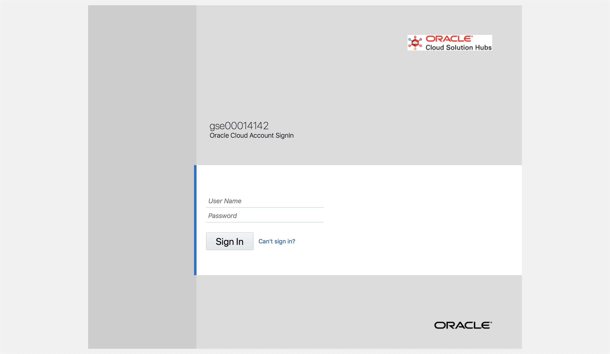  

4. Once you log in you will see a page similar to the one below: -
    
    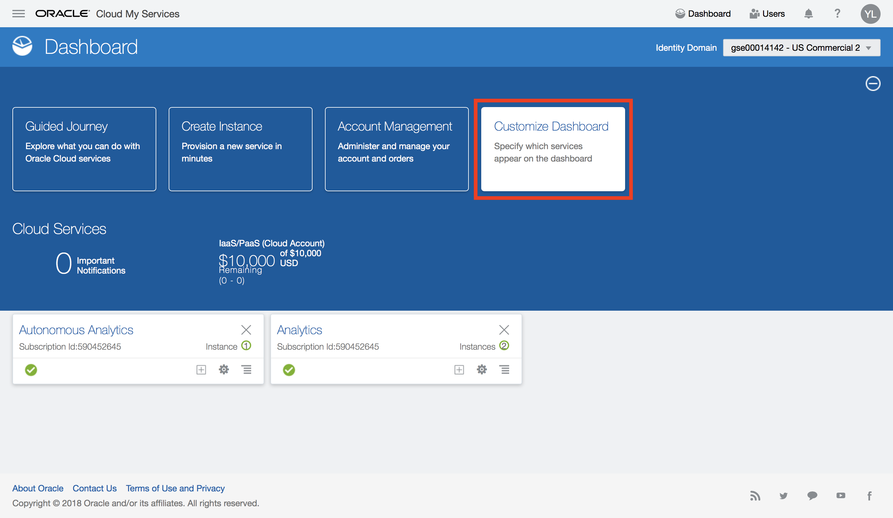  

    Select **Customize Dashboard**. Ensure that **Autonomous Analytics** is not hidden.
    
    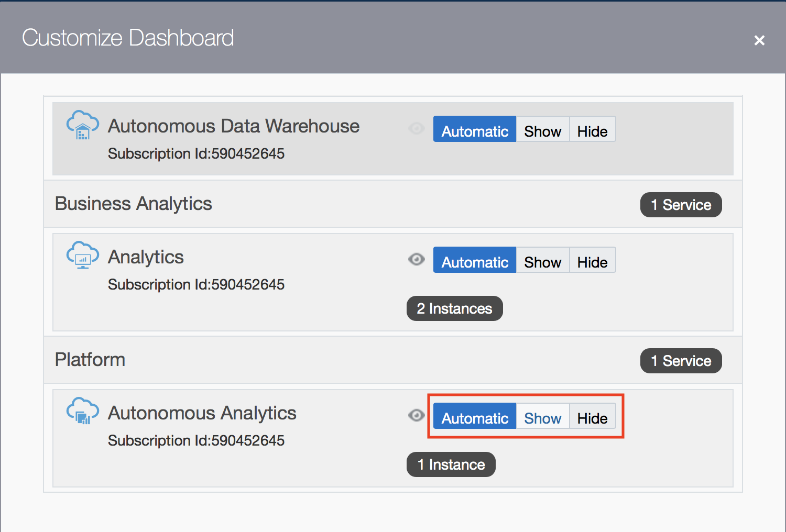 
    
5. Click on the hamburger icon to reveal the menu. Select **Services**. The expanded menu will list all services available for provisioning.

    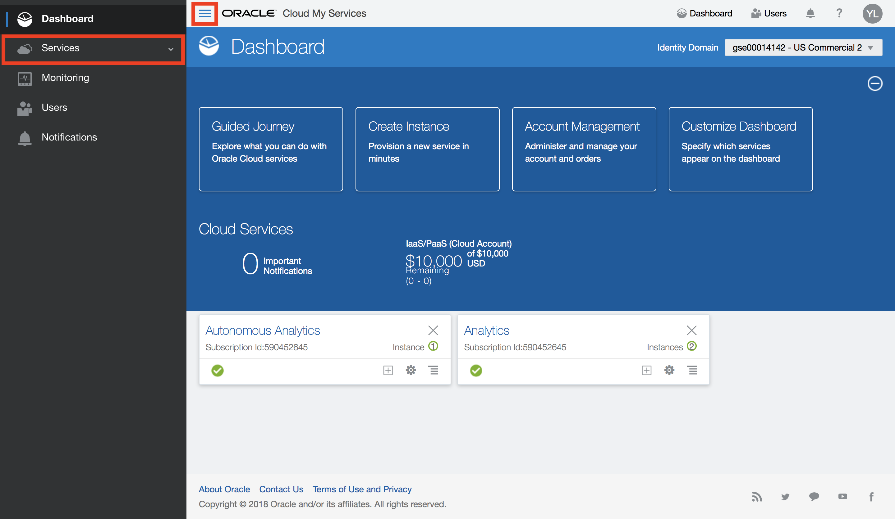 

    Select **Autonomous Analytics**.
    
    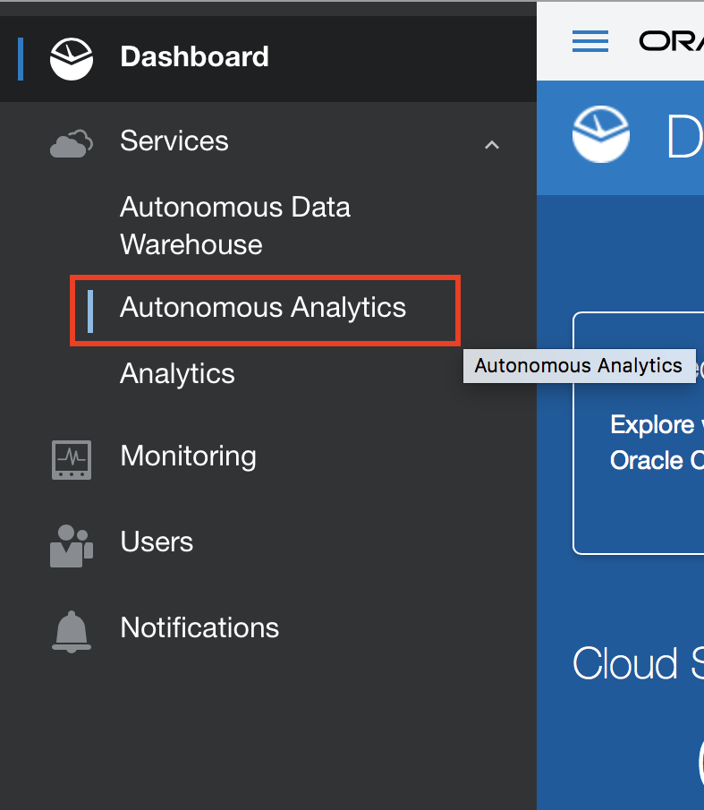 
    
6. On the next screen click on **Create Instance**.
    
    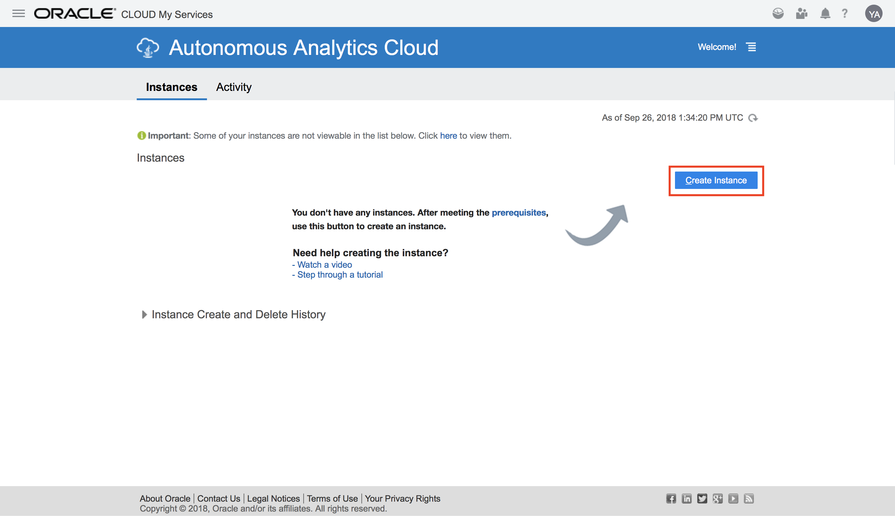 
    
7. Next, we will configure our instance. Click on the **Feature Set** dropdown. 
    
    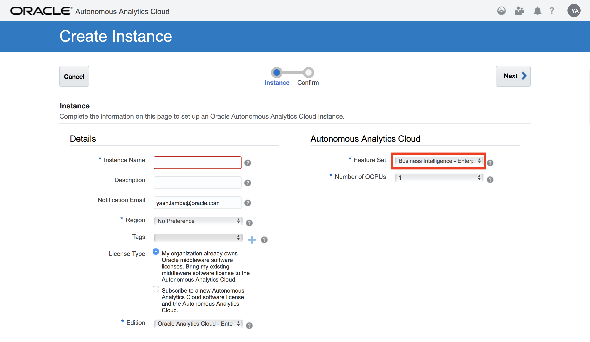
    
    Choose **Data Visualization**.
    
    
    
    Now, give your instance a **Name** and choose the correct **License Type**. If you already own a license, then choose the first option else go with the second.
    
    
    
    After this click on the **Edition**, choose **Oracle Analytics Cloud - Standard**.
    
    
    
    
    
    Once configured, click on **Next**.
    
    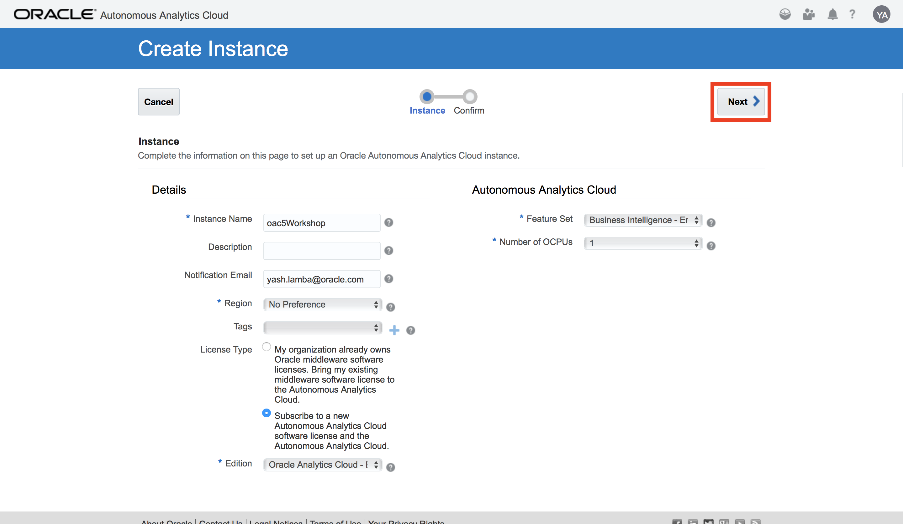
    
8. Review your selections and click **Create**. In case of issues, return to the previous screen and make the required changes.

    
    
9. Now, wait for the instance to be created.

    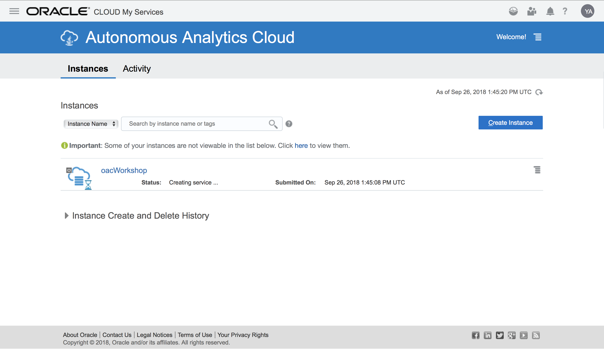
    
    You will receive an email once the instance is ready.
    
    
    
10. Click on the **Ellipses** menu and select **Oracle Analytics Cloud URL**. 

    
    
    Doing so will take you to the OAC home page which we will be reviewing in the next section.
    
    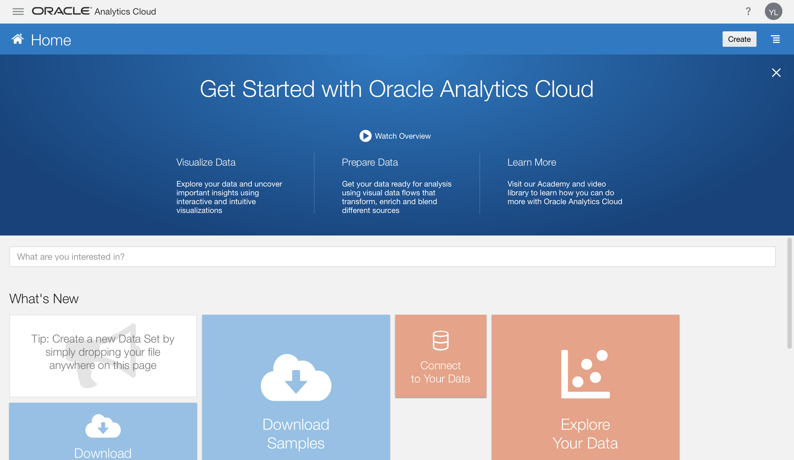
    

### 1b) Reviewing the Home page and the primary menus

On logging into OACv5, you will see the home page.

  

1. Start by clicking on the hamburger menu in the top-left of the UI. This will open the drawer menu.

    
    
2. You can use this menu to navigate through the application.

    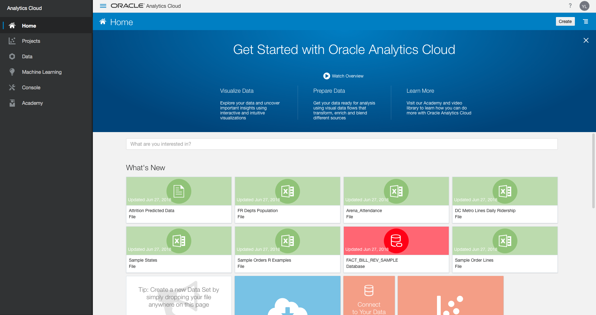
    
    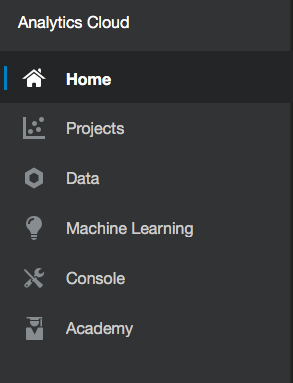
    
    The application follows standard web and application interface protocols, thus supporting both left and right click interactions. In terms of general navigation, there are 4 key menus accessible at the top of the screen or via a hamburger menu in the top left (not all screens will show the top menu bar but the hamburger navigation is always available).

    - **Home**: Application start up page from where you can view existing projects, data sets, data flows or create new ones. 
    
    - **Projects**:  Collections of visualizations and the underlying data sources. **Folders** are simply means by which to organize projects.
    
    - **Data**: This page allows you to display or create **Data Sets** (instances of data such as a specific Excel file); **Connections** (connections to data sources such as a database or SaaS application to pull data files); or **Data Flows** (ability to curate data from data sources including adding calculations, merging multiple sources, and managing columns).
    
    - **Machine Learning**: This page shows all the available machine learning models ready for use in projects.
    
    - **Console**: Administrative menu for managing **Custom Plugins** (e.g. new types of analyses obtained from the Oracle Analytics Store or custom built), **Maps** layers (e.g. new backgrounds for map-based analyses) and other administrative tasks.
    
    - **Academy**: Home to important links to the OAC documentation and videos that help you accomplish common tasks in the OAC. 
   
3. At the top-right of the UI, click on the Create button.

    
    
    This window allows you to create a Visualization project, a data set, a connection to an external source, a data flow, a sequence...

4. Click on hamburger icon at the top right of the UI, next to Create.

    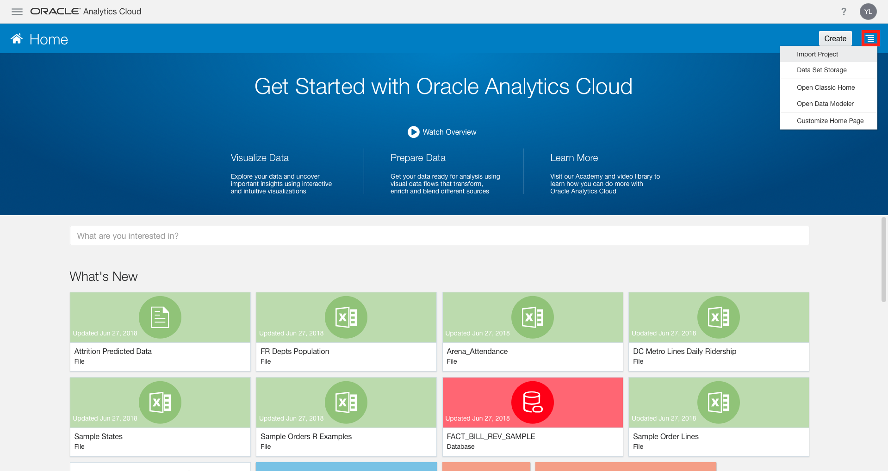

5. Select the Customize option.

    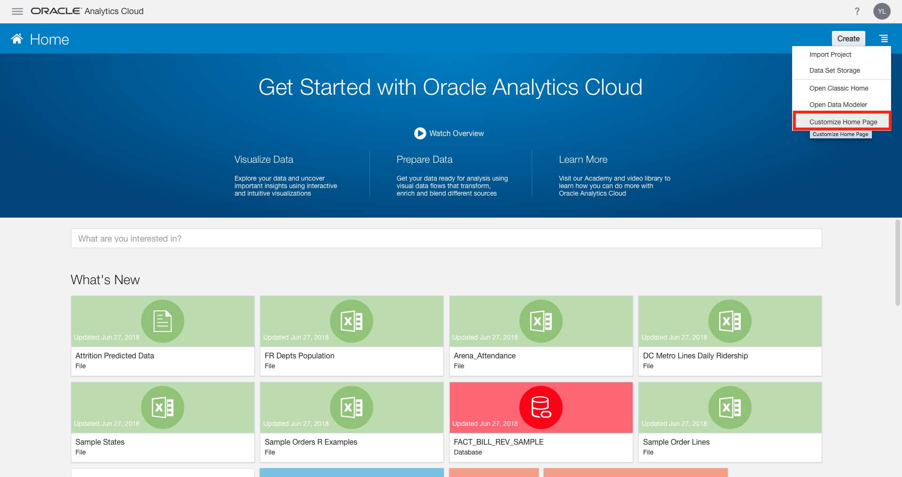
    
    
    
    This menu allows you to customize the components of your home page.

Now that you can start OAC and navigate around DV, let’s get started with some analyses!