  
Updated: February 10, 2017

# Lab 4 - Data Flows to Curate Data (General Ledger from Multiple Sources)

In this next lab, you will create a data source from multiple sources as a resuaable **Data Flow. Data Flows** can be used to merge multiple data sources; apply aggregations; filter results; and modify and create columns. These flows can also be refreshed and reused as needed. 

 
### This lab is optional but provides an important overview of managing data for those users who might need to prepare data for analysis.

 
### As VP of Finance at a large organization you often face the challenge of being able adequately analyze financial data which is often derived from multiple sources. A Project Planning and Management tool is used for budgeting and forecasting purposes while actuals (e.g. spend) are captured in a Financials module of an ERP. You have asked for data from both but been given a delimited text file and an Excel file.Luckily, one of your staff recently learned about Oracle Data Visualization Desktop and is here to help you define a mechanism by which that data can be merged and utilized for your analytical purposes.

## 4a – Import an Excel File and a Delimited Text File and Apply a Format Conversion

- **1) Import actuals data from an Excel file for use in your data flow.**
    - Open the **Data** menu.
     

    - Select **Data Source** in the **Create** section.
    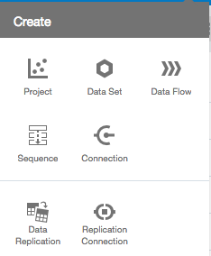 
    
    - Select **File.**
    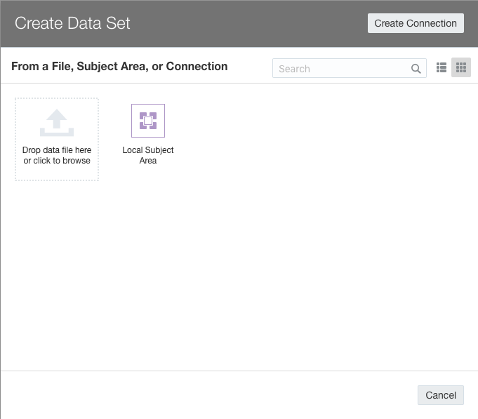

    - Select **General Ledger Data - Financial System Actuals.xlsx** from where you saved the data files for the workshop. Please make sure you do not load the combined data file (that is used if skipping this lab). 
    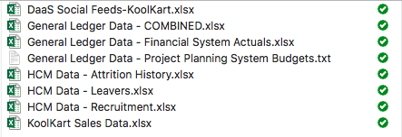

    - You’ll notice this file contains **Actual** (spend amount) by **AccountLineId, Account, Account Group, Business Lines, Month.** Leave all fields as they are and select **Add.**
    

     
    - You may have noticed that **Month** is appearing with the day of the month as well. Let’s clean that up.

    - Select the the header for the **Month** column 
    

    - Navigate to the **Month** settings section, select the clock (Date/Time Format) icon, and chnage the Format to MMMMMM YYYY.
    
    
    - After you've confirmed that the format is correct select **Add** to upload the dataset. 
    

    - Select the the header for the **Actual** column 
    

    - Navigate to the **Actual** settings in the bottom left corner, select #, and chnage the number format to Currency. 
    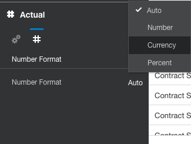

    - Your data should now be ready to use. Select < icon to go back to the **Data Sources** menu.
    

- **2) Import budget data from a delimited text file for use in your data flow.**
    - Open the **Data** menu.
    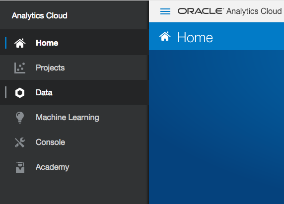 

    - Return to the **Data Seource** in the **Create** section.
    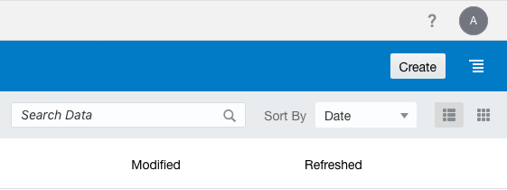

    - Select **File.**
    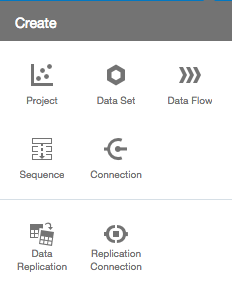

    - Select **General Ledger Data - Project Planning System Budgets.txt** from where you saved the data files for the workshop. Please make sure you do not load the combined data file (that is used if skipping this lab).
    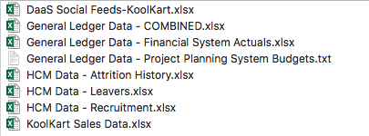

     
    - Delimited files (typically in a text format) are simply datasets where the columns are separated by a character (or set of characters) such as a comma, a pipe, a semicolon, or others. Most systems today have strong export capabilities and APIs for retrieving data but large datasets and those from legacy systems often rely upon these means for sharing data.

    - You’ll notice that it looks like the system thinks all the data is part of a single column. This is because the system defaults to looking for comma delimited files so you will need to change this. Click on **Comma.** Select **Custom.**
    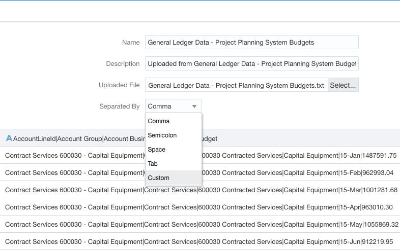

    - Type in a vertical bar - | for the Separated By text box.
    

    -Click outside the menu to apply the changes and you’ll now notice this file contains **Budget** by **AccountLineId, Account, Account Group, Business Lines,** and **Month.**

    Leave all fields as they are and select **Add**.
    

- **3) Convert Text to Dates.**

     
    - You may have noticed that **Month** is appearing with the day of the month as well and in text format. Let’s clean that up so we can analyze it as a date.

    - Select the the header for the **Month** column
    

    - Navigate to the **Month** settings section and channge the Data Type to Date. 
    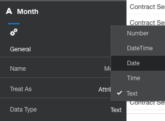

    - Select the clock (Date/Time Format) icon and chnage the Format to MMMMMM YYYY. Click outside of the menu to apply the changes.
    

    The data is now ready to be used in our data flow.

     
    - You won’t always need to be modify data as we just did and you can also add data sources directly while creating data flows but these past two exercises have been structured to allow you to see that, regardless of the type and format of data you have been provided, you can easily structure it for analysis within DVD.

## 4b – Create a Data Flow to Curate Budget and Actuals into a Single Dataset. 

- **1) Create a new Data Flow.**

    - Return to the **Data Sources** menu. 
    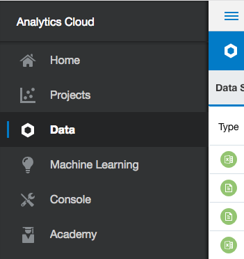

    - Select **Data Flow** in the **Create** section
    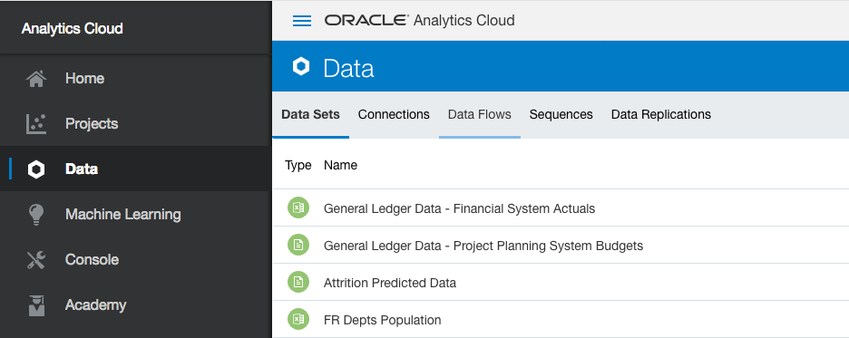

    

    - Select the **General Ledger Data – Financial System Actuals dataset** and select **Add**.
    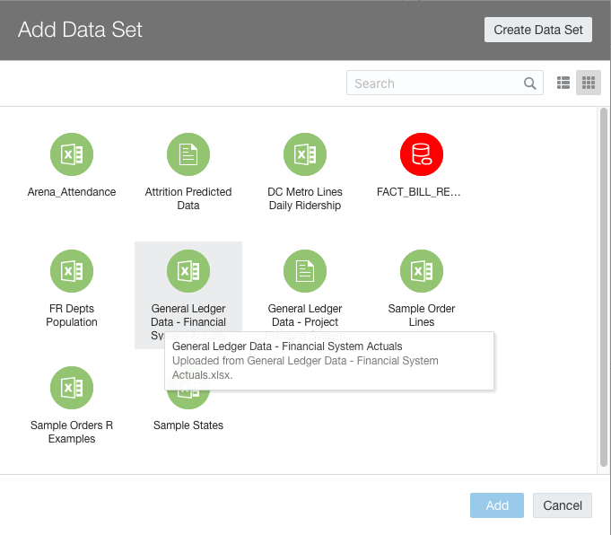

    - This brings up the **Data Flow** editor. We will not be covering this in its entirety but the editor shows a visual representation of the operations at the top of the screen with the resulting data at the bottom. The available operations are presented as icons on the right.
    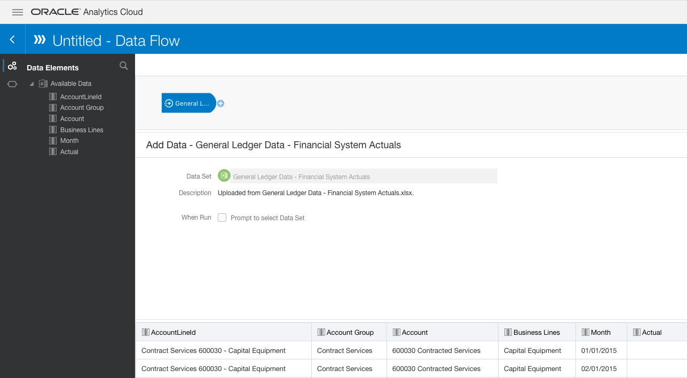

- **2) Add another data source.**
    - Select the Data flow icon. 
    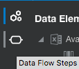

    - The first thing we should do here is add our other data source (the budgetary figures). Select **Add Data** from the **Operations Menu**. Drag it under **General** in the diagram.
    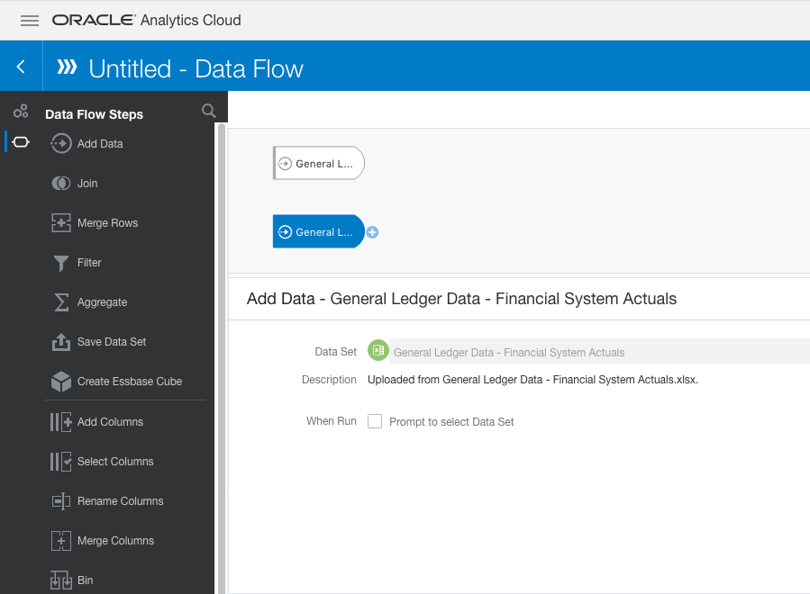

    - Select the **General Ledger Data - Project Planning System Budgets** dataset and select **Add**.

- **2) Join the data sources.**

You will take on 3 Personas during the workshop. The **Project Manager Persona** will create the projects, add tasks and features to be worked on, and assign tasks to developers.  The Project Manager will then start the initial sprint. The Java Developer persona will develop a new twitter feed service that will allow for retrieval and filtering of twitter data. The **JavaScript Developer** persona will develop a new Twitter Marketing UI that will display the twitter data to allow for analysis.  During the workshop, you will get exposure to Oracle Developer Cloud Service and Oracle Application Container Cloud Service.

**_To log issues_**, click here to go to the [github oracle](https://github.com/oracle/learning-library/issues/new) repository issue submission form.

## Objectives
- Create Initial Project
    - Add Users to Project
- Create Product Issues
    - Create Issues for Twitter Feed Microservice
    - Create Issues for Twitter Feed Marketing UI
- Create Agile Board and initial Sprint
- Add Issues to Sprint

## Required Artifacts
- The following lab requires an Oracle Public Cloud account that will be supplied by your instructor.

# Create Twitter Feed Marketing Project

## Create Developer Cloud Service Project

### **STEP 1**: Login to your Oracle Cloud Account
- From any browser, go to the URL:
    `https://cloud.oracle.com`

- click **Sign In** in the upper right hand corner of the browser

    

- **IMPORTANT** - Under my services, select from the drop down list the correct data center and click on **My Services**. If you are unsure of the data center you should select, and this is an in-person training event, ***ask your instructor*** which **Region** to select from the drop down list. If you received your account through an Oracle Trial, your Trial confirmation email should provide a URL that will pre-select the region for you.

    

- Enter your identity domain and click **Go**.

    **NOTE:** The **Identity Domain, User Name** and **Password** values will be given to you by the instructor or Trial confirmation email.

    

- Once your Identity Domain is set, enter your User Name and Password and click **Sign In**

  **NOTE:** For this lab you will assume the role of Project Manager ***Lisa Jones***. Although you are assuming the identify of Lisa Jones, you will log into the account using the **username** provided to you by your instructor, given to you by your corporation, or supplied to you as part of an Oracle Trial. As you progress through the workshop, you will remain logged in as a single user, but you will make “logical” changes from Lisa Jones the Project Manager to other personas.

    

    

- You will be presented with a Dashboard displaying the various cloud services available to this account.

    

- If all your services are not visible, **click** on the **Customize Dashboard**, you can add services to the dashboard by clicking **Show.** For this workshop, you will want to ensure that you are showing at least the **Application Container, Developer and Storage** cloud services. If you do not want to see a specific service, click **Hide**

    

### **STEP 2**: Check/Set Storage Replication Policy

Depending on the state of your Cloud Account, you may need to set the replication policy, if it has not been previously set. In this step you will got to the Storage Cloud Service to check on the status of the Replicaton Policy. 

- Click on the **Storage** Cloud Service

    

- If you see a message requesting that you **Set Replication Policy** as is shown below, click on the message. If the message is not displayed, your replicatin policy has already been set and you can continue to the next step by clicking on the **Dashboard** icon in the top right corner of the page.

    

- Care must be taking when setting your replication policy, because it cannot be changed. With Trial accounts, the first option available will generatlly set the replication policy sufficient for this workshop, so we will take the Default, and click on the **Set** button. 

    

- Click on the **Dashboard** button

    

### **STEP 3**: Login to Developer Cloud Service

Oracle Developer Cloud Service provides a complete development platform that streamlines team development processes and automates software delivery. The integrated platform includes an issue tracking system, agile development dashboards, code versioning and review platform, continuous integration and delivery automation, as well as team collaboration features such as wikis and live activity stream. With a rich web based dashboard and integration with popular development tools, Oracle Developer Cloud Service helps deliver better applications faster.

- From the Cloud UI dashboard click on the **Developer** service. In our example, the Developer Cloud Service is named **developer99019**.

    

- The Service Details page gives you a quick glance of the service status overview.

    

- Click **Open Service Console** for the Oracle Developer Cloud Service. The Service Console will then list all projects for which you are currently a member.

    

### **STEP 4**: Create Developer Cloud Service Project

- Click **New Project** to start the project create wizard.

    

- On Details screen enter the following data and click on **Next**.

    **Name:** `Twitter Feed Marketing Project`

    **Description:** `Project to gather and analyze twitter data`

    **Note:** A Private project will only be seen by you. A Shared project will be seen by all Developer Cloud users. In either case, users need to be added to a project in order to interact with the project.

    

- Leave default template set to **Empty Project** and click **Next**

    

- Select your **Wiki Markup** preference to **MARKDOWN** and click **Finish**.

    

- The Project Creation will take about 1 minute.

    

- You now have a new project, in which you can manage your software development.

    

# Create Product Issues

## Create Issues for Twitter Feed Microservice

### **STEP 5**: Create Issue for the initial GIT Repository Creation

In this step you are still assuming the identity of the Project Manager, ***Lisa Jones***.

- Click **Issues** on left hand navigation panel to display the Track Issues page.

    

- Click **New Issue**. Enter the following data in the New Issue page and click **Create Issue**.

    **Note:** Throughout the lab you will assign your own account as the “physical” owner of the issue, but for the sake of this workshop, **Bala Gupta** will be the “logical” owner of the following issues.

    

    **Summary:**
    `Create Initial GIT Repository for Twitter Feed Service`

    **Description:**
    `Create Initial GIT Repository for Twitter Feed Service`

    **Type:** `Task`

    **Owner:** `Select your account provided in the dropdown [Logical Owner: Bala Gupta]`

    **Story Points:** `1`

    Note: Story point is an arbitrary measure used by Scrum teams. They are used to measure the effort required to implement a story. This [Site](https://agilefaq.wordpress.com/2007/11/13/what-is-a-story-point/) will provide more information. 

    

### **STEP 6**: Create Issue for Update Twitter Credentials

- Click **New Issue**. Enter the following data in the New Issue page and click **Create Issue**.

    

    **Summary:** `Create Filter on Twitter Feed`

    **Description:** `Create Filter to allow user to supply text to reduce the amount of data returned by the Twitter feed`

    **Type:** `Feature`

    **Owner:** `Select your account provided in the dropdown [Logical Owner: Bala Gupta]`

    **Story Points:** `2`

    

### **STEP 7**: Create Issue for initial GIT Repository creation

- Click **New Issue**. Enter the following data in the New Issue page and click **Create Issue**. Note: The next two issues will logically be owned by John Dunbar.

    

    **Summary:** `Create Initial GIT Repository for Twitter Feed Marketing UI`

    **Description:** `Create Initial GIT Repository for Twitter Feed Marketing UI`

    **Type:** `Task`

    **Owner:** `Select your account provided in the dropdown [Logical Owner: John Dunbar]`

    **Story Points:** `1`

    

### **STEP 8**: Create Issue for Displaying Twitter Feed

- Click **New Issue**. Enter the following data in the New Issue page and click **Create Issue**.

    

    **Summary:** `Display Twitter Feed in Table Format`

    **Description:** `Display Twitter Feed in Table Format`

    **Type:** `Feature`

    **Owner:** `Select account provided in the dropdown [Logical Owner: John Dunbar]`

    **Story Points:** `2`

    

- Click the back arrow  on the **left side** of the window, or click on the **Issues** menu option to view all newly created issues.

    

