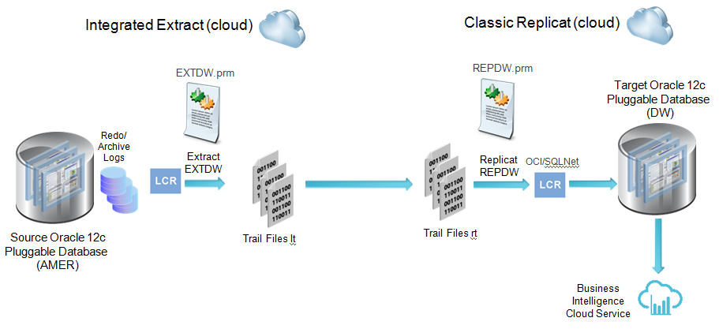
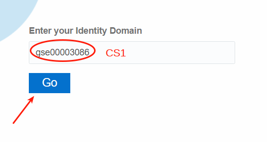
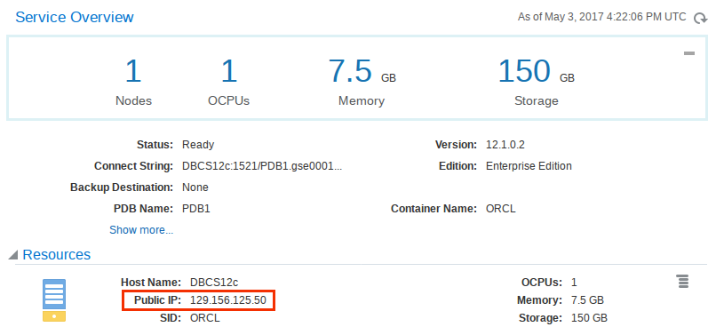
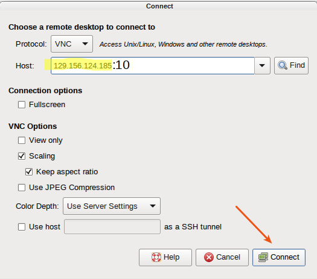
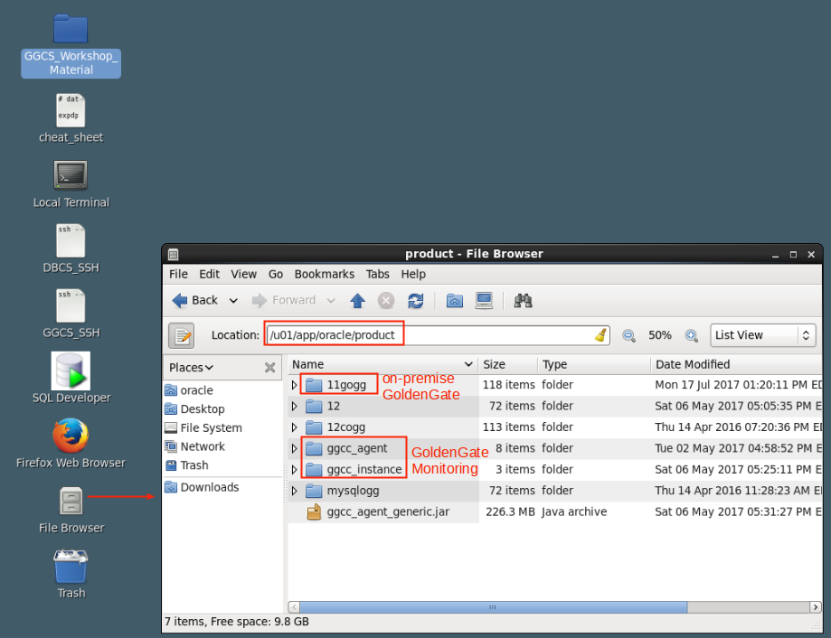

Update May 2, 2017

## Introduction

This is the first of several labs that are part of the Oracle Public Cloud GoldenGate Cloud Service workshop. These labs will give you a basic understanding of the Oracle GoldenGate Cloud Service and many of the capabilities around real time data replication and migration.  Throughout the workshop the following use cases will be covered.  These will be covered in more detail in labs 200, 300, and 400.  In lab 500 you will review GGCS monitoring.

- Lab 200: Migration and replication of data from an on-premise 11g database to a DBCS 12c multi-tenant database:

	

- Lab 300: Replication of data from a DBCS 12c multi-tenant database back to an on-premise 11g datbase:

	

- Lab 400: Replication and transformation of data from a DBCS 12c pluggable database to a DBCS 12c reporting data warehouse with Business Intelligence analytics access:

	

## Objectives

- Familiarize you with the Oracle Cloud environment and services that will be used in the following labs.
- Familiarize you with an on-premise 11g Database environment that will be replicated to a DBCS 12c environment.  Note: this is set up as an image running in Oracle IAAS/compute, but process and configuration steps are the same as though the image was running outside the cloud.
- Walk through the steps to create a GoldenGate Cloud Service that will manage data replication between on-premise and cloud environments, and manage replication between different cloud environments.
- Walk you through creating a new GoldenGate enabled Database Cloud Service.
- To log issues and view the Lab Guide source, go to the [github oracle](https://github.com/pcdavies/GoldenGateCloudService/tree/master/workshops/goldengate) repository.

## Required Artifacts

- The following lab requires a VNC Viewer to connect to an Image running on Oracle's IaaS Compute Service.
- The following information will be required, and used throughout the labs.  For clarity this is listed below.  As you navigate the environments **write down** the necessary information on paper:
	- **Oracle Cloud Identity Domain:**
		- Userid and password will be given to you by your instructor.  
	- **SSH Key:**  `ggcs_key`.  This is a private key that will be used to ssh to GGCS and DGCS.  It is located in the `GGCS\_Workshop\_Material\keys` folder on the desktop of the OGG 'On-premise' 11g Database Compute image (noted below).
	- **OGG 'On-premise' 11g**
		- **IP Address:**  `you will be given this`
		- **VNC (port 5902) Password**  `ggcs2017_`
		- **Database Schemas:**
			- `euro`
			- `ggcs_bu`
			- passwords:  `ggcs2017_`
	- **GGCS:**
		- **IP Address**  `you will get this off the cloud console AFTER creating a new GGCS instance`
		- **SSH Access:**  `ggcs_key`
	- **DBCS:**
		- **IP Address:**  `you will get this off the Cloud Console`  DBCS will be running when you start the labs.
		- **Schemas:**
			- `amer`
			- `dw`
			-`ggcs_bu`
			- passwords are `ggcs2017_`

## Review Cloud Services

### **STEP 1**: Login to your Oracle Cloud account and Review Services

-   Open a browser and go to the following URL:

	https://cloud.oracle.com

-   Click **Sign In** in the upper right hand corner of the browser

	

- **IMPORTANT** - Under my services, select from the drop down list the correct data center and click on **My Services**. If you are unsure of the data center you should select, and this is an in-person training event, ***ask your instructor*** which **Region** to select from the drop down list. If you received your account through an Oracle Trial, your Trial confirmation email should provide a URL that will pre-select the region for you.

	

-   Enter the **identity domain** and click **Go**

	**NOTE**: The **Identity Domain, User Name** and **Password** values will be given to you from your instructor.

	

-   Once your Identity Domain is set, enter your User Name and Password and click **Sign In**

	**NOTE**: the **Identity Domain, User Name** and **Password** values will be given to you from your instructor.

	

-   You will be presented with a Dashboard summarizing all of your available services.

	

-   If all of your services are not visible, **click** on **Customize Dashboard.** You can then add services to the dashboard by clicking **Show**. If you do not want to see a specific service click **Hide**.

	

- Review services that will be used in the GGCS Labs:
	- The Compute node will serve as your on-premise 11g database instance.  It will be migrated in Lab 200 to a target DBCS 12c pluggable databse in lab 200, and a GG target (reverse data replication) in lab 300.
	- The Database Service (DBCS) will be a GG target in lab 200 and a GG source in lab 300.
	- The GGCS instance is not yet in your identity domain.  You will create and configure this in Labs 200 - 500.
	- Finally note that BICS is not available in this identiity domain.  That will be provided in a separate Identity Domain.

	

### **STEP 2**: Create a GoldenGate Enabled Database Cloud Service (note this has been done for you - this is a review step)

- Go to the Cloud Console and select the Database Cloud Service

### **STEP 3**: Gather Information Required for Access to Images and GG Configuration

- Select the Database Cloud Service:

	

- Open the Service Console:

	

- Select the DBCS12c Service: 

	

- Note the Public IP (**write this down**).  Also note the Service Name (DBCS12c - you will need this when creating GGCS)

	

- Exit back out the the Cloud Dashboard:

	

- Select the Compute Image:

	

- Then open Service Console:

	

- Identity Domains will have multiple sites. Please ask you instructor which site the Client Image is running on. If needed, click the Site drop down to access the Site Selector, and choose the correct site.

	

- Note the public IP of the GG_On-premise image (**write this down**):

	

### **STEP 4**: Create GoldenGate Cloud Service Instance

- Return to Dashboard (upper right), select GGCS, then Open Service Console, and then Create Service Instance:

	

- Enter Service Name ggcsservice-ggcs-1 as the name, take the defaults and then hit Next:

	

- Enter the following details:

	

- Hit 'Next' and then submit.  The instance create process will take several minutes.

### **STEP 5**: Review Compute Image (On-premise OGG)

For the GoldenGate Cloud Service Workshop we will be using a compute Image that will represent your on-premises environment. In this image we have installed a 11g database that we will be migrating to our Oracle Public Cloud Database instance. The image also contains SQL Developer 4.1 that will be used to connect to both your local and cloud database.

- Start your vnc viewer and enter the IP address of the Compute image noted above.  Enter the cloud login password.

	

- This is the 'On-premise' environment desktop.  All the lab material is in the GGCS\_Workshop\_Material folder on the desktop - double click on this folder and review the contents.  Note:
	- The keys folder:  You will use a private key to access the GGCS and DBCS instances.  You will need the IP addresses of those environments after GGCS is up.
	- The SQL Files folder:  These scripts are used to re-set your data if you need to restore it at some point, and to generate transactions for GoldenGate.

	

- Double click on the SQL Developer desktop icon.  You will use SQL Developer to review data and execute SQL Scripts.  Three connections have been set up for you (highlighted).  These will need to be updated with the IP addresses of your assigned instances (On-premise 11g Database, DBCS 12c Database, and your GGCS instance).

	

- Select the File Browser off the desktop and navigate to /u01/app/oracle/product.  This location is where GoldenGate On-premise is installed and configured.  We will review this in the next lab.  Note that Oracle Database 11g which is used in the following labs is installed in /opt/oracle.

	

### **STEP 6**: Set up GGCS For the Labs that Follow

- By now GolderGate Cloud Service (GGCS) should be available.  Go to the console to get the IP address.  Select GGCS.  Note that at any time you can collapse the region above the services.  Then open Service Console.

	

- Open ggcsservice_ggcs_1

	

- Note the public IP **write this down**.  You will need this later for various configuration steps.

	

- Go back to the OGG Image running in Compute and execute a script to copy the GGCS configuration files.  Note these files exist on GGCS but need to modified for our use cases.  To simplify configuration we done most of the setup and will transfer the configuration from our compute image to GGCS.  Now go to the GGCS\_Workshop\_Material folder on the desktop and run the following script.
	- script needs to be updated with the IP address, then run

